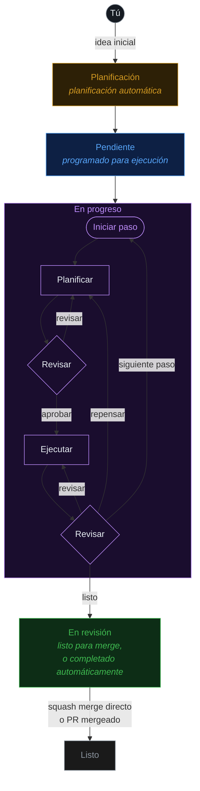

<div align="center">

#  Fusion

### De idea inicial a código en producción — automáticamente.

### 🏭 Una fábrica de software, gestionada por un orquestador multiagente.

Describe lo que quieres — un equipo de agentes de IA lo **planifica, construye, revisa y entrega** por ti. Fusion es tu fábrica de software: una línea de montaje para el código que opera a través de tareas, agentes, misiones, git, archivos y worktrees, con cualquier modelo, local o en la nube.

[**runfusion.ai →**](https://runfusion.ai) · [Docs](./docs/README.md) · [GitHub](https://github.com/Runfusion/Fusion) · [npm](https://www.npmjs.com/package/@runfusion/fusion) · [Discord](https://discord.gg/ksrfuy7WYR)

[English](./README.md) · [简体中文](./README.zh-CN.md) · [繁體中文](./README.zh-TW.md) · [Français](./README.fr.md) · **Español** · [한국어](./README.ko.md)

*Esta es una traducción automática; el README en inglés es el documento canónico.*

[](./LICENSE)
[](https://www.npmjs.com/package/@runfusion/fusion)
[](https://discord.gg/ksrfuy7WYR)


<br />


<br />
<br />

<a href="https://runfusion.ai">
  
</a>

</div>

---

## Todo tu entorno de desarrollo. En una sola pantalla.

Describe una tarea en lenguaje natural. Un agente de planificación lee tu proyecto, comprende el contexto y escribe un plan completo en `PROMPT.md` — pasos, alcance de archivos, criterios de aceptación. Luego Fusion planifica, revisa, ejecuta y vuelve a revisar, en un worktree de git aislado, con una aprobación humana donde tú la necesites.

Un tablero. Controlado desde cualquier lugar. Laptop, Mac mini, servidor Linux, VM en la nube, teléfono — todo conectado.

> Como Trello, pero tus tareas son especificadas, ejecutadas y entregadas por IA. Construido sobre el gran trabajo de [dustinbyrne/kb](https://github.com/dustinbyrne/kb).

---

## Inicio rápido

**Sin instalación, directo desde npm:**

```bash
npx runfusion.ai
```

Esto lanza el panel. Los subcomandos se pasan directamente: `npx runfusion.ai task create "fix X"`, `npx runfusion.ai --help`, etc. (O de forma explícita: `npx @runfusion/fusion dashboard`.)

**Instalador en una línea** (macOS y Linux — usa Homebrew automáticamente, recurre a npm como alternativa):

```bash
curl -fsSL https://runfusion.ai/install.sh | sh
fusion dashboard
```

**Homebrew** (macOS y Linux):

```bash
brew tap runfusion/fusion
brew install fusion
fusion dashboard            # o: fn dashboard
```

O en una sola línea (añade el tap automáticamente): `brew install runfusion/fusion/fusion`.

**npm global**:

```bash
npm install -g @runfusion/fusion
fn dashboard                # o: fusion dashboard
```

**Desde un clon** (para desarrollo):

```bash
pnpm dev dashboard
```

Luego haz clic en la URL `Open:` que aparece en la terminal. Incorpora un token de portador
(`http://localhost:4040/?token=fn_...`) que el navegador guarda en
`localStorage` en la primera visita y reutiliza automáticamente. En el lado del
servidor, Fusion ahora persiste el token del panel/daemon en
`~/.fusion/settings.json` en la primera ejecución autenticada y lo reutiliza en
inicios posteriores a menos que lo sobreescribas (`--token`, `FUSION_DASHBOARD_TOKEN`,
`FUSION_DAEMON_TOKEN`) o deshabilites la autenticación con `--no-auth`. Consulta
[Referencia CLI → fn dashboard → Autenticación](./docs/cli-reference.md#fn-dashboard)
para conocer la precedencia completa y las opciones de restablecimiento/revocación.

### Configuración inicial

En el primer lanzamiento, Fusion abre el **asistente de incorporación** con tres pasos guiados:

1. **Configuración de IA** — Usa una lista de proveedores simplificada para el inicio rápido (proveedores recomendados más los ya conectados), luego expande la **Configuración avanzada de proveedores** solo si necesitas proveedores adicionales o detalles de configuración. Solo necesitas un proveedor para comenzar. Las entradas de proveedor obsoletas de Google Gemini CLI / Antigravity están intencionalmente ocultas; las rutas de clave API de Google/Gemini, Google Generative AI, Vertex y Cloud Code permanecen disponibles.
2. **GitHub (Opcional)** — Conecta GitHub para importar issues y gestionar PRs
3. **Primera tarea** — Crea tu primera tarea o impórtala desde GitHub (si no hay ningún proyecto activo, la incorporación primero te pedirá que registres/selecciones un directorio de proyecto)

El asistente se puede **descartar y no bloquea** — haz clic en **Omitir por ahora** para usar el panel de inmediato. Vuélvelo a activar más tarde desde **Configuración → Autenticación → Reabrir guía de incorporación**.

### Móvil

Para el flujo de trabajo con Capacitor + PWA, consulta [MOBILE.md](./MOBILE.md).

---

## El flujo

```
  ①  Describir          ②  Planificación         ③  El tablero          ④  Worktree aislado
  ─────────────        ─────────────         ─────────────          ─────────────────────
  "Agregar modo    →   El agente escribe  →  Plan → Revisión →   →  rama fusion/FN-123
   oscuro al           PROMPT.md              Ejecución →             concurrente, cero
   panel de            (pasos, alcance,        Revisión (por           conflictos de
   configuración"      aceptación)             paso, hasta             archivos
                                               terminar)
```

### Ve cada paso antes del merge

<div align="center">
  
</div>

Cada tarea muestra su plan, sus revisiones, sus diffs y sus cambios de archivos en tiempo real. Entra a una tarea activa y ajusta la dirección, refina las restricciones, pausa o reescribe el prompt.

---

## Qué lo hace diferente

|  |  |
|---|---|
| 🧠 **Planificación con IA** | Describe una tarea en lenguaje natural. Los agentes de planificación la convierten en un plan `PROMPT.md` con pasos, alcance de archivos y criterios de aceptación. |
| 🔁 **Workflows seleccionables** | Los integrados cubren codificación, arreglos rápidos, trabajo con revisión intensa, ejecución paso a paso, Compound Engineering con plugin y fragmentos de ciclo de vida de PR. Elige un workflow por tarea o crea personalizados en el [Editor de workflows](./docs/workflow-editor.md). |
| 🌳 **Aislamiento con worktrees** | Cada tarea corre en su propia rama y worktree (`fusion/{task-id}`). Tareas en paralelo. Cero conflictos. Delegación opcional a [worktrunk](https://github.com/max-sixty/worktrunk) mediante [`worktrunk.enabled`](./docs/settings-reference.md#worktree-backend-settings) (ver [abstracción WorktreeBackend](./docs/architecture.md#worktreebackend-abstraction)). |
| ⚡ **Controles de merge inteligente** | ¿Pasa todas las puertas? Fusion hace squash-merge y avanza. Puedes exigir aprobación manual, heredar el valor global de auto-merge o definir sobreescrituras por tarea. |
| 🛰️ **Malla multinodo** | Laptop, Mac mini, servidor Linux, VM en la nube, teléfono — todos sincronizados. Escritorio, móvil, web. |
| 🧩 **Cualquier modelo** | Anthropic, OpenAI, Ollama, Google Generative AI, Z.ai, runtimes locales y [proveedores personalizados](./docs/dashboard-guide.md#custom-providers). Local y nube coexisten, con canales de modelo/fallback configurables por workflow. |
| 🏢 **Empresas de agentes** | Importa equipos predefinidos — más de 440 agentes en 16 empresas — y ejecútalos de forma autónoma durante semanas. |
| 📬 **Mensajería entre agentes** | Buzón incorporado entre agentes. Delega, aclara, coordina. |
| 🗨️ **Chat de agentes** | Chat directo, chat de tareas, adjuntos, tarjetas de preguntas en chat, streams reanudables y salas multiagente experimentales donde los miembros mencionados responden directamente y miembros ambientales pueden sumarse hasta un límite. ([Documentación de chat](./docs/dashboard-guide.md#chat-view)) |
| 🗺️ **Misiones** | Planificación jerárquica (Misión → Hito → Slice → Característica → Tarea) con piloto automático y contratos de validación. |
| 🔬 **Investigación** | Ejecuciones de investigación delimitadas con búsqueda web, GitHub, documentación local y síntesis con LLM (además de soporte integrado en tiempo de ejecución para WebSearch/WebFetch en flujos de planificación y síntesis cuando está disponible). Convierte los hallazgos en tareas. ([Documentación](./docs/research.md)) |
| 🧪 **Automejora** | Los agentes reflexionan sobre su propio resultado y actualizan sus prompts a medida que aprenden tu base de código. |
| 🔓 **Código abierto. MIT.** | Sin dependencia de proveedor. Ejecútalo en tu propio hardware. Se actualiza semanalmente. |

---

## Míralo en acción

<!--
FNXC:Docs 2026-06-21-19:55:
README must lead with a smaller wordmark and a visual showcase of the latest surfaces (Command Center, selectable workflows, agent chat, multi-agent chat rooms, agent mail) so the value lands fast.
Each feature pairs a short looping GIF with value copy; Command Center additionally carries real fleet stats, the token/productivity/team graph trio, and the 70+-theme grid (incl. shadcn light/mono/orange/black) to make the data pop.
Media lives in demo/assets/ (committed, GitHub-inline GIFs); stat numbers are sourced from a live seeded fleet — refresh them if the captures are re-shot.
Each feature keeps its original Tokyo Night capture and adds a Shadcn Light + Shadcn Dark Gray pair; the theme showcase is split into a light-themes grid and a dark-themes grid. Workflow GIFs feature the Stepwise coding graph with node-level zoom/pan.
-->

Las superficies más recientes de Fusion, de un vistazo — control de misión, workflows visuales, chat de agentes, salas multiagente y correo entre agentes.

### 🛰️ Command Center — control de misión para tu flota de agentes

<div align="center">
  
</div>

Una sola pantalla para todo lo que hacen tus agentes. Ajusta en vivo la capacidad del planificador, observa el gasto de tokens por modelo en tiempo real y demuestra el valor con números concretos.

<table>
<tr>
<td width="33%"><br/><sub><b>Tokens</b> — gasto por modelo, en caché vs. entrada vs. salida, a lo largo del tiempo.</sub></td>
<td width="33%"><br/><sub><b>Productividad</b> — resultados, percentiles de duración, mezcla de lenguajes.</sub></td>
<td width="33%"><br/><sub><b>Equipo</b> — organigrama de agentes y participación de tokens por agente.</sub></td>
</tr>
</table>

> Tokens · Herramientas · Actividad · Productividad · Equipo · Ecosistema · GitHub · Señales · Sistema · Fiabilidad · Control de misión — cada pestaña es una lente distinta sobre la misma flota en vivo.

**La misma flota, a tu manera** — Command Center (y todo el panel) se re-estiliza en vivo en más de **70 temas de color**. Aquí está en Shadcn Light y Shadcn Dark Gray:

<table>
<tr>
<td width="50%"><br/><sub><b>Shadcn Light</b></sub></td>
<td width="50%"><br/><sub><b>Shadcn Dark Gray</b></sub></td>
</tr>
</table>

<details>
<summary><b>Una docena de temas claros y una docena de temas oscuros</b> (clic para expandir)</summary>

<br/>

<div align="center">
  
  <br/><br/>
  
</div>

</details>

### 🔁 Workflows seleccionables, creados visualmente

<div align="center">
  
</div>

El recorrido de una tarea desde la idea hasta el merge es un **workflow** — y tú lo eliges y le das forma. Elige uno integrado (Coding, Quick fix, Review-heavy, Stepwise, PR lifecycle, Compound engineering y más), inspecciona su grafo, luego duplícalo y personaliza columnas, puertas, canales de modelo y política de revisión en el [Editor de workflows](./docs/workflow-editor.md) visual. Sin necesidad de bifurcar el motor.

Aquí está el grafo de **Stepwise coding** — planifica, ejecuta y revisa cada paso antes del siguiente — explorado nodo a nodo en Shadcn Light y Dark Gray:

<table>
<tr>
<td width="50%"><br/><sub><b>Shadcn Light</b></sub></td>
<td width="50%"><br/><sub><b>Shadcn Dark Gray</b></sub></td>
</tr>
</table>

### 🗨️ Chat de agentes — habla con tus agentes, en pleno vuelo

<div align="center">
  
</div>

Chat directo y chat por tarea con cualquier agente, en cualquier modelo. Pregunta por qué falló una tarea, orienta un enfoque, suelta adjuntos, responde tarjetas de preguntas en chat y reanuda los streams donde los dejaste — con renderizado completo de markdown y código en todo momento.

<table>
<tr>
<td width="50%"><br/><sub><b>Shadcn Light</b></sub></td>
<td width="50%"><br/><sub><b>Shadcn Dark Gray</b></sub></td>
</tr>
</table>

### 👥 Salas de chat multiagente

<div align="center">
  
</div>

Coloca varios agentes en una sala y deja que se coordinen. Menciona a un miembro y responde directamente; los miembros ambientales pueden sumarse a la conversación hasta un límite. Aquí los agentes **CEO**, **Product Manager** y **CTO** se alinean sobre la propiedad de la tarea en `#leads` — sin ningún humano en el bucle. ([Documentación de chat](./docs/dashboard-guide.md#chat-view))

<table>
<tr>
<td width="50%"><br/><sub><b>Shadcn Light</b></sub></td>
<td width="50%"><br/><sub><b>Shadcn Dark Gray</b></sub></td>
</tr>
</table>

### 📬 Correo de agentes — una bandeja de entrada entre tus agentes

<div align="center">
  
</div>

Un buzón incorporado para delegación, aclaraciones y traspasos. Los agentes registran resúmenes de triage, solicitan aprobaciones y coordinan el trabajo en toda la flota — con vistas de Bandeja de entrada, Bandeja de salida, Agentes y Aprobaciones, para que puedas auditar cada intercambio.

<table>
<tr>
<td width="50%"><br/><sub><b>Shadcn Light</b></sub></td>
<td width="50%"><br/><sub><b>Shadcn Dark Gray</b></sub></td>
</tr>
</table>

---

## Cómo funciona



Las tareas con dependencias se procesan secuencialmente. Las tareas independientes se ejecutan en paralelo. Opcionalmente puedes requerir aprobación manual antes de que las tareas pasen de Planificación a Pendiente (configuración `requirePlanApproval`).

---

## Resumen del flujo de trabajo

Fusion workflows definen cómo una tarea pasa de una idea a una entrega. La ruta de codificación predeterminada sigue siendo el ciclo **Planificación/triage → Ejecución → Pasos del flujo → Revisión → Merge**, pero ahora la política vive en un workflow seleccionable en lugar de estar solo codificada en el motor.

- **Selecciona por tarea:** elige un workflow desde los controles de workflow de la tarea/tablero, o asígnalo con `fn_workflow_select` / `workflow_id` al crear tareas.
- **Catálogo integrado:** Coding (`builtin:coding`), Quick fix (`builtin:quick-fix`), Review-heavy (`builtin:review-heavy`), Compound engineering (`builtin:compound-engineering`, requiere plugin), Stepwise coding (`builtin:stepwise-coding`) y PR lifecycle (`builtin:pr-workflow`, un fragmento reutilizable de grafo de PR).
- **Personaliza con seguridad:** inspecciona los workflows integrados, duplícalos o crea workflows personalizados en el [Editor de workflows](./docs/workflow-editor.md). Los ajustes específicos de workflow cubren canales de modelo, revisión/aprobación, ejecución de pasos, campos de tarea y columnas.

Lee [Pasos del flujo](./docs/workflow-steps.md) para la semántica de ejecución y [Editor de workflows](./docs/workflow-editor.md) para la guía de autoría en el panel.

---

## Multinodo. Un tablero. Todas las plataformas.

<div align="center">


<br />


</div>

Laptop, Mac mini, servidor Linux, VM en la nube, teléfono — cada nodo es un par. El estado de tus tareas, agentes, registros y diffs permanecen sincronizados en toda la malla. El mismo Fusion se distribuye como:

- 🖥️ **Aplicación de escritorio** — Electron para **macOS** (Intel + Apple Silicon), **Windows** 10/11 y **Linux**
- 📱 **Aplicación móvil** — Capacitor para **iOS/iPadOS** y **Android** ([MOBILE.md](./MOBILE.md))
- 🌐 **Panel web** — cualquier navegador moderno, servido desde el daemon `fn dashboard`
- 🔌 **CLI** — binario `fn` + extensión para flujos de trabajo centrados en la terminal

Inicia el daemon en cualquier nodo, conecta tus otros dispositivos y el tablero te sigue a todas partes.

---

## Ejecuta una empresa de agentes

<div align="center">


</div>

Importa un equipo. Ejecútalo de forma autónoma durante semanas. **Más de 440 agentes en 16 empresas**, preparados para misiones, buzones y delegación entre agentes.

```bash
npx companies.sh add paperclipai/companies/gstack
```

---

## Compatible con las herramientas que ya usas.

Fusion se integra con las herramientas que ya conoces. **Hermes**, **Paperclip** y **OpenClaw** vienen como plugins de primera clase — enruta cualquier espacio de trabajo al entorno de ejecución que mejor se adapte a la tarea. Y cualquier empresa de agentes de Paperclip se importa con un solo comando.

<div align="center">
  
</div>

### [Hermes](https://hermes-agent.nousresearch.com) <sub>`experimental`</sub>

<sub>Nous Research</sub>

El agente autónomo de código abierto de **Nous Research**. Instala el plugin de Hermes y ejecuta agentes a través de Hermes para trabajos de larga duración con contexto creciente — enruta cualquier espacio de trabajo de Fusion hacia él.

### OpenClaw <sub>`experimental`</sub>

El soporte del entorno de ejecución de OpenClaw está disponible como plugin experimental (`fusion-plugin-openclaw-runtime`) para paridad en el descubrimiento y la configuración del entorno. Configura los agentes con `runtimeConfig.runtimeHint: "openclaw"` después de instalar el plugin.

<br />

<div align="center">
  
</div>

### [Paperclip](https://paperclip.ing) <sub>`experimental`</sub>

<sub>paperclip.ing</sub>

El plano de control humano para la mano de obra de IA. Instala el plugin de Paperclip para ejecutar agentes a través de Paperclip dentro de Fusion.

Fusion también soporta nativamente el estándar de empresa de agentes **[`companies.sh`](https://github.com/paperclipai/companies)**: importa un equipo predefinido — **más de 440 agentes en 16 empresas** — y déjalos coordinarse a través del buzón, las misiones y las puertas de flujo de Fusion durante semanas de trabajo autónomo. El mismo formato de empresa, los mismos agentes, las mismas habilidades que Paperclip.

```bash
npx companies.sh add paperclipai/companies/gstack
```

<br />

> **Hermes**, **Paperclip** y **OpenClaw** son plugins de entorno de ejecución **experimentales** — las APIs y los formatos de comunicación pueden cambiar entre versiones menores.

---

## Documentación

| Guía | Qué cubre |
|---|---|
| [Primeros pasos](./docs/getting-started.md) | Instalación, incorporación, primera tarea y selección básica de workflows |
| [Guía del panel](./docs/dashboard-guide.md) | Vistas de tablero/lista, chat, editor de workflows, gestor de git, configuración y herramientas UI |
| [Gestión de tareas](./docs/task-management.md) | Ciclo de vida, especificaciones de prompts, comentarios, archivado e integración con GitHub |
| [Referencia CLI](./docs/cli-reference.md) | Referencia completa de comandos `fn` y daemon |
| [Referencia de configuración](./docs/settings-reference.md) | Configuración global/proyecto, jerarquía de modelos, configuración de workflows y proveedores personalizados |
| [Pasos del flujo](./docs/workflow-steps.md) | Runtime de workflows, integrados, puertas, plantillas y fases |
| [Editor de workflows](./docs/workflow-editor.md) | Autoría visual, importación/exportación, campos/columnas/configuración y editor móvil |
| [Investigación](./docs/research.md) | Ejecuciones de investigación, hallazgos, exportaciones e integración con tareas |
| [Agentes](./docs/agents.md) | Gestión de agentes, spawning, latidos y buzones |
| [Misiones](./docs/missions.md) | Jerarquía, planificación, piloto automático y contratos de validación |
| [Gestión de plugins](./docs/plugin-management.md) | Descubrir, instalar, habilitar, configurar y solucionar plugins |
| [Autoría de plugins](./docs/PLUGIN_AUTHORING.md) | Crear plugins con hooks, rutas, herramientas, runtimes y superficies de panel |
| [Acceso remoto](./docs/remote-access.md) | Acceso remoto con token, Tailscale/Cloudflare y solución de problemas |
| [Multiproyecto](./docs/multi-project.md) | Registro central, aislamiento y migraciones |
| [Docker](./docs/docker.md) | Despliegue en contenedores |

---

## Características principales

- **AI Planning** — Planning agent generates detailed `PROMPT.md` with steps, file scope, and acceptance criteria
- **Step-by-step Execution** — Plan → Review → Execute → Review cycle for each task step, with graph-mode workflows able to model per-step parse/execute/review/rework explicitly
- **Git Worktree Isolation** — Each task runs in its own worktree (`fusion/{task-id}` branch)
- **Selectable workflows** — Pick Coding, Quick fix, Review-heavy, Stepwise coding, plugin-gated Compound Engineering, custom workflows, or PR lifecycle fragments where appropriate ([overview](#resumen-del-flujo-de-trabajo); [Workflow Steps](./docs/workflow-steps.md#resumen-del-flujo-de-trabajo))
- **Visual Workflow Editor** — Inspect read-only built-ins, duplicate/customize workflows, and edit graph nodes, columns, task fields, typed settings, and per-project values ([Workflow Editor](./docs/workflow-editor.md))
- **Workflow Steps** — Configurable quality gates (pre-merge blocks merge; post-merge informational), plus opt-in [Browser Verification](./docs/workflow-steps.md#workflow-declared-optional-steps)
- **Workflow-native policy** — Fast-mode planning, typed triage thresholds, review/approval, step execution, and model/fallback lanes are workflow settings ([Settings Reference](./docs/settings-reference.md#workflow-settings))
- **GitHub + PR lifecycle** — Import issues, create PRs, display live PR/issue badges, and use workflow-mode PR lifecycle graph fragments where enabled
- **Dashboard** — Real-time kanban/list/graph views, agent management, terminal, git manager, missions, chat, workflow editor, custom providers, and one-click updates
- **Missions** — Hierarchical planning (Mission → Milestone → Slice → Feature → Task) with autopilot, validation contracts, fix-feature retries, mission-goal linking, and blocked handoffs
- **Multi-Project** — Manage multiple projects from one installation with project isolation
- **Custom Providers** — Add OpenAI-compatible, OpenAI Responses, Anthropic-compatible, or Google Generative AI providers; saved models appear in project and workflow model dropdowns ([Dashboard Guide](./docs/dashboard-guide.md#custom-providers))
- **Smart merge controls** — Global auto-merge stays live for default tasks, while explicit per-task overrides can force auto/manual behavior
- **Inter-Agent Messaging** — Built-in messaging for coordination between agents and users; engineer-role agents can opt into backlog auto-claim
- **Agent Chat + Chat Rooms** — Direct/task chat supports attachments, resumable streams, question response cards, and renameable conversations; experimental rooms route mentioned members as direct responders ([Dashboard Guide → Chat View](./docs/dashboard-guide.md#chat-view))

### Autenticación de proveedores

Fusion soporta autenticación basada en OAuth para proveedores de IA configurados en **Configuración → Autenticación**. Para la mayoría de los proveedores OAuth, cuando se accede al panel desde un host que no es localhost (nodo remoto, host/IP de LAN o proxy inverso), las URLs de inicio de sesión del proveedor se reescriben para enrutar los callbacks de OAuth a través de un endpoint puente (`/api/auth/oauth-callback`) de modo que las redirecciones lleguen a la sesión de navegador activa.

- **Anthropic (Claude)** — Usa un flujo de código de autorización pegado en Configuración/incorporación: inicia sesión y pega la URL de redirección final (o el código) de vuelta en Fusion para completar el inicio de sesión
- **OpenAI Codex** — Usa el mismo flujo de código de autorización pegado con validación segura de estado
- **Factory AI — mediante Droid CLI** *(opcional)* — requiere instalación local de Droid CLI + `droid auth login`; la detección sigue la ruta efectiva del binario en tiempo de ejecución (predeterminado `droid`, o `droidBinaryPath` del plugin cuando está configurado), luego habilita en **Configuración → Autenticación** y reinicia Fusion
- **llama.cpp — mediante servidor HTTP** *(opcional)* — configura la URL de tu servidor llama.cpp (predeterminado `http://127.0.0.1:8080`) y la clave API opcional, luego habilita en **Configuración → Autenticación**
- **Otros proveedores** — Autentícate mediante entrada de clave API en Configuración (incluidas la clave API de Google/Gemini, Google Generative AI, Vertex y los alias de Cloud Code)

### Sistema de modelos

Fusion usa una jerarquía de modelos de doble alcance con cinco canales independientes. La configuración global define los valores predeterminados de referencia; la configuración de proyecto proporciona sobreescrituras por proyecto.

| Canal | Propósito | Claves de referencia global | Claves de sobreescritura por proyecto |
|------|---------|---------------------|----------------------|
| Executor | Agente de ejecución de tareas | `executionGlobalProvider` + `executionGlobalModelId` | `executionProvider` + `executionModelId` |
| Planning | Agente de planificación de tareas | `planningGlobalProvider` + `planningGlobalModelId` | `planningProvider` + `planningModelId` |
| Validator | Revisor de plan/código | `validatorGlobalProvider` + `validatorGlobalModelId` | `validatorProvider` + `validatorModelId` |
| Title Summarization | Generación automática de títulos | `titleSummarizerGlobalProvider` + `titleSummarizerGlobalModelId` | `titleSummarizerProvider` + `titleSummarizerModelId` |
| Workflow Step Refinement | Refinamiento de prompts con IA | (usa `defaultProvider`/`defaultModelId`) | (usa `modelProvider`/`modelId` en WorkflowStep) |

**Canales de workflow:** El workflow predeterminado expone canales de modelo Plan/Triage, Executor, Reviewer y fallback en **Configuración → Modelos de proyecto**, y los workflows avanzados pueden declarar valores tipados adicionales ([Referencia de configuración](./docs/settings-reference.md#workflow-settings)).

**Sobreescrituras por tarea:** Las tareas pueden sobreescribir los canales de executor, validator y planning con campos de modelo por tarea (`modelProvider`/`modelId`, `validatorModelProvider`/`validatorModelId`, `planningModelProvider`/`planningModelId`).

**Precedencia:** Por tarea → Sobreescritura de proyecto → Canal global → `defaultProvider`/`defaultModelId` → Resolución automática.

Para la documentación completa de configuración, consulta la [Referencia de configuración](./docs/settings-reference.md).

### Tareas programadas / automatizaciones

Fusion soporta automatización de tareas programadas a través de los endpoints `/api/automations`. Las automatizaciones pueden ejecutar comandos de shell o flujos de trabajo de múltiples pasos en un horario configurable.

#### Alcance de la programación

Las automatizaciones y rutinas pueden ejecutarse en dos alcances:

- **Global** — Se ejecuta en todos los proyectos. Úsalo para mantenimiento entre proyectos, copias de seguridad o reportes unificados.
- **Proyecto** — Se ejecuta solo dentro de un proyecto específico. Úsalo para CI, pruebas o tareas de despliegue específicas del proyecto.

Cuando creas una programación sin elegir un alcance, Fusion usa por defecto el **alcance de proyecto** con el ID de proyecto `default` por compatibilidad con versiones anteriores.

Para especificar un alcance de forma explícita:
- En el modal de **Tareas programadas** del panel, usa el selector **Global / Proyecto**.
- Mediante la API, pasa `?scope=global` o `?scope=project&projectId=<id>` en los endpoints de automatización/rutina.

**Reglas de resolución de alcance:**
- `scope=global` siempre se resuelve en el canal de automatización/rutina global, independientemente del proyecto activo.
- `scope=project` requiere un `projectId`. Si se omite, vuelve a `"default"`.
- Las operaciones de CRUD, ejecución, activación/desactivación y webhook están estrictamente aisladas por alcance: una programación global no puede ser modificada desde una solicitud de alcance de proyecto, y viceversa.

**Orientación operativa para configuraciones multiproyecto:**
- Prefiere programaciones **globales** para infraestructura compartida (p. ej., copias de seguridad nocturnas, extracción de información de memoria).
- Prefiere programaciones de **proyecto** para automatización por repositorio (p. ej., ejecutores de pruebas por proyecto, hooks de despliegue).
- Los canales global y de proyecto son sondeados de forma independiente por el motor, por lo que las ejecuciones pendientes en un canal no bloquean al otro.

#### Automatizaciones

| Endpoint | Método | Descripción |
|---------|--------|-------------|
| `/api/automations` | GET | Listar todas las automatizaciones (filtradas por alcance si se especifica) |
| `/api/automations` | POST | Crear automatización (el alcance predeterminado es `project`) |
| `/api/automations/:id` | GET | Obtener automatización por ID |
| `/api/automations/:id` | PATCH | Actualizar automatización |
| `/api/automations/:id` | DELETE | Eliminar automatización |
| `/api/automations/:id/run` | POST | Activar ejecución manual |
| `/api/automations/:id/toggle` | POST | Activar/desactivar |
| `/api/automations/:id/steps/reorder` | POST | Reordenar pasos de la automatización |

#### Rutinas

Las rutinas son tareas de agente de IA activadas por programaciones cron, webhooks o ejecución manual. Las rutinas comparten el mismo modelo de alcance global/proyecto que las automatizaciones.

| Endpoint | Método | Descripción |
|---------|--------|-------------|
| `/api/routines` | GET | Listar todas las rutinas (filtradas por alcance si se especifica) |
| `/api/routines` | POST | Crear rutina (el alcance predeterminado es `project`) |
| `/api/routines/:id` | GET | Obtener rutina por ID |
| `/api/routines/:id` | PATCH | Actualizar rutina |
| `/api/routines/:id` | DELETE | Eliminar rutina |
| `/api/routines/:id/run` | POST | Activar manualmente |
| `/api/routines/:id/trigger` | POST | Activación manual canónica |
| `/api/routines/:id/runs` | GET | Obtener historial de ejecuciones |
| `/api/routines/:id/webhook` | POST | Activación por webhook (verificación de firma compatible) |

---

## Ejemplos rápidos de CLI

```bash
fn task create "Fix the login bug"                    # Entrada rápida → planificación
fn task plan "Build auth system"                      # Planificación guiada por IA
fn task import owner/repo --labels bug                # Importar issues de GitHub
fn task show FN-001                                   # Ver detalles de la tarea
fn task logs FN-001 --follow                          # Transmitir registros de ejecución
fn task steer FN-001 "Use TypeScript"                 # Guiar al agente durante la ejecución

fn project add my-app /path/to/app                    # Registrar un proyecto
fn project list                                       # Listar todos los proyectos

fn settings set maxConcurrent 4                       # Configurar ajustes
fn settings export                                    # Exportar configuración

fn mission create "Auth System" "Build auth"          # Crear misión
fn mission activate-slice <slice-id>                  # Activar un slice

fn skills search react                                # Buscar en skills.sh
fn skills install firebase/agent-skills               # Instalar habilidades de agente
```

---

## Paquetes

| Paquete | Descripción |
|---------|-------------|
| `@fusion/core` | Modelo de dominio — tareas, columnas del tablero, almacén SQLite |
| `@fusion/dashboard` | Interfaz web — servidor Express + tablero kanban con SSE |
| `@fusion/engine` | Motor de IA — planificación, ejecución, programación, pasos del flujo |
| `@runfusion/fusion` | CLI + extensión — publicado en npm |

---

## Desarrollo

```bash
pnpm install                  # Instalar dependencias
pnpm local                    # Iniciar panel/API local en un puerto distinto al 4040
pnpm local -- --engine        # Iniciar panel local con el motor de IA
pnpm build                    # Compilar paquetes del espacio de trabajo predeterminado (excluye escritorio/móvil)
pnpm build:all                # Compilar todos los paquetes (incluyendo escritorio/móvil)
pnpm dev dashboard            # Ejecutar panel + motor de IA
pnpm dev:ui                   # Solo el panel (sin motor de IA)
pnpm lint                     # Verificar estilo de código en todos los paquetes
pnpm typecheck                # Verificar tipos en todos los paquetes
pnpm test                     # Ejecutar todas las pruebas
```

### Compilar un ejecutable independiente

Compila un binario `fn` autocontenido usando [Bun](https://bun.sh/):

```bash
pnpm build:exe                # Compilar para la plataforma actual
pnpm build:exe:all            # Compilación cruzada para todas las plataformas
```

---

## Licencia

MIT — código abierto, sin dependencia de proveedor. Ver [LICENSE](./LICENSE).

<div align="center">

**[runfusion.ai →](https://runfusion.ai)**

</div>
