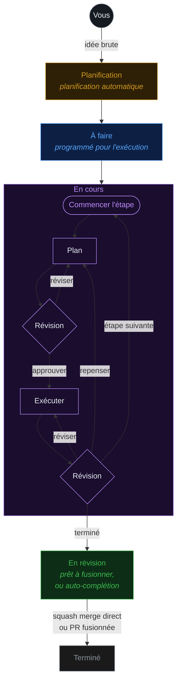

<div align="center">

#  Fusion

### De l'idée brute au code de production — automatiquement.

### 🏭 Une usine logicielle, pilotée par un orchestrateur multi-agents.

Décrivez ce que vous voulez — une équipe d'agents IA le **planifie, le construit, le révise et le livre** pour vous. Fusion est votre usine logicielle : une chaîne de montage pour le code qui s'étend sur les tâches, les agents, les missions, git, les fichiers et les worktrees, avec n'importe quel modèle, local ou cloud.

[**runfusion.ai →**](https://runfusion.ai) · [Docs](./docs/README.md) · [GitHub](https://github.com/Runfusion/Fusion) · [npm](https://www.npmjs.com/package/@runfusion/fusion) · [Discord](https://discord.gg/ksrfuy7WYR)

[English](./README.md) · [简体中文](./README.zh-CN.md) · [繁體中文](./README.zh-TW.md) · **Français** · [Español](./README.es.md) · [한국어](./README.ko.md)

*Traduction automatique — le README anglais fait foi.*

[](./LICENSE)
[](https://www.npmjs.com/package/@runfusion/fusion)
[](https://discord.gg/ksrfuy7WYR)


<br />


<br />
<br />

<a href="https://runfusion.ai">
  
</a>

</div>

---

## Tout votre environnement de développement. Sur un seul écran.

Décrivez une tâche en langage naturel. Un agent de planification lit votre projet, comprend le contexte et rédige un plan `PROMPT.md` complet — étapes, périmètre des fichiers, critères d'acceptation. Fusion planifie ensuite, révise, exécute et révise à nouveau, dans un worktree git isolé, avec une validation humaine où vous le souhaitez.

Un tableau. Contrôlé de n'importe où. Laptop, Mac mini, serveur Linux, VM cloud, téléphone — tous connectés.

> Comme Trello, mais vos tâches sont spécifiées, exécutées et livrées par l'IA. Construit sur l'excellent travail de [dustinbyrne/kb](https://github.com/dustinbyrne/kb).

---

## Démarrage rapide

**Sans installation, directement depuis npm :**

```bash
npx runfusion.ai
```

Cela lance le tableau de bord. Les sous-commandes passent directement : `npx runfusion.ai task create "fix X"`, `npx runfusion.ai --help`, etc. (Ou de façon verbeuse : `npx @runfusion/fusion dashboard`.)

**Installateur en une ligne** (macOS et Linux — choisit automatiquement Homebrew, bascule sur npm en secours) :

```bash
curl -fsSL https://runfusion.ai/install.sh | sh
fusion dashboard
```

**Homebrew** (macOS et Linux) :

```bash
brew tap runfusion/fusion
brew install fusion
fusion dashboard            # ou : fn dashboard
```

Ou en une ligne (tap automatique) : `brew install runfusion/fusion/fusion`.

**npm global** :

```bash
npm install -g @runfusion/fusion
fn dashboard                # ou : fusion dashboard
```

**Depuis un clone** (pour le développement) :

```bash
pnpm dev dashboard
```

Cliquez ensuite sur l'URL `Open:` affichée dans le terminal. Elle intègre un jeton bearer
(`http://localhost:4040/?token=fn_...`) que le navigateur capture dans
`localStorage` à la première visite et réutilise automatiquement par la suite. Côté
serveur, Fusion persiste désormais le jeton du tableau de bord/démon dans
`~/.fusion/settings.json` à la première exécution authentifiée et le réutilise
lors des démarrages ultérieurs, sauf si vous le remplacez (`--token`,
`FUSION_DASHBOARD_TOKEN`, `FUSION_DAEMON_TOKEN`) ou désactivez l'authentification
avec `--no-auth`. Voir
[Référence CLI → fn dashboard → Authentification](./docs/cli-reference.md#fn-dashboard)
pour la précédence complète et les options de réinitialisation/révocation.

### Configuration au premier lancement

Au premier lancement, Fusion ouvre l'**assistant d'intégration** en trois étapes guidées :

1. **Configuration IA** — Utilisez la liste simplifiée de fournisseurs de démarrage rapide (fournisseurs recommandés et fournisseurs déjà connectés), puis développez les **Paramètres avancés du fournisseur** uniquement si vous avez besoin de fournisseurs supplémentaires ou de détails de configuration. Un seul fournisseur suffit pour commencer. Les entrées de fournisseurs dépréciés Google Gemini CLI / Antigravity sont intentionnellement masquées ; les chemins clé API Google/Gemini, Google Generative AI, Vertex et Cloud Code restent pris en charge.
2. **GitHub (optionnel)** — Connectez GitHub pour l'import de tickets et la gestion des PR
3. **Première tâche** — Créez votre première tâche ou importez depuis GitHub (si aucun projet n'est actif, l'assistant vous invite d'abord à enregistrer/sélectionner un répertoire de projet)

L'assistant est **dismissable et non bloquant** — cliquez sur **Ignorer pour l'instant** pour utiliser le tableau de bord immédiatement. Relancez-le plus tard depuis **Paramètres → Authentification → Rouvrir le guide d'intégration**.

### Mobile

Pour le workflow Capacitor + PWA, voir [MOBILE.md](./MOBILE.md).

---

## Le flux

```
  ①  Décrire            ②  Planification        ③  Le tableau          ④  Worktree isolé
  ─────────────         ─────────────         ─────────────          ─────────────────────
  "Ajouter un       →   L'agent rédige  →   Plan → Révision →   →   branche fusion/FN-123
   bouton mode          PROMPT.md           Exécution → Révision     concurrent, zéro
   sombre dans le       (étapes, périmètre, (par étape, jusqu'à      conflit de fichiers
   panneau réglages"    acceptation)        la fin)
```

### Voir chaque étape avant la fusion

<div align="center">
  
</div>

Chaque tâche affiche son plan, ses révisions, ses diffs et ses modifications de fichiers en temps réel. Intervenez sur une tâche active pour réorienter, affiner les contraintes, mettre en pause ou reformuler.

---

## Ce qui la différencie

|  |  |
|---|---|
| 🧠 **Planification IA** | Décrivez une tâche en langage naturel. Les agents de planification la transforment en plan `PROMPT.md` avec étapes, périmètre des fichiers et critères d'acceptation. |
| 🔁 **Workflows sélectionnables** | Les workflows intégrés couvrent le codage, les correctifs rapides, le travail à forte révision, l'exécution par étapes, le Compound Engineering activé par plugin et les fragments de cycle de vie de PR. Choisissez un workflow par tâche ou créez-en des personnalisés dans l'[Éditeur de workflows](./docs/workflow-editor.md). |
| 🌳 **Isolation par worktree** | Chaque tâche s'exécute dans sa propre branche et son propre worktree (`fusion/{task-id}`). Tâches parallèles. Zéro conflit. Délégation [worktrunk](https://github.com/max-sixty/worktrunk) optionnelle via [`worktrunk.enabled`](./docs/settings-reference.md#worktree-backend-settings) (voir [abstraction WorktreeBackend](./docs/architecture.md#worktreebackend-abstraction)). |
| ⚡ **Fusion intelligente** | Toutes les portes franchies ? Fusion effectue un squash-merge et passe à la suite. Activez la validation manuelle où vous le souhaitez, héritez du défaut global d'auto-fusion en direct, ou définissez des remplacements auto/manuel explicites par tâche. |
| 🛰️ **Maillage multi-nœuds** | Laptop, Mac mini, serveur Linux, VM cloud, téléphone — tout synchronisé. Bureau, mobile, web. |
| 🧩 **N'importe quel modèle** | Anthropic, OpenAI, Ollama, Google Generative AI, Z.ai, runtimes locaux et [fournisseurs personnalisés](./docs/dashboard-guide.md#custom-providers) définis par l'utilisateur. Local et cloud coexistent, avec des voies de modèle/fallback de workflow configurables par projet. |
| 🏢 **Entreprises d'agents** | Importez des équipes prédéfinies — plus de 440 agents répartis dans 16 entreprises — et faites-les fonctionner de façon autonome pendant des semaines. |
| 📬 **Messagerie inter-agents** | Boîte aux lettres intégrée entre agents. Déléguer, clarifier, coordonner ; les agents au rôle d'ingénieur peuvent activer la réclamation automatique du backlog quand vous voulez de l'aide à l'implémentation au-delà du retrait réservé à l'exécuteur. |
| 🗨️ **Chat d’agents** | Chat direct, chat de tâche, pièces jointes, cartes de questions, flux reprenables et salles multi-agents expérimentales où les membres mentionnés répondent directement et les membres ambiants peuvent participer jusqu’à un plafond. ([Docs Chat](./docs/dashboard-guide.md#chat-view)) |
| 🗺️ **Missions** | Planification hiérarchique (Mission → Jalon → Tranche → Fonctionnalité → Tâche) avec pilotage automatique et contrats de validation. |
| 🔬 **Recherche** | Exécutions de recherche délimitées avec recherche web, GitHub, docs locaux et synthèse LLM (plus prise en charge intégrée de WebSearch/WebFetch dans les flux de planification et de synthèse lorsque disponible). Transformez les résultats en tâches. ([Docs](./docs/research.md)) |
| 🧪 **Auto-amélioration** | Les agents réfléchissent à leurs propres résultats et mettent à jour leurs prompts au fur et à mesure qu'ils apprennent votre base de code. |
| 🔓 **Open source. MIT.** | Pas d'enfermement propriétaire. Faites-le tourner sur votre propre matériel. Livraisons hebdomadaires. |

---

## Voir en action

<!--
FNXC:Docs 2026-06-21-19:55:
README must lead with a smaller wordmark and a visual showcase of the latest surfaces (Command Center, selectable workflows, agent chat, multi-agent chat rooms, agent mail) so the value lands fast.
Each feature pairs a short looping GIF with value copy; Command Center additionally carries real fleet stats, the token/productivity/team graph trio, and the 70+-theme grid (incl. shadcn light/mono/orange/black) to make the data pop.
Media lives in demo/assets/ (committed, GitHub-inline GIFs); stat numbers are sourced from a live seeded fleet — refresh them if the captures are re-shot.
Each feature keeps its original Tokyo Night capture and adds a Shadcn Light + Shadcn Dark Gray pair; the theme showcase is split into a light-themes grid and a dark-themes grid. Workflow GIFs feature the Stepwise coding graph with node-level zoom/pan.
-->

Les surfaces les plus récentes de Fusion, en un coup d'œil — contrôle de mission, workflows visuels, chat d'agents, salles multi-agents et messagerie inter-agents.

### 🛰️ Command Center — le contrôle de mission de votre flotte d'agents

<div align="center">
  
</div>

Un seul écran pour tout ce que font vos agents. Ajustez la capacité du planificateur en direct, suivez la dépense de tokens par modèle en temps réel et prouvez la valeur avec des chiffres concrets.

<table>
<tr>
<td width="33%"><br/><sub><b>Tokens</b> — dépense par modèle, en cache vs. entrée vs. sortie, dans le temps.</sub></td>
<td width="33%"><br/><sub><b>Productivité</b> — résultats, percentiles de durée, mix de langages.</sub></td>
<td width="33%"><br/><sub><b>Équipe</b> — organigramme des agents et part de tokens par agent.</sub></td>
</tr>
</table>

> Tokens · Outils · Activité · Productivité · Équipe · Écosystème · GitHub · Signaux · Système · Fiabilité · Mission Control — chaque onglet est un angle différent sur la même flotte en direct.

**La même flotte, à votre façon** — Command Center (et tout le tableau de bord) se re-thématise en direct sur **plus de 70 thèmes de couleurs**. Le voici en Shadcn Light et Shadcn Dark Gray :

<table>
<tr>
<td width="50%"><br/><sub><b>Shadcn Light</b></sub></td>
<td width="50%"><br/><sub><b>Shadcn Dark Gray</b></sub></td>
</tr>
</table>

<details>
<summary><b>Une douzaine de thèmes clairs &amp; une douzaine de thèmes sombres</b> (cliquer pour développer)</summary>

<br/>

<div align="center">
  
  <br/><br/>
  
</div>

</details>

### 🔁 Workflows sélectionnables, créés visuellement

<div align="center">
  
</div>

Le parcours d'une tâche, de l'idée à la fusion, est un **workflow** — et c'est à vous de le choisir et de le façonner. Choisissez un workflow intégré (Coding, Quick fix, Review-heavy, Stepwise, PR lifecycle, Compound engineering et plus encore), inspectez son graphe, puis dupliquez et personnalisez les colonnes, les portes, les voies de modèle et la politique de révision dans l'[Éditeur de workflows](./docs/workflow-editor.md) visuel. Aucun fork du moteur requis.

Voici le graphe **Stepwise coding** — planifier, exécuter et réviser chaque étape avant la suivante — exploré nœud par nœud en Shadcn Light et Dark Gray :

<table>
<tr>
<td width="50%"><br/><sub><b>Shadcn Light</b></sub></td>
<td width="50%"><br/><sub><b>Shadcn Dark Gray</b></sub></td>
</tr>
</table>

### 🗨️ Chat d'agents — parlez à vos agents, en plein vol

<div align="center">
  
</div>

Chat direct et chat par tâche avec n'importe quel agent, sur n'importe quel modèle. Demandez pourquoi une tâche a échoué, orientez une approche, déposez des pièces jointes, répondez aux cartes de questions intégrées et reprenez les flux là où vous les avez laissés — rendu complet du markdown et du code de bout en bout.

<table>
<tr>
<td width="50%"><br/><sub><b>Shadcn Light</b></sub></td>
<td width="50%"><br/><sub><b>Shadcn Dark Gray</b></sub></td>
</tr>
</table>

### 👥 Salles de chat multi-agents

<div align="center">
  
</div>

Placez plusieurs agents dans une salle et laissez-les se coordonner. Mentionnez un membre et il répond directement ; les membres ambiants peuvent rejoindre la conversation jusqu'à un plafond. Ici, les agents **CEO**, **Product Manager** et **CTO** s'accordent sur l'attribution des tâches dans `#leads` — sans humain dans la boucle. ([Docs Chat](./docs/dashboard-guide.md#chat-view))

<table>
<tr>
<td width="50%"><br/><sub><b>Shadcn Light</b></sub></td>
<td width="50%"><br/><sub><b>Shadcn Dark Gray</b></sub></td>
</tr>
</table>

### 📬 Messagerie d'agents — une boîte de réception entre vos agents

<div align="center">
  
</div>

Une boîte aux lettres intégrée pour la délégation, la clarification et les passations. Les agents déposent des résumés de triage, demandent des approbations et coordonnent le travail à travers la flotte — avec les vues Boîte de réception, Boîte d'envoi, Agents et Approbations, pour que vous puissiez auditer chaque échange.

<table>
<tr>
<td width="50%"><br/><sub><b>Shadcn Light</b></sub></td>
<td width="50%"><br/><sub><b>Shadcn Dark Gray</b></sub></td>
</tr>
</table>

---

## Comment ça fonctionne



Les tâches avec dépendances sont traitées séquentiellement. Les tâches indépendantes s'exécutent en parallèle. Vous pouvez exiger une validation manuelle avant que les tâches passent de Planification à À faire (paramètre `requirePlanApproval`).

---

## Aperçu des workflows

Les workflows Fusion définissent comment une tâche passe de l’idée à la livraison. Le parcours de codage par défaut reste **Plan/Triage → Exécution → Étapes de workflow → Revue → Merge**, mais cette politique vit désormais dans un workflow sélectionnable plutôt que seulement dans le moteur.

- **Sélection par tâche :** choisissez un workflow dans les contrôles de tâche/tableau, ou assignez-le avec `fn_workflow_select` / `workflow_id` lors de la création.
- **Catalogue intégré :** Coding (`builtin:coding`), Quick fix (`builtin:quick-fix`), Review-heavy (`builtin:review-heavy`), Compound engineering (`builtin:compound-engineering`, avec plugin), Stepwise coding (`builtin:stepwise-coding`) et PR lifecycle (`builtin:pr-workflow`, fragment PR réutilisable).
- **Personnalisation sûre :** inspectez les workflows intégrés, dupliquez-les ou créez des workflows personnalisés dans l’[Éditeur de workflows](./docs/workflow-editor.md). Les réglages de workflow couvrent les voies de modèles, revue/approbation, exécution des étapes, champs de tâche et colonnes.

Consultez [Workflow Steps](./docs/workflow-steps.md) pour la sémantique d’exécution et [Workflow Editor](./docs/workflow-editor.md) pour le guide d’édition dans le tableau de bord.

---

## Multi-nœuds. Un tableau. Toutes les plateformes.

<div align="center">


<br />


</div>

Laptop, Mac mini, serveur Linux, VM cloud, téléphone — chaque nœud est un pair. L'état de vos tâches, vos agents, vos journaux et vos diffs restent synchronisés sur tout le maillage. Le même Fusion est livré sous forme de :

- 🖥️ **Application de bureau** — Electron pour **macOS** (Intel + Apple Silicon), **Windows** 10/11 et **Linux**
- 📱 **Application mobile** — Capacitor pour **iOS/iPadOS** et **Android** ([MOBILE.md](./MOBILE.md))
- 🌐 **Tableau de bord web** — tout navigateur moderne, servi par le démon `fn dashboard`
- 🔌 **CLI** — binaire `fn` + extension pour les workflows orientés terminal

Démarrez le démon sur n'importe quel nœud, connectez vos autres appareils, et le tableau vous suit partout.

---

## Faire tourner une entreprise d'agents

<div align="center">


</div>

Importez une équipe. Faites-la tourner de façon autonome pendant des semaines. **Plus de 440 agents répartis dans 16 entreprises**, câblés pour les missions, les boîtes aux lettres et la délégation inter-agents.

```bash
npx companies.sh add paperclipai/companies/gstack
```

---

## Compatible avec les outils que vous utilisez déjà.

Fusion s'intègre avec les outils que vous aimez. **Hermes**, **Paperclip** et **OpenClaw** sont tous livrés comme plugins de première classe — routez n'importe quel espace de travail vers le runtime qui convient à la tâche. Et n'importe quelle entreprise d'agents Paperclip s'importe en une seule commande.

<div align="center">
  
</div>

### [Hermes](https://hermes-agent.nousresearch.com) <sub>`experimental`</sub>

<sub>Nous Research</sub>

L'agent autonome open source de **Nous Research**. Installez le plugin Hermes et exécutez des agents via Hermes pour les travaux de longue durée à contexte croissant — routez n'importe quel espace de travail Fusion vers lui.

### OpenClaw <sub>`experimental`</sub>

La prise en charge du runtime OpenClaw est disponible sous forme de plugin expérimental (`fusion-plugin-openclaw-runtime`) pour la parité de découverte/configuration du runtime. Configurez les agents avec `runtimeConfig.runtimeHint: "openclaw"` après installation du plugin.

<br />

<div align="center">
  
</div>

### [Paperclip](https://paperclip.ing) <sub>`experimental`</sub>

<sub>paperclip.ing</sub>

Le plan de contrôle humain pour le travail IA. Installez le plugin Paperclip pour exécuter des agents via Paperclip dans Fusion.

Fusion prend également en charge nativement le standard d'entreprises d'agents **[`companies.sh`](https://github.com/paperclipai/companies)** : importez une équipe prédéfinie — **plus de 440 agents répartis dans 16 entreprises** — et laissez-les se coordonner via la boîte aux lettres, les missions et les portes de workflow de Fusion pendant des semaines de travail autonome. Même format d'entreprise, mêmes agents, mêmes compétences que Paperclip.

```bash
npx companies.sh add paperclipai/companies/gstack
```

<br />

> **Hermes**, **Paperclip** et **OpenClaw** sont des plugins de runtime **expérimentaux** — les API et les formats de communication peuvent évoluer entre les versions mineures.

---

## Documentation

| Guide | Ce qu'il couvre |
|---|---|
| [Démarrage](./docs/getting-started.md) | Installation, onboarding, première tâche et bases de sélection des workflows |
| [Guide du tableau de bord](./docs/dashboard-guide.md) | Vues tableau/liste, chat, éditeur de workflows, gestionnaire git, paramètres et outils UI |
| [Gestion des tâches](./docs/task-management.md) | Cycle de vie, spécifications de prompts, commentaires, archivage et intégration GitHub |
| [Référence CLI](./docs/cli-reference.md) | Référence complète des commandes `fn` et du daemon |
| [Référence des paramètres](./docs/settings-reference.md) | Paramètres globaux/projet, hiérarchie des modèles, paramètres de workflow et fournisseurs personnalisés |
| [Workflow Steps](./docs/workflow-steps.md) | Runtime de workflow, workflows intégrés, portes, modèles et phases |
| [Workflow Editor](./docs/workflow-editor.md) | Édition visuelle, import/export, champs/colonnes/paramètres et éditeur mobile |
| [Recherche](./docs/research.md) | Exécutions de recherche, résultats, exports et intégration aux tâches |
| [Agents](./docs/agents.md) | Gestion des agents, spawning, heartbeat et boîtes aux lettres |
| [Missions](./docs/missions.md) | Hiérarchie, planification, autopilotage et contrats de validation |
| [Gestion des plugins](./docs/plugin-management.md) | Découvrir, installer, activer, configurer et dépanner les plugins |
| [Création de plugins](./docs/PLUGIN_AUTHORING.md) | Construire des plugins avec hooks, routes, outils, runtimes et surfaces tableau de bord |
| [Accès distant](./docs/remote-access.md) | Accès distant tokenisé, Tailscale/Cloudflare et dépannage |
| [Multi-projet](./docs/multi-project.md) | Registre central, modes d’isolation et migrations |
| [Docker](./docs/docker.md) | Déploiement conteneurisé |

---

## Fonctionnalités principales

- **AI Planning** — Planning agent generates detailed `PROMPT.md` with steps, file scope, and acceptance criteria
- **Step-by-step Execution** — Plan → Review → Execute → Review cycle for each task step, with graph-mode workflows able to model per-step parse/execute/review/rework explicitly
- **Git Worktree Isolation** — Each task runs in its own worktree (`fusion/{task-id}` branch)
- **Selectable workflows** — Pick Coding, Quick fix, Review-heavy, Stepwise coding, plugin-gated Compound Engineering, custom workflows, or PR lifecycle fragments where appropriate ([overview](#aperçu-des-workflows); [Workflow Steps](./docs/workflow-steps.md#aperçu-des-workflows))
- **Visual Workflow Editor** — Inspect read-only built-ins, duplicate/customize workflows, and edit graph nodes, columns, task fields, typed settings, and per-project values ([Workflow Editor](./docs/workflow-editor.md))
- **Workflow Steps** — Configurable quality gates (pre-merge blocks merge; post-merge informational), plus opt-in [Browser Verification](./docs/workflow-steps.md#workflow-declared-optional-steps)
- **Workflow-native policy** — Fast-mode planning, typed triage thresholds, review/approval, step execution, and model/fallback lanes are workflow settings ([Settings Reference](./docs/settings-reference.md#workflow-settings))
- **GitHub + PR lifecycle** — Import issues, create PRs, display live PR/issue badges, and use workflow-mode PR lifecycle graph fragments where enabled
- **Dashboard** — Real-time kanban/list/graph views, agent management, terminal, git manager, missions, chat, workflow editor, custom providers, and one-click updates
- **Missions** — Hierarchical planning (Mission → Milestone → Slice → Feature → Task) with autopilot, validation contracts, fix-feature retries, mission-goal linking, and blocked handoffs
- **Multi-Project** — Manage multiple projects from one installation with project isolation
- **Custom Providers** — Add OpenAI-compatible, OpenAI Responses, Anthropic-compatible, or Google Generative AI providers; saved models appear in project and workflow model dropdowns ([Dashboard Guide](./docs/dashboard-guide.md#custom-providers))
- **Smart merge controls** — Global auto-merge stays live for default tasks, while explicit per-task overrides can force auto/manual behavior
- **Inter-Agent Messaging** — Built-in messaging for coordination between agents and users; engineer-role agents can opt into backlog auto-claim
- **Agent Chat + Chat Rooms** — Direct/task chat supports attachments, resumable streams, question response cards, and renameable conversations; experimental rooms route mentioned members as direct responders ([Dashboard Guide → Chat View](./docs/dashboard-guide.md#chat-view))

### Authentification des fournisseurs

Fusion prend en charge l'authentification OAuth pour les fournisseurs IA configurée via **Paramètres → Authentification**. Pour la plupart des fournisseurs OAuth, lorsque le tableau de bord est accédé via un hôte non-localhost (nœud distant, hôte/IP LAN ou proxy inverse), les URL de connexion du fournisseur sont réécrites pour router les callbacks OAuth via un endpoint bridge (`/api/auth/oauth-callback`) afin que les redirections atteignent la session navigateur active.

- **Anthropic (Claude)** — Utilise un flux de code d'autorisation collé dans Paramètres/l'assistant : connectez-vous, puis collez l'URL de redirection finale (ou le code) dans Fusion pour terminer la connexion
- **OpenAI Codex** — Utilise le même flux de code d'autorisation collé avec validation d'état sécurisée
- **Factory AI — via Droid CLI** *(optionnel)* — nécessite une installation locale de Droid CLI + `droid auth login` ; la détection suit le chemin du binaire runtime effectif (par défaut `droid`, ou `droidBinaryPath` du plugin si configuré), puis activez dans **Paramètres → Authentification** et redémarrez Fusion
- **llama.cpp — via serveur HTTP** *(optionnel)* — configurez l'URL de votre serveur llama.cpp (par défaut `http://127.0.0.1:8080`) et la clé API optionnelle, puis activez dans **Paramètres → Authentification**
- **Autres fournisseurs** — Authentifiez via la saisie de clé API dans Paramètres (y compris clé API Google/Gemini, Google Generative AI, Vertex et alias Cloud Code)

### Système de modèles

Fusion utilise une hiérarchie de modèles à double portée avec cinq voies indépendantes. Les paramètres globaux définissent les valeurs par défaut de base ; les paramètres de projet fournissent des remplacements par projet.

| Voie | Objectif | Clés globales de base | Clés de remplacement par projet |
|------|---------|---------------------|----------------------|
| Exécuteur | Agent d'exécution des tâches | `executionGlobalProvider` + `executionGlobalModelId` | `executionProvider` + `executionModelId` |
| Planification | Agent de planification des tâches | `planningGlobalProvider` + `planningGlobalModelId` | `planningProvider` + `planningModelId` |
| Validateur | Réviseur de plan/code | `validatorGlobalProvider` + `validatorGlobalModelId` | `validatorProvider` + `validatorModelId` |
| Résumé de titre | Génération automatique de titre | `titleSummarizerGlobalProvider` + `titleSummarizerGlobalModelId` | `titleSummarizerProvider` + `titleSummarizerModelId` |
| Raffinement des étapes de workflow | Raffinement de prompt IA | (utilise `defaultProvider`/`defaultModelId`) | (utilise `modelProvider`/`modelId` sur WorkflowStep) |

**Voies de workflow :** Le workflow par défaut expose les voies Plan/Triage, Executor, Reviewer et fallback dans **Paramètres → Modèles du projet**, et les workflows avancés peuvent déclarer d’autres valeurs typées ([Référence des paramètres](./docs/settings-reference.md#workflow-settings)).

**Remplacements par tâche :** Les tâches peuvent remplacer les voies exécuteur, validateur et planification avec des champs de modèle par tâche (`modelProvider`/`modelId`, `validatorModelProvider`/`validatorModelId`, `planningModelProvider`/`planningModelId`).

**Précédence :** Par tâche → Remplacement projet → Voie globale → `defaultProvider`/`defaultModelId` → Résolution automatique.

Pour la documentation complète des paramètres, voir la [Référence des paramètres](./docs/settings-reference.md).

### Tâches planifiées / automatisations

Fusion prend en charge l'automatisation de tâches planifiées via les endpoints `/api/automations`. Les automatisations peuvent exécuter des commandes shell ou des workflows multi-étapes selon un calendrier configurable.

#### Portée de la planification

Les automatisations et les routines peuvent s'exécuter dans deux portées :

- **Globale** — S'exécute sur tous les projets. À utiliser pour la maintenance inter-projets, les sauvegardes ou les rapports unifiés.
- **Projet** — S'exécute uniquement dans un projet spécifique. À utiliser pour la CI, les tests ou les déploiements spécifiques au projet.

Lorsque vous créez une planification sans choisir de portée, Fusion utilise par défaut la **portée projet** avec l'ID de projet `default` pour la compatibilité ascendante.

Pour cibler explicitement une portée :
- Dans le modal **Tâches planifiées** du tableau de bord, utilisez le bouton **Global / Projet**.
- Via l'API, passez `?scope=global` ou `?scope=project&projectId=<id>` sur les endpoints d'automatisation/routine.

**Règles de résolution de portée :**
- `scope=global` se résout toujours vers la voie d'automatisation/routine globale, indépendamment du projet actif.
- `scope=project` nécessite un `projectId`. S'il est omis, il bascule sur `"default"`.
- Les opérations CRUD, exécution, bascule et webhook sont strictement isolées par portée : une planification globale ne peut pas être modifiée depuis une requête à portée projet, et vice versa.

**Conseils opérationnels pour les configurations multi-projets :**
- Préférez les planifications **globales** pour l'infrastructure partagée (ex. : sauvegardes nocturnes, extraction de résumés mémorisés).
- Préférez les planifications **projet** pour l'automatisation par dépôt (ex. : lanceurs de tests par projet, hooks de déploiement).
- Les voies globale et projet sont interrogées indépendamment par le moteur, donc les exécutions dues dans une voie ne bloquent pas l'autre.

#### Automatisations

| Endpoint | Méthode | Description |
|---------|--------|-------------|
| `/api/automations` | GET | Lister toutes les automatisations (filtrées par portée si spécifiée) |
| `/api/automations` | POST | Créer une automatisation (portée par défaut : `project`) |
| `/api/automations/:id` | GET | Obtenir une automatisation par ID |
| `/api/automations/:id` | PATCH | Mettre à jour une automatisation |
| `/api/automations/:id` | DELETE | Supprimer une automatisation |
| `/api/automations/:id/run` | POST | Déclencher une exécution manuelle |
| `/api/automations/:id/toggle` | POST | Activer/désactiver |
| `/api/automations/:id/steps/reorder` | POST | Réordonner les étapes d'automatisation |

#### Routines

Les routines sont des tâches d'agents IA déclenchées par des planifications cron, des webhooks ou une exécution manuelle. Les routines partagent le même modèle de portée global/projet que les automatisations.

| Endpoint | Méthode | Description |
|---------|--------|-------------|
| `/api/routines` | GET | Lister toutes les routines (filtrées par portée si spécifiée) |
| `/api/routines` | POST | Créer une routine (portée par défaut : `project`) |
| `/api/routines/:id` | GET | Obtenir une routine par ID |
| `/api/routines/:id` | PATCH | Mettre à jour une routine |
| `/api/routines/:id` | DELETE | Supprimer une routine |
| `/api/routines/:id/run` | POST | Déclenchement manuel |
| `/api/routines/:id/trigger` | POST | Déclenchement manuel canonique |
| `/api/routines/:id/runs` | GET | Obtenir l'historique d'exécution |
| `/api/routines/:id/webhook` | POST | Déclenchement par webhook (vérification de signature prise en charge) |

---

## Exemples CLI rapides

```bash
fn task create "Fix the login bug"                    # Entrée rapide → planification
fn task plan "Build auth system"                      # Planification guidée par IA
fn task import owner/repo --labels bug                # Importer des tickets GitHub
fn task show FN-001                                   # Voir les détails d'une tâche
fn task logs FN-001 --follow                          # Suivre les journaux d'exécution
fn task steer FN-001 "Use TypeScript"                 # Guider l'agent en cours d'exécution

fn project add my-app /path/to/app                    # Enregistrer un projet
fn project list                                       # Lister tous les projets

fn settings set maxConcurrent 4                       # Configurer les paramètres
fn settings export                                    # Exporter la configuration

fn mission create "Auth System" "Build auth"          # Créer une mission
fn mission activate-slice <slice-id>                  # Activer une tranche

fn skills search react                                # Rechercher dans skills.sh
fn skills install firebase/agent-skills               # Installer des compétences d'agent
```

---

## Paquets

| Paquet | Description |
|---------|-------------|
| `@fusion/core` | Modèle de domaine — tâches, colonnes du tableau, store SQLite |
| `@fusion/dashboard` | Interface web — serveur Express + tableau kanban avec SSE |
| `@fusion/engine` | Moteur IA — planification, exécution, ordonnancement, étapes de workflow |
| `@runfusion/fusion` | CLI + extension — publié sur npm |

---

## Développement

```bash
pnpm install                  # Installer les dépendances
pnpm local                    # Démarrer le tableau de bord/API local sur un port différent de 4040
pnpm local -- --engine        # Démarrer le tableau de bord local avec le moteur IA
pnpm build                    # Construire les paquets du workspace par défaut (exclut bureau/mobile)
pnpm build:all                # Construire tous les paquets (y compris bureau/mobile)
pnpm dev dashboard            # Exécuter le tableau de bord + le moteur IA
pnpm dev:ui                   # Tableau de bord seul (sans moteur IA)
pnpm lint                     # Linter tous les paquets
pnpm typecheck                # Vérifier les types de tous les paquets
pnpm test                     # Exécuter tous les tests
```

### Construire un exécutable autonome

Construisez un binaire `fn` autonome et auto-contenu avec [Bun](https://bun.sh/) :

```bash
pnpm build:exe                # Construire pour la plateforme actuelle
pnpm build:exe:all            # Compilation croisée pour toutes les plateformes
```

---

## Licence

MIT — open source, sans enfermement propriétaire. Voir [LICENSE](./LICENSE).

<div align="center">

**[runfusion.ai →](https://runfusion.ai)**

</div>
