<div align="center">

#  Fusion

### 从粗糙想法到生产代码——全程自动化。

### 🏭 由多智能体编排器运行的软件工厂。

描述你想要的东西——一支 AI 智能体团队便会为你**规划、构建、审核并交付**。Fusion 就是你的软件工厂：一条贯穿任务、智能体、任务群、Git、文件与工作树的代码流水线，支持任意模型，本地与云端皆可。

[**runfusion.ai →**](https://runfusion.ai) · [文档](./docs/README.md) · [GitHub](https://github.com/Runfusion/Fusion) · [npm](https://www.npmjs.com/package/@runfusion/fusion) · [Discord](https://discord.gg/ksrfuy7WYR)

[English](./README.md) · **简体中文** · [繁體中文](./README.zh-TW.md) · [Français](./README.fr.md) · [Español](./README.es.md) · [한국어](./README.ko.md)

*本文档为社区机器翻译版本，英文 README 为权威原版。*

[](./LICENSE)
[](https://www.npmjs.com/package/@runfusion/fusion)
[](https://discord.gg/ksrfuy7WYR)


<br />


<br />
<br />

<a href="https://runfusion.ai">
  
</a>

</div>

---

## 你的整个开发环境。尽在一块面板之上。

用自然语言描述一个任务。规划智能体会读取你的项目、理解上下文，并撰写完整的 `PROMPT.md` 计划——包括步骤、文件范围和验收标准。随后 Fusion 在隔离的 Git 工作树中完成规划、审核、执行与再审核，你可以在任意环节设置人工审批门控。

一块看板。随处操控。笔记本、Mac mini、Linux 服务器、云虚拟机、手机——全部互联。

> 就像 Trello，只不过你的任务由 AI 来定义、执行和交付。基于 [dustinbyrne/kb](https://github.com/dustinbyrne/kb) 的出色工作构建。

---

## 快速上手

**无需安装，直接通过 npm 运行：**

```bash
npx runfusion.ai
```

这将启动仪表板。子命令可透传：`npx runfusion.ai task create "fix X"`、`npx runfusion.ai --help` 等（或完整写法：`npx @runfusion/fusion dashboard`）。

**一键安装脚本**（macOS 和 Linux——自动选用 Homebrew，失败则回退到 npm）：

```bash
curl -fsSL https://runfusion.ai/install.sh | sh
fusion dashboard
```

**Homebrew**（macOS 和 Linux）：

```bash
brew tap runfusion/fusion
brew install fusion
fusion dashboard            # 或：fn dashboard
```

或使用一行命令（自动添加 tap）：`brew install runfusion/fusion/fusion`。

**npm 全局安装**：

```bash
npm install -g @runfusion/fusion
fn dashboard                # 或：fusion dashboard
```

**从克隆仓库启动**（用于开发）：

```bash
pnpm dev dashboard
```

然后点击终端输出的 `Open:` URL。该 URL 内嵌了一个持有者令牌
（`http://localhost:4040/?token=fn_...`），浏览器首次访问时会将其捕获并存入
`localStorage`，此后自动复用。在服务端，Fusion 会在首次经过身份验证的运行时将
仪表板/守护进程令牌持久化至 `~/.fusion/settings.json`，并在后续启动时复用，
除非你通过 `--token`、`FUSION_DASHBOARD_TOKEN`、`FUSION_DAEMON_TOKEN` 覆盖，
或使用 `--no-auth` 禁用鉴权。完整的优先级规则及重置/吊销选项，请参见
[CLI 参考 → fn dashboard → 身份验证](./docs/cli-reference.md#fn-dashboard)。

### 首次运行向导

首次启动时，Fusion 会打开**引导向导**，分三步引导：

1. **AI 配置** — 使用简化的快速启动提供商列表（推荐提供商加上已连接的提供商），如需添加更多提供商或查看详细设置，展开**高级提供商设置**即可。入门只需一个提供商。已弃用的 Google Gemini CLI / Antigravity 提供商条目已被有意隐藏；Google/Gemini API 密钥、Google Generative AI、Vertex 和 Cloud Code 路径仍受支持。
2. **GitHub（可选）** — 连接 GitHub 以导入 Issue 和管理 PR
3. **第一个任务** — 创建你的第一个任务，或从 GitHub 导入（若当前无活跃项目，引导向导会先提示你注册/选择项目目录）

向导**可关闭且不阻塞**——点击**暂时跳过**即可立即使用仪表板。稍后可从**设置 → 身份验证 → 重新打开引导向导**再次触发。

### 移动端

Capacitor + PWA 工作流，请参见 [MOBILE.md](./MOBILE.md)。

---

## 工作流程

```
  ①  描述              ②  规划                  ③  看板                  ④  隔离工作树
  ─────────────        ─────────────         ─────────────          ─────────────────────
  "在设置面板    →   智能体撰写    →   规划 → 审核 →      →   fusion/FN-123 分支
   添加深色模式        PROMPT.md           执行 → 审核              并行运行，零
   切换按钮"          （步骤、范围、        （逐步进行，直到          文件冲突
                       验收标准）           完成）
```

### 合并前看清每一步

<div align="center">
  
</div>

每个任务都会实时展示其计划、审核记录、差异对比和文件变更。你可以随时介入活跃任务，调整方向、收紧约束、暂停执行或重新提示。

---

## 与众不同之处

|  |  |
|---|---|
| 🧠 **AI 规划** | 用自然语言描述任务。规划智能体将其转化为包含步骤、文件范围和验收标准的 `PROMPT.md` 计划。 |
| 🔁 **可选工作流** | 内置工作流覆盖编码、快速修复、强化审核、逐步执行、插件化 Compound Engineering 与 PR lifecycle 片段。可按任务选择，或在[工作流编辑器](./docs/workflow-editor.md)中编写自定义工作流。 |
| 🌳 **工作树隔离** | 每个任务在独立分支和工作树（`fusion/{task-id}`）中运行，支持并行任务，零冲突。可通过 [`worktrunk.enabled`](./docs/settings-reference.md#worktree-backend-settings) 选择性启用 [worktrunk](https://github.com/max-sixty/worktrunk) 委托（参见 [WorktreeBackend 抽象](./docs/architecture.md#worktreebackend-abstraction)）。 |
| ⚡ **智能合并控制** | 通过所有门控后，Fusion 自动压缩合并并继续推进。你可以要求人工审批、继承全局 auto-merge 默认值，或设置任务级自动/手动覆盖。 |
| 🛰️ **多节点网格** | 笔记本、Mac mini、Linux 服务器、云虚拟机、手机——全部同步。桌面端、移动端、Web 端均支持。 |
| 🧩 **任意模型** | 支持 Anthropic、OpenAI、Ollama、Google Generative AI、Z.ai、本地运行时与[自定义提供方](./docs/dashboard-guide.md#custom-providers)。本地与云端并存，并可按项目配置工作流模型/回退通道。 |
| 🏢 **智能体公司** | 导入预构建团队——16 家公司共 440+ 个智能体——自主运行数周。 |
| 📬 **智能体间消息** | 内置智能体间邮箱，支持委派、澄清与协调。 |
| 🗨️ **智能体聊天** | 支持直接聊天、任务聊天、附件、聊天内问题卡、可恢复流，以及实验性的多智能体聊天室；被提及成员直接回复，旁听成员可在上限内参与。（[聊天文档](./docs/dashboard-guide.md#chat-view)） |
| 🗺️ **任务群** | 层级式规划（任务群 → 里程碑 → 切片 → 功能 → 任务），支持自动驾驶和验证契约。 |
| 🔬 **调研** | 有边界的调研运行，集成网络搜索、GitHub、本地文档和 LLM 综合分析（规划与综合流程中还支持运行时内置 WebSearch/WebFetch）。将调研发现直接转化为任务。（[文档](./docs/research.md)） |
| 🧪 **自我改进** | 智能体反思自身输出，并在熟悉你的代码库后持续更新其提示词。 |
| 🔓 **开源，MIT 协议。** | 无供应商锁定。可在自有硬件上运行。每周持续更新。 |

---

## 实地一览

<!--
FNXC:Docs 2026-06-21-19:55:
README must lead with a smaller wordmark and a visual showcase of the latest surfaces (Command Center, selectable workflows, agent chat, multi-agent chat rooms, agent mail) so the value lands fast.
Each feature pairs a short looping GIF with value copy; Command Center additionally carries real fleet stats, the token/productivity/team graph trio, and the 70+-theme grid (incl. shadcn light/mono/orange/black) to make the data pop.
Media lives in demo/assets/ (committed, GitHub-inline GIFs); stat numbers are sourced from a live seeded fleet — refresh them if the captures are re-shot.
Each feature keeps its original Tokyo Night capture and adds a Shadcn Light + Shadcn Dark Gray pair; the theme showcase is split into a light-themes grid and a dark-themes grid. Workflow GIFs feature the Stepwise coding graph with node-level zoom/pan.
-->

Fusion 中最新的功能界面一览——任务控制中心、可视化工作流、智能体聊天、多智能体聊天室与智能体间邮件。

### 🛰️ 指挥中心 — 你的智能体舰队的任务控制中心

<div align="center">
  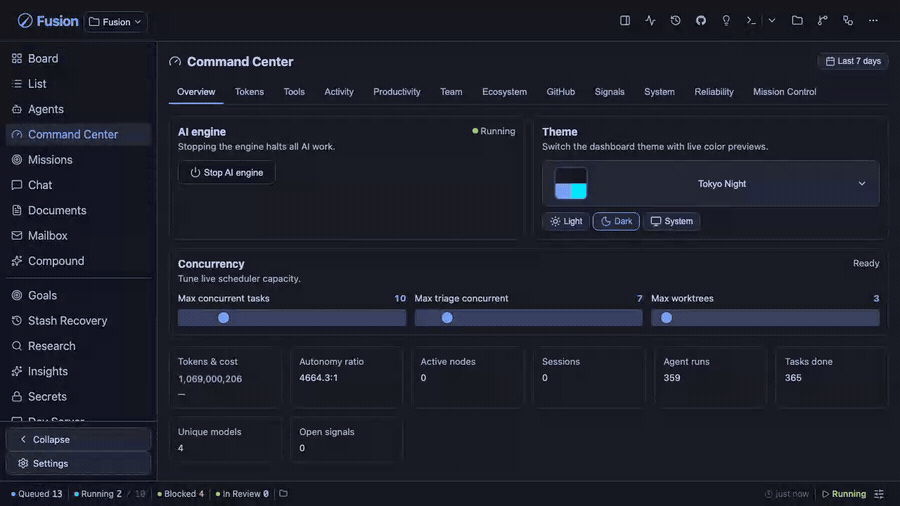
</div>

一块屏幕掌握智能体的所有动态。实时调节调度器容量，按模型实时观察 token 消耗，并用硬数据证明价值。

<table>
<tr>
<td width="33%">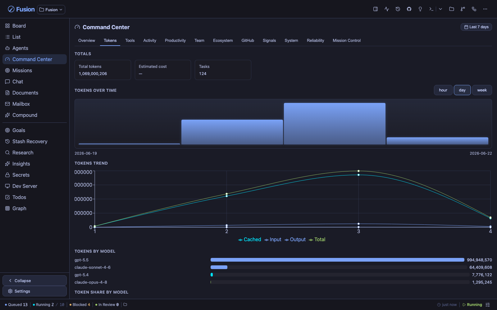<br/><sub><b>Token</b> — 按模型划分的消耗，缓存 vs. 输入 vs. 输出，随时间变化。</sub></td>
<td width="33%">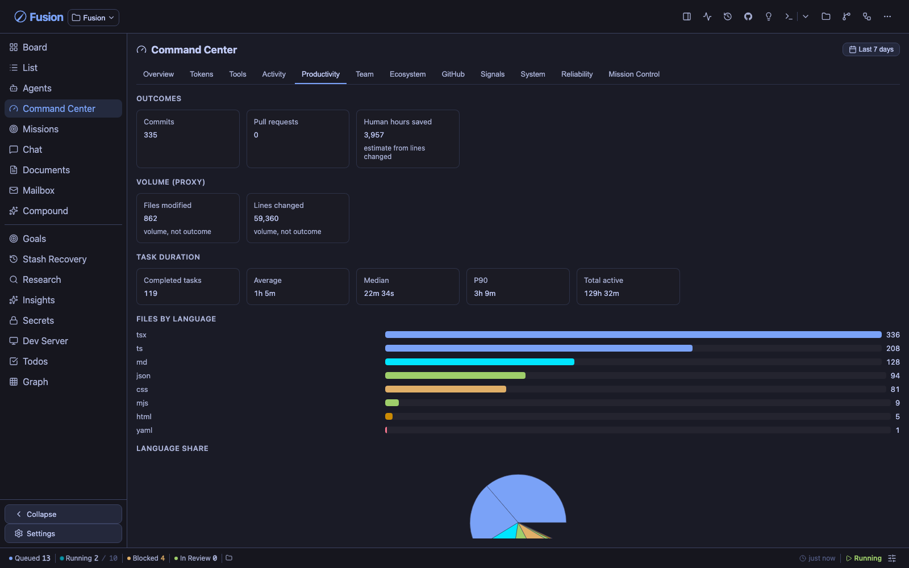<br/><sub><b>生产力</b> — 产出成果、时长分位数、语言占比。</sub></td>
<td width="33%">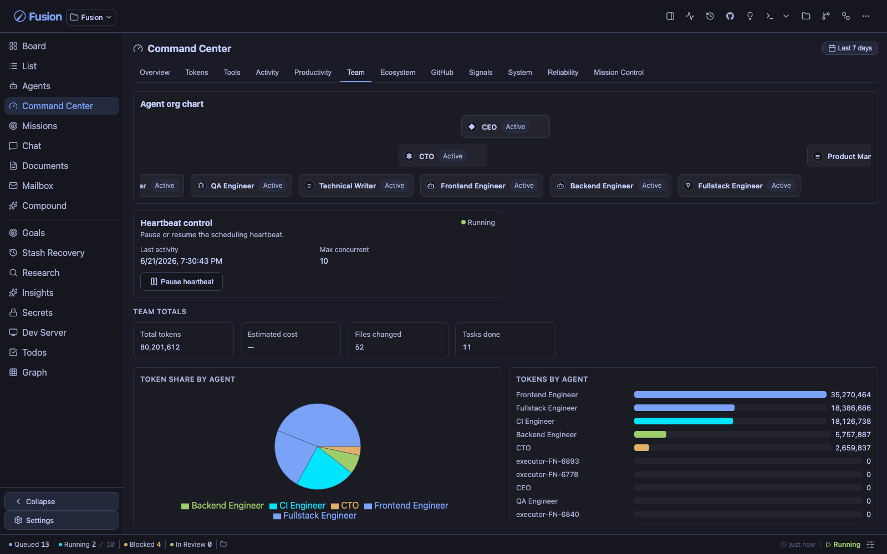<br/><sub><b>团队</b> — 智能体组织架构图与每个智能体的 token 占比。</sub></td>
</tr>
</table>

> Tokens · Tools · Activity · Productivity · Team · Ecosystem · GitHub · Signals · System · Reliability · Mission Control — 每个标签页都是观察同一支实时舰队的不同视角。

**同一支舰队，随你定制** — 指挥中心（以及整个仪表板）可在 **70+ 种配色主题**间实时换肤。这里展示的是 Shadcn Light 和 Shadcn Dark Gray：

<table>
<tr>
<td width="50%">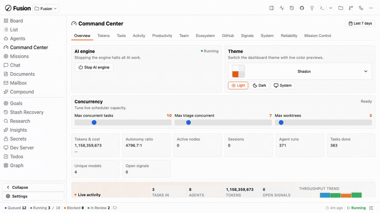<br/><sub><b>Shadcn Light</b></sub></td>
<td width="50%">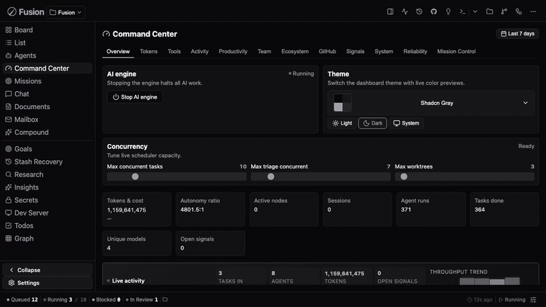<br/><sub><b>Shadcn Dark Gray</b></sub></td>
</tr>
</table>

<details>
<summary><b>十余种浅色主题与十余种深色主题</b>（点击展开）</summary>

<br/>

<div align="center">
  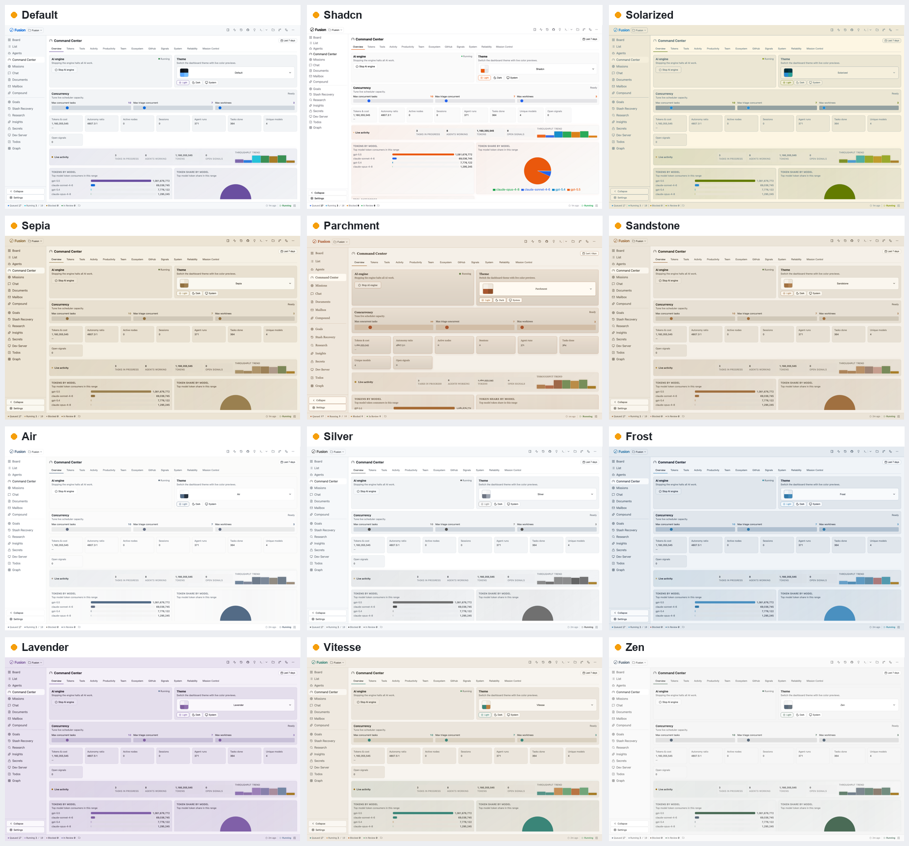
  <br/><br/>
  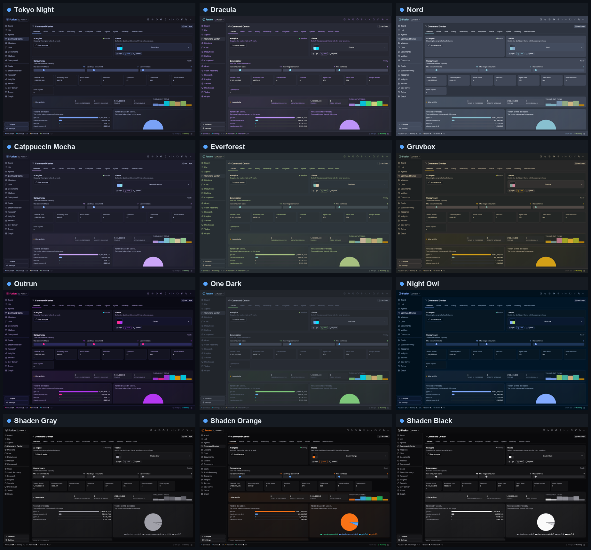
</div>

</details>

### 🔁 可视化编写的可选工作流

<div align="center">
  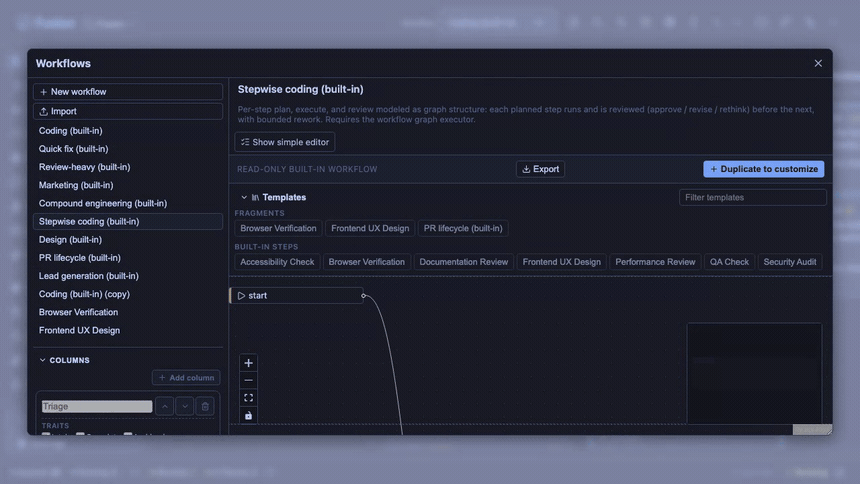
</div>

任务从想法到合并的旅程就是一条**工作流**——它由你选择、由你塑造。挑选一个内置工作流（Coding、Quick fix、Review-heavy、Stepwise、PR lifecycle、Compound engineering 等），查看其图形，然后在可视化[工作流编辑器](./docs/workflow-editor.md)中复制并定制列、门控、模型通道和审核策略。无需 fork 引擎。

这是 **Stepwise coding**（逐步编码）图形——在进入下一步前对每一步进行规划、执行和审核——在 Shadcn Light 和 Dark Gray 中逐节点探索：

<table>
<tr>
<td width="50%">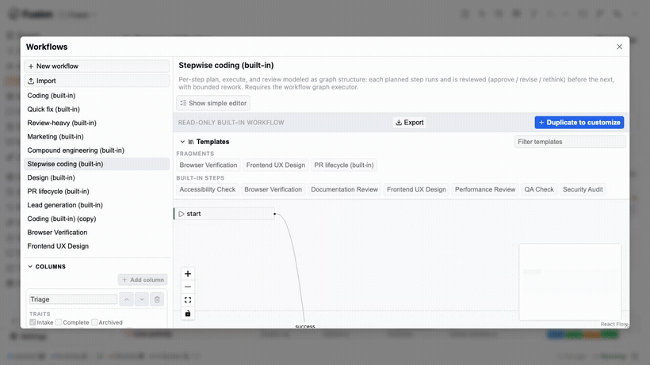<br/><sub><b>Shadcn Light</b></sub></td>
<td width="50%">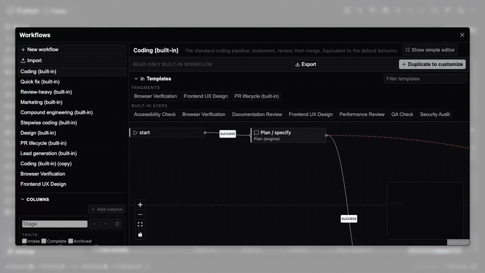<br/><sub><b>Shadcn Dark Gray</b></sub></td>
</tr>
</table>

### 🗨️ 智能体聊天 — 在任务进行中与智能体对话

<div align="center">
  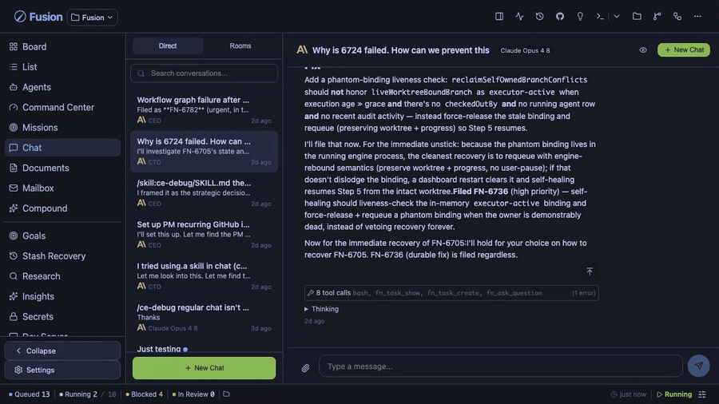
</div>

与任意智能体进行直接聊天和任务聊天，可用任意模型。询问任务为何失败、引导其方法、拖入附件、回答聊天内问题卡，并从上次中断处恢复流——全程支持完整的 markdown 和代码渲染。

<table>
<tr>
<td width="50%">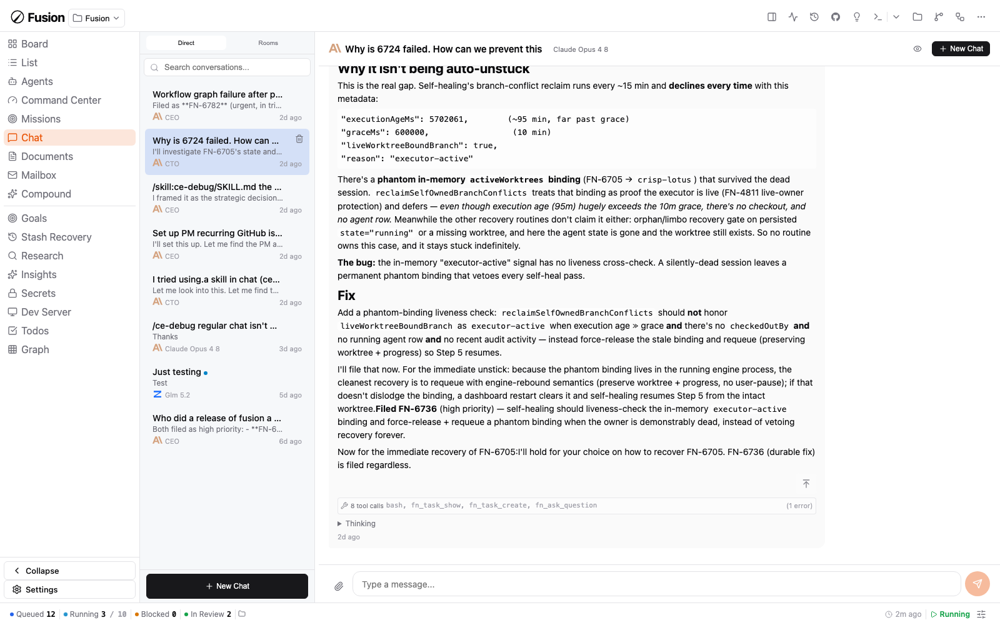<br/><sub><b>Shadcn Light</b></sub></td>
<td width="50%">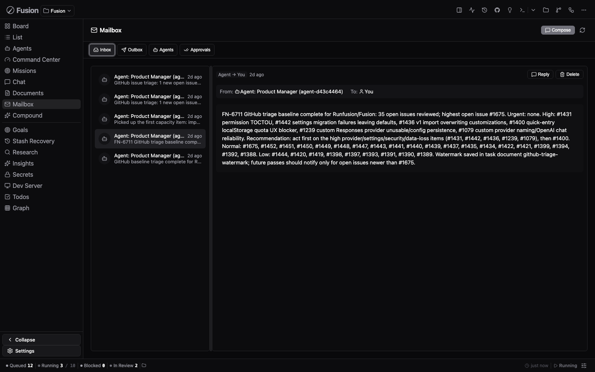<br/><sub><b>Shadcn Dark Gray</b></sub></td>
</tr>
</table>

### 👥 多智能体聊天室

<div align="center">
  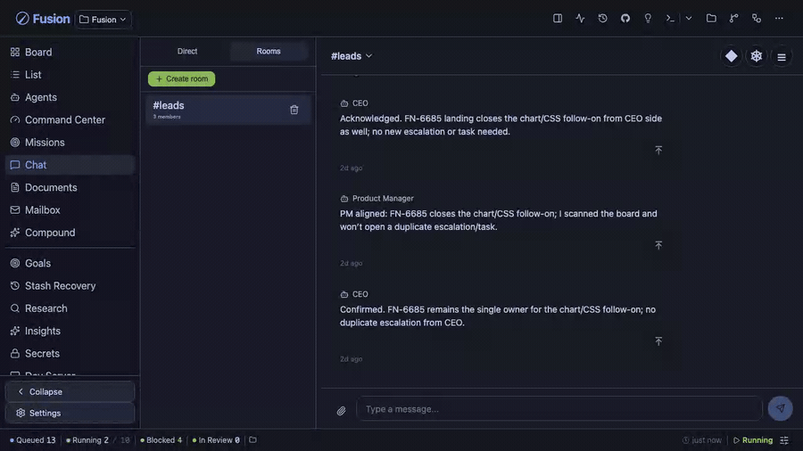
</div>

把多个智能体放进同一个房间，让它们协作。提及某个成员，它便会直接回复；旁听成员可在上限内加入对话。这里 **CEO**、**产品经理**和 **CTO** 智能体在 `#leads` 中就任务归属达成一致——全程无需人工介入。（[聊天文档](./docs/dashboard-guide.md#chat-view)）

<table>
<tr>
<td width="50%">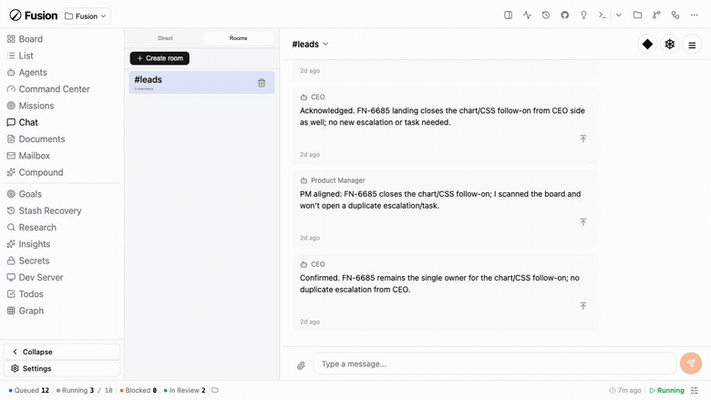<br/><sub><b>Shadcn Light</b></sub></td>
<td width="50%">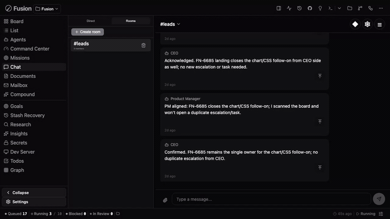<br/><sub><b>Shadcn Dark Gray</b></sub></td>
</tr>
</table>

### 📬 智能体邮件 — 智能体之间的收件箱

<div align="center">
  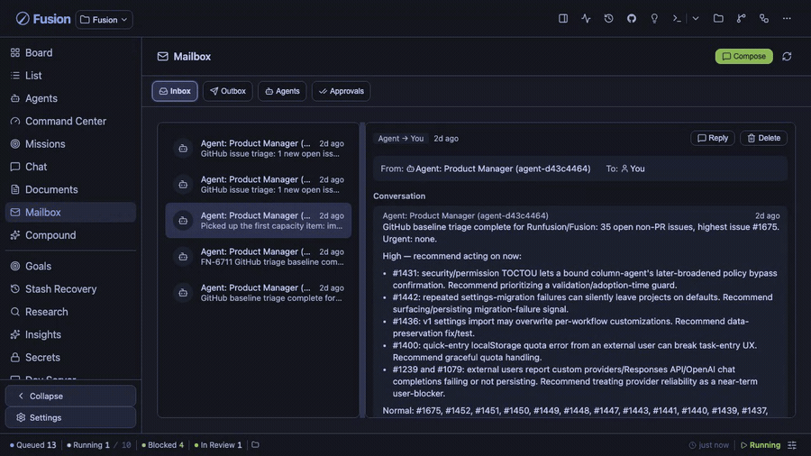
</div>

内置邮箱，用于委派、澄清与交接。智能体提交分诊摘要、请求审批，并在整支舰队间协调工作——配有收件箱、发件箱、智能体和审批视图，让你可以审计每一次往来。

<table>
<tr>
<td width="50%">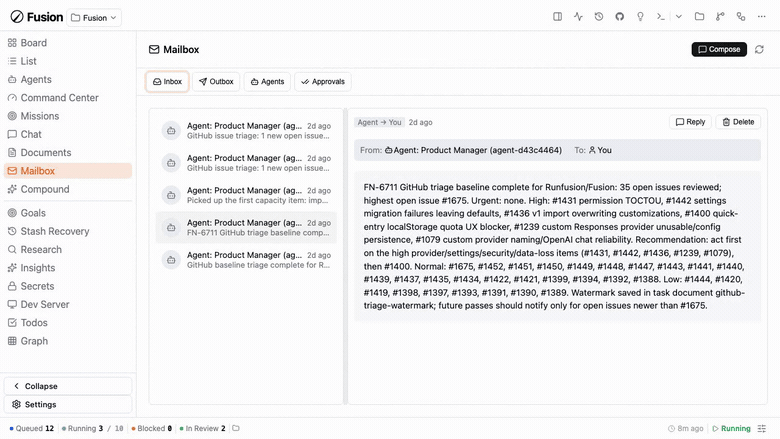<br/><sub><b>Shadcn Light</b></sub></td>
<td width="50%">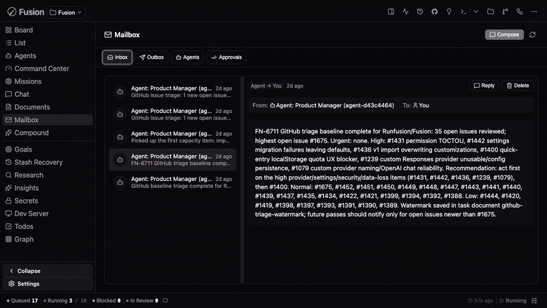<br/><sub><b>Shadcn Dark Gray</b></sub></td>
</tr>
</table>

---

## 工作原理

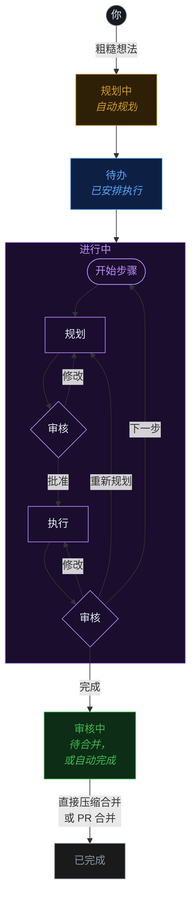

有依赖关系的任务按顺序处理，相互独立的任务并行运行。可选择在任务从规划移至待办前要求手动审批（`requirePlanApproval` 设置）。

---

## 工作流概览

Fusion 工作流定义任务如何从想法走向交付。默认编码路径仍是 **Plan/Triage → Execute → Workflow steps → Review → Merge** 循环，但策略现在属于可选择的工作流，而不只是写死在引擎里。

- **按任务选择：** 在仪表板的任务/看板工作流控件中选择，或创建任务时通过 `fn_workflow_select` / `workflow_id` 指定。
- **内置目录：** Coding（`builtin:coding`）、Quick fix（`builtin:quick-fix`）、Review-heavy（`builtin:review-heavy`）、Compound engineering（`builtin:compound-engineering`，需插件）、Stepwise coding（`builtin:stepwise-coding`）以及 PR lifecycle（`builtin:pr-workflow`，可复用的 PR 图形片段）。
- **安全定制：** 在可视化[工作流编辑器](./docs/workflow-editor.md)中查看内置工作流、复制它们或编写自定义工作流。工作流专属设置涵盖模型通道、审核/审批策略、步骤执行、任务字段与列。

阅读 [Workflow Steps](./docs/workflow-steps.md) 了解运行语义；阅读 [Workflow Editor](./docs/workflow-editor.md) 了解仪表板编辑指南。

---

## 多节点。一块看板。全平台覆盖。

<div align="center">


<br />


</div>

笔记本、Mac mini、Linux 服务器、云虚拟机、手机——每个节点都是对等方。你的任务状态、智能体、日志和差异对比在整个网格中保持同步。同一个 Fusion 提供以下形态：

- 🖥️ **桌面应用** — 基于 Electron，支持 **macOS**（Intel + Apple Silicon）、**Windows** 10/11 和 **Linux**
- 📱 **移动应用** — 基于 Capacitor，支持 **iOS/iPadOS** 和 **Android**（[MOBILE.md](./MOBILE.md)）
- 🌐 **Web 仪表板** — 任意现代浏览器，由 `fn dashboard` 守护进程提供服务
- 🔌 **CLI** — `fn` 二进制文件 + 扩展，面向终端优先的工作流

在任意节点启动守护进程，连接其他设备，看板随你所在。

---

## 运行一个智能体公司

<div align="center">


</div>

导入一个团队，自主运行数周。**16 家公司共 440+ 个智能体**，预置了任务群、邮箱和智能体间委派机制。

```bash
npx companies.sh add paperclipai/companies/gstack
```

---

## 与你已在使用的工具兼容。

Fusion 与你喜爱的工具深度集成。**Hermes**、**Paperclip** 和 **OpenClaw** 均作为一等公民插件发布——将任意工作区路由到最适合该任务的运行时。任何 Paperclip 智能体公司均可通过单条命令导入。

<div align="center">
  
</div>

### [Hermes](https://hermes-agent.nousresearch.com) <sub>`experimental`</sub>

<sub>Nous Research</sub>

**Nous Research** 出品的开源自主智能体。安装 Hermes 插件后，可通过 Hermes 运行智能体以处理长期运行、上下文持续增长的工作——将任意 Fusion 工作区路由至其上。

### OpenClaw <sub>`experimental`</sub>

OpenClaw 运行时支持以实验性插件（`fusion-plugin-openclaw-runtime`）的形式提供，用于运行时发现与配置对等。安装插件后，使用 `runtimeConfig.runtimeHint: "openclaw"` 配置智能体。

<br />

<div align="center">
  
</div>

### [Paperclip](https://paperclip.ing) <sub>`experimental`</sub>

<sub>paperclip.ing</sub>

AI 劳动力的人工控制平面。安装 Paperclip 插件后，可在 Fusion 内部通过 Paperclip 运行智能体。

Fusion 还原生支持 **[`companies.sh`](https://github.com/paperclipai/companies)** 智能体公司标准：导入预构建团队——**16 家公司共 440+ 个智能体**——让它们通过 Fusion 的邮箱、任务群和工作流门控协作，自主运行数周。与 Paperclip 共用相同的公司格式、相同的智能体和相同的技能。

```bash
npx companies.sh add paperclipai/companies/gstack
```

<br />

> **Hermes**、**Paperclip** 和 **OpenClaw** 均为**实验性**运行时插件——API 和通信格式可能在次要版本间发生变更。

---

## 文档

| 指南 | 内容 |
|---|---|
| [入门指南](./docs/getting-started.md) | 安装、引导、首个任务与工作流选择基础 |
| [仪表板指南](./docs/dashboard-guide.md) | 看板/列表视图、聊天、工作流编辑器、Git 管理器、设置与 UI 工具 |
| [任务管理](./docs/task-management.md) | 生命周期、提示规范、评论、归档与 GitHub 集成 |
| [CLI 参考](./docs/cli-reference.md) | 完整 `fn` 命令与守护进程参考 |
| [设置参考](./docs/settings-reference.md) | 全局/项目设置、模型层级、工作流设置与自定义提供方 |
| [Workflow Steps](./docs/workflow-steps.md) | 工作流运行时、内置工作流、门控、模板与阶段 |
| [Workflow Editor](./docs/workflow-editor.md) | 可视化编排、导入/导出、字段/列/设置与移动端编辑器 |
| [调研](./docs/research.md) | 调研运行、发现、导出与任务集成 |
| [智能体](./docs/agents.md) | 智能体管理、派生、心跳与邮箱流程 |
| [任务群](./docs/missions.md) | 层级、规划、自动驾驶与验证契约 |
| [插件管理](./docs/plugin-management.md) | 发现、安装、启用、配置与排查插件 |
| [插件开发](./docs/PLUGIN_AUTHORING.md) | 使用 hooks、routes、tools、runtimes 与仪表板表面构建插件 |
| [远程访问](./docs/remote-access.md) | 带令牌的远程仪表板、Tailscale/Cloudflare 与故障排查 |
| [多项目](./docs/multi-project.md) | 中央注册表、隔离模式与迁移 |
| [Docker](./docs/docker.md) | 容器部署 |

---

## 核心功能

- **AI Planning** — Planning agent generates detailed `PROMPT.md` with steps, file scope, and acceptance criteria
- **Step-by-step Execution** — Plan → Review → Execute → Review cycle for each task step, with graph-mode workflows able to model per-step parse/execute/review/rework explicitly
- **Git Worktree Isolation** — Each task runs in its own worktree (`fusion/{task-id}` branch)
- **Selectable workflows** — Pick Coding, Quick fix, Review-heavy, Stepwise coding, plugin-gated Compound Engineering, custom workflows, or PR lifecycle fragments where appropriate ([overview](#工作流概览); [Workflow Steps](./docs/workflow-steps.md#工作流概览))
- **Visual Workflow Editor** — Inspect read-only built-ins, duplicate/customize workflows, and edit graph nodes, columns, task fields, typed settings, and per-project values ([Workflow Editor](./docs/workflow-editor.md))
- **Workflow Steps** — Configurable quality gates (pre-merge blocks merge; post-merge informational), plus opt-in [Browser Verification](./docs/workflow-steps.md#workflow-declared-optional-steps)
- **Workflow-native policy** — Fast-mode planning, typed triage thresholds, review/approval, step execution, and model/fallback lanes are workflow settings ([Settings Reference](./docs/settings-reference.md#workflow-settings))
- **GitHub + PR lifecycle** — Import issues, create PRs, display live PR/issue badges, and use workflow-mode PR lifecycle graph fragments where enabled
- **Dashboard** — Real-time kanban/list/graph views, agent management, terminal, git manager, missions, chat, workflow editor, custom providers, and one-click updates
- **Missions** — Hierarchical planning (Mission → Milestone → Slice → Feature → Task) with autopilot, validation contracts, fix-feature retries, mission-goal linking, and blocked handoffs
- **Multi-Project** — Manage multiple projects from one installation with project isolation
- **Custom Providers** — Add OpenAI-compatible, OpenAI Responses, Anthropic-compatible, or Google Generative AI providers; saved models appear in project and workflow model dropdowns ([Dashboard Guide](./docs/dashboard-guide.md#custom-providers))
- **Smart merge controls** — Global auto-merge stays live for default tasks, while explicit per-task overrides can force auto/manual behavior
- **Inter-Agent Messaging** — Built-in messaging for coordination between agents and users; engineer-role agents can opt into backlog auto-claim
- **Agent Chat + Chat Rooms** — Direct/task chat supports attachments, resumable streams, question response cards, and renameable conversations; experimental rooms route mentioned members as direct responders ([Dashboard Guide → Chat View](./docs/dashboard-guide.md#chat-view))

### 提供商身份验证

Fusion 支持通过**设置 → 身份验证**为 AI 提供商配置基于 OAuth 的身份验证。对于大多数 OAuth 提供商，当仪表板通过非 localhost 主机访问（远程节点、局域网主机/IP 或反向代理）时，提供商登录 URL 会被重写，通过桥接端点（`/api/auth/oauth-callback`）路由 OAuth 回调，以确保重定向能到达活跃的浏览器会话。

- **Anthropic (Claude)** — 在设置/引导向导中使用粘贴授权码流程：登录后，将最终重定向 URL（或授权码）粘贴回 Fusion 以完成登录
- **OpenAI Codex** — 使用相同的粘贴授权码流程，附带安全状态验证
- **Factory AI — 通过 Droid CLI** *（可选）* — 需要本地安装 Droid CLI 并执行 `droid auth login`；检测遵循有效运行时二进制路径（默认为 `droid`，或配置了插件 `droidBinaryPath` 时使用该路径），然后在**设置 → 身份验证**中启用并重启 Fusion
- **llama.cpp — 通过 HTTP 服务器** *（可选）* — 配置你的 llama.cpp 服务器 URL（默认 `http://127.0.0.1:8080`）和可选 API 密钥，然后在**设置 → 身份验证**中启用
- **其他提供商** — 在设置中通过 API 密钥条目进行身份验证（包括 Google/Gemini API 密钥、Google Generative AI、Vertex 和 Cloud Code 别名）

### 模型系统

Fusion 使用双作用域模型层级，包含五条独立通道。全局设置定义基准默认值，项目设置提供每个项目的覆盖配置。

| 通道 | 用途 | 全局基准键 | 项目覆盖键 |
|------|---------|---------------------|----------------------|
| 执行器 | 任务执行智能体 | `executionGlobalProvider` + `executionGlobalModelId` | `executionProvider` + `executionModelId` |
| 规划器 | 任务规划智能体 | `planningGlobalProvider` + `planningGlobalModelId` | `planningProvider` + `planningModelId` |
| 验证器 | 计划/代码审核 | `validatorGlobalProvider` + `validatorGlobalModelId` | `validatorProvider` + `validatorModelId` |
| 标题摘要 | 自动标题生成 | `titleSummarizerGlobalProvider` + `titleSummarizerGlobalModelId` | `titleSummarizerProvider` + `titleSummarizerModelId` |
| 工作流步骤优化 | AI 提示词优化 | （使用 `defaultProvider`/`defaultModelId`） | （使用 WorkflowStep 上的 `modelProvider`/`modelId`） |

**工作流通道：** 默认工作流在**设置 → 项目模型**中暴露 Plan/Triage、Executor、Reviewer 与 fallback 模型通道，高级工作流设置还可声明额外类型化值（[设置参考](./docs/settings-reference.md#workflow-settings)）。

**任务级覆盖：** 任务可通过任务级模型字段（`modelProvider`/`modelId`、`validatorModelProvider`/`validatorModelId`、`planningModelProvider`/`planningModelId`）覆盖执行器、验证器和规划器通道。

**优先级：** 任务级 → 项目覆盖 → 全局通道 → `defaultProvider`/`defaultModelId` → 自动解析。

完整设置文档，请参见[设置参考](./docs/settings-reference.md)。

### 计划任务 / 自动化

Fusion 通过 `/api/automations` 端点支持计划任务自动化。自动化任务可按可配置的计划运行 Shell 命令或多步骤工作流。

#### 调度范围

自动化任务和例程可在两种范围内运行：

- **全局** — 跨所有项目运行。适用于跨项目维护、备份或统一报告。
- **项目** — 仅在特定项目内运行。适用于项目特定的 CI、测试或部署任务。

创建计划时若未选择范围，Fusion 默认使用 **project 范围**并以 `default` 项目 ID，以保持向后兼容。

显式指定范围的方式：
- 在仪表板的**计划任务**模态框中，使用**全局 / 项目**切换开关。
- 通过 API，在自动化/例程端点上传递 `?scope=global` 或 `?scope=project&projectId=<id>`。

**范围解析规则：**
- `scope=global` 始终解析到全局自动化/例程通道，与活跃项目无关。
- `scope=project` 需要 `projectId`。若省略，则回退到 `"default"`。
- 增删改查、运行、切换和 Webhook 操作严格按范围隔离：全局计划不能通过项目范围请求修改，反之亦然。

**多项目环境操作建议：**
- 共享基础设施（如夜间备份、记忆洞察提取）优先使用**全局**计划。
- 仓库级自动化（如每项目测试运行器、部署钩子）优先使用**项目**计划。
- 全局通道和项目通道由引擎独立轮询，一个通道中到期的运行不会阻塞另一个。

#### 自动化任务

| 端点 | 方法 | 说明 |
|---------|--------|-------------|
| `/api/automations` | GET | 列出所有自动化任务（若指定范围则按范围过滤） |
| `/api/automations` | POST | 创建自动化任务（范围默认为 `project`） |
| `/api/automations/:id` | GET | 按 ID 获取自动化任务 |
| `/api/automations/:id` | PATCH | 更新自动化任务 |
| `/api/automations/:id` | DELETE | 删除自动化任务 |
| `/api/automations/:id/run` | POST | 触发手动运行 |
| `/api/automations/:id/toggle` | POST | 切换启用/禁用 |
| `/api/automations/:id/steps/reorder` | POST | 重排自动化步骤顺序 |

#### 例程

例程是由 Cron 计划、Webhook 或手动执行触发的 AI 智能体任务。例程与自动化任务共用相同的全局/项目范围模型。

| 端点 | 方法 | 说明 |
|---------|--------|-------------|
| `/api/routines` | GET | 列出所有例程（若指定范围则按范围过滤） |
| `/api/routines` | POST | 创建例程（范围默认为 `project`） |
| `/api/routines/:id` | GET | 按 ID 获取例程 |
| `/api/routines/:id` | PATCH | 更新例程 |
| `/api/routines/:id` | DELETE | 删除例程 |
| `/api/routines/:id/run` | POST | 手动触发 |
| `/api/routines/:id/trigger` | POST | 规范化手动触发 |
| `/api/routines/:id/runs` | GET | 获取执行历史 |
| `/api/routines/:id/webhook` | POST | Webhook 触发（支持签名验证） |

---

## CLI 快速示例

```bash
fn task create "Fix the login bug"                    # 快速录入 → 规划
fn task plan "Build auth system"                      # AI 辅助规划
fn task import owner/repo --labels bug                # 导入 GitHub Issue
fn task show FN-001                                   # 查看任务详情
fn task logs FN-001 --follow                          # 流式查看执行日志
fn task steer FN-001 "Use TypeScript"                 # 在执行中途引导智能体

fn project add my-app /path/to/app                    # 注册项目
fn project list                                       # 列出所有项目

fn settings set maxConcurrent 4                       # 配置设置
fn settings export                                    # 导出配置

fn mission create "Auth System" "Build auth"          # 创建任务群
fn mission activate-slice <slice-id>                  # 激活切片

fn skills search react                                # 搜索 skills.sh
fn skills install firebase/agent-skills               # 安装智能体技能
```

---

## 包结构

| 包 | 说明 |
|---------|-------------|
| `@fusion/core` | 领域模型——任务、看板列、SQLite 存储 |
| `@fusion/dashboard` | Web UI——Express 服务器 + 带 SSE 的看板 |
| `@fusion/engine` | AI 引擎——规划、执行、调度、工作流步骤 |
| `@runfusion/fusion` | CLI + 扩展——发布至 npm |

---

## 开发

```bash
pnpm install                  # 安装依赖
pnpm local                    # 在非 4040 端口启动本地仪表板/API
pnpm local -- --engine        # 启动带 AI 引擎的本地仪表板
pnpm build                    # 构建默认工作区包（不含桌面端/移动端）
pnpm build:all                # 构建所有包（含桌面端/移动端）
pnpm dev dashboard            # 运行仪表板 + AI 引擎
pnpm dev:ui                   # 仅仪表板（无 AI 引擎）
pnpm lint                     # 对所有包执行代码检查
pnpm typecheck                # 对所有包执行类型检查
pnpm test                     # 运行所有测试
```

### 构建独立可执行文件

使用 [Bun](https://bun.sh/) 构建单个自包含的 `fn` 二进制文件：

```bash
pnpm build:exe                # 为当前平台构建
pnpm build:exe:all            # 跨平台编译所有目标
```

---

## 许可证

MIT — 开源，无供应商锁定。详见 [LICENSE](./LICENSE)。

<div align="center">

**[runfusion.ai →](https://runfusion.ai)**

</div>
