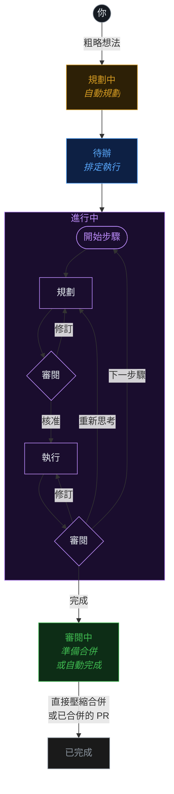

<div align="center">

#  Fusion

### 從粗略想法到正式上線的程式碼——全自動完成。

### 🏭 一座軟體工廠，由多代理人協調器運作。

描述你想要的——一支 AI 代理人團隊會為你**規劃、建置、審閱並交付**。Fusion 就是你的軟體工廠：一條橫跨任務、代理人、任務群組、git、檔案與工作樹的程式碼生產線，支援任何模型，本地或雲端皆可。

[**runfusion.ai →**](https://runfusion.ai) · [文件](./docs/README.md) · [GitHub](https://github.com/Runfusion/Fusion) · [npm](https://www.npmjs.com/package/@runfusion/fusion) · [Discord](https://discord.gg/ksrfuy7WYR)

[English](./README.md) · [简体中文](./README.zh-CN.md) · **繁體中文** · [Français](./README.fr.md) · [Español](./README.es.md) · [한국어](./README.ko.md)

*本文件為機器翻譯，英文版 README 為權威版本。*

[](./LICENSE)
[](https://www.npmjs.com/package/@runfusion/fusion)
[](https://discord.gg/ksrfuy7WYR)


<br />


<br />
<br />

<a href="https://runfusion.ai">
  
</a>

</div>

---

## 整個開發環境。盡在一個畫面。

用白話文描述一個任務。規劃代理人讀取你的專案、理解脈絡，並撰寫完整的 `PROMPT.md` 計畫——包含步驟、檔案範圍與驗收條件。接著 Fusion 在獨立的 git 工作樹中依序規劃、審閱、執行、再審閱，並在你指定的任何環節設置人工核准關卡。

一個看板。從任何地方操控。筆電、Mac mini、Linux 伺服器、雲端虛擬機、手機——全部連線。

> 就像 Trello，但你的任務由 AI 負責規格撰寫、執行與交付。基於 [dustinbyrne/kb](https://github.com/dustinbyrne/kb) 的優秀成果打造。

---

## 快速開始

**免安裝，直接從 npm 執行：**

```bash
npx runfusion.ai
```

這會啟動儀表板。子指令可直接傳遞：`npx runfusion.ai task create "fix X"`、`npx runfusion.ai --help` 等。（或完整形式：`npx @runfusion/fusion dashboard`。）

**單行安裝程式**（macOS 與 Linux——自動選用 Homebrew，若無則退回 npm）：

```bash
curl -fsSL https://runfusion.ai/install.sh | sh
fusion dashboard
```

**Homebrew**（macOS 與 Linux）：

```bash
brew tap runfusion/fusion
brew install fusion
fusion dashboard            # 或：fn dashboard
```

或使用單行指令（自動新增 tap）：`brew install runfusion/fusion/fusion`。

**npm 全域安裝**：

```bash
npm install -g @runfusion/fusion
fn dashboard                # 或：fusion dashboard
```

**從複本執行**（供開發使用）：

```bash
pnpm dev dashboard
```

然後點擊終端機中顯示的 `Open:` 網址。該網址內嵌一個不記名令牌
（`http://localhost:4040/?token=fn_...`），瀏覽器會在首次造訪時擷取並存入
`localStorage`，之後自動重複使用。在伺服器端，Fusion 會在首次驗證執行時
將儀表板與背景程式令牌持久化至 `~/.fusion/settings.json`，並在後續啟動時
重複使用，除非你覆蓋它（`--token`、`FUSION_DASHBOARD_TOKEN`、
`FUSION_DAEMON_TOKEN`）或以 `--no-auth` 停用驗證。完整的優先順序與
重設/撤銷選項，請參閱
[命令列參考 → fn dashboard → 驗證](./docs/cli-reference.md#fn-dashboard)。

### 首次執行設定

首次啟動時，Fusion 會開啟**引導精靈**，提供三個引導步驟：

1. **AI 設定** — 使用簡化的快速啟動供應商清單（建議的供應商，加上已連線的供應商），只有在需要其他供應商或詳細設定時，才展開**進階供應商設定**。只需一個供應商即可開始使用。已棄用的 Google Gemini CLI / Antigravity 供應商項目已刻意隱藏；Google/Gemini API 金鑰、Google Generative AI、Vertex 與 Cloud Code 路徑仍受支援。
2. **GitHub（選填）** — 連結 GitHub 以匯入議題並管理 PR
3. **第一個任務** — 建立你的第一個任務或從 GitHub 匯入（若無作用中的專案，引導精靈會先提示你註冊/選取專案目錄）

精靈**可關閉且不阻擋操作**——點擊**暫時略過**即可立即使用儀表板。之後可從**設定 → 驗證 → 重新開啟引導指南**再次觸發。

### 行動裝置

Capacitor + PWA 工作流程，請參閱 [MOBILE.md](./MOBILE.md)。

---

## 工作流程

```
  ①  描述              ②  規劃                ③  看板                ④  獨立工作樹
  ─────────────        ─────────────         ─────────────          ─────────────────────
  「在設定面板     →   代理人撰寫    →   規劃 → 審閱 →       →   fusion/FN-123 分支
   加入深色模式        PROMPT.md           執行 → 審閱              並行執行，零
   切換開關」          （步驟、範圍、        （每步驟，直到           檔案衝突
                       驗收條件）           完成）
```

### 合併前看清每個步驟

<div align="center">
  
</div>

每個任務都即時顯示其計畫、審閱紀錄、差異比較與檔案變更。進入作用中的任務，調整方向、收緊限制條件、暫停或重新提示。

---

## 與眾不同之處

|  |  |
|---|---|
| 🧠 **AI 規劃** | 用白話文描述任務。規劃代理人將其轉換為含步驟、檔案範圍與驗收條件的 `PROMPT.md` 計畫。 |
| 🔁 **可選工作流程** | 內建工作流程涵蓋編碼、快速修復、強化審閱、逐步執行、外掛化 Compound Engineering 與 PR lifecycle 片段。可依任務選取，或在[工作流程編輯器](./docs/workflow-editor.md)中撰寫自訂工作流程。 |
| 🌳 **工作樹隔離** | 每個任務在各自的分支與工作樹（`fusion/{task-id}`）中執行。任務並行執行，零衝突。可選用 [worktrunk](https://github.com/max-sixty/worktrunk) 委派，透過 [`worktrunk.enabled`](./docs/settings-reference.md#worktree-backend-settings) 設定（詳見 [WorktreeBackend 抽象層](./docs/architecture.md#worktreebackend-abstraction)）。 |
| ⚡ **智慧合併控制** | 通過所有關卡後，Fusion 自動壓縮合併並繼續執行。你可以要求人工核准、繼承全域 auto-merge 預設值，或設定任務層級自動/手動覆蓋。 |
| 🛰️ **多節點網狀架構** | 筆電、Mac mini、Linux 伺服器、雲端虛擬機、手機——全部同步。桌面、行動裝置、網頁皆支援。 |
| 🧩 **任意模型** | 支援 Anthropic、OpenAI、Ollama、Google Generative AI、Z.ai、本地執行環境與[自訂提供者](./docs/dashboard-guide.md#custom-providers)。本地與雲端共存，並可依專案設定工作流程模型/備援通道。 |
| 🏢 **代理人公司** | 匯入預建團隊——橫跨 16 家公司的 440+ 個代理人——自主運行數週。 |
| 📬 **代理人間訊息傳遞** | 代理人之間內建郵件信箱。委派、釐清、協調。 |
| 🗨️ **代理人聊天** | 支援直接聊天、任務聊天、附件、聊天內問題卡、可恢復串流，以及實驗性多代理人聊天室；被提及成員直接回覆，環境成員可在上限內參與。（[聊天文件](./docs/dashboard-guide.md#chat-view)） |
| 🗺️ **任務群組** | 層級式規劃（任務群組 → 里程碑 → 切片 → 功能 → 任務），具備自動駕駛模式與驗證合約。 |
| 🔬 **研究** | 有界研究執行，整合網頁搜尋、GitHub、本地文件與 LLM 合成（規劃與合成流程中亦支援執行時內建的 WebSearch/WebFetch）。將研究結果轉換為任務。（[文件](./docs/research.md)） |
| 🧪 **自我改善** | 代理人反思自身輸出，並隨著對你的程式碼庫的了解更新自身提示詞。 |
| 🔓 **開放原始碼，MIT 授權。** | 無廠商綁定。在自己的硬體上執行。每週持續更新。 |

---

## 實際運作一覽

<!--
FNXC:Docs 2026-06-21-19:55:
README must lead with a smaller wordmark and a visual showcase of the latest surfaces (Command Center, selectable workflows, agent chat, multi-agent chat rooms, agent mail) so the value lands fast.
Each feature pairs a short looping GIF with value copy; Command Center additionally carries real fleet stats, the token/productivity/team graph trio, and the 70+-theme grid (incl. shadcn light/mono/orange/black) to make the data pop.
Media lives in demo/assets/ (committed, GitHub-inline GIFs); stat numbers are sourced from a live seeded fleet — refresh them if the captures are re-shot.
Each feature keeps its original Tokyo Night capture and adds a Shadcn Light + Shadcn Dark Gray pair; the theme showcase is split into a light-themes grid and a dark-themes grid. Workflow GIFs feature the Stepwise coding graph with node-level zoom/pan.
-->

Fusion 中最新的功能一覽——任務指揮中心、視覺化工作流程、代理人聊天、多代理人聊天室與代理人間郵件。

### 🛰️ Command Center——你代理人艦隊的任務指揮中心

<div align="center">
  
</div>

一個畫面掌握代理人正在進行的一切。即時調整排程器容量、依模型即時觀察 token 花費，並以實際數據證明價值。

<table>
<tr>
<td width="33%"><br/><sub><b>Tokens</b> — 依模型的花費、快取 vs. 輸入 vs. 輸出，隨時間變化。</sub></td>
<td width="33%"><br/><sub><b>Productivity</b> — 成果、時長百分位數、語言組成。</sub></td>
<td width="33%"><br/><sub><b>Team</b> — 代理人組織圖與每位代理人的 token 占比。</sub></td>
</tr>
</table>

> Tokens · Tools · Activity · Productivity · Team · Ecosystem · GitHub · Signals · System · Reliability · Mission Control——每一個分頁都是同一支即時艦隊的不同視角。

**同一支艦隊，依你所好**——Command Center（以及整個儀表板）可在 **70+ 種色彩主題**間即時換膚。這裡是 Shadcn Light 與 Shadcn Dark Gray：

<table>
<tr>
<td width="50%"><br/><sub><b>Shadcn Light</b></sub></td>
<td width="50%"><br/><sub><b>Shadcn Dark Gray</b></sub></td>
</tr>
</table>

<details>
<summary><b>十多種淺色主題與十多種深色主題</b>（點擊展開）</summary>

<br/>

<div align="center">
  
  <br/><br/>
  
</div>

</details>

### 🔁 可選工作流程，以視覺化方式撰寫

<div align="center">
  
</div>

任務從想法到合併的旅程是一個**工作流程**——而它由你選擇與塑造。選取內建工作流程（Coding、Quick fix、Review-heavy、Stepwise、PR lifecycle、Compound engineering 等），檢視其圖形，接著在視覺化[工作流程編輯器](./docs/workflow-editor.md)中複製並自訂欄、關卡、模型通道與審閱政策。無需 fork 引擎。

這是 **Stepwise coding** 圖形——在進入下一步前，規劃、執行並審閱每個步驟——以 Shadcn Light 與 Dark Gray 逐節點探索：

<table>
<tr>
<td width="50%"><br/><sub><b>Shadcn Light</b></sub></td>
<td width="50%"><br/><sub><b>Shadcn Dark Gray</b></sub></td>
</tr>
</table>

### 🗨️ 代理人聊天——在執行途中與你的代理人對話

<div align="center">
  
</div>

與任何代理人在任何模型上進行直接聊天與每任務聊天。詢問任務為何失敗、引導方法、放上附件、回答聊天內問題卡，並從上次中斷處恢復串流——全程支援完整的 markdown 與程式碼渲染。

<table>
<tr>
<td width="50%"><br/><sub><b>Shadcn Light</b></sub></td>
<td width="50%"><br/><sub><b>Shadcn Dark Gray</b></sub></td>
</tr>
</table>

### 👥 多代理人聊天室

<div align="center">
  
</div>

把多個代理人放進一個房間，讓他們協調作業。提及某位成員，它就會直接回覆；環境成員可在上限內加入對話。這裡 **CEO**、**Product Manager** 與 **CTO** 代理人在 `#leads` 中就任務歸屬達成共識——全程沒有人類介入。（[聊天文件](./docs/dashboard-guide.md#chat-view)）

<table>
<tr>
<td width="50%"><br/><sub><b>Shadcn Light</b></sub></td>
<td width="50%"><br/><sub><b>Shadcn Dark Gray</b></sub></td>
</tr>
</table>

### 📬 代理人郵件——代理人之間的收件匣

<div align="center">
  
</div>

內建的郵件信箱，用於委派、釐清與交接。代理人會提交分流摘要、請求核准，並在整支艦隊間協調作業——具備 Inbox、Outbox、Agents 與 Approvals 檢視，讓你能稽核每一次往來。

<table>
<tr>
<td width="50%"><br/><sub><b>Shadcn Light</b></sub></td>
<td width="50%"><br/><sub><b>Shadcn Dark Gray</b></sub></td>
</tr>
</table>

---

## 運作原理



有相依關係的任務依序處理；獨立任務並行執行。可選擇在任務從「規劃中」移至「待辦」前要求手動核准（`requirePlanApproval` 設定）。

---

## 工作流程概覽

Fusion 工作流程定義任務如何從想法走到交付。預設編碼路徑仍是 **Plan/Triage → Execute → Workflow steps → Review → Merge** 迴圈，但政策現在位於可選取的工作流程中，而不只是硬編碼在引擎裡。

- **依任務選取：** 從儀表板的任務/看板工作流程控制項選取，或建立任務時用 `fn_workflow_select` / `workflow_id` 指定。
- **內建目錄：** Coding（`builtin:coding`）、Quick fix（`builtin:quick-fix`）、Review-heavy（`builtin:review-heavy`）、Compound engineering（`builtin:compound-engineering`，需外掛）、Stepwise coding（`builtin:stepwise-coding`）與 PR lifecycle（`builtin:pr-workflow`，可重用的 PR 圖形片段）。
- **安全客製：** 在視覺化[工作流程編輯器](./docs/workflow-editor.md)中檢視內建工作流程、複製它們或撰寫自訂工作流程。工作流程專屬設定涵蓋模型通道、審閱/核准、步驟執行、任務欄位與欄。

閱讀 [Workflow Steps](./docs/workflow-steps.md) 了解執行語義；閱讀 [Workflow Editor](./docs/workflow-editor.md) 了解儀表板編輯指南。

---

## 多節點。一個看板。全平台支援。

<div align="center">


<br />


</div>

筆電、Mac mini、Linux 伺服器、雲端虛擬機、手機——每個節點都是對等節點。你的任務狀態、代理人、日誌與差異比較在整個網狀架構中保持同步。同一個 Fusion 以下列形式發布：

- 🖥️ **桌面應用程式** — 支援 **macOS**（Intel + Apple Silicon）、**Windows** 10/11 與 **Linux** 的 Electron 應用程式
- 📱 **行動應用程式** — 支援 **iOS/iPadOS** 與 **Android** 的 Capacitor 應用程式（[MOBILE.md](./MOBILE.md)）
- 🌐 **網頁儀表板** — 任何現代瀏覽器，由 `fn dashboard` 背景程式提供服務
- 🔌 **命令列介面** — `fn` 執行檔 + 適合以終端機為主要工作流程的擴充功能

在任意節點啟動背景程式，連接其他裝置，看板就會跟著你到任何地方。

---

## 執行代理人公司

<div align="center">


</div>

匯入一個團隊，自主執行數週。**橫跨 16 家公司的 440+ 個代理人**，專為任務群組、信箱與代理人間委派而設計。

```bash
npx companies.sh add paperclipai/companies/gstack
```

---

## 與你已在使用的工具相容。

Fusion 整合你喜愛的工具。**Hermes**、**Paperclip** 與 **OpenClaw** 皆作為一等公民外掛程式發布——將任何工作區路由至最適合該任務的執行環境。任何 Paperclip 代理人公司都能以單一指令匯入。

<div align="center">
  
</div>

### [Hermes](https://hermes-agent.nousresearch.com) <sub>`experimental`</sub>

<sub>Nous Research</sub>

來自 **Nous Research** 的開放原始碼自主代理人。安裝 Hermes 外掛程式，透過 Hermes 執行代理人，適合需要長時間執行、上下文持續增長的工作——可將任何 Fusion 工作區路由至 Hermes。

### OpenClaw <sub>`experimental`</sub>

OpenClaw 執行環境支援作為實驗性外掛程式（`fusion-plugin-openclaw-runtime`）提供，可進行執行環境探索與設定對等。安裝外掛程式後，以 `runtimeConfig.runtimeHint: "openclaw"` 設定代理人。

<br />

<div align="center">
  
</div>

### [Paperclip](https://paperclip.ing) <sub>`experimental`</sub>

<sub>paperclip.ing</sub>

AI 勞動力的人類控制平面。安裝 Paperclip 外掛程式，在 Fusion 內透過 Paperclip 執行代理人。

Fusion 也原生支援 **[`companies.sh`](https://github.com/paperclipai/companies)** 代理人公司標準：匯入預建團隊——**橫跨 16 家公司的 440+ 個代理人**——讓他們透過 Fusion 的信箱、任務群組與工作流程關卡協調作業，自主工作數週。相同的公司格式、相同的代理人、相同的技能，與 Paperclip 一致。

```bash
npx companies.sh add paperclipai/companies/gstack
```

<br />

> **Hermes**、**Paperclip** 與 **OpenClaw** 為**實驗性**執行環境外掛程式——API 與通訊格式可能在次要版本之間有所變動。

---

## 文件

| 指南 | 涵蓋內容 |
|---|---|
| [入門指南](./docs/getting-started.md) | 安裝、導引、第一個任務與工作流程選取基礎 |
| [儀表板指南](./docs/dashboard-guide.md) | 看板/清單檢視、聊天、工作流程編輯器、Git 管理器、設定與 UI 工具 |
| [任務管理](./docs/task-management.md) | 生命週期、提示規格、留言、封存與 GitHub 整合 |
| [CLI 參考](./docs/cli-reference.md) | 完整 `fn` 命令與守護程式參考 |
| [設定參考](./docs/settings-reference.md) | 全域/專案設定、模型層級、工作流程設定與自訂提供者 |
| [Workflow Steps](./docs/workflow-steps.md) | 工作流程執行時、內建工作流程、門控、範本與階段 |
| [Workflow Editor](./docs/workflow-editor.md) | 視覺化編排、匯入/匯出、欄位/欄/設定與行動編輯器 |
| [研究](./docs/research.md) | 研究執行、發現、匯出與任務整合 |
| [代理人](./docs/agents.md) | 代理人管理、spawning、heartbeat 與信箱流程 |
| [任務群組](./docs/missions.md) | 階層、規劃、自動駕駛與驗證合約 |
| [外掛管理](./docs/plugin-management.md) | 探索、安裝、啟用、設定與疑難排解外掛 |
| [外掛開發](./docs/PLUGIN_AUTHORING.md) | 使用 hooks、routes、tools、runtimes 與儀表板表面建置外掛 |
| [遠端存取](./docs/remote-access.md) | 權杖化遠端儀表板、Tailscale/Cloudflare 與疑難排解 |
| [多專案](./docs/multi-project.md) | 中央登錄、隔離模式與遷移 |
| [Docker](./docs/docker.md) | 容器部署 |

---

## 核心功能

- **AI Planning** — Planning agent generates detailed `PROMPT.md` with steps, file scope, and acceptance criteria
- **Step-by-step Execution** — Plan → Review → Execute → Review cycle for each task step, with graph-mode workflows able to model per-step parse/execute/review/rework explicitly
- **Git Worktree Isolation** — Each task runs in its own worktree (`fusion/{task-id}` branch)
- **Selectable workflows** — Pick Coding, Quick fix, Review-heavy, Stepwise coding, plugin-gated Compound Engineering, custom workflows, or PR lifecycle fragments where appropriate ([overview](#工作流程概覽); [Workflow Steps](./docs/workflow-steps.md#工作流程概覽))
- **Visual Workflow Editor** — Inspect read-only built-ins, duplicate/customize workflows, and edit graph nodes, columns, task fields, typed settings, and per-project values ([Workflow Editor](./docs/workflow-editor.md))
- **Workflow Steps** — Configurable quality gates (pre-merge blocks merge; post-merge informational), plus opt-in [Browser Verification](./docs/workflow-steps.md#workflow-declared-optional-steps)
- **Workflow-native policy** — Fast-mode planning, typed triage thresholds, review/approval, step execution, and model/fallback lanes are workflow settings ([Settings Reference](./docs/settings-reference.md#workflow-settings))
- **GitHub + PR lifecycle** — Import issues, create PRs, display live PR/issue badges, and use workflow-mode PR lifecycle graph fragments where enabled
- **Dashboard** — Real-time kanban/list/graph views, agent management, terminal, git manager, missions, chat, workflow editor, custom providers, and one-click updates
- **Missions** — Hierarchical planning (Mission → Milestone → Slice → Feature → Task) with autopilot, validation contracts, fix-feature retries, mission-goal linking, and blocked handoffs
- **Multi-Project** — Manage multiple projects from one installation with project isolation
- **Custom Providers** — Add OpenAI-compatible, OpenAI Responses, Anthropic-compatible, or Google Generative AI providers; saved models appear in project and workflow model dropdowns ([Dashboard Guide](./docs/dashboard-guide.md#custom-providers))
- **Smart merge controls** — Global auto-merge stays live for default tasks, while explicit per-task overrides can force auto/manual behavior
- **Inter-Agent Messaging** — Built-in messaging for coordination between agents and users; engineer-role agents can opt into backlog auto-claim
- **Agent Chat + Chat Rooms** — Direct/task chat supports attachments, resumable streams, question response cards, and renameable conversations; experimental rooms route mentioned members as direct responders ([Dashboard Guide → Chat View](./docs/dashboard-guide.md#chat-view))

### 供應商驗證

Fusion 透過**設定 → 驗證**支援 AI 供應商的 OAuth 驗證。對大多數 OAuth 供應商而言，當儀表板透過非 localhost 主機存取（遠端節點、區域網路主機/IP 或反向代理），供應商登入網址會被重寫，以透過橋接端點（`/api/auth/oauth-callback`）路由 OAuth 回呼，確保重導向能到達作用中的瀏覽器工作階段。

- **Anthropic (Claude)** — 在設定/引導精靈中使用貼上授權碼流程：登入後，將最終的重導向網址（或授權碼）貼回 Fusion 以完成登入
- **OpenAI Codex** — 使用相同的貼上授權碼流程，搭配安全的狀態驗證
- **Factory AI — 透過 Droid CLI** *（選填）* — 需要本地安裝 Droid CLI 並執行 `droid auth login`；偵測依照有效的執行環境二進位路徑（預設為 `droid`，或設定後的外掛程式 `droidBinaryPath`），然後在**設定 → 驗證**中啟用並重新啟動 Fusion
- **llama.cpp — 透過 HTTP 伺服器** *（選填）* — 設定你的 llama.cpp 伺服器網址（預設 `http://127.0.0.1:8080`）與選填的 API 金鑰，然後在**設定 → 驗證**中啟用
- **其他供應商** — 在設定中透過輸入 API 金鑰進行驗證（包含 Google/Gemini API 金鑰、Google Generative AI、Vertex 與 Cloud Code 別名）

### 模型系統

Fusion 使用具備五條獨立通道的雙範圍模型層級。全域設定定義基準預設值；專案設定提供每個專案的覆蓋值。

| 通道 | 用途 | 全域基準金鑰 | 專案覆蓋金鑰 |
|------|---------|---------------------|----------------------|
| Executor | 任務執行代理人 | `executionGlobalProvider` + `executionGlobalModelId` | `executionProvider` + `executionModelId` |
| Planning | 任務規劃代理人 | `planningGlobalProvider` + `planningGlobalModelId` | `planningProvider` + `planningModelId` |
| Validator | 計畫/程式碼審閱者 | `validatorGlobalProvider` + `validatorGlobalModelId` | `validatorProvider` + `validatorModelId` |
| Title Summarization | 自動標題產生 | `titleSummarizerGlobalProvider` + `titleSummarizerGlobalModelId` | `titleSummarizerProvider` + `titleSummarizerModelId` |
| Workflow Step Refinement | AI 提示詞精煉 | （使用 `defaultProvider`/`defaultModelId`） | （使用 WorkflowStep 上的 `modelProvider`/`modelId`） |

**工作流程通道：** 預設工作流程會在**設定 → 專案模型**中顯示 Plan/Triage、Executor、Reviewer 與 fallback 模型通道，進階工作流程設定可宣告額外型別值（[設定參考](./docs/settings-reference.md#workflow-settings)）。

**每任務覆蓋：** 任務可透過每任務模型欄位（`modelProvider`/`modelId`、`validatorModelProvider`/`validatorModelId`、`planningModelProvider`/`planningModelId`）覆蓋執行器、驗證器與規劃通道。

**優先順序：** 每任務 → 專案覆蓋 → 全域通道 → `defaultProvider`/`defaultModelId` → 自動解析。

完整的設定文件，請參閱[設定參考](./docs/settings-reference.md)。

### 排程任務/自動化

Fusion 透過 `/api/automations` 端點支援排程任務自動化。自動化可按設定的排程執行 shell 指令或多步驟工作流程。

#### 排程範圍

自動化與常式可在兩種範圍中執行：

- **全域** — 跨所有專案執行。適用於跨專案維護、備份或統一報告。
- **專案** — 僅在特定專案中執行。適用於特定專案的 CI、測試或部署任務。

當你建立排程而未選擇範圍時，Fusion 為了向後相容，預設使用 `default` 專案 ID 的**專案範圍**。

明確指定範圍的方式：
- 在儀表板的**排程任務**對話框中，使用**全域 / 專案**切換。
- 透過 API，在自動化/常式端點上傳遞 `?scope=global` 或 `?scope=project&projectId=<id>`。

**範圍解析規則：**
- `scope=global` 永遠解析至全域自動化/常式通道，與作用中的專案無關。
- `scope=project` 需要 `projectId`。若省略，退回至 `"default"`。
- CRUD、執行、切換與 webhook 操作嚴格進行範圍隔離：全域排程無法從專案範圍的請求進行變更，反之亦然。

**多專案設定的操作指引：**
- 偏好使用**全域**排程處理共用基礎設施（例如每夜備份、記憶體洞察擷取）。
- 偏好使用**專案**排程處理每個儲存庫的自動化（例如每個專案的測試執行器、部署鉤子）。
- 全域與專案通道由引擎獨立輪詢，因此一個通道中的到期執行不會阻擋另一個通道。

#### 自動化

| 端點 | 方法 | 說明 |
|---------|--------|-------------|
| `/api/automations` | GET | 列出所有自動化（若指定範圍則依範圍篩選） |
| `/api/automations` | POST | 建立自動化（範圍預設為 `project`） |
| `/api/automations/:id` | GET | 依 ID 取得自動化 |
| `/api/automations/:id` | PATCH | 更新自動化 |
| `/api/automations/:id` | DELETE | 刪除自動化 |
| `/api/automations/:id/run` | POST | 觸發手動執行 |
| `/api/automations/:id/toggle` | POST | 切換啟用/停用 |
| `/api/automations/:id/steps/reorder` | POST | 重新排序自動化步驟 |

#### 常式

常式是由 cron 排程、webhook 或手動執行觸發的 AI 代理人任務。常式與自動化共用相同的全域/專案範圍模型。

| 端點 | 方法 | 說明 |
|---------|--------|-------------|
| `/api/routines` | GET | 列出所有常式（若指定範圍則依範圍篩選） |
| `/api/routines` | POST | 建立常式（範圍預設為 `project`） |
| `/api/routines/:id` | GET | 依 ID 取得常式 |
| `/api/routines/:id` | PATCH | 更新常式 |
| `/api/routines/:id` | DELETE | 刪除常式 |
| `/api/routines/:id/run` | POST | 手動觸發 |
| `/api/routines/:id/trigger` | POST | 正式手動觸發端點 |
| `/api/routines/:id/runs` | GET | 取得執行歷史 |
| `/api/routines/:id/webhook` | POST | Webhook 觸發（支援簽章驗證） |

---

## 命令列快速範例

```bash
fn task create "Fix the login bug"                    # 快速輸入 → 規劃
fn task plan "Build auth system"                      # AI 引導規劃
fn task import owner/repo --labels bug                # 匯入 GitHub 議題
fn task show FN-001                                   # 檢視任務詳情
fn task logs FN-001 --follow                          # 串流執行日誌
fn task steer FN-001 "Use TypeScript"                 # 執行中引導代理人

fn project add my-app /path/to/app                    # 註冊專案
fn project list                                       # 列出所有專案

fn settings set maxConcurrent 4                       # 設定組態
fn settings export                                    # 匯出組態

fn mission create "Auth System" "Build auth"          # 建立任務群組
fn mission activate-slice <slice-id>                  # 啟動切片

fn skills search react                                # 搜尋 skills.sh
fn skills install firebase/agent-skills               # 安裝代理人技能
```

---

## 套件

| 套件 | 說明 |
|---------|-------------|
| `@fusion/core` | 領域模型——任務、看板欄位、SQLite 儲存庫 |
| `@fusion/dashboard` | 網頁 UI——Express 伺服器 + 搭配 SSE 的看板 |
| `@fusion/engine` | AI 引擎——規劃、執行、排程、工作流程步驟 |
| `@runfusion/fusion` | 命令列介面 + 擴充功能——發布至 npm |

---

## 開發

```bash
pnpm install                  # 安裝相依套件
pnpm local                    # 在非 4040 連接埠啟動本地儀表板/API
pnpm local -- --engine        # 啟動本地儀表板並包含 AI 引擎
pnpm build                    # 建置預設工作區套件（不含桌面/行動裝置）
pnpm build:all                # 建置所有套件（包含桌面/行動裝置）
pnpm dev dashboard            # 執行儀表板 + AI 引擎
pnpm dev:ui                   # 僅儀表板（不含 AI 引擎）
pnpm lint                     # 對所有套件執行 lint
pnpm typecheck                # 對所有套件進行型別檢查
pnpm test                     # 執行所有測試
```

### 建置獨立執行檔

使用 [Bun](https://bun.sh/) 建置單一自包含的 `fn` 執行檔：

```bash
pnpm build:exe                # 為目前平台建置
pnpm build:exe:all            # 跨平台編譯所有平台
```

---

## 授權條款

MIT——開放原始碼，無廠商綁定。請參閱 [LICENSE](./LICENSE)。

<div align="center">

**[runfusion.ai →](https://runfusion.ai)**

</div>
