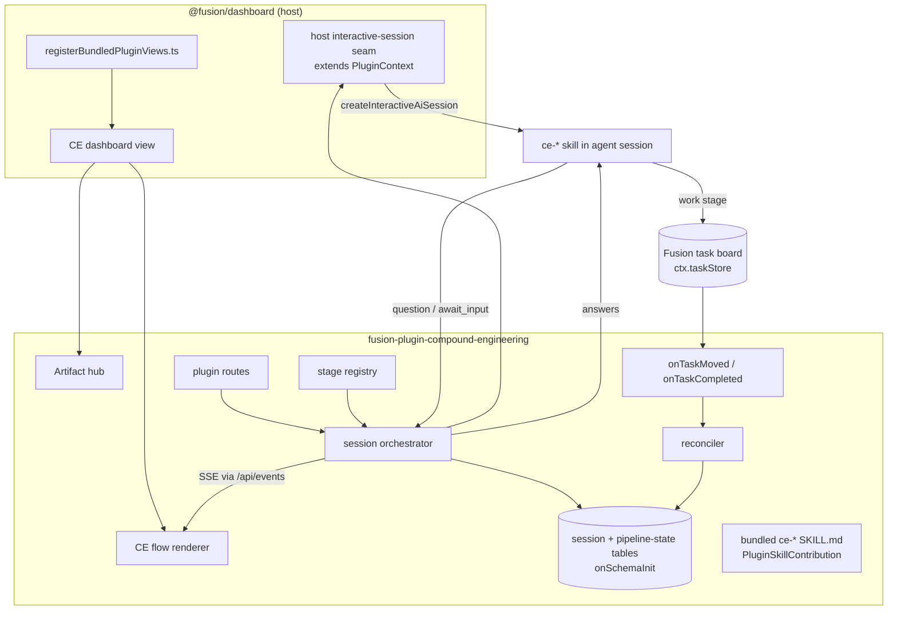
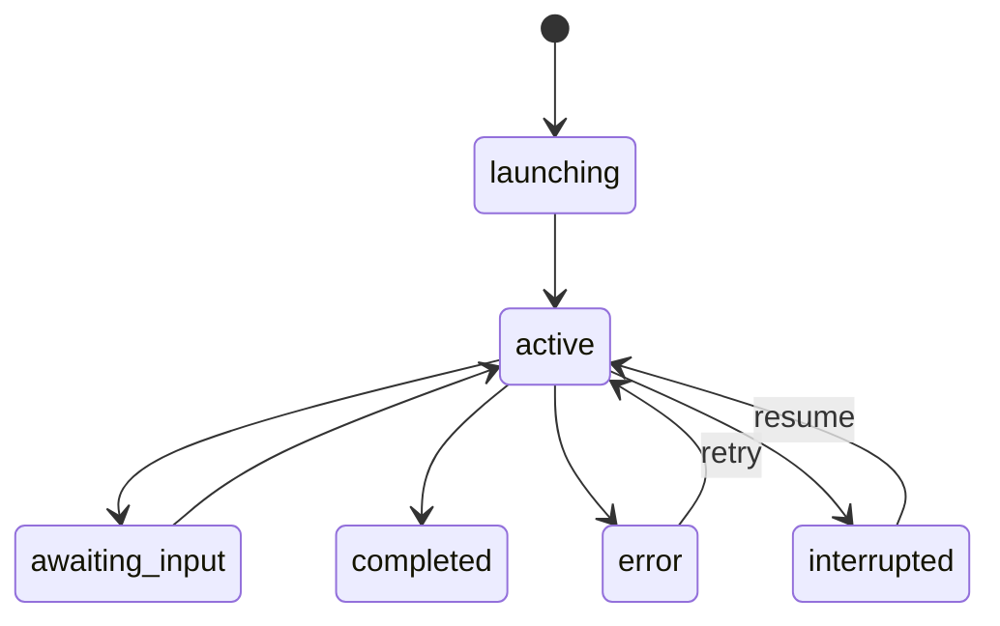

# feat: Compound Engineering plugin with end-to-end UI

## Summary

Build `fusion-plugin-compound-engineering`: a bundled Fusion plugin that adds a dedicated Compound Engineering dashboard surface — an artifact hub plus interactive in-dashboard `ce-*` sessions that reuse the real (bundled) skills, a work→board bridge, and event-driven bidirectional sync between the board and a plugin-local CE-pipeline state model. It runs alongside Fusion's native pipeline. The load-bearing piece is a foundational host seam that exposes the agent's interactive question/await-input protocol to plugins, since today's `ctx.createAiSession` is one-shot only.

## Problem Frame

Compound engineering runs today as terminal slash-commands whose artifacts scatter across `docs/`, with no unified surface, no visual way to start a stage, and no link between a finished plan and the board work that follows. The brainstorm (see `origin`) commits to surfacing the flow inside Fusion while reusing the real skills so the plugin improves as they do.

Research invalidated the brainstorm's optimistic "only the renderer is new" assumption: the multi-turn Q/A machinery (`AiSessionStore`, `awaiting_input`, `PlanningQuestion`, SSE streaming, resume) lives inside `@fusion/dashboard`, is hard-coded to a closed `AiSessionType` union, and is not reachable from a plugin. The only AI surface a plugin gets, `ctx.createAiSession`, is one-shot (`prompt()` → read `state.messages`) and cannot pause on a mid-agent question. So an interactive skill-session runner requires a small foundational host extension, not just wiring — this plan treats that as its first risk-bearing unit (the gating spike).

Everything else is well-precedented: `plugins/fusion-plugin-reports/` is a near-exact template for a primary dashboard view + routes + settings + agent-driven pipeline; task lifecycle hooks (`onTaskCreated`/`onTaskMoved`/`onTaskCompleted`) plus `ctx.taskStore` cover both sync directions; and `PluginSkillContribution.skillFiles` covers bundled skills.

## Requirements Trace

| Origin req | Where addressed |
|---|---|
| R1–R3, R20 (CE surface, artifact hub, hub states) | U3 |
| R4–R10, R21 (interactive sessions, flow UI, fallback, session states) | U4, U5, U6 |
| R11–R13 (bundled skill install, isolation) | U2 |
| R14, R19 (work→board bridge, runs alongside) | U7 |
| R15–R17 (bidirectional sync) | U8 |
| R18 (standard `fusion-plugin-*` packaging) | U1, U9 |
| Success Criteria (skill-interaction audit) | U6 |
| Deferred/Open Questions (back-sync state model, IA, conflict, fallback scope) | back-sync→U8, IA→U3, conflict→U8, fallback→U6; concurrency carried to Open Questions below |

## Key Technical Decisions

- **KTD1 — A foundational host seam exposes interactive agent sessions to plugins.** `ctx.createAiSession` is one-shot and cannot surface a mid-agent question. Critically, there is **no engine-level await-input primitive** to reuse: `packages/dashboard/src/planning.ts` implements interactivity in application code — it prompts the one-shot agent, reads the last assistant message out of `state.messages`, JSON-parses it into a `PlanningQuestion`, and reprompts on parse failure. So the await-input loop (prompt → parse → retry → persist between turns) is **reimplemented at the seam layer modeled on `planning.ts`**, not reused from the engine. The only genuinely shared assets are the one-shot `createFnAgent`/`createAiSession`, the `PlanningQuestion`/`PlanningResponse` type shapes, and the JSON contract. This seam is still the smallest change that unblocks the brainstorm's interactive requirement (see `origin` gating spike); the richer alternative — registering a plugin session type into the host `AiSessionStore` — is deferred (see Alternatives).
- **KTD2 — The interactive runner is driven from a plugin route, not a tool.** `createAiSession` is injected only on route/loader contexts (`packages/core/src/plugin-loader.ts`), not on tool or runtime contexts (`packages/engine/src/plugin-runner.ts` omits it). Session orchestration therefore lives behind plugin routes under `/api/plugins/fusion-plugin-compound-engineering/`.
- **KTD3 — Session liveness, streaming, and state are plugin-local.** The CE flow renderer, the session SSE stream, and the persisted session/pipeline state are owned by the plugin (mirroring `reports`' route+store pattern), decoupled from `PlanningModeModal` per the brainstorm. Streaming reuses the shared `/api/events` bus or a single dedicated stream — never a raw `EventSource` per the dashboard SSE ownership contract (`docs/dashboard-realtime.md`).
- **KTD4 — Back-sync is event-driven with a persisted CE-pipeline state model + poll-fallback reconciliation.** Adopt the ratified FN-5719 pattern (`docs/rfcs/FN-5719-decouple-executor-merger.md`): a plugin-local pipeline-state table (created via `onSchemaInit` idempotent DDL) is the addressable object the brainstorm's R16/R17 needs; `onTaskMoved`/`onTaskCompleted` hooks enqueue updates, and a reconciliation sweep recovers from missed events. No new polling loop (per `docs/performance/dashboard-load.md`). Board-task ownership and CE-pipeline ownership stay separate state machines to avoid the oscillation FN-5719 catalogs. Hooks have a 5s timeout — heavy work is queued, not inline.
- **KTD5 — Skills are bundled, not fetched.** Ship `SKILL.md` files inside the plugin and declare them via `PluginSkillContribution.skillFiles` (plugin-root-relative). This is inherently plugin-local and cannot clobber a global compound-engineering install (R12). Whether the engine skill-resolver auto-discovers them or a cpSync-style physical install is also required (mirroring `installBundledFusionSkill` in `packages/cli/src/commands/skill-installation.ts`) is verified in U2.
- **KTD6 — Generic stage registry.** A single registry maps each stage → `{ skillId, artifact location/glob, presentation metadata }`. Adding a stage is a registry entry, not a screen (origin Key Decision). Which stages render richly vs. fall back to chat is measured by the U6 audit, not assumed.

## High-Level Technical Design



State machines kept separate (KTD4):



## Output Structure

```text
plugins/fusion-plugin-compound-engineering/
  manifest.json
  package.json
  tsconfig.json
  vitest.config.ts
  src/
    index.ts                  # definePlugin: manifest, hooks, routes, dashboardViews, skills
    settings.ts               # settingsSchema
    stage-registry.ts         # stage -> skill/artifact/metadata map (U6)
    artifacts/
      discovery.ts            # scan conventional locations (U3)
    routes/
      artifact-routes.ts      # list/read artifacts (U3)
      session-routes.ts       # start/answer/resume/stream sessions (U5)
    session/
      orchestrator.ts         # interactive turn loop on the host seam (U5)
      session-store.ts        # session table CRUD (U5)
    sync/
      pipeline-store.ts       # CE-pipeline-state table (U8)
      reconciler.ts           # event-enqueue + poll-fallback (U8)
    schema.ts                 # onSchemaInit idempotent DDL (U5, U8)
    dashboard-view.tsx        # re-export of the view component (U3)
    dashboard/
      CompoundEngineeringView.tsx   # hub + launcher (U3)
      CeFlow.tsx                    # interactive renderer + chat fallback (U6)
      hooks/                        # useArtifacts, useCeSession, api (U3, U6)
    skills/
      ce-ideate/SKILL.md ...        # bundled skills (U2)
    __tests__/
```

## Implementation Units

### U1. Plugin scaffold and bundling

**Goal:** A minimal installable, bundled plugin shell that registers and starts cleanly.
**Requirements:** R18, R19.
**Dependencies:** none.
**Files:** `plugins/fusion-plugin-compound-engineering/{manifest.json,package.json,tsconfig.json,vitest.config.ts}`, `plugins/fusion-plugin-compound-engineering/src/index.ts`, `packages/cli/src/plugins/bundled-plugin-install.ts` (add id to `BUNDLED_PLUGIN_IDS`), `.changeset/<name>.md`.
**Approach:** Mirror `plugins/fusion-plugin-reports/` layout. `definePlugin({ manifest, hooks: {}, ... })`. Register the id in `BUNDLED_PLUGIN_IDS`. Changeset bumps `@runfusion/fusion` minor (new feature). Static imports only; no `@fusion/engine` import (reach AI via `ctx`).
**Patterns to follow:** `plugins/fusion-plugin-reports/src/index.ts`, `manifest.json`.
**Test scenarios:**
- Manifest validates via `validatePluginManifest` (happy path).
- Plugin appears in the bundled set and loads to `started` state in a fake host.
- Edge: missing required manifest field fails validation with a clear error.
**Verification:** `pnpm build` bundles the plugin; it loads without error; `pnpm lint` passes (static-import + no-nohup guards).

### U2. Bundle and install the `ce-*` skills (isolation-safe)

**Goal:** The plugin carries pinned `ce-*` skills and makes them available to agent sessions without clobbering a global install.
**Requirements:** R11, R12, R13; AE2.
**Dependencies:** U1.
**Files:** `plugins/fusion-plugin-compound-engineering/src/skills/ce-*/SKILL.md`, `src/index.ts` (`skills: PluginSkillContribution[]`), possibly `src/setup.ts` (`setup.hooks.install` cpSync mirror).
**Approach:** Declare each stage's skill via `PluginSkillContribution` with `skillFiles` relative to plugin root. **Expect a physical install:** the engine skill-resolver (`packages/engine/src/skill-resolver.ts`) only *filters* skills already discovered from disk by pi's `DefaultResourceLoader` — it does not ingest `PluginSkillContribution.skillFiles` into the discovered set — so a `cpSync` into a discoverable plugin-local skills dir registered via `.fusion` settings is the likely-required path (mirror `installBundledFusionSkill` in `packages/cli/src/commands/skill-installation.ts`, which `cpSync`s and skips when the target exists). Auto-discovery is the bonus case the gating test confirms. Install target must be plugin-local, never a global `~/.claude/skills` path that an operator's own install owns. U5's skill load depends on this install having run.
**Patterns to follow:** `PluginSkillContribution` (`packages/core/src/plugin-types.ts`), `installBundledFusionSkill`.
**Execution note:** Start by confirming the resolver behavior with a failing test that asserts a contributed skill is resolvable in a session before wiring install.
**Test scenarios:**
- Covers AE2. Given a simulated global compound-engineering install present, when the plugin installs its skills, the global location is untouched (assert no writes outside the plugin-local target).
- A contributed skill id resolves to its `SKILL.md` for an agent session (happy path).
- Idempotent: re-install with the target present is a no-op (skip-if-exists).
- Edge: a malformed/missing `SKILL.md` path surfaces a clear load error, not a silent skip.
**Verification:** A session created for a registered stage can load its skill; global-install location is provably untouched.

### U3. Artifact hub: discovery, read API, dashboard view, hub states

**Goal:** A primary CE dashboard view that discovers and renders CE artifacts with explicit empty/partial/error states.
**Requirements:** R1, R2, R3, R20.
**Dependencies:** U1.
**Files:** `src/artifacts/discovery.ts`, `src/routes/artifact-routes.ts`, `src/dashboard-view.tsx`, `src/dashboard/CompoundEngineeringView.tsx`, `src/dashboard/hooks/{useArtifacts.ts,api.ts}`, `packages/dashboard/app/plugins/registerBundledPluginViews.ts` (add `loadCompoundEngineeringView()` + `registerPluginView(...)`), workspace import alias for the view.
**Approach:** `dashboardViews` entry (`viewId`, `label: "Compound Engineering"`, `icon`, `placement: "primary"`, `order`). Discovery scans conventional locations (`STRATEGY.md`, `docs/ideation/`, `docs/brainstorms/`, plan docs, `docs/solutions/`, `CONCEPTS.md`) and groups by stage/type. Remember `componentPath` is cosmetic — the real binding is the `registerBundledPluginViews.ts` entry. Artifact reads go through a plugin route; render self-contained (sandboxed `srcDoc`/inlined styles per the reports preview pattern). Apply the dashboard performance kit: composite `(type, updatedAt DESC)` ordering, viewport-gated metadata fetch with an `enabled` flag, short-TTL cache keyed by `id:projectId`.
**Patterns to follow:** `plugins/fusion-plugin-reports/src/dashboard/ReportsView.tsx`, `registerBundledPluginViews.ts`, `docs/performance/dashboard-load.md`, `docs/plugins/reports.md` (preview/export split, `data-section` markers).
**Test scenarios:**
- Discovery returns grouped artifacts from a fixture repo tree (happy path).
- Hub empty/first-run state: no artifacts found → orientation state with a start action.
- Partial-discovery state: some categories present, others empty.
- Unreadable/malformed artifact → represented as an error entry, not a crash or silent drop.
- Discovery ignores unrelated files and does not read outside the conventional locations.
**Verification:** The view mounts in the dashboard, lists fixture artifacts grouped by stage, and renders each of the three non-happy states from seeded conditions.

### U4. Foundational host seam: interactive agent sessions for plugins (gating spike)

**Goal:** Expose the agent's interactive question/await-input protocol to plugin route contexts.
**Requirements:** R5, R6 (enables); R9 (transport reuse).
**Dependencies:** U1.
**Files:** `packages/core/src/plugin-types.ts` (extend `PluginContext` with an interactive-session factory type), `packages/core/src/ai-engine-loader.ts` + `packages/core/src/plugin-loader.ts` (DI registration + route-context injection), `packages/engine/src/index.ts` (register the real adapter, reusing the question protocol that backs planning), `packages/dashboard` wiring as needed.
**Approach:** Add a `createInteractiveAiSession` capability (alongside the existing one-shot `createAiSession`) that returns a session able to emit a structured question (reuse `PlanningQuestion`/`PlanningQuestionType` from `packages/core/src/types.ts`), expose an `awaiting_input` state, and accept a structured answer to continue. The interactive loop itself — prompt the one-shot agent, parse JSON questions from `state.messages`, retry on unparsable output, persist between turns — is **built here in the seam, modeled on `packages/dashboard/src/planning.ts`** (there is no engine primitive to call; see KTD1). Decide during the spike whether to share `parseAgentResponse` from dashboard or reimplement it in the seam to keep core generic (see Open Questions). Inject onto route/loader contexts only (consistent with how `createAiSession` is injected). Keep the surface minimal and generic — no CE-specific concepts in core/engine.
**Technical design (directional, not implementation spec):** factory shape echoing the existing one —
```
createInteractiveAiSession(opts) -> {
  session: {
    prompt(text): Promise<void>,
    nextEvent(): AsyncIterator<{type:'thinking'|'text'|'question'|'complete'|'error', data}>,
    answer(questionId, response): Promise<void>,
    dispose(): void
  }
}
```
**Patterns to follow:** `getCreateAiSessionFactory`/`setCreateAiSessionFactory` DI in `ai-engine-loader.ts` + `packages/engine/src/index.ts:122-139`; the planning question protocol in `packages/dashboard/src/planning.ts`.
**Execution note:** Spike-first — prove a route can drive one question→answer→complete round trip before building the plugin orchestrator (U5) on top. Size the spike to include the prompt/parse/retry loop itself — that loop is the real work, not wiring, and it inherits `planning.ts`'s parse-retry fragility.
**Test scenarios:**
- A route-context session emits a `question` event, pauses in `awaiting_input`, accepts an answer, and continues to `complete` (happy path, integration — mocks alone won't prove the pause/resume).
- Single-select, multi-select, free-text, and confirm question types round-trip.
- Tool/runtime contexts do NOT receive the factory (parity with `createAiSession` injection boundary).
- Error path: agent session error surfaces as an `error` event without hanging the caller.
**Verification:** From a plugin route, a session reaches `complete` after at least one interactive question, with the factory absent on non-route contexts.

### U5. Plugin session orchestrator: turn loop, persistence, SSE, resume

**Goal:** Drive a stage's skill as an interactive session, persisting state and streaming turns, with lifecycle states that never lose work.
**Requirements:** R5, R6, R7, R10, R21.
**Dependencies:** U4, U2; plus a storage/event seam (see Approach).
**Files:** `src/session/orchestrator.ts`, `src/session/session-store.ts`, `src/schema.ts` (`onSchemaInit` DDL), `src/routes/session-routes.ts`.
**Storage/event seam note:** `PluginContext` exposes no `db` handle and its loader `emitEvent` is currently a logging stub. Route handlers must reach the `onSchemaInit`-created tables via `ctx.taskStore.getDatabase()` (the same DB `onSchemaInit` runs against), and a real publish-to-`/api/events` seam is a dependency — confirm or add it alongside U4 before relying on plugin-owned SSE.
**Approach:** A route starts a session for a registered stage (loads its bundled skill via the resolver), then runs the turn loop on the U4 seam: stream `thinking`/`text`, surface `question` to the client, accept the answer, continue, and on `complete` write/update the artifact in its conventional location (R10). Persist session rows (id, stage, status, currentQuestion, conversationHistory, projectId) in a plugin-local table created idempotently in `onSchemaInit`. Lifecycle states: launching/active/awaiting_input/completed/error/interrupted; on interrupt/error auto-save progress and emit an observable event — never silent loss (lesson: `docs/incidents/2026-05-23-lost-work-tasks.md`). Support resume of an `awaiting_input`/`interrupted` session. Use an interval-relative staleness rubric for liveness (`docs/fn-4172-heartbeat-investigation.md`), not raw last-event age. Stream over the shared `/api/events` bus or one dedicated stream with symmetric `on/off` — no raw `EventSource` (`docs/dashboard-realtime.md`).
**Patterns to follow:** `plugins/fusion-plugin-reports/src/review-panel.ts` (session driver, timeout race, dispose in finally), `packages/dashboard/src/ai-session-store.ts` (status model, `recoverStaleSessions`).
**Execution note:** Characterize the interrupt/resume path with a test before wiring persistence, so the no-silent-loss invariant is covered first.
**Test scenarios:**
- Start → question → answer → complete writes the artifact to the conventional location (happy path, integration).
- Interrupted mid-question → progress auto-saved, status `interrupted`, event emitted; resume returns to the same question.
- Agent error → status `error`, progress preserved, observable event; retry resumes.
- Registering a new stage requires only a registry entry (no new route/store code) — assert a second stage runs through the same orchestrator.
- Edge: a healthy-but-slow session is not misclassified stale (interval-relative rubric).
**Verification:** Two different stages complete end-to-end through one orchestrator; an interrupted session resumes with no lost progress.

### U6. CE flow renderer, stage registry, and fallback; skill-interaction audit

**Goal:** Render interactive prompts in the plugin's own UI, fall back to chat when needed, and measure rich-vs-chat coverage across stages.
**Requirements:** R4, R6, R7, R8; AE1; Success Criteria.
**Dependencies:** U5, U3.
**Files:** `src/stage-registry.ts`, `src/dashboard/CeFlow.tsx`, `src/dashboard/hooks/useCeSession.ts`, `src/routes/session-routes.ts` (launch wiring), `src/__tests__/skill-interaction-audit.test.ts`.
**Approach:** The registry maps each stage → `{ skillId, artifact glob, icon, label }`; the view's launcher lists registered stages (R4). `CeFlow` renders `text`/`single_select`/`multi_select`/`confirm` questions and free-text, feeding answers back via the session route. When a turn carries an interaction the renderer can't express, degrade to a plain agent/chat view (R8/AE1) that is visually marked as degraded. The skill-interaction audit enumerates, for 2–3 real stages, which interaction types each performs and the share renderable richly vs. chat — encoded as a test/report, making the Success Criterion measurable rather than assumed.
**Patterns to follow:** existing question rendering shapes (`PlanningQuestion` consumers) for parity, without importing `PlanningModeModal`.
**Test scenarios:**
- Covers AE1. A turn the renderer can't express falls back to a visibly-degraded chat view and the stage still completes.
- Each question type renders and submits correctly (happy path).
- Launcher lists exactly the registered stages; launching one starts its session.
- Audit test asserts a measured rich-vs-chat ratio is produced for the sampled stages (fails if a stage's interactions are unclassified).
**Verification:** A full stage (e.g., brainstorm) runs interactively in the CE view; the audit produces a coverage figure; an unrenderable interaction degrades gracefully.

### U7. Work bridge: stage work lands on the board, traceable

**Goal:** The work stage creates board tasks tagged CE-originated and traceable to their pipeline/artifact, without disturbing the native pipeline.
**Requirements:** R14, R19.
**Dependencies:** U5.
**Files:** `src/session/orchestrator.ts` (work-stage handling), `src/sync/pipeline-store.ts` (link records), `src/routes/session-routes.ts`.
**Approach:** When a stage reaches its work phase, create Fusion tasks via `ctx.taskStore.createTask` (outbound is fully reachable today), tagged CE-originated with a stable reference back to the originating pipeline/artifact (stored in the pipeline-state table from U8, not task-row JSON, per FN-5719). Tasks then run under the normal lifecycle untouched.
**Patterns to follow:** `packages/core/src/store.ts` task CRUD; `ctx.taskStore` usage in `reports`.
**Test scenarios:**
- A work-stage transition creates board tasks tagged CE-originated with a resolvable back-reference (happy path).
- Tasks execute under the normal lifecycle with no plugin interference (integration).
- Edge: work stage with zero derived tasks is a clean no-op (no orphan records).
**Verification:** Launching the work stage produces tagged, traceable board tasks that run normally.

### U8. CE-pipeline state model and bidirectional sync

**Goal:** A persisted CE-pipeline state model kept in sync with the board both ways via lifecycle hooks plus reconciliation.
**Requirements:** R15, R16, R17; AE3.
**Dependencies:** U7.
**Files:** `src/sync/pipeline-store.ts`, `src/sync/reconciler.ts`, `src/schema.ts` (pipeline tables), `src/index.ts` (`hooks.onTaskMoved`, `hooks.onTaskCompleted`, `hooks.onSchemaInit`).
**Approach:** Define a plugin-local pipeline-state table (the addressable object R16/R17 needs). Inbound: `onTaskMoved`/`onTaskCompleted` enqueue a state update for the linked CE pipeline (advance/feed next stage) — heavy work queued, not inline (5s hook timeout). A periodic reconciliation sweep recovers missed events (event-enqueue + poll-fallback, FN-5719) without a tight poll loop. Outbound: CE-flow changes propagate to the board via `ctx.taskStore`. Keep board-task ownership and CE-pipeline ownership as separate state machines (no shared column encoding two concerns). Conflict policy: board authoritative for task state, CE flow authoritative for artifact/pipeline content.
**Patterns to follow:** `docs/rfcs/FN-5719-decouple-executor-merger.md` (handoff record + reconcile), lifecycle hooks in `packages/engine/src/plugin-runner.ts`, idempotent `onSchemaInit` DDL.
**Execution note:** Cover the missed-event reconciliation path with a test before relying on hooks alone.
**Test scenarios:**
- Covers AE3. A CE-originated task reaching completed/reviewed advances the linked pipeline to/feeds the next stage with no manual step (integration).
- Outbound: a CE-flow change propagates to the board task.
- Missed hook event → reconciliation sweep converges the pipeline state.
- Hook handler returns within the 5s budget (heavy work deferred to the queue).
- Conflict: simultaneous board + CE change resolves per the authoritative-side policy.
**Verification:** Board transitions advance the pipeline, CE changes reach the board, and a dropped event still reconciles.

### U9. Settings, packaging polish, and docs

**Goal:** Operator-facing settings and a discoverable, documented plugin.
**Requirements:** R18.
**Dependencies:** U3, U5, U8.
**Files:** `src/settings.ts` (`settingsSchema`), `manifest.json` (settings), `plugins/fusion-plugin-compound-engineering/README.md`, `docs/plugins/` entry.
**Approach:** Expose settings grouped like `reports` (e.g., reconciliation cadence, default model/provider for sessions, enabled stages). Document the view, sessions, and sync model. Confirm the lazy-view inventory test (`packages/dashboard/app/__tests__/lazy-loaded-views-docs.test.ts`) is unaffected since plugin views go through `pluginViewRegistry`'s own `lazy()`.
**Test scenarios:** Test expectation: none for docs/settings scaffolding beyond a settings-schema validation test (settings validate against the schema; defaults resolve).
**Verification:** Settings render in the plugin manager; README documents setup and the sync model.

## Scope Boundaries

**Deferred for later** (from origin)
- Full compounding lineage-graph visualization (the back-sync it depends on is built here; the visualization is not).
- Bespoke per-stage flows (native, stage-tailored UIs for the richest stages).
- Modeling a CE pipeline as a Fusion mission.

**Outside this product's identity** (from origin)
- Reimplementing skill logic natively in the plugin.
- Coupling the CE flow UI to `PlanningModeModal` or mission-interview internals.
- Replacing or bypassing Fusion's native task pipeline.

**Deferred to Follow-Up Work** (plan-local)
- Promoting the U4 host seam into a full registrable plugin session type in `AiSessionStore` (the reusable alternative to the minimal seam).
- Cross-node sync of CE state (would require matching the FN-4886 secrets-sync auth-parity contract; out of scope for a single-node v1).
- A generic plugin scheduling hook (this plugin uses event hooks + reconciliation instead; host-level cron extensibility is a separate concern).

## Alternatives Considered

- **Register a plugin session type into the host `AiSessionStore` (vs. the minimal seam in KTD1).** Largest blast radius and the most reusable — every future plugin gets interactive sessions, persistence, and tab-resume for free. Rejected for v1 because it widens the closed `AiSessionType` union and the dashboard session lifecycle, a bigger change than the brainstorm's single plugin warrants. Captured as Deferred Follow-Up so the minimal seam can graduate later.
- **Pure plugin-local loop over `ctx.createAiSession` (no host change).** Mirrors `reports` exactly and needs zero core/engine edits, but `createAiSession` is one-shot and cannot pause on a mid-agent question, so it can only do request/response — it cannot satisfy the brainstorm's interactive R6. Rejected as insufficient; this is precisely why U4 exists.
- **Standalone CE daemon for sync (vs. event hooks + reconciliation).** A continuously polling daemon is heavier, harder to test, and violates the "no new polling loops" rule (`docs/performance/dashboard-load.md`); lifecycle hooks already provide the board→plugin direction. Rejected in favor of KTD4.

## Risks & Dependencies

- **R: The host seam (U4) is the critical path and touches `@fusion/core`/`engine`.** A bad seam blocks U5/U6. Mitigation: spike-first (U4 execution note), keep the surface generic and minimal, prove a single round trip before building on it.
- **R: Skill-resolver discovery of contributed skills is unverified.** If `PluginSkillContribution.skillFiles` are registered but not physically discoverable at session time, U2 needs a cpSync install step. Mitigation: U2 starts with a resolver test; fall back to the `installBundledFusionSkill` pattern.
- **R: Hook 5s timeout and SSE slot limits.** Heavy back-sync inline, or raw `EventSource`, will regress the dashboard. Mitigation: queue hook work; reuse `/api/events` or one dedicated symmetric stream.
- **R: Route contexts expose no `db` handle and `emitEvent` is a stub.** Plugin tables must be reached via `ctx.taskStore.getDatabase()`, and a real publish-to-`/api/events` seam is unconfirmed — both sit on the U5/U8 path. Mitigation: use `getDatabase()` for storage; confirm or add the event-publish seam alongside U4.
- **R: U4 inherits `planning.ts` parse fragility.** The await-input loop depends on the agent emitting parseable JSON; `planning.ts` needs retries and still fails some first responses. Mitigation: carry the parse-retry-and-dispose path into the seam and test the unparsable case.
- **R: Lost work on interrupt.** Mitigation: auto-save + observable event on interrupt/error (U5), per the 2026-05-23 incident.
- **Dependency:** `ce-*` skills are external (the compound-engineering plugin); their real interaction patterns are unverified until the U6 audit. The plan bundles a pinned copy (KTD5).

## Open Questions

**Deferred to implementation**
- Concurrency per stage: whether a stage allows multiple active sessions or enforces one-at-a-time with a UI indicator when a session already exists (origin deferred question; decided in U5/U6).
- Storage/event seam: whether `ctx.taskStore.getDatabase()` is the sanctioned access path for plugin-local tables, and whether a plugin SSE publish seam exists or must be added to the host (U5 resolves alongside U4).
- Whether the engine skill-resolver auto-discovers `PluginSkillContribution` skills or also needs a physical install (U2 resolves).
- Exact shape of the U4 interactive-session event iterator and how closely it can reuse `planning.ts` internals without leaking dashboard types into core.
- Stream choice: multiplex `/api/events` vs. a dedicated CE session stream (U5 decides against the SSE ownership contract).
- The first registration set of stages and their presentation metadata (origin Outstanding Question; U6 seeds it with the audited stages).

## Sources & Research

- `origin`: `docs/brainstorms/2026-06-02-compound-engineering-plugin-requirements.md`.
- `packages/core/src/plugin-types.ts` — `FusionPlugin`, `PluginContext`, `PluginDashboardViewDefinition`, `PluginSkillContribution`, lifecycle hook types, `createAiSession` shape.
- `packages/core/src/plugin-loader.ts`, `packages/core/src/ai-engine-loader.ts`, `packages/engine/src/index.ts`, `packages/engine/src/plugin-runner.ts` — where `createAiSession` is (and isn't) injected; DI registration.
- `packages/core/src/types.ts` — `PlanningQuestion`/`PlanningQuestionType`, `PlanningResponse`.
- `packages/dashboard/src/ai-session-store.ts`, `packages/dashboard/src/planning.ts`, `packages/dashboard/src/mission-interview.ts` — the existing interactive transport this plan deliberately does not couple to but reuses the protocol of.
- `packages/dashboard/app/plugins/registerBundledPluginViews.ts`, `pluginViewRegistry.tsx` — view registration (the real binding; `componentPath` is cosmetic).
- `plugins/fusion-plugin-reports/` — the closest shipped precedent (view, routes, settings, agent-driven pipeline, self-contained rendering).
- `packages/cli/src/commands/skill-installation.ts` — `installBundledFusionSkill` cpSync pattern; `packages/engine/src/skill-resolver.ts` — session skill resolution.
- `docs/rfcs/FN-5719-decouple-executor-merger.md` — event-enqueue + poll-fallback handoff; separate ownership state machines.
- `docs/performance/dashboard-load.md` — composite indexes, viewport gating, TTL caches, no new polling.
- `docs/dashboard-realtime.md` — SSE ownership contract (no raw `EventSource`).
- `docs/incidents/2026-05-23-lost-work-tasks.md` — never silently destroy progress on interrupt.
- `docs/fn-4172-heartbeat-investigation.md` — interval-relative staleness rubric.
- `AGENTS.md` — bundled-plugin registration, static-import rule, changeset policy, `__tests__/` layout, `superviseSpawn`, port 4040.
