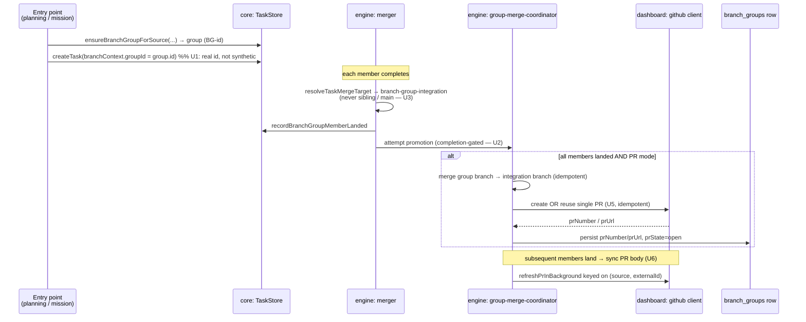
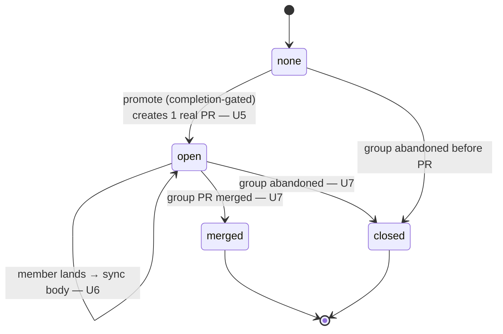

# feat: End-to-end branch-group single managed PR flow (planning + missions)

## Summary

When a user runs **planning** or a **mission**, every task in the resulting group should land on one shared group branch, and that group branch should produce **a single PR that is created and kept in sync** as members land — through to a terminal merge/close.

The plumbing for most of this already exists (the FN-5782 → FN-5788 → FN-5819 → FN-5830 → FN-5846 chain). This plan is an **audit-and-complete** pass: it fixes the breaks that stop the flow from working end-to-end and adds the one capability that was never built — creating and syncing a real GitHub PR for the group.

Confirmed scope decisions (from planning dialogue):
- **PR lifecycle:** create the single group PR, **keep it in sync** as members land (body/checklist/completion), and reconcile terminal merge/close.
- **Entry points:** both **planning** and **missions** must work end-to-end.

Out of scope: redesigning the task/mission data model, the merger seam (FN-5719 is ratified; we align with it, we don't re-open it), or PR-monitor external-integration semantics.

---

## Problem Frame

The branch-group system was built incrementally and has four classes of defect that, together, prevent the "single managed PR" outcome:

1. **The PR is never real.** `promoteBranchGroup` (in `packages/engine/src/group-merge-coordinator.ts`) does git plumbing only — it merges the group branch into the integration branch and flips `BranchGroup.prState` to `"open"` for PR-mode, but it never calls the GitHub client, so `prNumber`/`prUrl` stay empty. There is no "PR" beyond a status string.

2. **The manual promote route is dead.** `POST /branch-groups/:id/promote` (`packages/dashboard/src/routes/register-branch-groups-routes.ts`) invokes `engine.promoteBranchGroup(groupId)` as a method on the engine object, but only a standalone function exists. The dashboard test mocks the method, so the gap is invisible in CI.

3. **Members can't be enumerated by group.** Planning and missions stamp `task.branchContext.groupId` with a synthetic string (`planning:<sessionId>` / `mission:<missionId>`), while the stored `BranchGroup.id` is a generated `BG-…`. `listTasksByBranchGroup(group.id)` filters on exact `groupId` equality, so auto-created groups won't list their members — which breaks completion gating and PR rollup.

4. **Inconsistent "landed" semantics.** The route's `isMemberLanded` and the coordinator's `evaluateBranchGroupCompletion` define "landed/complete" differently, so the gate that reveals PR controls can disagree with the gate the engine uses to promote.

Underlying all of this is a **data-loss risk** (the 2026-05-23 lost-work incident): shared members share branch lineage, so any path that resolves a shared member's merge target to a sibling `fusion/fn-*` branch or to `main` instead of `branch_groups.branchName` can strand or mis-attribute work. This plan must preserve and extend the existing guards, especially across self-healing finalize paths (FN-5846).

---

## Requirements

- **R1.** A shared group created by planning or by a mission can enumerate its member tasks via the store (`listTasksByBranchGroup`) using the group's real id. *(fixes defect 3)*
- **R2.** "Landed" and "group complete" have a single canonical definition shared by the dashboard route and the engine coordinator. *(fixes defect 4)*
- **R3.** Every merge path — normal merge **and** all self-healing/deterministic finalize paths — resolves a shared member to `branch_groups.branchName`, never to a sibling `fusion/fn-*` branch or to the project default. *(preserves the lost-work guards)*
- **R4.** The dashboard `promote` route reaches a real, callable promotion entry point on the engine. *(fixes defect 2)*
- **R5.** Promotion of a completed group creates **exactly one** GitHub PR (group integration branch → default), persists `prNumber`/`prUrl`/`prState`, and is **idempotent** (re-running never opens a second PR). *(fixes defect 1)*
- **R6.** Once the group PR exists, it is kept in sync as additional members land — body reflects member list and completion (x/total) — reusing the existing idempotent PR-refresh path.
- **R7.** When a group reaches terminal state, `prState` reconciles to `"merged"` (group merged) or `"closed"` (group abandoned), and the GitHub PR is closed/merged accordingly.
- **R8.** PR/promote controls remain completion-gated; under `autoMerge: false`, promotion and PR creation are explicit user actions with no automatic push-to-origin.
- **R9.** The flow works end-to-end from both the **planning** entry point and the **mission** entry point, verified by integration tests.
- **R10.** Agent-native parity: any group promote/PR action a user can take in the dashboard is reachable from the CLI / agent surface.

---

## High-Level Technical Design

*Authoritative shape of the flow; per-unit fields below are the source of truth for files.*

### Flow: member task → shared branch → single managed PR

### BranchGroup.prState lifecycle

Two definitions must be unified (U2): the route's `isMemberLanded` and the coordinator's `evaluateBranchGroupCompletion`. The diagram's gates assume the unified predicate.

---

## Key Technical Decisions

- **KTD1 — Stamp the real `BG-` id into `branchContext.groupId`.** Rather than teach `listTasksByBranchGroup` to also match synthetic keys, have the entry points use the id returned by `ensureBranchGroupForSource`. This is the smallest change that makes membership queries correct everywhere and avoids a dual-key convention that would rot. Migration concern for already-created groups is addressed in U1.
- **KTD2 — One canonical landed/completion predicate in `@fusion/core`.** Extract a single function (e.g. in `packages/core/src/task-merge.ts` or a small `branch-group-completion.ts`) consumed by both the route and the coordinator, so the gate can never diverge again.
- **KTD3 — Build a new group-PR sync helper; do NOT reuse `refreshPrInBackground`.** Feasibility review confirmed `refreshPrInBackground` (`packages/dashboard/src/routes/register-git-github.ts:2220`) is task-hardwired and runs the *wrong direction* — it pulls review/merge status *from* GitHub onto a task's PR array; U6 needs to *push* an updated PR **body** for a group PR stored on the `branch_groups` row. `github.ts` has `mergePr` but no `updatePr`/`closePr` helper, so those are net-new. The `(source, externalId)` idempotency key belongs to the comment-import path (`register-git-github.ts:2073`), is unrelated to group-PR sync, and must not be cited as the dedup mechanism here.
- **KTD4 — Promotion/sync idempotency via persisted `prNumber` + `getBranchGroupByBranchName`** (`packages/core/src/store.ts:4373`). Before creating a PR, check for an existing one on the group; create only when absent. Re-running promotion is a no-op on the PR. This — not KTD3 — is the load-bearing idempotency guarantee for R5/R6.
- **KTD5 — A single engine bridge method** (`engine.promoteBranchGroup(groupId)`) wraps the standalone coordinator function so the route wiring in `register-integrated-routers.ts` works and the dashboard test stops mocking a non-existent method.
- **KTD7 — Inject the GitHub client via the existing `processPullRequestMerge` option seam, not `setCreateFnAgent`.** The engine already receives GitHub capability as a constructor-option callback that closes over a dashboard-built `GitHubClient` (`packages/engine/src/project-engine.ts:207`, invoked at `:1877`; constructed in the CLI layer at `daemon.ts:335`, `dashboard.ts:1560`, `serve.ts:361`). Add a sibling option (e.g. `promoteBranchGroupPr`/`createGroupPr`) alongside it and thread it through **all three** CLI construction sites. `setCreateFnAgent` is a weaker module-load global and the wrong model here.
- **KTD6 — Additive schema only.** `branch_groups` already carries `prState`/`prUrl`/`prNumber` (per `storage.md`). If a member-checklist cache is needed it's an additive, forward-only, version-gated `IF NOT EXISTS` column — no destructive backfill, `fusion-central.db` untouched. Default assumption: **no migration needed**; confirm during U5.

---

## Scope Boundaries

### In scope
- Membership identity fix, unified completion predicate, merge-target safety hardening, the engine bridge method, real single-PR creation, PR sync as members land, terminal merge/close reconciliation, dashboard + CLI surfacing, and end-to-end tests for both entry points.

### Deferred to Follow-Up Work
- Multi-node promotion arbitration. Promotion idempotency is currently task-row/group-local with no central claim/lease (FN-4820 gap). If two nodes can trigger promotion concurrently, a lease is needed. Out of this PR; flagged in U5 as an assumption (single-promoter).
- Richer PR templating / labels / reviewers beyond a member checklist + completion summary.

### Outside this product's identity
- Changing PR-monitor external-integration semantics (explicit non-goal per FN-5719).
- Re-opening the executor/merger decoupling seam.

---

## Implementation Units

### U1. Unify branch-group membership identity

**Goal:** Make `listTasksByBranchGroup(group.id)` reliably return members for groups created by planning and missions, and stop `setTaskBranchGroup` from hardcoding the assignment mode. *(R1)*

**Dependencies:** none (foundational).

**Files:**
- `packages/core/src/store.ts` — `setTaskBranchGroup` (~4434), `listTasksByBranchGroup` (~4467), `ensureBranchGroupForSource` (~4378).
- `packages/dashboard/src/routes/register-planning-subtask-routes.ts` — branch-context construction (~213–246 and the parallel ~1273–1310 block).
- `packages/core/src/mission-store.ts` — branch-context construction (~3814–3848).
- Tests: `packages/core/src/__tests__/branch-group-store.test.ts`, `packages/dashboard/src/__tests__/shared-branch-group-entry-points.test.ts`.

**Approach:** Root cause (feasibility-confirmed): both entry points call `ensureBranchGroupForSource(...)` but **discard its return value** (`register-planning-subtask-routes.ts:228`, `mission-store.ts:3823`), then stamp `branchContext.groupId` with the synthetic string (`register-planning-subtask-routes.ts:214,1271`; `mission-store.ts:3844`). The synthetic value never resolves against `getBranchGroup` (a plain PK lookup, `store.ts:4363`), so it is broken for *every* consumer today, not just enumeration. Fix: capture the returned `group.id` and stamp it. `setTaskBranchGroup` should carry the group's actual assignment intent instead of literal `"shared"`. A read-side fallback matching the legacy synthetic key is harmless and preserves enumeration of already-broken old groups — but note it is not preventing a regression (legacy groups were already non-functional for promotion/gating), so keep it minimal and removable.

**Patterns to follow:** `ensureBranchGroupForSource` idempotency; existing `branchContext` shape in `types.ts` (~1690).

**Test scenarios:**
- Covers F (planning shared group). Planning creates a shared group; `listTasksByBranchGroup(group.id)` returns all created subtasks.
- Covers F (mission shared group). Mission triage creates a shared group; members enumerate by real id.
- `setTaskBranchGroup` on a `per-task-derived` group does not overwrite mode to `"shared"`.
- Legacy row with synthetic `groupId` still enumerates via read-side fallback.
- Empty group returns `[]`, not an error.

**Verification:** Both entry points produce groups whose members are returned by id; no path writes the shared branch as `task.branch`.

---

### U2. Canonical landed / completion predicate

**Goal:** One shared definition of "member landed" and "group complete," consumed by both the dashboard route and the engine coordinator. *(R2)*

**Dependencies:** U1.

**Files:**
- `packages/core/src/task-merge.ts` (or a new `packages/core/src/branch-group-completion.ts`) — exported predicate(s).
- `packages/core/src/index.ts` — export.
- `packages/dashboard/src/routes/register-branch-groups-routes.ts` — replace local `isMemberLanded` (~14–18).
- `packages/engine/src/group-merge-coordinator.ts` — replace/wrap `evaluateBranchGroupCompletion` (~44–67).
- Tests: `packages/core/src/__tests__/` new test for the predicate; update `routes-branch-groups.test.ts`, `group-merge-coordinator.test.ts`.

**Approach:** Define `isBranchGroupMemberLanded(task, group)` and `isBranchGroupComplete(members, group)` in core. The two existing semantics genuinely disagree (feasibility-confirmed): the route requires `mergeConfirmed === true && mergeTargetSource === "branch-group-integration" && mergeTargetBranch === group.branchName` (`register-branch-groups-routes.ts:13`), while the coordinator accepts `column === "done"` OR `(column === "in-review" && mergeTargetSource === "branch-group-integration")` and **never checks `mergeTargetBranch`** (`group-merge-coordinator.ts:50`). **Decision:** the stricter route semantics win — landing requires `mergeConfirmed` **and** `mergeTargetBranch === group.branchName`. This is load-bearing for U3's merge-target safety guarantee (a member `done` against a sibling/mismatched branch must NOT count as landed). Route and coordinator both import the core predicate.

**Patterns to follow:** existing exports from `@fusion/core`; serialize-group completion shape in the route (~20–38).

**Test scenarios:**
- Member with `mergeConfirmed` + matching target → landed; mismatched `mergeTargetBranch` → not landed.
- Group with all members landed → complete; one unlanded → incomplete.
- Route serialization and coordinator agree on the same fixture (no divergence).
- Empty membership → not complete.

**Verification:** Route gate and engine gate return identical results for identical group states.

---

### U3. Merge-target safety for shared members across all paths

**Goal:** Guarantee every merge and self-healing finalize path routes a shared member to `branch_groups.branchName`, never to a sibling `fusion/fn-*` branch or the default. *(R3)*

**Dependencies:** U1 (correct group resolution).

**Execution note:** Characterization-first — add coverage that pins current correct routing on the normal path before touching the recovery paths, given the data-loss history.

**Files:**
- `packages/core/src/task-merge.ts` — `resolveTaskMergeTarget` (~71), `isSharedBranchGroupMemberIntegration` (~64).
- `packages/engine/src/merger.ts` — `resolveBranchGroupMergeRouting` (~7466), `recordBranchGroupMemberLanding` (~7475), finalize-success paths (~8139, 8206, 8411, deferred-confirm ~9983–10127).
- `packages/engine/src/self-healing.ts`, `packages/engine/src/already-merged-detector.ts` — recovery/finalize re-routing (FN-5846).
- Tests: `packages/engine/src/__tests__/reliability-interactions/branch-group-merge-routing.test.ts`, `shared-group-member-integration.test.ts`, plus new recovery-path cases.

**Approach:** Audit each finalize/recovery path; ensure shared-member re-routing to the group branch happens **before** reachability checks, stamps `mergeTargetSource`/`mergeTargetBranch`, calls `recordBranchGroupMemberLanded`, and emits a defensive audit event if any path would evaluate a shared member against the default branch (mirror `merge:merge-target-rejected-fusion-sibling`). Keep "already landed" detection commit-ownership-anchored, not grep-prose-matched.

**Patterns to follow:** existing rejection guard `merge:merge-target-rejected-fusion-sibling`; FN-5819 in-review-terminal exception for member→group integration.

**Test scenarios:**
- Shared member with inherited sibling `baseBranch` → merge target resolves to group branch, not the sibling; emits routed audit.
- Self-healing finalize of a shared member re-routes to the group branch and never evaluates against `main`.
- `already-merged-detector` attributes a landed commit by ownership trailer, not first `git log --grep` hit.
- `autoMerge: false`: member→group integration proceeds (FN-5819 exception) but does **not** trigger shared→default promotion.
- Ungrouped / `per-task-derived` task still routes direct-to-default (no regression).

**Verification:** No path resolves a shared member's target to a sibling branch or default; recovery paths emit the routed/rejected audit events.

---

### U4. Engine `promoteBranchGroup` bridge method

**Goal:** Expose a real, callable `engine.promoteBranchGroup(groupId)` so the dashboard route works and the test stops mocking a non-existent method. *(R4)*

**Dependencies:** U2.

**Files:**
- `packages/engine/src/project-engine.ts` — add the method wrapping the standalone coordinator function (used internally at ~1853; auto-promotion at ~1848–1872).
- `packages/engine/src/group-merge-coordinator.ts` — ensure the standalone signature is callable from the method.
- `packages/dashboard/src/routes/register-integrated-routers.ts` — verify the `promoteBranchGroup` option wiring (~48–59) now hits a real method.
- Tests: `packages/dashboard/src/__tests__/routes-branch-groups.test.ts` (remove the mock-masking; assert real wiring), `packages/engine/src/__tests__/group-merge-coordinator.test.ts`.

**Approach:** Add `promoteBranchGroup(groupId)` to the engine class that resolves store/rootDir/settings and delegates to the coordinator. Confirm `getEngine(projectId)` returns an object exposing it. Update the dashboard test to exercise the real path (the prior mock hid GAP A).

**Patterns to follow:** existing engine method exposure and the option-callback injection pattern in `register-integrated-routers.ts`.

**Test scenarios:**
- `POST /branch-groups/:id/promote` on a complete group reaches the engine method (no "not available on engine" throw).
- Promote on an incomplete group is rejected by the gate (completion-gated).
- Engine method delegates to the coordinator with resolved settings.

**Verification:** The promote route succeeds against a real engine method; no test mocks `engine.promoteBranchGroup`.

---

### U5. Create a single real GitHub PR for the group

**Goal:** On promotion (PR mode, completion-gated), create exactly one GitHub PR for the group integration branch → default, persist `prNumber`/`prUrl`/`prState`, idempotently. *(R5, R8)*

**Dependencies:** U1, U2, U4.

**Files:**
- `packages/engine/src/group-merge-coordinator.ts` — `promoteBranchGroup` (~111–242): after the integration merge, create/reuse the PR via the injected callback instead of only flipping `prState`.
- `packages/dashboard/src/github.ts` — add a group-PR create helper reusing `createPrWithGh` (~722) / `createPrWithApi` (~771).
- `packages/cli/src/commands/daemon.ts` (~335), `packages/cli/src/commands/dashboard.ts` (~1560), `packages/cli/src/commands/serve.ts` (~361) — **all three** engine-construction sites must pass the new group-PR callback alongside `processPullRequestMerge`, or behavior diverges between `fn daemon` / `fn dashboard` / `fn serve`.
- `packages/engine/src/project-engine.ts` — accept the new option alongside `processPullRequestMerge` (~207).
- `packages/core/src/store.ts` — persist PR fields via `updateBranchGroup` (~4402); use `getBranchGroupByBranchName` (~4373) for idempotency.
- `packages/core/src/db.ts` — confirmed: no schema change needed (`branch_groups` already has `prState`/`prUrl`/`prNumber` at ~784–786); add an additive `IF NOT EXISTS` migration only if a checklist cache is required.
- Tests: `packages/engine/src/__tests__/reliability-interactions/branch-group-promotion.test.ts`, `branch-group-promotion-gate.test.ts`; new github-client test.

**Approach:** Gate on unified completion (U2). If a PR already exists for the group (persisted `prNumber` or matching open PR via `getBranchGroupByBranchName`), reuse it — never open a second (KTD4). The GitHub client reaches the coordinator via the injected `processPullRequestMerge`-style option callback (KTD7), never a static dashboard import. Under `autoMerge: false`, creation is explicit and does not push automatically. **Assumption:** single-promoter — multi-node arbitration (no central claim/lease, FN-4820) is deferred.

**Patterns to follow:** the existing `processPullRequestMerge` injected-callback seam (`project-engine.ts:207` → CLI construction sites); `createPrWithGh`/`createPrWithApi`; DI to avoid `@fusion/engine` ↔ dashboard cycles.

**Test scenarios:**
- Complete group, PR mode → exactly one PR created; `prNumber`/`prUrl`/`prState=open` persisted.
- Re-running promotion → no second PR (idempotent).
- Incomplete group → no PR (gate blocks).
- `autoMerge: false` → PR creation is explicit, no auto-push.
- gh-CLI path and API path both produce a persisted PR (parity).
- GitHub failure → group left in a recoverable state (no partial `prState` lie); error surfaced.

**Verification:** A completed group yields one real PR with populated number/url; re-promotion is a no-op.

---

### U6. Keep the group PR in sync + terminal lifecycle

**Goal:** As more members land, update the PR body (member checklist, x/total completion); on group merge/abandon, reconcile `prState` and the GitHub PR. *(R6, R7)*

**Dependencies:** U5.

**Files:**
- `packages/dashboard/src/github.ts` — add **net-new** `updatePr`/`editPrBody` and `closePr` helpers (only `mergePr` exists today at ~1785); no body-edit/close helper exists to reuse.
- `packages/engine/src/merger.ts` — trigger sync from `recordBranchGroupMemberLanding` (~7475) when a group PR exists, via the injected callback (KTD7).
- `packages/engine/src/group-merge-coordinator.ts` — terminal reconciliation (group complete → `merged`; abandon → `closed`).
- `packages/core/src/store.ts` — `updateBranchGroup` status transitions (auto-`closedAt` on leaving `open`).
- `packages/dashboard/src/routes/register-branch-groups-routes.ts` — surface refreshed state in serialization.
- Tests: new group-PR sync test; `store-pr-merged-transition.test.ts`; coordinator terminal-state tests.

**Approach:** Build a **new group-PR sync helper** (push body + close + merge against the `branch_groups` row) — do **not** reuse `refreshPrInBackground`, which is task-scoped and pulls status the wrong direction (KTD3). On each member landing, if the group has an open PR, enqueue a body refresh (member list + completion); idempotency comes from the persisted `prNumber` (KTD4), so coalescing/retry must be built here, not inherited. On group completion/merge, set `prState=merged`; on abandon (`status=abandoned`), close the GitHub PR and set `prState=closed`.

**Patterns to follow:** `updateBranchGroup` closing semantics; the injected-callback seam from U5 (KTD7).

**Test scenarios:**
- Second member lands after PR open → PR body reflects 2/N; no duplicate PR.
- Group fully merged → `prState=merged`, GitHub PR merged/closed.
- Group abandoned → `prState=closed`, GitHub PR closed.
- Concurrent member landings → single coalesced refresh (idempotent), no race-duplicated updates.
- Sync failure is retryable and does not corrupt `prState`.
- Group PR closed/merged out-of-band on GitHub (persisted `prNumber` no longer open) → sync detects and reconciles `prState` rather than erroring or re-opening.

**Verification:** PR body tracks completion as members land; terminal states reconcile both `prState` and the GitHub PR.

---

### U7. Dashboard + CLI surfacing (agent-native parity)

**Goal:** Surface completion-gated group-PR controls in the dashboard and provide an equivalent CLI/agent path. *(R8, R10)*

**Dependencies:** U4, U5, U6.

**Files:**
- `packages/dashboard/app/components/` — Group Task Modal / `MissionManager.tsx` / `TaskCard.tsx`: show progress before completion, reveal promote/PR-open + PR link after.
- `packages/cli/src/commands/task.ts` and/or `packages/cli/src/commands/git.ts` — a group promote/PR command reaching the same engine method.
- Tests: dashboard route/UI tests; CLI command test.

**Approach:** Controls hidden until the unified completion predicate (U2) reports complete; once promoted, show the PR link from persisted `prUrl`. The CLI command calls the same promote entry point (no dashboard-only capability).

**Patterns to follow:** existing branch-group dashboard APIs (`GET/POST /api/branch-groups...`); CLI command structure in `packages/cli/src/commands/`.

**Test scenarios:**
- Incomplete group → progress shown, promote control hidden.
- Complete group → promote/PR control shown; after promote, PR link rendered.
- CLI promote command on a complete group opens/links the same single PR a dashboard user would get (parity).
- CLI promote on incomplete group → rejected with the same gate.

**Verification:** Any group PR action available in the UI is reachable from the CLI; controls respect completion gating.

---

### U8. End-to-end integration tests (planning + mission)

**Goal:** Prove the full flow for both entry points: group creation → members land on the shared branch → single managed PR created and synced. *(R9)*

**Dependencies:** U1–U7.

**Files:**
- `packages/dashboard/src/__tests__/` — extend `planning.test.ts`, `mission-e2e.test.ts` / `mission-integration.test.ts`.
- `packages/engine/src/__tests__/reliability-interactions/shared-branch-group-lifecycle.test.ts` — full lifecycle assertion.

**Approach:** Drive each entry point through to a single PR, asserting member enumeration (U1), unified gating (U2), safe routing (U3), real PR creation (U5), and sync/terminal (U6). Assert no second PR appears on re-promotion and no shared member ever targets a sibling/default branch.

**Test scenarios:**
- Covers F (planning E2E). Planning → shared group → all subtasks land → one PR created, synced to N/N, merged → `prState=merged`.
- Covers F (mission E2E). Mission triage → shared group → members land → one PR; abandon mid-flight → `prState=closed`.
- Re-running promotion in either flow → no duplicate PR.
- A self-healing finalize during the flow keeps members on the group branch (no lost work).

**Verification:** Both entry points reach a single managed PR with correct terminal state; no duplicate PRs; no mis-routed members.

---

## Risks & Dependencies

- **Data loss (high).** Shared members share branch lineage; a regression in merge-target resolution can strand work (2026-05-23 incident). Mitigation: U3 characterization-first, defensive audit events, commit-ownership-anchored detection, and the U8 self-healing E2E case.
- **Idempotency / duplicate PRs (medium).** Mitigation: KTD4 (persisted `prNumber` + `getBranchGroupByBranchName` check) and explicit re-promotion no-op tests in U5/U8.
- **Multi-node promotion (deferred).** No central claim/lease today (FN-4820). Documented as a single-promoter assumption in U5; out of scope.
- **Circular import (low).** The coordinator must not import the dashboard GitHub client directly — inject it via the existing `processPullRequestMerge`-style option-callback seam (`project-engine.ts:207` → CLI construction sites), **not** `setCreateFnAgent` (KTD7). Wiring only one of the three CLI sites is the realistic mistake — see U5 file list.
- **Changeset.** `@runfusion/fusion` ships this behavior — add `.changeset/*.md` before commit (per repo convention).

---

## Sources & Research

- Repo trace: `branch-assignment.ts`, `store.ts` branch-group methods, `group-merge-coordinator.ts`, `register-branch-groups-routes.ts`, `register-integrated-routers.ts`, `github.ts`, planning/mission entry points.
- Learnings: `docs/missions.md` (shared-group invariant), `docs/architecture.md` (FN-5782/5830/5846 merge routing + promotion), `docs/incidents/2026-05-23-lost-work-tasks.md` (merge-target safety), `docs/dashboard-guide.md` (PR surface + `refreshPrInBackground`), `docs/rfcs/FN-5719-decouple-executor-merger.md` (cutover discipline), `docs/dag/milestone-b-schema-migration-plan.md` (migration pattern).
