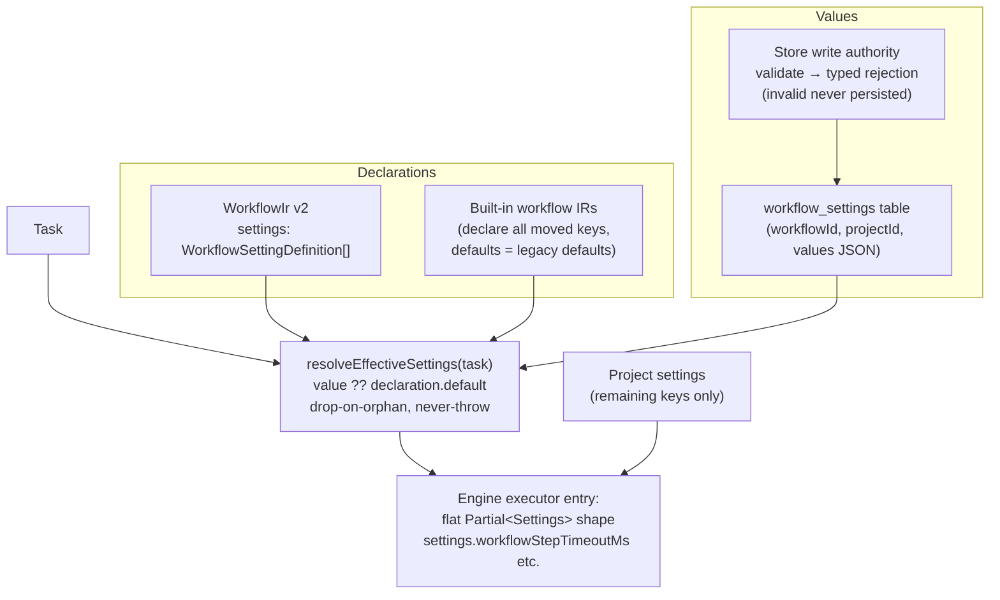
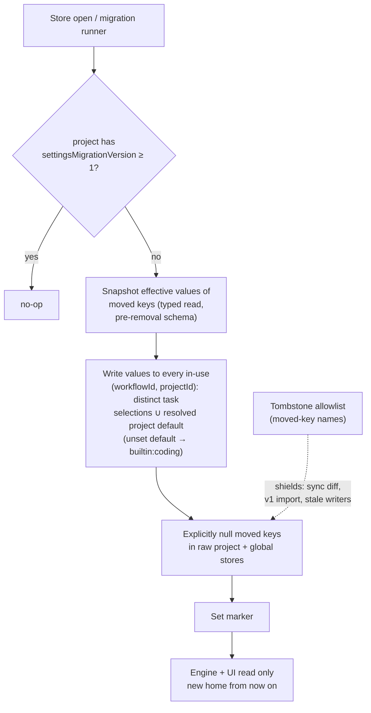

# feat: Workflow settings mechanism, settings hard-move, and Settings UI redesign

## Summary

Give workflows a first-class **typed settings mechanism**: workflows declare settings in their IR (mirroring the shipped custom-task-fields pattern), setting *values* persist per `(workflowId, projectId)` through a single validating store authority, and the engine resolves **effective settings per task** at executor entry. Then **hard-move** the global/project settings that are actually workflow policy — step execution, review/approval, per-phase model lanes — onto this mechanism via a one-time, idempotent, marker-gated migration that removes the keys from the settings schema entirely. Finally, **redesign the Settings modal**: replace ~7,900 lines of ad-hoc inline controls with shared schema-driven field primitives, per-section components with co-located CSS, consistent grouping/naming, and redirect stubs pointing users to the workflow editor for moved settings.

Keys already destined for column **trait** config under the columns/traits track (merge strategy cluster, `maxConcurrent` → WIP trait) go there, not here — this plan draws that boundary explicitly (KTD-4).

---

## Problem Frame

The columns/traits and step-inversion tracks made workflows the home for board and step *policy* — columns, traits, custom task fields, step modeling. But the policy *knobs* that parameterize that behavior still live as ambient project/global settings in `packages/core/src/settings-schema.ts`: `workflowStepTimeoutMs`, `runStepsInNewSessions`, `requirePrApproval`, `reviewHandoffPolicy`, per-phase model lanes, and dozens more. This is now incoherent:

- A workflow models *how* tasks execute, but the timeouts, review gates, and model lanes that govern that execution are configured somewhere else entirely, with no relationship to the workflow.
- The columns plan's identity posture (KTD-6) says user-lowerable enforcement floors belong *inside an explicitly authored workflow, never as ambient settings* — the current settings catalog violates this.
- The Settings modal has grown to ~7,900 lines of bespoke inline controls across ~25 sections with no shared field components, making every settings change expensive and the UI inconsistent.

There is no mechanism for a workflow to declare a setting at all — that's the gap this plan fills first, then exploits.

---

## Scope Boundaries

### In scope

- `settings` declarations on WorkflowIr v2 (additive): `WorkflowSettingDefinition[]` with typed values, defaults, enum options, descriptions, render hints; `validateSettings` in `parseWorkflowIr`.
- A per-`(workflowId, projectId)` setting-**value** store (new table, schema bump) with a single validating write authority; values writable for built-in workflows even though built-in IR is non-editable.
- Per-task effective-settings resolution in core, consumed by the engine at executor entry, preserving the flat `Partial<Settings>` read shape.
- Built-in workflow declarations for every moved key, with defaults byte-equal to today's `DEFAULT_PROJECT_SETTINGS` values.
- `WorkflowSettingsPanel` in the workflow node editor (declarations + defaults; per-project values in project context); agent-tool parity (`fn_workflow_create/update` declarations; a value read/write path).
- One-time hard-move migration (per-project marker, idempotent) of the moved-key catalog (see U4) out of `DEFAULT_PROJECT_SETTINGS`, with tombstone allowlist, explicit value nulling, and surface sweep: settings export v2, cross-node sync guard, SettingsModal save-split, CLI, consistency test.
- Full SettingsModal redesign: shared schema-driven field primitives, per-section components + co-located CSS files, regrouped navigation, redirect stubs for moved settings, i18n throughout.

### Deferred to Follow-Up Work

- Removing the redirect stubs (one release after this ships).
- A `workflowSettings` channel in cross-node settings *sync* (this plan excludes moved keys from sync and reports the exclusion; full sync of the value table is follow-up — see KTD-8).
- Per-task setting value overrides (values are per workflow+project only this round).
- Plugin-contributed setting types or plugin-declared settings.
- Moving capacity/scheduler ops knobs (`backlogPressure*`, `stale*`, `pollIntervalMs`, etc.) — these are engine/scheduler operations policy, not per-workflow process policy; reconsider only after the mechanism proves out.
- Migrating merge-cluster keys — owned by the columns plan's merge-trait track (U7 there), not this plan.

### Outside this plan's identity

- No global-default-plus-workflow-override layering: the user decision is a hard move. A moved key has exactly one home.
- Integrity guarantees (lost-work trio, crash recovery, audit) stay non-configurable — they never become workflow settings.
- Device-local three-tier prefs (theme, language, font scale) stay exactly as they are.

---

## Requirements

**Mechanism**

- R1. Workflows can declare typed settings in IR (`id`, `name`, `type`, `default`, `options`, `description`, render hints); declarations are validated at save by `parseWorkflowIr` with the same rigor as `validateFields` (unique ids, type whitelist, options iff enum-kind).
- R2. Setting values persist per `(workflowId, projectId)` through a single store write authority that validates each value against the named workflow's declaration schema and rejects invalid values with typed errors — invalid values are never persisted.
- R3. The engine resolves effective settings **per task** (stored value → declaration default), as a flat `Partial<Settings>`-shaped object, via a never-throw resolver; all moved-key engine read sites receive values from this resolution.
- R4. Built-in workflows (`builtin:coding`, stepwise) declare every moved setting with defaults equal to today's `DEFAULT_PROJECT_SETTINGS` values; setting *values* for built-ins are writable even though built-in IR is not editable.
- R5. The workflow node editor has a settings panel for declarations/defaults and per-project values; `fn_workflow_create/update` accept `settings` declarations and agents can read/write values with the same typed-rejection contract.

**Migration**

- R6. A one-time, idempotent, per-project migration (gated by a persisted migration marker) snapshots each project's effective moved-key values, writes them to **every workflow the project's tasks can resolve** — the distinct `task_workflow_selection` workflowIds in use, unioned with the resolved project default, where an unset/empty `defaultWorkflowId` normalizes to `builtin:coding` (matching the resolver's falsy-id degradation) — removes the keys from `DEFAULT_PROJECT_SETTINGS`/`GLOBAL` schema objects, and explicitly nulls persisted raw values.
- R7. Every settings surface stays consistent with the move: keys lists/predicates, validation, export/import (v2), cross-node sync, SettingsModal save-split, `useAppSettings`, CLI settings commands — guarded by a consistency test so the lists cannot silently drift.
- R8. Pre-migration payloads cannot resurrect moved keys: importing a v1 export upgrades moved keys into workflow setting values; sync of moved keys is suppressed via the tombstone allowlist.

**Settings UI**

- R9. SettingsModal is rebuilt from shared schema-driven field primitives (toggle/number/select/text/textarea rows) and per-section components with co-located CSS files following the dashboard CSS conventions.
- R10. Each moved setting's former location shows a redirect stub ("moved to the workflow editor" with a link) for one release.
- R11. Behavior of remaining settings is preserved: save-splitting by scope predicates, null-as-delete clears, changed-only project writes, three-tier device prefs untouched, all strings `t()`-wrapped.

---

## High-Level Technical Design

Effective-settings resolution (the load-bearing data flow — flat shape preserved so ~20 engine read sites don't change):

One-time migration sequence (per project, idempotent, marker-gated):

The schema-object key removal (from `DEFAULT_PROJECT_SETTINGS`) ships in the same commit as the migration — the two are inseparable, because `GlobalSettingsStore`/project `updateSettings` re-inject `DEFAULT_*` values after deletion (`packages/core/src/global-settings.ts:181-211`): a key left in the DEFAULT object re-materializes on the next unrelated save and silently overrides the migrated value.

---

## Key Technical Decisions

- KTD-1 — **Mirror the fields pattern exactly.** `WorkflowSettingDefinition` clones the shape of `WorkflowFieldDefinition` (`packages/core/src/workflow-ir-types.ts:90-98`); `validateSettings` clones `validateFields` (`packages/core/src/workflow-ir.ts:659-727`); the editor panel clones `WorkflowFieldsPanel.tsx`. This is the established, shipped pattern for "workflow-declared typed schema" — inventing a second idiom would be gratuitous divergence. Settings get their **own** render-hint type (widget only — no `card`/`detail` placement, which is task-card-specific).

- KTD-2 — **Values live per `(workflowId, projectId)` in a new table, not in IR.** Built-in workflows are non-editable (`isBuiltinWorkflowId` guard in store CRUD), so values cannot be written into built-in IR; and per-project tuning of the same workflow must survive the migration (two projects using `builtin:coding` with different step timeouts). Declarations describe the schema; the value table carries the data — exactly the workflow-fields ↔ `tasks.customFields` split, one level up. Value writes are validated against the *named* workflow's schema (not the project's current default workflow), and built-in workflow values are writable while built-in declarations are not — two distinct error paths in the write authority.

- KTD-3 — **Per-task effective-settings resolution, flat shape.** The engine reads moved keys as flat fields on `Partial<Settings>` at ~20 sites (`packages/engine/src/executor.ts:9974, :2149, :5154`, `packages/engine/src/step-session-executor.ts:671`, reviewer/merger). A `resolveEffectiveSettings(task)` sibling of `resolveWorkflowIrForTask` (`packages/core/src/workflow-ir-resolver.ts`) builds the same flat shape from value-table + declaration defaults at executor entry, so read sites keep their exact expressions. Same never-throw degradation contract as the IR resolver. Each read site's hardcoded `?? <literal>` fallback must be audited to match the built-in declaration default — otherwise resolution returning `undefined` silently overrides migrated values.

- KTD-4 — **Trait-config boundary.** Column-scoped policy belongs to column *traits* (merge strategy/squash/fileScope → merge trait; `maxConcurrent` → WIP trait, per columns plan KTD-6/U6/U7). Workflow *settings* carry workflow-scoped policy not tied to a single column: step execution knobs, review/approval policy, per-phase model lanes. A key gets exactly one home; the moved-key catalog (U4) records the home for every candidate so the same policy never has two sources of truth.

- KTD-5 — **Hard-move = schema removal + tombstones + explicit nulls + per-project marker; no experimental flag.** A behavior flag would require moved keys to exist in both homes simultaneously (flag-OFF reads old, flag-ON reads new), which contradicts a hard move and re-creates the dual-writer hazard. Instead, the migrated/not-migrated state is per project, gated by a persisted `settingsMigrationVersion` marker, and transitions exactly once. A `MOVED_SETTINGS_KEYS` tombstone allowlist (the only remaining record of the old names) shields the surfaces that can encounter old payloads: sync diff, v1 import, stale CLI writers. Safety comes from characterization tests proving effective-value equivalence across the migration boundary, not from a flag.

- KTD-6 — **Drop-on-orphan for setting values (deliberate divergence from fields).** `reconcileFieldsOnWorkflowChange` retains orphaned task-field values and surfaces them in a disclosure — fine for display data, dangerous for policy the engine consumes (a retyped enum→number setting with a stale string value would feed garbage into execution). Effective resolution drops values that no longer validate against the current declaration and falls to the declaration default. The editor surfaces dropped values; the engine never sees them.

- KTD-7 — **Model-lane resolution chain.** Per-phase project lanes (`executionProvider/ModelId`, `planningProvider/ModelId`, `validatorProvider/ModelId`, fallbacks, title summarizer) move to workflow settings. The documented chain (`packages/engine/src/executor.ts:5755-5770`, the `resolveExecutorSessionModel` lane-hierarchy site) becomes: workflow-setting lane → global lane (`executionGlobalProvider` etc., which stay global) → project default override → global default. An empty workflow lane falls through; characterization tests pin the chain before and after.

- KTD-8 — **Export v2; sync excludes moved keys this round.** `settings-export.ts` bumps to `version: 2` with a `workflowSettings` section (declarations are in workflows; export carries values). Importing v1 upgrades moved keys into workflow setting values using the same write-target rule as the migration (in-use workflows ∪ resolved default, unset default normalized to `builtin:coding`) instead of dead-writing them into project settings. Cross-node settings sync (`packages/dashboard/src/routes/register-settings-sync-routes.ts:15-33`) filters moved keys out of diffs/push/pull via the tombstone list and surfaces "workflow settings are not synced yet" in the sync UI; a full sync channel is deferred (Scope Boundaries).

- KTD-9 — **Cascade-delete values on workflow deletion.** Deleting a custom workflow deletes its value rows; tasks pinned to a deleted workflow already degrade to `builtin:coding` via the resolver and therefore read built-in declarations + built-in values. No unreachable orphan rows.

- KTD-10 — **Schema-driven Settings UI primitives.** The redesign introduces shared field-row primitives (toggle/number/select/text/textarea + section scaffolding) rendered from a per-section descriptor, the same render-by-type idiom as `WorkflowFieldsPanel` widgets. SettingsModal becomes a shell (nav + save-split + scope handling) composing per-section components, each with a co-located CSS file. This is what makes the modal cheap to change and is also the convergence point: `WorkflowSettingsPanel` value editing reuses the same primitives.

---

## Implementation Units

### U1. Workflow IR settings declarations + validation + built-in declarations

- **Goal:** Workflows can declare typed settings; built-ins declare the full moved-key catalog.
- **Requirements:** R1, R4
- **Dependencies:** none
- **Files:** `packages/core/src/workflow-ir-types.ts`, `packages/core/src/workflow-ir.ts`, `packages/core/src/builtin-coding-workflow-ir.ts`, `packages/core/src/builtin-stepwise-coding-workflow-ir.ts`, `packages/core/src/__tests__/workflow-ir.test.ts`
- **Approach:** Add `settings?: WorkflowSettingDefinition[]` to `WorkflowIrV2` (additive; v1 stays frozen). Definition shape: `{ id, name, type, default?, options?, description?, render? }` with type whitelist `string | text | number | boolean | enum | multi-enum`; settings-specific render hint (`widget` only). `validateSettings` in `validateV2` mirrors `validateFields`: non-empty unique ids, type whitelist, options iff enum-kind, unique option values, default validates against its own type/options. Built-in IRs declare every moved key with defaults byte-equal to current `DEFAULT_PROJECT_SETTINGS` literals. Note: presence of `settings` keeps IR v2 under `downgradeIrToV1IfPure`.
- **Patterns to follow:** `validateFields` (`workflow-ir.ts:659-727`), `WorkflowFieldDefinition` types, `WorkflowIrError` surfacing.
- **Test scenarios:**
  - Valid declaration of each type parses and round-trips through `parseWorkflowIr`.
  - Duplicate setting ids → `WorkflowIrError`; empty id → error; unknown type → error.
  - `enum` without options → error; options on non-enum type → error; duplicate option values → error.
  - Default value violating its own type (`type: number`, `default: "x"`) or enum options → error.
  - Built-in coding workflow declares every key in `MOVED_SETTINGS_KEYS` and each declaration default strictly equals the legacy `DEFAULT_PROJECT_SETTINGS` literal (consistency assertion — this is the parity anchor for the migration).
  - IR with `settings` present is not downgraded to v1.
- **Verification:** `pnpm test` for core IR suites green; consistency assertion ties built-in defaults to legacy literals.

### U2. Setting-value store: table, write authority, validation core

- **Goal:** Persist values per `(workflowId, projectId)` behind a single validating authority.
- **Requirements:** R2, R4
- **Dependencies:** U1
- **Files:** `packages/core/src/db.ts`, `packages/core/src/store.ts`, `packages/core/src/workflow-settings.ts` (new), `packages/core/src/__tests__/workflow-settings.test.ts`, `packages/core/src/__tests__/db-migrate.test.ts`
- **Approach:** New table `workflow_settings (workflowId, projectId, values JSON, updatedAt)` with composite PK; `SCHEMA_VERSION` bump (additive, forward-only, idempotent migration step). `workflow-settings.ts` is the side-effect-free validation core mirroring `task-fields.ts`: `validateSettingValuePatch(declarations, patch)` → typed rejections (`unknown-setting`, `type-mismatch`, `enum-violation`, `no-settings-defined`), plus `resolveEffectiveSettingValues(declarations, stored)` implementing drop-on-orphan (KTD-6) with an explicit comment marking the deliberate divergence from the field reconciler. Store authority `updateWorkflowSettingValues(workflowId, projectId, patch)`: validates against the **named** workflow's declarations; built-in workflow ids accepted for value writes (declaration edits stay rejected); null-as-delete per key. Cascade-delete rows in workflow deletion (KTD-9).
- **Execution note:** Bumping `SCHEMA_VERSION` requires the broad literal sweep — `grep -rn 'toBe(<old>)' packages/` hits ~40+ sites across ≥8 test files (`db.test.ts` ~26, `db-migrate.test.ts`, `goals-schema.test.ts`, `task-documents.test.ts`, plus insight-store/run-audit/store-merge-queue/merge-request-record/mission-store suites); update all of them atomically in this unit's commit. The U4 settings migration is a separate commit with no DB schema change.
- **Patterns to follow:** `updateTaskCustomFields` / `validateCustomFieldPatch` (`store.ts:6947`, `task-fields.ts`), `addColumnIfMissing` migration discipline, db-migrate forward-path tests.
- **Test scenarios:**
  - Write a valid value for a custom workflow → persisted; read back typed.
  - Write value for `(builtin:coding, project)` → accepted (R4); attempt to edit built-in declarations via workflow update → still rejected.
  - Type-mismatch / unknown-setting / enum-violation patches → typed rejection, nothing persisted (write boundary contract).
  - Null value in patch deletes the key; subsequent effective resolution falls to declaration default.
  - Retype a declared setting (enum→number) with a stale string value stored → effective resolution drops it and returns declaration default; stored row untouched until next write (drop-on-orphan).
  - Delete custom workflow → its value rows are gone; task pinned to deleted workflow resolves builtin values.
  - db-migrate forward-path test for the new version; schema-version literal sweep complete.
- **Verification:** Core suites green; no row rewrites in migration; corruption-resilience posture unchanged.

### U3. Effective-settings resolution + engine integration + fallback audit

- **Goal:** Engine reads moved keys from per-task resolution; behavior is characterization-identical for untouched defaults.
- **Requirements:** R3
- **Dependencies:** U1, U2
- **Files:** `packages/core/src/workflow-ir-resolver.ts` (or sibling `workflow-settings-resolver.ts`), `packages/engine/src/executor.ts`, `packages/engine/src/step-session-executor.ts`, `packages/engine/src/reviewer.ts`, `packages/engine/src/merger.ts`, `packages/core/src/__tests__/workflow-settings-resolver.test.ts`, `packages/engine/src/__tests__/executor-settings.test.ts`
- **Approach:** `resolveEffectiveSettings(task | workflowId+projectId)` composes `resolveWorkflowIrForTask` + value table + drop-on-orphan into a flat `Partial<Settings>`-shaped object (never-throw, degrade like the IR resolver). Engine builds it once at executor entry and merges over the remaining project/global settings object so the ~20 read sites keep their exact `settings.<key>` expressions. Audit every moved-key read site's hardcoded `?? <literal>` fallback (e.g. `executor.ts:9974` `?? 360_000`, `step-session-executor.ts:671`) and align each with the built-in declaration default — assert alignment in a test rather than by eye. Model-lane chain rewired per KTD-7.
- **Execution note:** Characterization-first — capture current effective values consumed by a scripted run (default settings, and a customized-project fixture) before wiring resolution; then prove the post-wiring run consumes identical values.
- **Patterns to follow:** `resolveWorkflowIrForTask` never-throw contract; `workflow-parity.ts` observation machinery for characterization.
- **Test scenarios:**
  - Task on `builtin:coding`, no stored values → effective values equal legacy defaults for every moved key (parity anchor).
  - Stored value for `(workflow, project)` → engine read site receives it (spot-check `workflowStepTimeoutMs`, `runStepsInNewSessions`, `requirePrApproval`).
  - Two tasks in one project resolving different workflows → each gets its own workflow's effective values (per-task resolution, not per-project).
  - Workflow lacking a declaration for a moved key (custom workflow with empty settings) → falls to the declaration-absent path → read-site fallback; test asserts the fallback equals the legacy default (I2 guard).
  - New custom workflow created post-migration with empty settings → effective values are declaration/read-site defaults, **not** the project's prior customized values — asserted explicitly as expected behavior (and documented in U10's user docs: switching a project to a new workflow starts from that workflow's defaults).
  - Model lanes: workflow lane set → wins; empty → global lane; both empty → global default (chain pinned, KTD-7).
  - Corrupt/missing workflow → resolver degrades, never throws, run proceeds on builtin declarations.
  - Fallback-alignment assertion: for every moved key, read-site literal fallback === built-in declaration default.
- **Verification:** Engine suites green; characterization fixtures prove value-equivalence pre/post.

### U4. One-time hard-move migration + tombstones + schema removal

- **Goal:** Each project's effective moved-key values land in the value table; moved keys leave the settings schema for good.
- **Requirements:** R6, R8
- **Dependencies:** U1, U2, U3
- **Files:** `packages/core/src/settings-schema.ts`, `packages/core/src/settings-validation.ts`, `packages/core/src/global-settings.ts`, `packages/core/src/store.ts`, `packages/core/src/moved-settings.ts` (new: `MOVED_SETTINGS_KEYS` tombstone list + marker helpers), `packages/core/src/__tests__/settings-migration.test.ts`
- **Approach:** Single commit containing: (a) `MOVED_SETTINGS_KEYS` tombstone allowlist with the definitive moved-key catalog — step execution (`workflowStepTimeoutMs`, `workflowStepScopeEnforcement`, `planOnlyScopeLeakEnforcement`, `workflowRevisionForkOnScopeMismatch`, `strictScopeEnforcement`, `runStepsInNewSessions`, `maxParallelSteps`, `buildRetryCount`, `buildTimeoutMs`, `verificationFixRetries`, `maxPostReviewFixes`), review/approval (`requirePrApproval`, `requirePlanApproval`, `reviewHandoffPolicy`, `maxReviewerContextRetries`, `maxReviewerFallbackRetries`, the `reflection*` trio — verify during the U3 audit that `reflectionAfterTask`/`reflectionIntervalMs` actually have engine read sites; any key without a per-task reader stays in project settings per the catalog-shrink rule), and per-phase model lanes (`executionProvider/ModelId`, `planningProvider/ModelId` + fallback, `validatorProvider/ModelId` + fallback, `titleSummarizerProvider/ModelId` + fallback); each entry records its new home and built-in default. `completionDocumentationMode` stays in project settings — `triage.ts:1082` reads it via `store.getSettings()` outside per-task execution scope, so it fails the per-task-reader rule. Merge-cluster and `maxConcurrent` keys are explicitly annotated as trait-owned (KTD-4) and not in this list. (b) Migration runner at store open, per project: skip if `settingsMigrationVersion ≥ 1`; snapshot effective values via the **pre-removal typed read**; write the snapshot to **every in-use `(workflowId, projectId)`** — the distinct workflowIds across the project's `task_workflow_selection` rows, unioned with the resolved project default, normalizing an unset/empty `defaultWorkflowId` to `builtin:coding` (the id every selection-less task resolves to) — then explicitly null raw persisted keys in both stores; set marker. The value-writes and the project-store nulling share one SQLite transaction (same DB); the global-store null is defensive only (all moved keys are project-scoped) and may follow outside the transaction. (c) Removal of moved keys from `DEFAULT_PROJECT_SETTINGS`/`DEFAULT_GLOBAL_SETTINGS` and their validators — inseparable from (b) because the stores re-inject DEFAULT values after deletion (`global-settings.ts:181-211`). The `SCHEMA_VERSION` bump itself lands in U2 (the new table); this commit contains no DB schema change — only the settings-schema key removal, tombstones, and the runner.
- **Execution note:** Characterization-first: a fixture project with customized moved keys must produce identical engine-effective values before and after the migration runs.
- **Test scenarios:**
  - Fresh project post-migration: effective values equal declaration defaults; no moved key present in `PROJECT_SETTINGS_KEYS`.
  - Project with customized `workflowStepTimeoutMs`/`requirePrApproval`/`executionProvider` → values appear under every in-use `(workflowId, projectId)`; raw settings file no longer contains the keys; engine-effective values identical pre/post (characterization).
  - Mixed-pinning fixture: one task on `builtin:coding` (no selection row) and one pinned to a custom workflow, project `defaultWorkflowId` unset → both tasks read identical customized effective values post-migration (the in-use-union write target plus the `builtin:coding` normalization).
  - Project with `defaultWorkflowId` unset and no task selections → snapshot lands on `(builtin:coding, projectId)`; a default-workflow task reads it identically pre/post.
  - Migration runs twice → second run is a no-op (idempotency via marker).
  - Crash between value-write and nulling → re-run converges to the same end state (write-then-null is re-runnable; values overwrite identically).
  - Post-migration save of an unrelated setting does **not** re-materialize any moved key (the C1 default re-injection trap — the load-bearing regression test).
  - Project whose `defaultWorkflowId` points at a deleted/missing workflow → values land on `builtin:coding` (resolver degradation path).
  - Stale writer sends a moved key through `updateSettings` post-migration → key is filtered/ignored via tombstone, not persisted.
- **Verification:** Migration suite green; the default re-injection regression test is the gate; characterization equivalence proven.

### U5. Surface sweep: export v2, sync guard, CLI, consistency test

- **Goal:** Every settings surface agrees about which keys exist where; old payloads can't resurrect moved keys.
- **Requirements:** R7, R8
- **Dependencies:** U4
- **Files:** `packages/core/src/settings-export.ts`, `packages/dashboard/src/routes/register-settings-sync-routes.ts`, `packages/dashboard/src/routes/register-settings-sync-helpers.ts`, `packages/dashboard/app/hooks/useNodeSettingsSync.ts`, `packages/cli/src/commands/settings.ts`, `packages/cli/src/commands/settings-export.ts`, `packages/cli/src/commands/settings-import.ts`, `packages/core/src/__tests__/settings-export.test.ts`, `packages/core/src/__tests__/settings-consistency.test.ts` (new)
- **Approach:** Export bumps to `version: 2` with a `workflowSettings` value section; importing v1 upgrades moved keys into the project-default workflow's values (KTD-8); merge-mode semantics documented for the new section. Sync: `computeSettingsDiff` filters `MOVED_SETTINGS_KEYS` from field lists; inbound `applyRemoteSettings` drops them; the sync UI renders an inline, non-dismissible informational note at the bottom of the sync diff section ("Workflow settings are not synced across nodes yet.", `--text-muted`, no action affordance this release). CLI settings commands stop listing moved keys and print a pointer to the workflow editor. New consistency test (registration-drift lesson): asserts that schema key lists, tombstone list, built-in declarations, and the SettingsModal section descriptors are mutually consistent — a key may appear in exactly one regime.
- **Test scenarios:**
  - Export post-migration → v2 payload carries workflow setting values; no moved key under `project`.
  - Import v1 payload containing `workflowStepTimeoutMs` → value lands in the default workflow's values, not project settings; remaining v1 keys import normally.
  - Import v2 payload round-trips values.
  - Sync diff between migrated and unmigrated nodes → moved keys never appear in diff/push/pull; inbound push containing a moved key is dropped (multi-node race guard).
  - Consistency test fails if a key is simultaneously in `DEFAULT_PROJECT_SETTINGS` and `MOVED_SETTINGS_KEYS`, or in tombstones but missing from built-in declarations.
  - CLI `settings` listing excludes moved keys and shows the redirect hint.
- **Verification:** Export/sync/CLI suites green; consistency test in place as the permanent drift guard.

### U6. WorkflowSettingsPanel in the node editor + routes

- **Goal:** Users author setting declarations and edit values where the rest of workflow config lives.
- **Requirements:** R5
- **Dependencies:** U1, U2
- **Files:** `packages/dashboard/app/components/WorkflowSettingsPanel.tsx` (new), `packages/dashboard/app/components/WorkflowSettingsPanel.css` (new), `packages/dashboard/app/components/WorkflowNodeEditor.tsx`, `packages/dashboard/app/utils/workflow-flow-mapping.ts`, dashboard server routes for value read/write, `packages/dashboard/app/__tests__/WorkflowSettingsPanel.test.tsx`
- **Approach:** Clone the `WorkflowFieldsPanel` conventions: sibling panel in the editor, kebab-case id slugify, immutable id (edit = remove+add with warning), client mirrors the server type whitelist, validation server-side at save surfaced through the shared error band, i18n via `useTranslation`. The panel has an internal **tab pair** — "Definitions" (declarations + defaults; custom workflows only, read-only declaration view for built-ins) and "Values" (per-project values, editable for any workflow including built-ins) — so the editor gains one sibling panel, not two. Declaration edits ride the editor's existing IR save flow; **value edits batch in panel state and commit through a dedicated Save action in the Values tab** (one patch to the store authority route — never per-field writes, never fused with the IR Save; the two write authorities stay separate). Rejections render the typed error per field. The Values tab **binds to the projectId active when the panel opened**; if the active project changes while the editor is open, show a stale-context notice ("Values shown are for project X — reopen to edit the current project") instead of silently rebinding writes; when no project is active, the Values tab states that a project context is required. Orphaned stored values (KTD-6) render in a collapsible "Orphaned values" section below the live list: each row shows the key id, the stored raw value, and a delete affordance (null-patch through the store authority) — no edit affordance, with a note explaining the definition changed or was removed.
- **Patterns to follow:** `WorkflowFieldsPanel.tsx` + `.css`, editor save flow in `WorkflowNodeEditor.tsx`, CSS token conventions (`--duration-*`, `--text-muted`).
- **Test scenarios:**
  - Declare a setting of each type via the panel → IR save round-trips; invalid declaration (dup id) surfaces the server error band.
  - Built-in workflow: declarations render read-only; values editable for the active project.
  - Value edits batch: editing three fields then Save emits exactly one patch; a rejected field keeps the other two applied per the authority's typed-rejection semantics and renders the per-field error.
  - Value edit with type mismatch → typed rejection rendered, value unchanged.
  - No active project → Values tab shows the requires-project state, no write path.
  - Active project changes while editor open → stale-context notice shown; pending edits do not write to the new project.
  - Orphaned values render in the collapsible disclosure with delete affordance; delete removes the stored row via null-patch.
- **Verification:** Dashboard suites green; manual editor walkthrough (declare → set value → engine pick-up) in a worktree dashboard instance.

### U7. Agent-tool and SDK parity

- **Goal:** Agents can do everything the editor can: declare settings, read/write values.
- **Requirements:** R5
- **Dependencies:** U1, U2
- **Files:** `packages/cli/src/extension.ts`, `packages/core/src/agent-prompts.ts`, `packages/cli/skill/fusion/references/engine-tools.md`, `packages/plugin-sdk` type surface, `packages/cli/src/__tests__/extension-workflow-settings.test.ts`
- **Approach:** `fn_workflow_create/update` accept `settings` declaration arrays (validated by the same `parseWorkflowIr` path; built-in declaration edits rejected with the existing built-in error). New value read/write tool (or extension of an existing workflow tool) with the typed-rejection contract from U2; reads return effective values (post drop-on-orphan) plus raw stored values so agents see both. Document in engine-tools reference; mirror types in plugin-sdk.
- **Test scenarios:**
  - Agent creates a workflow with settings declarations → persisted and validated identically to editor saves.
  - Agent writes a valid value for `(builtin:coding, project)` → accepted; declaration edit on builtin → rejected with the distinct error (I8 two-path contract).
  - Agent write with enum violation → typed rejection surfaced through the tool result.
  - Tool read returns effective values matching `resolveEffectiveSettings`.
- **Verification:** CLI extension suites green; engine-tools doc updated.

### U8. Settings UI primitives + section scaffolding

- **Goal:** The shared, schema-driven building blocks the redesigned modal and the workflow settings panel both compose.
- **Requirements:** R9
- **Dependencies:** none (parallel with U1-U5)
- **Files:** `packages/dashboard/app/components/settings/` (new directory: `SettingsFieldRow.tsx`, `SettingsToggleRow.tsx`, `SettingsNumberRow.tsx`, `SettingsSelectRow.tsx`, `SettingsTextRow.tsx`, `SettingsSection.tsx`, plus co-located `.css` per component), `packages/dashboard/app/__tests__/settings-primitives.test.tsx`
- **Approach:** Primitives render from a field descriptor (`{ key, labelKey, type, options?, scope, help? }`) — the same render-by-type idiom as `WorkflowFieldsPanel` widgets — with uniform layout, label/help/error placement, and scope badge (global/project). Co-located CSS per component following the extraction conventions: `--duration-*` tokens for any animation (never `--transition-*` as a duration), canonical `--text-muted` (FN-4286 guard), no additions to monolith stylesheets; the existing `animation-duration-tokens.css.test.ts` sweep must stay green.
- **Test scenarios:**
  - Each primitive renders label/value/help and propagates change events with the right type.
  - Null-clear interaction emits the null-as-delete signal (preserving the modal's clear semantics).
  - CSS sweep test stays green over the new files; no banned tokens.
- **Test expectation note:** visual polish is verified in U9's browser pass; unit scope here is behavior + tokens.
- **Verification:** Component tests green; lint (including i18n and CSS guards) green.

### U9. SettingsModal redesign: section-by-section rebuild

- **Goal:** SettingsModal becomes a thin shell over per-section components built from U8 primitives; moved settings disappear behind redirect stubs; everything else behaves identically.
- **Requirements:** R9, R10, R11
- **Dependencies:** U4, U5, U8
- **Files:** `packages/dashboard/app/components/SettingsModal.tsx`, `packages/dashboard/app/components/SettingsModal.css`, `packages/dashboard/app/components/settings/sections/` (new per-section components + CSS), `packages/dashboard/app/hooks/useAppSettings.ts`, `packages/dashboard/app/__tests__/SettingsModal.test.tsx`
- **Approach:** Keep the proven shell mechanics — `SETTINGS_SECTIONS` nav model with group headers, `visibleSections` gating, save-splitting via `isGlobalSettingsKey`/`isProjectSettingsKey`, null-as-delete, changed-only project writes — but extract each section into a descriptor-driven component under `settings/sections/`. Remove moved settings from their sections; where a section's content moved wholesale (per-phase model lanes, step-execution and review knobs), render a redirect stub row that opens the workflow editor with the Settings panel pre-selected via a query/hash param (e.g. `?panel=settings`, read by `WorkflowNodeEditor` on mount — deterministic and testable), targeting the project's default workflow (one release, per KTD-5). Target IA for the regroup (group headers → sections): **Account** (Authentication); **Global** — General, Appearance, Models & Providers (merging global-models + openrouter + onboarding), Notifications (ntfy/webhook/failure), Research, Remote Access & Node Sync (merging remote + node-sync), Experimental; **Runtimes** unchanged; **Project** — General, Commands & Scripts, Git & Worktrees, Scheduling & Capacity, GitHub Integration, Agents & Permissions, Memory & Backups, Research, Secrets, Plugins. Former project-models and review/step sections collapse into redirect stubs under Project. Section renames keep stable section `id`s where a section survives so deep links and `DEFAULT_SETTINGS_SECTION` stay valid. Device-local three-tier prefs (theme/language/font scale) keep their hooks untouched. The 7,900-line file shrinks to shell + imports.
- **Execution note:** Land section-by-section in reviewable slices rather than one mega-commit — this is the branch most exposed to the extraction-vs-semantics merge hazard; if `main` changes a setting's behavior mid-flight, port the semantic change to the section's new home and run the union suite.
- **Test scenarios:**
  - Save-split regression: editing one global + one project setting in the same session produces the same `updateGlobalSettings`/`updateSettings` patches as before the redesign (characterization of the split function).
  - Clearing a project override emits null-as-delete; untouched inherited values are not written (changed-only gate preserved).
  - Moved-setting sections render redirect stubs with a working link to the workflow editor; no moved key is renderable or savable anywhere in the modal.
  - Section visibility gating (remote/research/evals) unchanged.
  - i18n: all new strings `t()`-wrapped (lint-enforced); language switch re-renders section labels.
  - Three-tier prefs still hydrate/write-through (theme toggle round-trip).
- **Verification:** Dashboard suites + lint green; browser walkthrough of every section (fresh bundle, free port — never 4040) confirming layout, save, clear, and stub navigation.

### U10. End-to-end characterization, docs, and parity closure

- **Goal:** Prove the whole move is behavior-preserving and leave the documentation trail.
- **Requirements:** R3, R6, R7
- **Dependencies:** U1-U9
- **Files:** `packages/core/src/__tests__/workflow-settings-e2e.test.ts` (new), `docs/` user-facing settings/workflow docs, `CONCEPTS.md`
- **Approach:** One end-to-end suite that runs the canonical journey: pre-migration project with customized moved keys → migration → engine run consuming identical effective values → value edited via panel/tool → engine run consuming the new value → export v2 → wipe → import → same effective values. Update user docs for "where did my setting go" and the workflow-settings authoring story; CONCEPTS.md gains the Workflow Setting / Effective Settings vocabulary.
- **Test scenarios:**
  - The full journey above as a single deterministic test (in-memory store, fake timers, no real polling).
  - Surface enumeration check (FN-5893 discipline): engine, dashboard modal, workflow editor, CLI, agent tools, export/import, sync — each surface has at least one assertion touching workflow settings.
- **Verification:** Full relevant suites green via `pnpm test` (scoped packages); docs reviewed.

---

## Risks & Dependencies

- **Default re-injection trap (highest severity).** If schema removal and migration ever separate, saved defaults silently overwrite migrated values. Mitigated by single-commit rule (U4) and the dedicated regression test.
- **Concurrent tracks.** The step-inversion plan (2026-06-04-001) also touches built-in IRs, `SCHEMA_VERSION`, and the workflow editor. Coordinate schema-version numbering and built-in IR edits; whichever lands second rebases the version bump and re-runs the literal sweep.
- **Long-lived branch vs `main` settings changes.** The SettingsModal rebuild collides with any concurrent settings semantics change. Mitigation: section-by-section slices (U9 execution note), union test suite on conflict.
- **Multi-node fleets mid-migration.** Nodes migrate independently; the tombstone sync filter prevents cross-contamination, but workflow setting values diverge across nodes until the sync follow-up ships. Surfaced in the sync UI (KTD-8); accepted for this round.
- **Engine `vi.mock("@fusion/core")` drift.** New core exports (settings types/resolver) break hand-written core mocks in CI shards; sweep mocks when adding exports.
- **Moved-key catalog disputes.** If implementation reveals a key with readers outside per-task execution (e.g. a scheduler reading `maxParallelSteps` outside task scope), the key stays put and the catalog shrinks — the tombstone list is the single place to amend, and the consistency test enforces coherence.

---

## Sources & Research

- Fields pattern (the template): `packages/core/src/workflow-ir-types.ts:65-98`, `packages/core/src/workflow-ir.ts:659-727`, `packages/core/src/task-fields.ts`, `packages/dashboard/app/components/WorkflowFieldsPanel.tsx`.
- Settings stack: `packages/core/src/settings-schema.ts` (DEFAULT objects + derived key lists), `packages/core/src/global-settings.ts:140-211` (schema protection + default re-injection), `packages/core/src/settings-export.ts`, `packages/dashboard/src/routes/register-settings-sync-routes.ts:15-33`.
- Engine read sites: `packages/engine/src/executor.ts:2149, 5154, 9974` (model-lane hierarchy at `executor.ts:5755-5770`, `resolveExecutorSessionModel`), `packages/engine/src/step-session-executor.ts:671`.
- Upstream plans: `docs/plans/2026-06-03-003-feat-workflow-custom-columns-traits-plan.md` (trait boundary, identity posture KTD-6), `docs/plans/2026-06-04-001-feat-step-inversion-workflow-modelable-steps-plan.md` (built-in parity-oracle posture, schema-sweep convention).
- Institutional learnings: `docs/solutions/integration-issues/bundled-plugin-registration-drift.md` (consistency test), `docs/solutions/ui-bugs/css-animation-frozen-by-transition-token-shape-mismatch.md` (token shape contract), `docs/solutions/architecture-patterns/i18n-foundation-vite-ink-monorepo-code-split-catalogs.md` (three-tier pattern, core-mock drift), `docs/solutions/best-practices/merge-conflict-extraction-vs-semantics-and-parallel-bootstrap.md` (long-branch hazard), `docs/solutions/logic-errors/queued-chat-message-flush-trusts-stale-isgenerating.md` (fresh-read gating for the migration).
