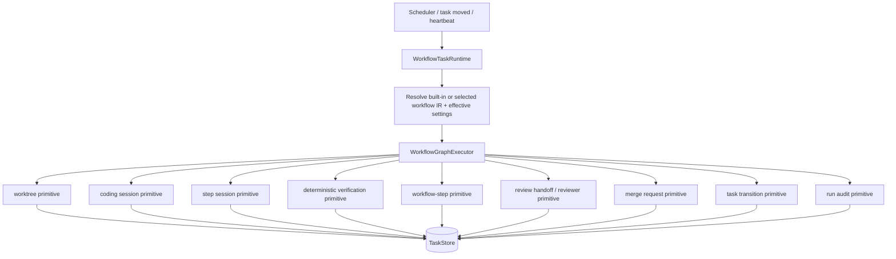

# refactor: Workflow engine subsumes execution

## Summary

Replace the execution engine's current orchestration with the workflow engine as the only execution engine. Planning, implementation, verification, review, merge, recovery routing, and custom nodes should all be driven from Workflow IR. The old engine is fully subsumed: existing executor, reviewer, merger, and step-session code becomes mechanics behind workflow nodes, while the built-in workflows encode the current engine logic so default behavior remains equivalent.

---

## Problem Frame

The workflow stack is no longer only a scaffold: `WorkflowGraphTaskRunner`, `WorkflowGraphExecutor`, foreach step inversion, PR nodes, workflow-defined columns, workflow settings, and built-in coding workflows already exist. The hard part now is that `TaskExecutor.execute()` still owns most lifecycle policy and the graph path re-enters it through `runImplementationPhase()` and completion interceptors. That makes the system hard to understand because there are two orchestration models: the graph says it owns sequencing, but `execute()` still owns setup, verification, workflow steps, review handoff, retry behavior, and many recovery side effects.

The cutover should simplify by making the workflow engine the only coordinator. The old engine should not remain as an alternate lifecycle path. Its useful pieces become implementation primitives: acquire a worktree, run a coding session, run a deterministic command, run a workflow-step prompt/script, review a step, transition a task, request a merge, abort active work, and emit audit records. The compatibility contract moves into built-in workflows that match the existing engine's control flow.

---

## Requirements

- R1. Every executable task runs through one workflow-engine entry point, not through `TaskExecutor.execute()` plus graph re-entry or an alternate legacy lifecycle.
- R2. Workflow IR is the source of lifecycle sequencing for built-in coding, stepwise coding, PR review-response, and custom workflows.
- R3. Existing lifecycle invariants remain non-configurable: hard cancel on user move to `todo`, `autoMerge:false` terminal-until-human-merge, file-scope guard, squash/file-scope merge contract, worktree liveness, and pause/unpause convergence.
- R4. Existing engine mechanics are preserved as runtime primitives and dependency-injected node handlers; the rewrite does not reimplement git merge, agent sessions, reviewer semantics, or task-store transition rules.
- R5. Built-in workflows match existing engine logic for default coding, step-session execution, deterministic verification, pre-merge workflow steps, review handoff, merge eligibility, and post-merge behavior.
- R6. Compatibility is provided by built-in workflow definitions and parity tests, not by keeping old engine routing available.
- R7. The runtime can fail safely: pre-side-effect graph failures can requeue during migration; post-side-effect failures park through workflow-defined failure edges or existing recovery, never by rerunning old engine orchestration.
- R8. Run state is inspectable and compact: a workflow run records current node, visited nodes, active branch/foreach instances, terminal disposition, and recovery reason without requiring readers to infer state from `execute()` internals.
- R9. Tests assert the invariant across all execution surfaces: default coding, stepwise coding, custom workflow nodes, PR workflow nodes, pause/cancel, auto-merge off, branch groups, and workflow settings/test mode.

---

## Scope Boundaries

### In Scope

- Introduce a workflow-engine runtime boundary that owns all executable task dispatch and graph execution.
- Extract executor-owned mechanics into explicit primitive modules used by workflow node handlers.
- Convert built-in lifecycle phases currently hidden inside `execute()` into graph nodes or built-in workflow regions that match current engine behavior.
- Move scheduler/dispatcher routing to the workflow runtime for executable tasks.
- Retire graph completion interceptors, graph re-entry, and any route that invokes old engine orchestration as an alternate execution path.
- Preserve existing stores, task entities, workflow IR, workflow settings, reviewer, merger, and step-session mechanisms.

### Out of Scope

- Replacing SQLite task storage or changing task identity.
- Rewriting the merger implementation.
- Rewriting agent runtimes or session protocol.
- Replacing every existing workflow-step template.
- Removing public workflow authoring surfaces.
- Changing release behavior or adding a changeset for this planning document.

---

## Key Technical Decisions

- KTD-1. Make the workflow engine the execution engine. `WorkflowTaskRuntime` should become the executable entry point for all tasks. `TaskExecutor` then shrinks into primitives or is split into smaller services; it does not remain an alternate engine.
- KTD-2. Runtime primitives are mechanics, not policy. Worktree acquisition, coding-session execution, deterministic verification, workflow-step execution, step execution, step reset, review handoff, and merge request each expose small typed functions. The graph decides when to call them.
- KTD-3. No graph re-entry into `execute()`. The current completion-interceptor pattern is the main complexity smell. The rewrite should extract the state assembly that `execute()` currently hides, then call primitives directly from node handlers.
- KTD-4. Built-in workflows are the compatibility layer. `BUILTIN_CODING_WORKFLOW_IR` and `BUILTIN_STEPWISE_CODING_WORKFLOW_IR` should encode the current engine logic that users experience today, including worktree preparation, coding/session behavior, deterministic verification, pre-merge workflow steps, review handoff, merge eligibility, and terminal failure routing.
- KTD-5. Failure handling is graph-owned. Early invalid IR or missing workflow can requeue or park before side effects while the migration is guarded. Once a graph invokes a side-effecting node, terminal failure must route through explicit edges or park in review/todo through existing transition primitives.
- KTD-6. Keep transition and merge authority in existing store/merger APIs. The runtime should call existing task transition, merge queue, and merge-request APIs so invariants remain centralized.
- KTD-7. Treat simplification as deletion after built-in workflow parity, not before. Each branch removed from `execute()` needs a matching built-in workflow node or primitive handler plus a parity test.

---

## High-Level Technical Design

The runtime should have one mental model: resolve a workflow, execute graph nodes, let handlers call primitives, persist run state, and end with a workflow disposition. Anything that reads like "if graph mode then call legacy execute and intercept completion" or "if graph fails then run the old engine" should disappear by the end of the cutover.

---

## Implementation Units

### U1. Workflow Engine Dispatch Ownership

- **Goal:** Introduce `WorkflowTaskRuntime` as the single executable-task entry point for all tasks.
- **Requirements:** R1, R2, R7, R8.
- **Dependencies:** None.
- **Files:** `packages/engine/src/workflow-task-runtime.ts` (new), `packages/engine/src/executor.ts`, `packages/engine/src/scheduler.ts`, `packages/engine/src/runtimes/in-process-runtime.ts`, `packages/engine/src/__tests__/workflow-task-runtime.test.ts`, `packages/engine/src/__tests__/scheduler-node-routing.test.ts`.
- **Approach:** Move dispatch logic into a runtime class that receives store, settings resolver, workflow resolver, node handler registry, run-state persistence, and audit sinks. A task with no explicit workflow resolves to the built-in default workflow. `TaskExecutor.execute()` should become a temporary adapter that delegates to this runtime, then disappear as the dispatch owner.
- **Patterns to follow:** `WorkflowGraphTaskRunner` for dependency injection, `workflow-ir-resolver.ts` for safe workflow resolution, `mergeEffectiveSettings` usage in `executor.ts`.
- **Test scenarios:** explicit workflow routes through runtime; null workflow resolves to built-in coding workflow; missing/corrupt selected workflow resolves to a typed pre-side-effect failure or safe built-in workflow according to resolver policy; duplicate dispatch claims one runtime run; runtime emits start/terminal events; workflow settings/test mode are passed to node handlers.
- **Verification:** Targeted runtime and scheduler tests prove the workflow engine is the only execution owner for executable tasks.

### U2. Execution Primitive Interfaces

- **Goal:** Define the small primitive surface graph node handlers can call without re-entering `execute()`.
- **Requirements:** R3, R4, R8.
- **Dependencies:** U1.
- **Files:** `packages/engine/src/runtime-primitives.ts` (new), `packages/engine/src/executor.ts`, `packages/engine/src/step-runner.ts`, `packages/engine/src/workflow-node-handlers.ts`, `packages/engine/src/__tests__/runtime-primitives.test.ts`, `packages/engine/src/__tests__/executor-worktree.test.ts`, `packages/engine/src/__tests__/step-runner.test.ts`.
- **Approach:** Introduce interfaces for `prepareTaskRun`, `runCodingSession`, `runSingleStep`, `resetStep`, `runDeterministicVerification`, `runWorkflowStep`, `handoffToReview`, `requestMerge`, `abortTaskRun`, and `captureModifiedFiles`. Initially adapt existing `TaskExecutor` methods to these interfaces, but do not let primitives call the full `execute()` lifecycle.
- **Execution note:** Characterization-first. Pin current behavior for worktree acquisition, base SHA capture, liveness gates, contamination checks, setup script handling, token usage persistence, and abort cleanup before extracting code.
- **Patterns to follow:** `step-runner.ts` DI style, `WorkflowGraphTaskRunnerDeps`, `ProjectEngine.requestInterpreterMerge`.
- **Test scenarios:** each primitive delegates to the current mechanism; primitive errors carry typed reasons; abort signal cancels configured commands and sessions; worktree primitive refuses repo-root or outside-worktrees paths; capture-modified-files produces the same output as the existing executor path.
- **Verification:** Primitive tests pass with fakes and at least one real-git worktree characterization where existing tests already use real git.

### U3. Built-In Workflow Engine Parity Map

- **Goal:** Map existing engine logic into built-in workflows before deleting old orchestration.
- **Requirements:** R2, R5, R6.
- **Dependencies:** U2.
- **Files:** `packages/core/src/builtin-coding-workflow-ir.ts`, `packages/core/src/builtin-stepwise-coding-workflow-ir.ts`, `packages/core/src/workflow-ir-types.ts`, `packages/core/src/workflow-ir.ts`, `packages/core/src/__tests__/builtin-coding-workflow-ir.test.ts`, `packages/core/src/__tests__/builtin-workflows.test.ts`, `packages/engine/src/__tests__/workflow-graph-executor-parity.test.ts`.
- **Approach:** Add built-in node kinds or typed prompt/script configs for every default engine phase: dependency gate, stale-spec gate, worktree preparation, setup script, base SHA capture, liveness/contamination checks, step parsing, coding session, deterministic verification with fix attempts, pre-merge workflow steps, review handoff, merge/manual-required handling, post-merge steps, and terminal failure routing. Keep custom authoring readable by using explicit node kinds where behavior is engine-owned and non-arbitrary.
- **Patterns to follow:** existing `parse-steps`, `foreach`, `step-review`, `code`, PR node validation, and `BUILTIN_STEPWISE_CODING_WORKFLOW_IR`.
- **Test scenarios:** built-in default workflow validates; a generated phase map covers each current `execute()` lifecycle branch; fast mode bypasses pre-merge gates but not post-merge behavior; deterministic verification failure routes to fix/revision behavior; workflow-step advisory failure continues; gate failure routes to remediation; no enabled workflow steps no-ops; stepwise workflow still validates with parse/foreach/review.
- **Verification:** Core IR tests plus engine graph parity tests show the built-in workflows match existing engine behavior for the default path before old orchestration is removed.

### U4. Node Handlers For Executor-Owned Phases

- **Goal:** Implement runtime node handlers that call primitives directly for prepare, coding, deterministic verification, workflow steps, review handoff, merge, and failure parking.
- **Requirements:** R3, R4, R5, R7.
- **Dependencies:** U2, U3.
- **Files:** `packages/engine/src/workflow-node-handlers.ts`, `packages/engine/src/workflow-task-runtime.ts`, `packages/engine/src/workflow-graph-executor.ts`, `packages/engine/src/__tests__/workflow-node-handlers.test.ts`, `packages/engine/src/__tests__/workflow-graph-task-runner.test.ts`, `packages/engine/src/__tests__/executor-user-cancel.test.ts`, `packages/engine/src/__tests__/workflow-step-integration-cwd.test.ts`.
- **Approach:** Replace seam handlers that call `runImplementationPhase()` with handlers that call the U2 primitives. Remove `WorkflowLegacySeams` as a production concept once built-in workflows use primitive handlers. Node results should carry outcome values such as `implementation-complete`, `verification-failed`, `revision-requested`, `manual-merge-required`, and `merge-timeout`.
- **Patterns to follow:** `createPromptLikeHandler`, `createStepReviewHandler`, `createPrNodeHandlers`, and `ProjectEngine.requestInterpreterMerge`.
- **Test scenarios:** coding node success flows to verification; deterministic verification failure routes to fix/revision edge; user pause aborts and parks according to existing contract; `autoMerge:false` merge node returns manual-required without forcing merge; merge timeout fails cleanly; post-side-effect handler throw does not invoke legacy fallback.
- **Verification:** Handler tests cover success, failure, pause, cancel, and manual-merge paths with fake primitives.

### U5. Workflow Run State And Observability

- **Goal:** Make runtime state inspectable enough that recovery and debugging no longer depend on reading `execute()` control flow.
- **Requirements:** R7, R8, R9.
- **Dependencies:** U1, U4.
- **Files:** `packages/core/src/store.ts`, `packages/core/src/types.ts`, `packages/engine/src/workflow-task-runtime.ts`, `packages/engine/src/workflow-parity-observer.ts`, `packages/engine/src/__tests__/workflow-graph-fanout.test.ts`, `packages/engine/src/__tests__/workflow-graph-foreach.test.ts`, `packages/engine/src/__tests__/run-audit-agent-session/executor-emit.test.ts`.
- **Approach:** Consolidate branch run rows, step instance rows, and top-level graph disposition under one workflow-run record keyed by task id and run id. Preserve existing branch and foreach persistence APIs where possible, but add top-level current node, terminal reason, side-effect-started marker, and recovery action.
- **Patterns to follow:** `workflow_run_branches`, `workflow_run_step_instances`, `WorkflowGraphTaskRunner` event emission, run audit event shapes.
- **Test scenarios:** crash before side effects is recoverable as retry/requeue; crash after coding node resumes or parks without rerunning old engine logic; stale run rows prune correctly; dashboard progress can read branch/foreach/top-level state; audit includes runtime node id and primitive name.
- **Verification:** Persistence tests prove no duplicate row accumulation and no lost terminal disposition.

### U6. Scheduler And Recovery Cutover

- **Goal:** Route scheduler, task-moved, heartbeat resume, pause/unpause, and self-healing triggers through the workflow runtime.
- **Requirements:** R1, R3, R7, R9.
- **Dependencies:** U5.
- **Files:** `packages/engine/src/scheduler.ts`, `packages/engine/src/executor.ts`, `packages/engine/src/project-engine.ts`, `packages/engine/src/self-healing-manager.ts` or adjacent recovery modules, `packages/engine/src/__tests__/executor-abort-all-in-flight.test.ts`, `packages/engine/src/__tests__/executor-pause.test.ts`, `packages/engine/src/__tests__/reliability-interactions/engine-stop-aborts-execution.test.ts`, `packages/engine/src/__tests__/reliability-interactions/in-review-automerge-off.test.ts`, `packages/engine/src/__tests__/reliability-interactions/workflow-interpreter-dual-observe.test.ts`.
- **Approach:** Make runtime run claims the authority for "currently executing". Existing `executingTaskLock`, active session registries, configured command controllers, and heartbeat gates should move behind runtime primitives or runtime ownership checks. Recovery sweeps should inspect workflow-run state before mutating active tasks.
- **Execution note:** Characterization-first for cancel/pause and auto-merge-off interactions.
- **Patterns to follow:** `executingTaskLock`, `maybeExecuteWorkflowGraph` duplicate guard, `ProjectEngine.requestInterpreterMerge`, reliability-interactions suites.
- **Test scenarios:** move `in-progress -> todo` aborts active runtime sessions and commands; engine stop aborts runtime-owned work; heartbeat deferral uses effective column agent; self-healing does not re-enqueue `autoMerge:false` tasks; graph failed tasks park once and do not oscillate; branch-group member integration remains allowed under its scoped exception.
- **Verification:** Reliability interaction tests pass for the workflow-engine path, with old-engine characterization retained only as test evidence until deletion.

### U7. Old Engine Subsumption And Deletion Pass

- **Goal:** Remove duplicated lifecycle orchestration after built-in workflow parity is proven.
- **Requirements:** R1, R6, R7, R9.
- **Dependencies:** U3, U4, U5, U6.
- **Files:** `packages/engine/src/executor.ts`, `packages/engine/src/workflow-graph-task-runner.ts`, `packages/engine/src/workflow-task-runtime.ts`, `packages/engine/src/__tests__/executor-core.test.ts`, `packages/engine/src/__tests__/workflow-graph-entry.test.ts` if present, `packages/engine/src/__tests__/stepwise-workflow-parity.test.ts`.
- **Approach:** Delete `graphCompletionInterceptors`, `graphRouting`, `graphStepRunOnce`, `runImplementationPhase()`, `maybeExecuteWorkflowGraph()`, and seam code that exists only to re-enter `execute()`. Remove or rename `TaskExecutor` once callers have moved to the workflow engine facade; any remaining code under that name must be primitive mechanics, not lifecycle orchestration.
- **Patterns to follow:** Existing parity tests, `compareWorkflowRunObservations`, `workflow-parity-observer.ts`.
- **Test scenarios:** default workflow run produces the same terminal column/status/token usage/modified files as old-engine characterization; stepwise run still passes parity; duplicate execute calls no-op under runtime claim; no test needs completion interceptors.
- **Verification:** A search for `graphCompletionInterceptors`, `runImplementationPhase`, `maybeExecuteWorkflowGraph`, and production `WorkflowLegacySeams` wiring returns no production call sites.

### U8. Documentation And Migration Notes

- **Goal:** Update docs so engineers can understand the new model without reading legacy executor branches.
- **Requirements:** R2, R8.
- **Dependencies:** U7.
- **Files:** `docs/architecture.md`, `docs/workflow-steps.md`, `docs/agents.md`, `CONCEPTS.md`, `packages/engine/src/__tests__/workflow-settings-fallback-alignment.test.ts`.
- **Approach:** Document the workflow engine runtime, runtime primitive boundary, node handler ownership, failure routing, and the fact that built-in workflows now carry the existing engine logic. Update Concepts with "Workflow engine runtime" and "Runtime primitive".
- **Test scenarios:** docs inventory tests, if any, still pass; workflow docs describe built-in lifecycle nodes and no longer call the interpreter flagged-off scaffold.
- **Verification:** Documentation matches code-level names and no longer describes graph execution as experimental no-op once the cutover flag graduates.

---

## System-Wide Impact

This refactor touches the highest-risk part of Fusion: task execution, git worktrees, review, merge, recovery, and agent identity. The main simplification benefit is also the main migration risk. After cutover, readers should be able to understand lifecycle sequencing by reading built-in workflow IR plus node handlers. There should be no competing old engine lifecycle to inspect.

Stakeholders affected:

- Developers get a smaller execution model and clearer ownership boundaries.
- Users get workflow-driven execution as the default behavior, including custom workflows that can replace the built-in lifecycle.
- Operations and support get workflow-run records that explain where a task is stuck.
- Plugin authors get a clearer distinction between authorable workflow nodes and engine-owned primitives.

---

## Risks & Dependencies

- `TaskExecutor.execute()` is large and stateful. Mitigation: extract primitives characterization-first and delete orchestration only after parity tests cover each removed branch.
- Workflow IR may become too engine-specific. Mitigation: use explicit built-in node kinds only for engine-owned lifecycle primitives and keep arbitrary user logic in prompt/script/code nodes; built-in workflows can be detailed without forcing every custom workflow to expose every engine phase.
- Recovery may race runtime-owned work. Mitigation: U5 top-level run state and U6 recovery cutover must land before deleting legacy guards.
- Auto-merge and manual merge semantics are easy to regress. Mitigation: keep `ProjectEngine.requestInterpreterMerge()` and merge queue authority; test `autoMerge:false`, branch groups, and manual-required states on the runtime path.
- Pre-side-effect recovery can hide resolver bugs if it silently chooses a default. Mitigation: make the resolver policy explicit, audit every substitution, and forbid invoking old engine orchestration as a recovery path.

---

## Acceptance Examples

- AE1. Given a task with no explicit workflow selection, when the scheduler dispatches it, then the workflow engine resolves the built-in coding workflow and executes the same lifecycle the old engine used to execute.
- AE2. Given `autoMerge:false`, when the merge node runs, then the task remains `in-review` or manual-required without being moved backward or force-merged.
- AE3. Given a user moves an active task from `in-progress` to `todo`, when runtime-owned coding or script work is active, then all sessions/subprocesses abort and the task parks with user-paused semantics.
- AE4. Given a workflow node throws before any side effects, when migration handling runs, then the task requeues or parks through workflow-runtime policy without invoking the old engine as an alternate lifecycle.
- AE5. Given a workflow node throws after the coding primitive started, when the runtime handles failure, then it routes or parks through workflow failure handling and never reruns old engine logic over the same work.

---

## Sources & Research

- `docs/plans/2026-06-03-002-feat-workflow-interpreter-cutover-plan.md` established the earlier thin-interpreter path and is superseded by this runtime rewrite direction.
- `docs/plans/2026-06-04-001-feat-step-inversion-workflow-modelable-steps-plan.md` documents the current foreach, step-review, parse-steps, and code-node direction.
- `docs/workflow-steps.md` describes Workflow IR v1/v2, graph executor gating, step inversion, and current workflow-step behavior.
- `CONCEPTS.md` defines Task, In-review, Merge queue, Manual-required, Self-healing sweep, Workflow-defined columns, Default workflow, and Step instance terminology.
- `packages/engine/src/executor.ts` currently owns graph routing, completion interceptors, implementation phase re-entry, workflow steps, review handoff, and many recovery paths.
- `packages/engine/src/workflow-graph-task-runner.ts`, `packages/engine/src/workflow-graph-executor.ts`, `packages/engine/src/workflow-node-handlers.ts`, and `packages/engine/src/workflow-graph-foreach.ts` are the existing workflow-runtime foundation.
- `packages/core/src/builtin-coding-workflow-ir.ts` and `packages/core/src/builtin-stepwise-coding-workflow-ir.ts` are the built-in workflow parity anchors.
