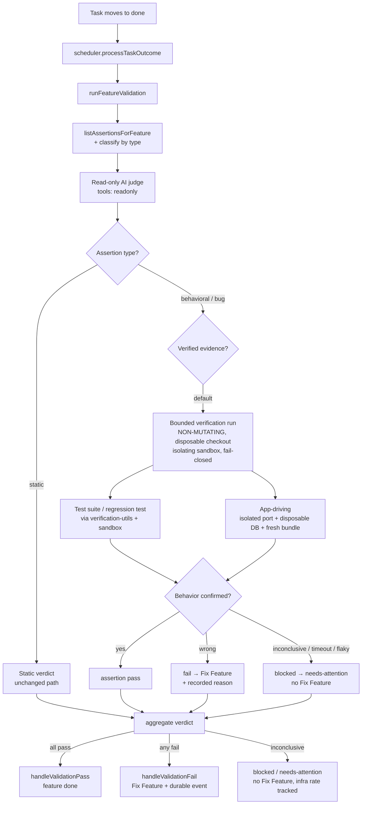

# feat: Behavioral verification in the Validator

## Summary

Make the Validator Run's "done" verdict reflect observed behavior instead of the diff's apparent intent. Behavioral and bug-fix Contract Assertions default to fail unless a bounded, non-mutating verification run confirms them by exercising the code — running the test suite / an agent-supplied regression test, and driving the running app for UI/bug assertions. Non-behavioral assertions keep today's static judging.

## Problem Frame

The Validator Run (`MissionExecutionLoop.runFeatureValidation` → `runValidation` in `packages/engine/src/mission-execution-loop.ts`) is a read-only AI judge: it opens a pi session with `tools: "readonly"`, reads the task context (title, description, last ~10 log action strings via `buildTaskContext`), and asks the model to grade each assertion as pass/fail/blocked. It never runs the code.

That is structurally weak for behavioral correctness. A bug-fix Feature was marked done after the judge accepted a diff that *looked* like a fix; the bug was still live in the running app. The judge graded intent; reality was never consulted, even though behavioral truth existed (it was caught and captured by hand). A gate that rubber-stamps means every "done" inherits a manual re-check tax, which defeats the gate.

Two hard facts from research shape the work:

- **The read-only invariant is enforced at the tool layer, not by convention.** `packages/engine/src/workflow-step-tool-policy.ts` denies `bash`/`edit`/`write` and task-mutation tools in readonly sessions; `packages/engine/src/pi.ts` strips host extensions for a "hermetically sealed" readonly session. The judge therefore *cannot run anything* today. Recovery sweeps and the validator reaper also rely on validation being side-effect-free (see origin and `docs/solutions/logic-errors/mission-autopilot-stalled-by-stranded-done-feature.md`).
- **App/browser driving does not exist yet.** `plugins/fusion-plugin-agent-browser/` is a metadata/probe stub (no Playwright/CDP); there is no computer-use or demo-reel. Test-suite execution, by contrast, already exists and is reusable (`packages/engine/src/verification-utils.ts` + `packages/engine/src/sandbox/`).

---

## Requirements

### Judging posture (origin R1–R3, R8–R10)

- R1. For behavioral and bug-fix assertions, the validator defaults to a fail verdict unless backed by verified behavioral evidence (origin R1).
- R2. Each Contract Assertion is classified behavioral/bug vs non-behavioral; the strict posture applies only to the former (origin R2).
- R3. Non-behavioral assertions retain existing static judging — no added cost or strictness where inspection suffices (origin R3).
- R4. A behavioral/bug assertion passes only when verification evidence corroborates it; an agent's narrative claim is not sufficient evidence on its own (origin R8).
- R5. When an agent supplies executable proof (a regression test), the validator confirms the proof is genuine — it fails on the pre-fix state and passes now — rather than accepting its presence at face value (origin R9).
- R6. A non-passing verdict records why it failed (which assertion, observed vs expected behavior) in a form the generated Fix Feature can act on (origin R10).

### Behavioral verification capability (origin R4–R7)

- R7. The gate can invoke a bounded verification run that exercises the implemented code to confirm a behavioral/bug assertion's observable outcome before passing it (origin R4).
- R8. For bug-fix assertions, verification confirms the reported defect is no longer reproducible — not merely that a plausible change was made (origin R5).
- R9. The verification run is bounded in time and cost; a run that cannot complete or conclude resolves to a non-passing verdict (fail/blocked/error), never a default pass (origin R6).
- R10. The verification run is non-mutating to mission/board state: it creates no board task, mutates no mission/board row, and edits no version-controlled source (origin R7).
- R11. (plan-level) Verification exercises the Feature's implemented code at a trusted revision in a disposable checkout (not the live task worktree — which is pruned before the done-transition that triggers validation — and not the repo root).
- R17. (plan-level) Filesystem isolation is a named invariant distinct from R10: verification executes against a disposable copy, and the source tree that feeds diff/merge is byte-identical (git-clean) after a run. Build artifacts, `node_modules`, coverage, and scratch DBs land only in the disposable surface.

### App-driving capability

- R12. A real app/browser-driving capability exists and is reachable from the verification run, sufficient to reproduce a UI/bug assertion's observable behavior against a running instance of the app.
- R13. App-driving runs against an isolated surface: never binds the reserved dashboard port, never dispatches on the shared central DB, and exercises a freshly-built bundle so verification cannot produce its own false verdicts. The disposable DB is created fresh/empty (never a copy of the central DB), lives under a run-unique tmpdir, is torn down unconditionally including on crash/timeout, and excludes credentials and agent logs.

### Safety and observability

- R14. The non-mutating execution path does not grant the judge `edit`/`write`/`bash` or task-mutation tools; the read-only verdict boundary is preserved and test-enforced.
- R15. Every site that re-drives validation (recovery sweep, validator reaper) remains correct once verification has side effects — i.e., verification's effects are confined to an isolated, disposable surface and leave no mission/board residue.
- R16. Verification-run failures and the resulting Fix-Feature triage are durably observable (persisted mission/audit events), not logged-and-continued.
- R18. (plan-level) Verification executes under an isolating sandbox backend (bubblewrap on Linux, sandbox-exec on macOS) with an explicit deny policy; if no isolating backend is available the verification run fails closed rather than falling through to the unrestricted native backend. The child process environment is scrubbed to a minimal allowlist (no API keys, auth tokens, or DB credentials inherited).
- R19. (plan-level) The verification command is constructed from a fixed system-owned template; agent-supplied proof contributes only a validated test-file path (within the disposable checkout, no shell metacharacters), never a free-form command string.
- R20. (plan-level) Verification verdicts are reproducible: a flaky/non-deterministic result resolves to inconclusive rather than fail, an authoritative fail requires N-run agreement, and no verdict feeds the deferred self-tightening gate (Approach C) unless it is reproducible.
- R21. (plan-level) "Behavior observed wrong" and "verification could not run" are distinct verdicts. A genuine behavioral failure spawns a Fix Feature; an infra-driven inconclusive (driver unavailable, timeout, isolation setup failure) routes to a blocked/needs-attention state that does not spawn remediation work, and the infra-failure rate is tracked separately.
- R22. (plan-level) Fix-Feature generation is idempotent across re-drives: creation is deduped on (source feature, originating run), and a re-drive reuses an existing verdict for the current implementation revision rather than minting a fresh failing run.

---

## Key Technical Decisions

- **Assertion classification via an explicit `type` field, not judge inference.** `MissionContractAssertion` (`packages/core/src/mission-types.ts`) carries no type metadata today. Add a typed field (e.g. `behavioral` | `static`, defaulting conservatively) persisted on `mission_contract_assertions`, populated when assertions are authored/seeded (`addContractAssertion`, `seedContractAssertionsForFeatures`, `ensureFeatureAssertion`). Rationale: a stored, upstream-authored type is reproducible and auditable; run-time judge inference reintroduces the same leniency we're trying to remove. Requires a schema-version bump and the repo-wide Schema-Version Sweep (per CONCEPTS.md).
- **Terminology.** A single named concept runs through the plan: the **verification run** is one bounded execution that confirms a behavioral/bug assertion; the **verification capability** is the injected dependency that performs it; the **verification step** is its position in the validation flow (between the read-only judge's behavioral verdict and the aggregate). These three terms are used consistently; there is no separate "verification path."
- **Two-step validation: read-only verdict, then isolated verification — never one session with execute rights.** Keep the AI judge session `tools: "readonly"`. Introduce a *separate* non-mutating verification run that executes code through `verification-utils.runVerificationCommand` + the sandbox backend, and (for UI assertions) the app-driver. This preserves R14 and the recovery/reaper safety assumption: the judge stays side-effect-free; only the bounded verification run touches a disposable surface. Rationale: flipping the judge session to allow `bash` would blow the hermetic boundary and every readonly guarantee with it.
- **Mandatory isolating sandbox backend; fail closed.** `resolveSandboxBackend()` with no argument falls through to `NativeSandboxBackend`, which advertises no filesystem or network policy and inherits full `process.env` — unacceptable for executing agent-authored code. The verification run must select an isolating backend explicitly (bubblewrap / sandbox-exec) with a deny policy, scrub the environment to a minimal allowlist, and fail closed (resolve to a non-pass) when no isolating backend is available rather than running unsandboxed (R18). This is the structural enforcement behind R10/R17 — the non-mutating guarantee is a boundary, not a convention the verification code is trusted to honor.
- **Verification runs against a disposable checkout at a trusted revision, not the live worktree.** The task worktree is removed by the merger *before* the task moves to `done`, and the done-transition is what triggers validation — so the live worktree is gone by the time verification runs. Verification materializes a disposable checkout at a trusted revision (the integration SHA), keeping the source tree that feeds diff/merge byte-clean (R11, R17). For agent-supplied regression proof, the pre-fix baseline is a *second* disposable checkout at `git merge-base` of the feature branch and the base branch — a revision the agent does not control — so a test that passes on both pre and post is genuinely exercising the defect (R5, AE5).
- **Fixed command template; agent supplies only a validated test path.** `runVerificationCommand` runs a shell command string. To prevent the implementing agent from gaming or escaping its own verification, the command is built from a system-owned template (e.g. the project's scoped test invocation) into which only a validated test-file path is substituted (within the disposable checkout, rejected if it contains shell metacharacters) — never a free-form agent-supplied command (R19).
- **Inconclusive is a first-class verdict, distinct from fail.** Verification yields pass / fail / **inconclusive**. Real behavioral failure → Fix Feature; inconclusive (driver unavailable, timeout, isolation setup failure, detected flakiness) → blocked/needs-attention, *no* Fix Feature, with infra-failure rate tracked. This keeps a brand-new, fragile app-driver from manufacturing Fix-Feature churn that depresses task completion, and gives the determinism contract (R20) somewhere to route flaky results.
- **Verification wall-clock is bounded under the reaper window.** `reapStaleMissionValidatorRuns` resolves a stale run to `lastValidatorStatus: "error"`, which `computeSliceStatus` never accepts as complete — so a slow verification reaped mid-run, combined with default-to-fail re-drive, livelocks the slice. The aggregate verification budget (build + suite + driving, including the pre-fix baseline run) must be provably shorter than the reaper stale window, or the reaper must distinguish an owned-but-slow run from an abandoned one. Owned by U7.
- **Reuse `verification-utils` + sandbox for test execution; do not invent a runner.** `runVerificationCommand` already provides timeout (`VERIFICATION_COMMAND_TIMEOUT_MS`), buffer caps, abort-signal/process-group kill, output summarization, and sandbox dispatch. The verification run wires into it rather than spawning processes directly.
- **Express verification as a runtime-style capability injected into the loop, not a hidden branch.** Per `docs/solutions/architecture-patterns/workflow-native-runtime-primitives.md`, side-effecting work belongs behind an explicit injected boundary. Model the verification capability as an injected dependency on `MissionExecutionLoop` so it is testable and swappable (real vs mock), mirroring how `createFnAgent` is injected.
- **App-driving is a net-new driver, not "wiring up a stub" — split it.** `plugins/fusion-plugin-agent-browser/` today is a metadata/probe stub: its only tool validates a URL allowlist and `probe.ts` shells `agent-browser --version` to detect an external binary; there is no Playwright/CDP and no in-process automation (`src/tools.ts`, `src/probe.ts`). Standing up real navigate/interact/observe driving plus an isolated-app-launch harness (fresh bundle, disposable DB, reserved-port avoidance, deterministic teardown) is two substantial subsystems. Split into U4 (isolation/launch harness with its safety contracts test-characterized first) and U8 (the actual driver), with U5 depending on U8. Name the driving technology at implementation time. The driver lives inside the existing agent-browser plugin boundary; its tools must be scoped to verification, not exposed to coding-agent sessions.
- **Default-to-fail is scoped, not global.** Only assertions typed behavioral/bug take the default-fail posture; static assertions are untouched (R3). This bounds the blast radius on slice completion — but see Risks & Dependencies below, since `lastValidatorStatus` gates `computeSliceStatus`.

---

## High-Level Technical Design

The judge box (E) keeps `tools: "readonly"`. The verification box (I) is the only new side-effecting surface, isolated and disposable, invoked between the judge's behavioral verdict and the aggregate.

---

## Implementation Units

### U1. Assertion type data model

- **Goal:** Give Contract Assertions a persisted classification so verification can be scoped to behavioral/bug assertions.
- **Requirements:** R2, R3
- **Dependencies:** none
- **Files:**
  - `packages/core/src/mission-types.ts` (add `type` to `MissionContractAssertion`, `ContractAssertionCreateInput`/`UpdateInput`; add the type union + const array alongside `MISSION_ASSERTION_STATUSES`)
  - `packages/core/src/db.ts` (add column to `mission_contract_assertions`; migration; schema-version bump)
  - `packages/core/src/mission-store.ts` (`addContractAssertion`, `seedContractAssertionsForFeatures`, `ensureFeatureAssertion`, `backfillFeatureAssertions` populate/default the field)
  - `packages/core/src/__tests__/` (new store + migration tests)
  - Schema-Version Sweep targets (non-core readers of the version constant, in addition to any in-core asserts): `packages/plugin-sdk/src/index.ts`, `packages/cli/src/plugin-sdk-core-runtime-shim.ts`, `packages/dashboard/src/routes/register-workflow-routes.ts`, and plugins re-exporting the constant (e.g. `plugins/fusion-plugin-roadmap/`). Prefer asserting against the exported constant over a literal so future bumps drop these from the sweep.
- **Approach:** Conservative default for existing rows (treat unknown as the type that preserves current behavior unless the assertion clearly reads behavioral). Same validating-store-authority pattern used elsewhere. Run the Schema-Version Sweep in the same commit as the bump.
- **Patterns to follow:** existing `MISSION_ASSERTION_STATUSES` const + validation; the Moved Settings Keys / schema-version sweep discipline in CONCEPTS.md.
- **Test scenarios:**
  - Creating an assertion with an explicit type persists and reloads it.
  - Creating without a type yields the conservative default.
  - Seeding/lazy-link (`ensureFeatureAssertion`) sets a type.
  - Migration upgrades an old DB: existing assertion rows get the default type, no row rewritten beyond the new column.
  - Schema-version assertion sweep: version constant readers still pass.
- **Verification:** core typecheck + new store/migration tests green; `pnpm test:gate` unaffected.

### U2. Classification + default-to-fail posture in the verdict path

- **Goal:** Make the judge default behavioral/bug assertions to fail unless verified, while leaving static assertions on the existing path.
- **Requirements:** R1, R2, R3, R4
- **Dependencies:** U1
- **Files:**
  - `packages/engine/src/mission-execution-loop.ts` (`runValidation`, `parseValidationResult`, `extractAssertionResults`; branch per assertion type)
  - validation prompt builders (`buildValidationSystemPrompt`, `buildValidationPrompt`) — adversarial framing for behavioral assertions: "not met until proven" + ask for the proof location
  - `packages/engine/src/__tests__/reliability-interactions/` (new test alongside existing mission-validator tests)
- **Approach:** After the read-only judge returns, partition assertions by type. Static assertions keep the current verdict. Behavioral/bug assertions are forced to non-pass *unless* U3's verification confirms them — i.e. the judge's "pass" on a behavioral assertion is advisory, not authoritative. Keep the judge session `tools: "readonly"` (no change to its tool policy).
- **Patterns to follow:** existing `extractAssertionResults` per-assertion mapping; `isTestModeActive`/mock provider for deterministic tests.
- **Test scenarios:**
  - Behavioral assertion with no verification evidence → fail, even if the judge text claims pass (origin AE2).
  - Static assertion (e.g. "documented in README") → static verdict, no verification invoked (origin AE3).
  - Mixed assertion set → static and behavioral each take their correct path; aggregate reflects both.
  - `Covers AE2.` narrative-only claim defaults to fail.
  - `Covers AE3.` non-behavioral inspected statically.
- **Verification:** engine typecheck; new reliability test green; existing mission-validator tests still pass.

### U3. Non-mutating verification step (test execution)

- **Goal:** Add a bounded, non-mutating verification run that confirms a behavioral/bug assertion by running the suite / an agent-supplied regression test against a disposable checkout of the implemented code.
- **Requirements:** R5, R7, R8, R9, R10, R11, R14, R17, R18, R19
- **Dependencies:** U1, U2
- **Files:**
  - `packages/engine/src/mission-verification.ts` (new — the injected verification capability; wraps `verification-utils.runVerificationCommand`)
  - `packages/engine/src/mission-execution-loop.ts` (inject + invoke between behavioral verdict and aggregate; materialize the disposable checkout)
  - `packages/engine/src/verification-utils.ts` (reuse; extend only if a non-mutating mode flag is needed)
  - `packages/engine/src/sandbox/index.ts` (verification must request an isolating backend explicitly, never the no-arg native fallback)
  - `packages/engine/src/workflow-step-tool-policy.ts` (only if a narrowly-allowlisted verification path is required; add a test that it grants no edit/write/task-mutation)
  - `packages/engine/src/__tests__/` and `reliability-interactions/`
- **Approach:** Materialize a disposable checkout at a trusted revision (the integration SHA) — the live task worktree is pruned before the done-transition that triggers validation, so it cannot be relied on (R11). Execute through an explicitly-selected isolating sandbox backend (bubblewrap/sandbox-exec) with a deny policy and a scrubbed env allowlist; fail closed to a non-pass if no isolating backend is available (R18). Build the command from a system-owned template, substituting only a validated test-file path from agent-supplied proof (R19). For agent-supplied proof, confirm the regression test fails on a *second* disposable checkout at `git merge-base` (feature branch vs base branch — not agent-controlled) and passes on the implementation (R5); a test that passes on both is rejected (origin AE5). After the run, assert the source tree that feeds diff/merge is git-clean (R17). Inconclusive/timeout → non-pass (R9). The run performs no board/mission writes (R10).
- **Execution note:** Start with a failing test asserting the isolation contract — source tree git-clean after a run, no board/mission mutation, no edit/write/bash granted, isolating backend required — before wiring real execution.
- **Patterns to follow:** `executor.ts`/`merger.ts` use of `runVerificationCommand`; `bubblewrap-policy.ts` env filtering; injection pattern of `createFnAgent`.
- **Open question (deferred to implementation):** exact per-assertion command derivation (how the verification run determines *which* invocation exercises a given assertion), and whether `runVerificationCommand`'s `store.logEntry`/`appendAgentLog` writes count against the R10 non-mutating invariant — see Open Questions.
- **Test scenarios:**
  - `Covers AE1.` bug-fix assertion where the bug still reproduces under verification → fail, Feature not done.
  - `Covers AE5.` agent test passing both on the merge-base checkout and the implementation → proof rejected, assertion not satisfied.
  - Bug no longer reproduces → assertion passes.
  - `Covers AE4.` verification exceeds its time/cost bound → terminated → non-pass, never default pass.
  - Verification runs against a disposable checkout at the integration SHA, not rootDir and not the (pruned) task worktree.
  - Source tree feeding diff/merge is byte-identical (git-clean) after a verification run (R17).
  - No isolating sandbox backend available → run fails closed to non-pass, never executes on the native backend (R18).
  - Command-template injection: an agent-supplied test path containing shell metacharacters is rejected before execution (R19).
  - Non-mutation: after a verification run, no new board task, no mission/board row mutated.
  - Tool-policy test: the verification path exposes no `edit`/`write`/`bash`/task-mutation tool.
- **Verification:** engine typecheck; new tests green; `pnpm test:gate` green.

### U4. Isolated-app-launch harness

- **Goal:** Stand up the isolated app surface that the driver (U8) will drive — independent of any navigation logic, so its safety contracts can be characterized and trusted first.
- **Requirements:** R13
- **Dependencies:** U3
- **Files:**
  - engine wiring to launch/tear down an isolated app instance for verification
  - `__tests__/` for the isolation contracts
- **Approach:** Launch an isolated app instance: a non-reserved port (respect `RESERVED_DASHBOARD_PORT` / `FUSION_RESERVED_PORTS` and the existing port-4040 guards), a disposable DB created fresh/empty (never a copy of the central DB) under a run-unique tmpdir, seeded only with the minimal fixtures a UI assertion needs (no credentials, no agent logs), and a freshly-built client bundle (avoid the stale `dist/client` trap). Tear down unconditionally, including on crash/timeout.
- **Execution note:** Characterize the isolation guarantees (port, DB lifecycle, bundle freshness, teardown) with tests *before* U8 does any real navigation — these are the exact traps in `docs/solutions/developer-experience/browser-testing-dashboard-from-worktree-safely.md`.
- **Patterns to follow:** the worktree port/DB isolation guidance in the learnings doc; the port-4040 guards already in the repo.
- **Test scenarios:**
  - Launch never binds the reserved dashboard port (assert against a reserved-port config).
  - The instance uses a fresh/empty disposable DB under a unique tmpdir, not the shared central DB; the DB contains no credentials or agent logs.
  - A stale bundle is rebuilt before launch (no false verdict from stale `dist/client`).
  - Teardown leaves no lingering process / bound port / DB file, including after a simulated crash or timeout.
- **Verification:** engine typecheck; new tests green.

### U8. App/browser driver

- **Goal:** Provide the real navigate/interact/observe driver so UI/bug assertions can be reproduced against the isolated instance from U4.
- **Requirements:** R12
- **Dependencies:** U4
- **Files:**
  - `plugins/fusion-plugin-agent-browser/src/tools.ts`, `plugins/fusion-plugin-agent-browser/src/probe.ts`, plugin entry — replace the metadata/probe stub with a real driver
  - plugin `__tests__/`
- **Approach:** Build a real driver (name the automation technology — e.g. Playwright/CDP — at implementation time; the current package has no automation dependency) inside the existing agent-browser plugin boundary. Its tools are scoped to verification contexts and must not be exposed to coding-agent sessions. The driver targets the isolated instance U4 launches.
- **Patterns to follow:** `@fusion/plugin-sdk` tool registration; verification-only tool scoping.
- **Test scenarios:**
  - Driver reproduces a known UI behavior against the isolated instance and reports the observed outcome.
  - Driver tools are not reachable from a normal coding-agent session (scope test).
  - A structurally un-exercisable assertion (selector unreachable, state the driver can't set up) resolves to inconclusive, not fail (feeds R21).
- **Verification:** plugin + engine typecheck; new tests green; manual smoke driving the dashboard on a throwaway port.

### U5. Wire app-driving into UI/bug verification

- **Goal:** Route UI/bug behavioral assertions through the app driver inside the verification run.
- **Requirements:** R8, R11, R12, R20, R21
- **Dependencies:** U3, U8
- **Files:**
  - `packages/engine/src/mission-verification.ts` (dispatch to test-execution vs app-driving based on assertion shape)
  - `packages/engine/src/__tests__/`
- **Approach:** Within the verification run, choose the evidence channel: test/regression execution for code-level behavior (U3), app-driving (U8 against U4's isolated instance) for UI/bug behavior (some assertions use both). Distinguish three outcomes per the inconclusive-verdict decision: behavior observed wrong → fail; behavior confirmed → pass; driver unavailable / structurally un-exercisable / detected flaky → **inconclusive** (R21), which does not spawn a Fix Feature. Apply the determinism contract (R20): a flaky result resolves to inconclusive, and an authoritative fail requires N-run agreement.
- **Test scenarios:**
  - UI bug assertion still reproduces via the driver → fail.
  - UI bug assertion no longer reproduces → pass.
  - Driver unavailable / un-exercisable → inconclusive (never default pass, never auto-fail-into-Fix-Feature), with recorded reason.
  - Flaky result (passes then fails across N runs) → inconclusive, not fail (R20).
  - Assertion needing both channels passes only when both confirm.
- **Verification:** engine typecheck; new tests green.

### U6. Failure reasons, Fix-Feature linkage, and durable observability

- **Goal:** Carry verification failure detail into the Fix Feature, make Fix-Feature generation idempotent across re-drives, route inconclusive verdicts away from remediation, and make verification + triage failures durably observable.
- **Requirements:** R6, R16, R21, R22
- **Dependencies:** U2, U3
- **Files:**
  - `packages/engine/src/mission-execution-loop.ts` (`handleValidationFail`, `recordValidatorFailures`; include observed-vs-expected reason; route inconclusive to blocked/needs-attention rather than Fix Feature)
  - `packages/core/src/mission-store.ts` (`createGeneratedFixFeature` — dedup on (source feature, originating run); lineage already carries failed assertion IDs; thread reason text)
  - mission event/audit emission for verification failures, inconclusive/infra outcomes, and fix-triage failures
  - `__tests__/` for both packages
- **Approach:** Record per-assertion observed vs expected on `mission_validator_failures` and surface it in the generated Fix Feature. Only a real behavioral *fail* spawns a Fix Feature; an *inconclusive* verdict routes to blocked/needs-attention with the infra-failure rate tracked, never minting remediation work (R21). Make Fix-Feature creation idempotent: dedup on (sourceFeatureId, generatedFromRunId) or skip when an open Fix Feature already exists for the source, and reuse an existing verdict for the current implementation revision on re-drive rather than minting a fresh failing run (R22) — this prevents recovery/reaper re-drives from exhausting the retry budget and force-blocking a correct feature. Emit persisted mission/audit events for verification failures, inconclusive outcomes, and any swallowed triage error (per the branch-group-collision learning).
- **Test scenarios:**
  - `Covers AE1.` failed verification produces a Fix Feature carrying the recorded reason.
  - Inconclusive verdict routes to blocked/needs-attention and spawns no Fix Feature (R21).
  - Re-drive of an already-failed feature does not create a duplicate Fix Feature (R22).
  - A flaky verification across recovery re-drives does not exhaust the retry budget and force-block a correct feature.
  - Verification failure and inconclusive outcomes each emit a persisted mission/audit event (not just a log line).
  - A triage failure on the generated Fix Feature is durably recorded, not silently swallowed.
- **Verification:** engine + core typecheck; new tests green.

### U7. Recovery/reaper safety audit and docs

- **Goal:** Falsify (not merely confirm) that every site re-driving validation stays correct now that verification has side effects; close the reaper-deadlock path; update authoritative docs. The recovery/reaper safety audit is complete once the test-execution surface (U3) exists — the app-driving surface is folded in when U8 lands, not a prerequisite for the audit.
- **Requirements:** R15, R20, plus origin Dependencies/Assumptions
- **Dependencies:** U3 (extend surface-enumeration coverage to the app-driving surface when U8 lands)
- **Files:**
  - `packages/engine/src/self-healing.ts` (recovery sweep, `reapStaleMissionValidatorRuns`)
  - `packages/engine/src/mission-execution-loop.ts` (`recoverActiveMissionValidations` and its re-drive branches: validating / needs_fix / implementing+taskId / orphan)
  - `packages/core/src/mission-store.ts` (`computeSliceStatus` / reaper terminal-status interaction)
  - `docs/missions.md` (Phase 4: Validator Loop), `docs/missions-completion-contract.md`, `CONCEPTS.md` (update Validator Run / Contract Assertion entries for the new posture + non-mutating verification)
  - a `.changeset/*.md`
  - `__tests__/reliability-interactions/`
- **Approach:** Reframe the audit from confirmation to falsification. Enumerate every concrete re-drive entry point — each `recoverActiveMissionValidations` branch, `reapStaleMissionValidatorRuns`, and normal `processTaskOutcome` — in a `## Surface Enumeration`, and for each add an adversarial test asserting post-conditions (source tree git-clean, zero duplicate Fix Features, a terminal verdict reached, no `error`-state slice deadlock). These tests gate release. Close the reaper deadlock specifically: ensure verification's aggregate wall-clock is provably under the reaper stale window, or teach the reaper to distinguish an owned-but-slow run from an abandoned one so a slow-but-legitimate verification is not reaped to a permanently-non-passing `error` that `computeSliceStatus` can never accept.
- **Test scenarios:**
  - Surface enumeration: for each re-drive entry point, source tree git-clean + no duplicate Fix Features + terminal verdict reached.
  - A slow verification reaped near the time bound does not strand the slice across a subsequent recovery sweep (reaches a terminal pass/fail/inconclusive, not indefinitely re-driven `error`).
  - Recovery sweep re-drives a behavioral validation → isolated verification runs → no duplicate Fix Features, no board residue.
  - Reaper-triggered re-run is idempotent.
- **Verification:** engine typecheck; reliability tests green; docs updated; changeset present.

---

## Scope Boundaries

### Deferred for later

- The self-tightening gate (origin Approach C): caught escapes feeding back to harden the relevant assertion and seed a permanent check so the same bug class can't pass again (see origin: `docs/brainstorms/2026-06-11-validator-behavioral-verification-requirements.md`). Built on top of this work once A+B are in place.

### Outside this product's identity

- This gate targets behavioral correctness. Off-target or low-quality work that isn't a behavioral/bug defect (e.g. stylistically poor but functionally correct code) is not what this gate is sharpened to catch (carried from origin).

### Deferred to Follow-Up Work

- Coordinating with FN-5902 ("make ALL mission validation AI-run; eliminate zero-assertion auto-pass") if it lands concurrently — confirm whether its auto-pass branch changes conflict with the default-to-fail posture before merge.

---

## Open Questions

- **Per-assertion command derivation (resolve in U3 implementation).** How does the verification run determine *which* command/test invocation exercises a given behavioral assertion — a system-derived whole-suite run, a convention mapping assertion → test, or the agent declaring its regression-test location? The origin left "how an agent expresses executable proof" deferred; this is its concrete form. The fixed-template + validated-path constraint (R19) bounds the *shape* of the answer but not the derivation.
- **Do `runVerificationCommand`'s log writes count as mutation?** The reused `runVerificationCommand` calls `store.logEntry` / `appendAgentLog` against the task store. Decide whether these writes are compatible with the R10 non-mutating invariant (they touch logs, not mission/board rows) or must be suppressed/redirected for verification runs, so the U3/U7 non-mutation tests have an unambiguous target.

---

## Risks & Dependencies

- **Read-only invariant breakage (high).** Verification introduces the first side-effecting path in a subsystem whose recovery/reaper logic assumes validation is side-effect-free, and "non-mutating" must hold at the *filesystem* level, not just board state. Mitigation: a mandatory isolating sandbox backend that fails closed (R18), execution against a disposable checkout with a git-clean post-condition (R11, R17), the judge session kept readonly, and a falsification audit of every re-drive site (U7).
- **Reaper → slice deadlock (high).** A slow verification (build + suite + driving + pre-fix baseline) reaped to `lastValidatorStatus: "error"` is never accepted by `computeSliceStatus`, and default-to-fail re-drives it — a livelock. Mitigation: bound verification wall-clock under the reaper window or teach the reaper to distinguish owned-but-slow from abandoned (U7); idempotent Fix-Feature creation (R22) so re-drives don't exhaust the retry budget.
- **Verification as a new false-verdict source (high).** A flaky test or a fragile app driver can manufacture non-reproducible verdicts — the very false-pass/false-fail class this work removes — and a flaky verdict feeding the deferred Approach C would bake flakiness into irreversible state. Mitigation: determinism contract (R20 — flaky → inconclusive, N-run agreement before fail), inconclusive routed away from remediation (R21), and the isolation guarantees of R13/U4 characterized before U8 drives anything.
- **Slice-completion blast radius (medium).** `lastValidatorStatus` gates `computeSliceStatus`; default-to-fail changes which Features complete a slice and multiplies Fix Features. Mitigation: scope default-fail to behavioral/bug only (R3), distinct inconclusive verdict so infra failures don't churn remediation (R21), durable observability (U6).
- **App-driving build cost + standing maintenance (medium).** App-driving was deferred in the origin and *assumed* to already exist; research overturned that — it is a greenfield driver (U8) plus an isolated-launch harness (U4), a permanently-maintained surface placed inside the validator hot path against a small team. It is sequenced behind the test-execution path (U1–U3, U6, U7) so that value lands and is proven before the heavy build is committed; treat U4/U8/U5 as a separately greenlightable phase. Re-evaluate against realized value from test-execution verification before building it.
- **Dependency:** an isolated, freshly-built app surface must be launchable for verification (origin assumption). Schema-version bump (U1) requires the repo-wide sweep across packages and plugins.

---

## Sources & Research

- Validator Run path: `packages/engine/src/mission-execution-loop.ts` (`runFeatureValidation`, `runValidation`, `handleValidationPass/Fail/Blocked/Error`, `buildValidationPrompt`).
- Read-only enforcement: `packages/engine/src/workflow-step-tool-policy.ts` (`READONLY_ALLOWLIST`, `DENIED_IN_READONLY`, `isReadonlyAllowed`), `packages/engine/src/pi.ts` (readonly session sealing).
- Reusable execution: `packages/engine/src/verification-utils.ts` (`runVerificationCommand`, `execWithProcessGroup`, `VERIFICATION_COMMAND_TIMEOUT_MS`), `packages/engine/src/sandbox/` (`resolveSandboxBackend` — no-arg fallback is the unsafe `NativeSandboxBackend`; `bubblewrap-policy.ts` env filtering; `sandbox-exec-policy.ts` `ensureNoFusionWrites`), `packages/engine/src/run-verification-tool.ts`.
- Assertion model: `packages/core/src/mission-types.ts`, `packages/core/src/db.ts` (`mission_contract_assertions`), `packages/core/src/mission-store.ts` (`createGeneratedFixFeature`, `computeSliceStatus`, `reapStaleMissionValidatorRuns`).
- App-driving stub: `plugins/fusion-plugin-agent-browser/src/tools.ts`, `plugins/fusion-plugin-agent-browser/src/probe.ts` (metadata/probe only — no automation dependency).
- Learnings: `docs/solutions/logic-errors/mission-autopilot-stalled-by-stranded-done-feature.md` (read-only assumption in recovery sweep), `docs/solutions/logic-errors/branch-group-name-collision-strands-mission-triage.md` (silent triage stalls), `docs/solutions/developer-experience/browser-testing-dashboard-from-worktree-safely.md` (port/DB/bundle traps), `docs/solutions/architecture-patterns/workflow-native-runtime-primitives.md` (injected side-effect boundary).
- Authoritative docs to update: `docs/missions.md`, `docs/missions-completion-contract.md`, `CONCEPTS.md`.
- Related in-flight: FN-5902 (all-AI validation / zero-assertion auto-pass).
