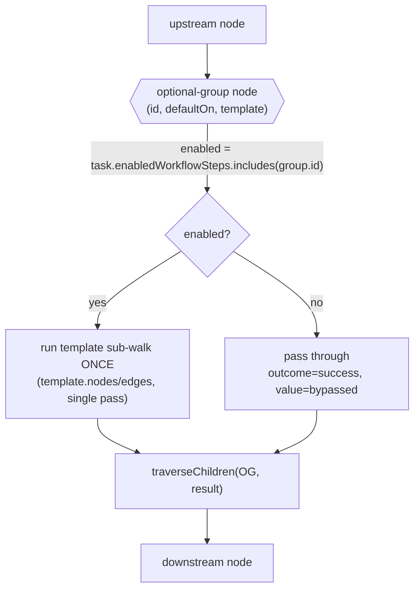
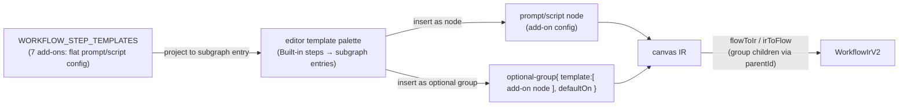

# feat: Optional-group container nodes + add-ons as insertable subgraphs

## Summary

Today "optional steps" are **execution-inert declarations**: a workflow lists `optionalSteps:
[{ templateId, defaultOn }]`, the create/edit UI seeds a per-task `enabledWorkflowSteps` set, and a
single hidden `workflow-step` seam node runs every enabled step *after* the graph finishes. Nothing about
optionality is visible in the graph, and the steps cannot be placed, ordered, or composed.

This plan makes optionality **graph-native**. A new `optional-group` container node — modeled on the
existing `foreach`/`loop` container nodes — holds a `template:{ nodes, edges }` subgraph. The graph
executor runs that subgraph **once** when the group is enabled for the task and **passes through
(skips)** it when disabled. Enable state reuses the existing per-task `enabledWorkflowSteps` facet plus a
workflow-level `defaultOn`, keyed by the group. Separately, every prior pre-workflow **add-on** (the seven
`WORKFLOW_STEP_TEMPLATES`: documentation-review, qa-check, security-audit, performance-review,
accessibility-check, browser-verification, frontend-ux-design) becomes **insertable from the editor's
template palette as a node subgraph**, and can be inserted already wrapped in an `optional-group` so an
author can drop in "Security Audit (optional)" in one action.

Finally, the plan **replaces** the declaration-based system per the confirmed scope decision: the built-in
**coding** and **stepwise-coding** workflows migrate `browser-verification` onto an `optional-group`, and
the now-dead `WorkflowOptionalStep` / `optionalSteps` declaration, `resolveWorkflowOptionalSteps` source,
the `workflow-step` seam node, and its compiler seam-anchor are retired — without breaking the create/edit
toggle surfaces, which re-point to the new source.

**Plan depth:** Deep. Cross-cutting across core IR + validation, the engine graph executor, per-task
persistence/seeding, the visual node editor, the built-in workflows, and a behavior-affecting removal of
the legacy execution path.

---

## Problem Frame

The declaration model has three structural limits this plan removes:

- **Invisible & unplaceable.** `optionalSteps` never appears in the graph
  (`packages/core/src/workflow-ir-types.ts:314-339`, marked "Execution-inert; the graph executor ignores
  this facet"). All enabled steps run in one lump at the `workflow-step` seam
  (`packages/engine/src/executor.ts` `runWorkflowSteps`, gated on `enabledWorkflowSteps`), so an author
  cannot put an optional step *between* two graph nodes, order multiple optional steps, or branch on one.
- **Add-ons are flat, not composable.** A `WorkflowStepTemplate`
  (`packages/core/src/types.ts:868-899`) is a flat prompt/script config. The seven built-in add-ons appear
  in the editor palette today only as **single "Built-in steps"** entries
  (`WorkflowNodeEditor.tsx:1002` `stepEntries`), not as subgraphs you can compose or gate.
- **Two ways to express "run this sometimes."** The graph already has real conditional routing
  (`shouldTraverseEdge` in `packages/engine/src/workflow-graph-executor.ts:657`, edge `condition` of
  `success`/`failure`/`outcome:<x>`) and container nodes (`foreach`/`loop`), yet optionality lives in a
  parallel, execution-inert declaration channel. Converging optionality onto the graph removes the split.

The graph already provides every seam this needs: container nodes compile/execute via a `template`
subgraph (`WorkflowForeachConfig`/`WorkflowLoopConfig`, `workflow-ir-types.ts:129-165`), the executor
dispatches them in `runNodeAndTraverse` (`workflow-graph-executor.ts:431-485`), the editor renders them as
React Flow group nodes with `parentId` children (`workflow-flow-mapping.ts:46-82,316-403,431-550`), and the
palette can already insert multi-node subgraphs via `insertFragment` (`WorkflowNodeEditor.tsx:1425-1430`).
The work is to add one new container kind that branches on a per-task toggle, project the add-on catalog
into the palette as subgraphs, and migrate the built-ins off the legacy path.

---

## Requirements

- **R1 — Optional-group container kind.** Add an `optional-group` node kind to the IR carrying a
  `template:{ nodes, edges }` subgraph, mirroring `WorkflowForeachConfig`. Parse + validate it.
- **R2 — Run-or-bypass execution.** The graph executor runs the group's template **once** when the group
  is enabled for the task and **passes through** (skips the subgraph, continues to the group's children)
  when disabled. No rework budget; a single pass.
- **R3 — Enable state reuses the per-task facet.** Whether a group runs is driven by the existing per-task
  `enabledWorkflowSteps` set plus a workflow-level `defaultOn` on the group, keyed by the group's stable
  id. New tasks seed their enabled set from each group's `defaultOn` at creation.
- **R4 — Author optional groups in the node editor.** An author can add an `optional-group` container,
  name it, set `defaultOn`, and place nodes inside it — reusing the foreach/loop group UX. The node type is
  registered so it renders (not as `react-flow__node-default`).
- **R5 — Every add-on is an insertable subgraph.** All seven `WORKFLOW_STEP_TEMPLATES` add-ons are
  insertable from the editor palette as a node subgraph, and offered with an "insert as optional group"
  variant that drops the add-on wrapped in an `optional-group` (seeded `defaultOn`).
- **R6 — Built-ins migrated, behavior preserved.** The coding and stepwise-coding built-ins express
  `browser-verification` as an `optional-group` (default OFF). A task with it enabled runs the step; a task
  with it disabled does not — proven by an execution-level (not traversal-only) test.
- **R7 — Legacy path retired without surface breakage.** The `WorkflowOptionalStep`/`optionalSteps`
  declaration, `resolveWorkflowOptionalSteps` as the toggle source, the `workflow-step` seam node, and its
  compiler seam-anchor are removed. The create/edit toggle surfaces (inline card, New Task modal, Workflow
  tab, steps dropdown) keep working by resolving their toggle list from `optional-group` nodes instead.
- **R8 — Validation invariants hold.** Optional-group templates are validated by walking the subgraph
  (children are not in `ir.nodes`): all template nodes reachable, no illegal (non-rework) cycles, no seam
  nodes inside a group. Graphs with no optional groups serialize byte-identically (R9 of prior art).
- **R9 — Additive serialization.** A workflow with no optional groups round-trips through the node editor
  byte-identically; `optional-group` introduces no new top-level IR keys (it is just a node kind).

---

## High-Level Technical Design

### Execution: container branches on the per-task toggle

The new dispatch slots into `runNodeAndTraverse` beside `foreach`/`loop`. Enabled → run the template
sub-walk once (reuse the loop/foreach template-walk machinery, no rework budget); disabled → return success
and traverse the group's children, skipping the body entirely.

Key boundary: the **decision** (run vs skip) is read from per-task state at the trigger seam, exactly like
the existing per-task auto-merge override — so it must be consulted wherever the run is gated, not only in
the executor branch (see Risks R-2). The **body** is an ordinary subgraph the executor already knows how to
walk.

### Authoring + add-on projection: catalog → palette → graph

The add-on→subgraph projection reuses the existing `insertFragment` subgraph-insertion path
(`WorkflowNodeEditor.tsx:1425`), which already remaps ids and rewires internal edges — so "insert as
optional group" is a wrap-then-insert, not a new insertion engine.

---

## Key Technical Decisions

- **KTD-1 — `optional-group` is a container node mirroring `WorkflowForeachConfig`, not a bypass edge.**
  Per the confirmed scope decision, optionality is encapsulated in a container (foreach/loop style) holding
  a `template:{ nodes, edges }`, rather than inline nodes plus an explicit bypass edge. This reuses the
  entire group-node toolchain (IR config, validation, React Flow `parentId` children, `insertFragment`),
  and the "skip" is the container passing through rather than a visible routed edge.

- **KTD-2 — Enable state reuses `enabledWorkflowSteps`, keyed by the group's stable node id.** No new
  persistence. The per-task `tasks.enabledWorkflowSteps` column (`db.ts:324`,
  `store.ts:424,2140`) holds the ids of enabled groups; `defaultOn` on the group seeds it at task creation
  via the existing materialization path. Keying on the **node id** (stable for built-ins and preserved
  across editor round-trips, like foreach/loop ids) means renaming/recreating a group resets its per-task
  state — acceptable and identical to today's `templateId` keying.

- **KTD-3 — Single pass, no rework budget.** Unlike `foreach` (per-step) and `loop` (bounded repeat), an
  optional-group runs its template exactly once when enabled. Reuse the loop/foreach template-walk helper
  but disable rework/iteration. Rework edges are **forbidden inside** an optional-group template (validation
  rejects them) to keep the single-pass guarantee unambiguous.

- **KTD-4 — Re-point the toggle resolver, don't keep two sources.** `resolveWorkflowOptionalSteps`
  (`workflow-optional-steps.ts`) currently maps `ir.optionalSteps` → display metadata for the create/edit
  UI. Replace its source with a scan of `optional-group` nodes (id, group name, `defaultOn`), preserving its
  output shape (`ResolvedWorkflowOptionalStep[]`) so the inline card, New Task modal, Workflow tab, and
  steps dropdown keep consuming it unchanged. This is what lets R7 retire the declaration without breaking
  the four toggle surfaces.

- **KTD-5 — Add-ons stay flat configs; the palette projects them to subgraphs at insert time.** Do **not**
  rewrite `WorkflowStepTemplate` into a nodes+edges shape. A template projects to a single `prompt`/`script`
  node (carrying its `prompt`/`scriptName`/`toolMode`/`gateMode`/`phase`/model), and the "optional" variant
  wraps that node in an `optional-group`. Keeping the catalog flat avoids migrating plugin-contributed
  templates and keeps the resolver/seeding logic simple.

- **KTD-6 — `workflow-step` seam removal is a compiler change, not just an IR edit.** `workflow-step` is a
  registered seam anchor in the compiler's canonical pipeline
  (`workflow-compiler.ts:45,170` `planning → execute → workflow-step → review → merge`). Retiring it
  requires removing it from `SEAM_NAMES`/`expectedSeamOrder` and updating the built-in IRs + their
  byte-identity parity oracles together, or the compiler will reject (or mis-order) the migrated graphs.

---

## Implementation Units

Grouped into three phases: **A — core/engine** (the construct runs), **B — editor** (authoring + add-on
palette), **C — migration/cleanup** (built-ins on the new model, legacy path retired).

### Phase A — Core construct + execution

### U1. `optional-group` IR type, parse, and validation

**Goal:** Introduce the `optional-group` node kind and its `template` config, and validate it by walking
the subgraph (R1, R8).

**Requirements:** R1, R8, R9

**Dependencies:** none

**Files:**
- `packages/core/src/workflow-ir-types.ts` (modify — add `"optional-group"` to `WorkflowIrNodeKind`; add
  `WorkflowOptionalGroupConfig { defaultOn?: boolean; template: { nodes; edges } }` mirroring
  `WorkflowForeachConfig` at `:129`)
- `packages/core/src/workflow-ir.ts` (modify — `validateV2` calls a new `validateOptionalGroup(node, ...)`;
  extend cycle/reachability/seam walks to descend into the template subgraph)
- `packages/core/src/__tests__/workflow-ir.test.ts` (modify/create — validation cases)

**Approach:**
- Add the kind + config type. The group's stable enable key is its node `id` (KTD-2); `defaultOn` lives on
  the node `config`.
- In validation, treat the template like a foreach template: its nodes are **not** in `ir.nodes`, so every
  reader/validator must walk the subgraph explicitly (learning: per-entity blast-radius `:37`). Validate:
  all template nodes reachable from the template's entry; endpoints reference template-local nodes; **no
  rework edges** inside (KTD-3); **no seam nodes** inside (mirror `validateParallelism`'s seam-in-branch
  rule, `workflow-ir.ts:190+`).
- `parseWorkflowIr` descends into optional-group templates the same way it clamps foreach/loop configs.

**Patterns to follow:** `WorkflowForeachConfig` type + `validateV2`/foreach template validation in
`workflow-ir.ts`; the seam-in-branch check in `validateParallelism`.

**Test scenarios:**
- A v2 IR with one `optional-group` (valid template) parses and validates.
- A template referencing an undefined template-local node throws `WorkflowIrError`.
- A rework edge inside an optional-group template is rejected.
- A seam node (e.g. `merge-gate`) inside an optional-group template is rejected.
- An unreachable template node is rejected.
- A graph with **no** optional-group serializes/parses byte-identically (R9).

**Verification:** `pnpm --filter @fusion/core test workflow-ir` green; no change to graphs without optional
groups.

---

### U2. Executor: run-once-or-bypass dispatch for `optional-group`

**Goal:** Make the graph executor run an enabled group's template once and pass through a disabled group
(R2), reading enable state from per-task `enabledWorkflowSteps` (R3).

**Requirements:** R2, R3

**Dependencies:** U1

**Files:**
- `packages/engine/src/workflow-graph-executor.ts` (modify — add an `optional-group` branch in
  `runNodeAndTraverse` at `:389-485`, beside `foreach`/`loop`)
- `packages/engine/src/workflow-graph-loop.ts` or a shared helper (modify/extract — reuse the
  single-template-walk without iteration/rework for the enabled path)
- `packages/engine/src/__tests__/workflow-graph-optional-group.test.ts` (create — execution-level tests)

**Approach:**
- Resolve `enabled = currentTask.enabledWorkflowSteps?.includes(node.id) ?? false`. **Read the freshest
  task state** at the seam (the executor already re-reads the task in `runWorkflowSteps`); ensure
  `enabledWorkflowSteps` is in whatever projection the gate reads (learning: per-task override slim-SELECT
  trap `:105`).
- Enabled → walk `node.config.template` once via the extracted helper, threading the same
  `runTemplateNode`/`shouldTraverseEdge` deps the foreach/loop handlers pass; collect `visitedNodeIds`;
  set `context[node:id:outcome]`. Disabled → `return await traverseChildren(node, { outcome: "success",
  value: "optional-group-bypassed" })`.
- Namespaced child ids: reuse the foreach instance-id scheme defensively — parse candidate-style and
  validate the template node exists, not just the container (learning `:56`).

**Execution note:** Start with the failing **two-task divergence** execution test (below) — it is the
contract that guards the dead-toggle failure mode.

**Test scenarios:**
- **Two-task divergence (critical):** two tasks identical except `enabledWorkflowSteps` — the one including
  the group id records the template's node execution; the sibling records none and reaches the same
  downstream node. (Shape from per-task-auto-merge learning `:106`.)
- Enabled group runs its template exactly **once** (not per-step, not looped) even when the graph has a
  foreach elsewhere.
- Disabled group is byte-inert: downstream context/outcome identical to a graph with the group removed
  (kill-switch inertness, learning `:55`).
- A template node failure inside an enabled group surfaces as the group's outcome and routes the group's
  `failure`/`outcome:` edges.

**Verification:** new engine test green; existing graph-executor tests unaffected.

---

### U3. Per-task enable resolution from optional-group nodes + `defaultOn` seeding

**Goal:** Re-point the per-task toggle source from `ir.optionalSteps` to `optional-group` nodes and seed
new tasks' enabled set from each group's `defaultOn` (R3, R7-prep).

**Requirements:** R3, R7

**Dependencies:** U1

**Files:**
- `packages/core/src/workflow-optional-steps.ts` (modify — `resolveWorkflowOptionalSteps` scans
  `optional-group` nodes instead of `ir.optionalSteps`, preserving `ResolvedWorkflowOptionalStep[]` output)
- `packages/core/src/` task-creation/materialization path that seeds `enabledWorkflowSteps` from `defaultOn`
  (modify — seed from optional-group `defaultOn`; today's `materializeDefaultWorkflowSteps`, see
  `types.ts:2668-2675`)
- `packages/core/src/__tests__/workflow-optional-steps.test.ts` (modify — group-sourced resolution)

**Approach:**
- Resolver: walk `ir` (v2) nodes, collect `optional-group` nodes → `{ id, name (from config), defaultOn }`.
  Keep output shape identical so the four UI surfaces (inline card, modal, Workflow tab, dropdown) need no
  change beyond what U7/U-editor already covers. Unknown/stale ids in `enabledWorkflowSteps` are ignored
  (defensive, as today).
- Seeding: at task creation, the enabled set is the ids of optional-group nodes whose effective
  `defaultOn` is true — mirroring the prior `optionalStep.defaultOn ?? false` precedence.
- Grep every reader of `enabledWorkflowSteps`/`optionalSteps` and confirm each now resolves from groups
  (learning: consult the override at every trigger seam `:100,:102`).

**Test scenarios:**
- `resolveWorkflowOptionalSteps` over a workflow with two optional-group nodes returns both, with names and
  `defaultOn` from node config.
- A new task created against that workflow seeds `enabledWorkflowSteps` to exactly the `defaultOn: true`
  group ids.
- A workflow with no optional-group nodes resolves to `[]` and seeds an empty set.
- Stale id in `enabledWorkflowSteps` (group since removed) does not crash resolution or execution.

**Verification:** core optional-steps tests green; creation seeding covered.

---

### Phase B — Editor authoring + add-on palette

### U4. Render & author the `optional-group` container in the node editor

**Goal:** Let an author add, name, configure (`defaultOn`), and fill an `optional-group` container,
reusing the foreach/loop group UX, with the node type registered so it renders (R4).

**Requirements:** R4

**Dependencies:** U1 (kind exists)

**Files:**
- `packages/dashboard/app/components/nodes/WorkflowNodeTypes.tsx` (modify — add `optional-group` to the
  node-type registry + icon, render as a group container like `foreach`/`loop`)
- `packages/dashboard/app/components/workflow-flow-mapping.ts` (modify — treat `optional-group` as a group
  kind everywhere foreach/loop are special-cased: `groupTemplateConfigOf` `:266`, group child
  reassembly `:441-480`, intra-template edge handling `:517`, group delete `:611,:636`,
  condition-editability `:663`)
- `packages/dashboard/app/components/WorkflowNodeEditor.tsx` (modify — inspector controls: group name +
  `defaultOn` toggle; help entry)
- `packages/dashboard/app/components/nodes/node-help.ts` (modify — add an `optional-group` help entry)
- `packages/dashboard/app/components/__tests__/workflow-flow-mapping.test.ts` (modify — round-trip group
  children)
- `packages/dashboard/app/components/__tests__/WorkflowNodeEditor.test.tsx` (modify — add/name/toggle/fill)

**Approach:**
- Mirror the `foreach`/`loop` group node: a React Flow `type: "group"` with `parentId` children using the
  existing `foreachChildFlowId` namespacing (`workflow-flow-mapping.ts:75`). `irToFlow` renders the
  template as children; `flowToIr` reassembles it (the `:454,:480` kind checks gain `optional-group`).
- Inspector: a `defaultOn` checkbox (labeled, focus ring) and the group name; the body is authored by
  dropping nodes inside, identical to foreach.
- **Register the node type** in `WorkflowNodeTypes.tsx` — an unregistered kind renders as
  `react-flow__node-default` with missing children (learning: worktree bundle `:24`). Verify against a
  fresh `FUSION_CLIENT_DIR` bundle, non-4040 port.

**Test scenarios:**
- Adding an optional-group, dropping a prompt node inside, and saving yields IR with an `optional-group`
  node whose `template.nodes` contains the inner node (round-trip).
- Toggling `defaultOn` marks the editor dirty and persists on save.
- Deleting the group removes its `parentId` children (no orphans) — mirrors the foreach delete test.
- The node renders with its registered type (not `react-flow__node-default`) — asserted via node-type
  registry presence.

**Verification:** mapping + editor tests green; real-browser check that the container renders, accepts
child nodes, and the `defaultOn` toggle works (fresh worktree bundle; verify on a mobile viewport per
Risks R-4).

---

### U5. Add-ons as insertable subgraphs (plus "insert as optional group")

**Goal:** Make all seven `WORKFLOW_STEP_TEMPLATES` add-ons insertable from the palette as node subgraphs,
each also offerable wrapped in an `optional-group` (R5).

**Requirements:** R5, KTD-5

**Dependencies:** U4 (optional-group authoring exists)

**Files:**
- `packages/dashboard/app/components/WorkflowNodeEditor.tsx` (modify — the "Built-in steps" palette
  section `:1002,:2741`, the existing `stepTemplateToNode()` projector `:249-275`, and the
  `handleInsertStepTemplate`/`handleInsertFragment` handlers `:1425-1453`: add an "insert as optional
  group" variant per add-on)
- `packages/dashboard/app/components/workflow-flow-mapping.ts` (modify — `insertFragment` `:1110-1219`
  already expands subgraphs incl. group `parentId` children; add the wrap-in-`optional-group` helper that
  builds the fragment IR from a projected add-on node)
- `packages/dashboard/app/components/__tests__/WorkflowNodeEditor.test.tsx` (modify — insert-as-node and
  insert-as-optional-group for an add-on)

**Approach:**
- Project each add-on to a node using the **existing `stepTemplateToNode()`** (`WorkflowNodeEditor.tsx:
  249-275`), which already maps a `WorkflowStepTemplate` → a `prompt`/`script` node carrying its
  `prompt`/`scriptName`/`toolMode`/`gateMode`/model (KTD-5). "Insert as node" is today's behavior.
- "Insert as optional group" wraps that projected node in an `optional-group{ template:{ nodes:[node],
  edges:[] }, defaultOn }` (seeded from the template's `defaultOn`) and inserts it through the existing
  `insertFragment` path (`workflow-flow-mapping.ts:1110-1219`), which already remaps ids, rewires internal
  edges, and expands group `parentId` children — so no new insertion engine is needed.
- Surface both variants in the palette's existing "Built-in steps" group; keep `data-testid` conventions.

**Test scenarios:**
- Each of the seven add-ons appears in the palette and inserts a node carrying its template config.
- "Insert as optional group" for `security-audit` yields an `optional-group` whose `template` holds the
  security-audit node and whose `defaultOn` matches the template default.
- Inserting an add-on subgraph remaps ids so two insertions of the same add-on do not collide.
- A plugin-contributed template (if present) still inserts as a node (catalog stays flat, KTD-5).

**Verification:** editor tests green; real-browser insert of an add-on and an optional-group-wrapped add-on,
then save → reopen round-trip.

---

### Phase C — Migrate built-ins, retire the legacy path

### U6. Migrate coding + stepwise-coding built-ins to `optional-group` browser-verification

**Goal:** Express `browser-verification` as an `optional-group` (default OFF) in both built-ins, preserving
runtime behavior, and update parity oracles (R6).

**Requirements:** R6, R8

**Dependencies:** U2, U3 (execution + seeding), U1 (kind)

**Files:**
- `packages/core/src/builtin-coding-workflow-ir.ts` (modify — replace `optionalSteps:[{templateId:
  "browser-verification"}]` `:123` + the `workflow-step` seam node `:69` with a `browser-verification`
  `optional-group` on the pre-merge path)
- `packages/core/src/builtin-stepwise-coding-workflow-ir.ts` (modify — add the `browser-verification`
  optional-group on the pre-merge path; stepwise had no `workflow-step` seam at all)
- `packages/core/src/__tests__/` built-in IR snapshot/parity fixtures (modify — update byte-identity
  oracles deliberately)
- `packages/engine/src/__tests__/` stepwise/coding execution parity test (modify — enabled-runs/disabled-
  skips at the built-in level)

**Approach:**
- Place the optional-group on the success path where `workflow-step` sat (pre-merge, after execute/steps,
  before review), so an enabled task runs browser-verification pre-merge exactly as before.
- The stepwise IR is a documented byte-identity parity oracle — adding the construct shifts its snapshot;
  update the fixture deliberately and confirm the group runs **once** post-foreach, not per step-instance
  (learning `:55`, prior plan R-5).

**Test scenarios:**
- `resolveWorkflowOptionalSteps(BUILTIN_CODING_WORKFLOW_IR)` returns one `browser-verification` group,
  `defaultOn: false`; same for stepwise.
- Execution: a coding task with the group enabled runs browser-verification pre-merge; disabled does not
  (two-task divergence at the built-in level).
- Stepwise: same divergence; the group runs once after the foreach completes.
- Both built-ins parse and pass `validateV2`.

**Verification:** core + engine built-in tests green; parity oracles updated and passing.

---

### U7. Retire the declaration-based optional-steps path

**Goal:** Remove the now-dead `WorkflowOptionalStep`/`optionalSteps` declaration, the `workflow-step` seam
node + handler, and its compiler seam-anchor, keeping the four toggle surfaces working via U3's resolver
(R7).

**Requirements:** R7

**Dependencies:** U3 (resolver re-pointed), U6 (built-ins migrated — nothing still declares `optionalSteps`)

**Files:**
- `packages/core/src/workflow-ir-types.ts` (modify — remove `WorkflowOptionalStep` + `WorkflowIrV2.
  optionalSteps`)
- `packages/core/src/workflow-compiler.ts` (modify — remove `workflow-step` from `SEAM_NAMES` `:45` and
  `expectedSeamOrder` `:170`)
- `packages/engine/src/executor.ts` (modify — remove `runWorkflowSteps` + the `workflow-step` seam
  dispatch, now unreachable)
- `packages/dashboard/app/components/workflow-flow-mapping.ts` (modify — drop `optionalSteps` threading in
  `flowToIr`/`optionalStepsOf` if present from the prior plan)
- `packages/core/src/__tests__/`, `packages/engine/src/__tests__/` (modify — delete/replace tests asserting
  the legacy path; keep the resolver/seeding tests now backed by groups)

**Approach:**
- This is a **behavior-affecting removal** — follow the codebase's Surface Enumeration discipline (see the
  section below). Enumerate every reader of `optionalSteps`/`workflow-step`/`runWorkflowSteps` and confirm
  each is migrated or removed; do not leave a mock-masked dead path (learning: branch-group dead-wiring).
- Removing the seam anchor changes the compiler's accepted pipeline — confirm no remaining built-in or
  fragment references `workflow-step`, then drop it from both anchor lists together with the built-in edits
  from U6.

**Test scenarios:**
- Grep proves zero remaining references to `optionalSteps`, `WorkflowOptionalStep`, `workflow-step` seam,
  and `runWorkflowSteps` in non-test source.
- The compiler accepts the migrated built-ins with `workflow-step` removed from the seam order.
- The four toggle surfaces (inline card, New Task modal, Workflow tab, steps dropdown) still render and
  submit `enabledWorkflowSteps` — now sourced from optional-group nodes (regression).
- A pre-existing workflow JSON that still carries `optionalSteps` (legacy persisted) does not crash parse —
  the key is ignored, not fatal (back-compat decision: tolerate-and-drop). *(Confirm this stance in review;
  alternative is a one-time parse upgrade.)*

**Verification:** full core + engine + dashboard suites green; `pnpm lint`, `pnpm typecheck`, `pnpm build`,
`pnpm test:gate` pass.

---

## Surface Enumeration

Behavior-affecting change (new execution construct + removal of the legacy path) and a UI-affordance change
(new node kind + retired toggle source), so per AGENTS.md ("Fix the Invariant, Not the Repro", FN-5893) the
surfaces are enumerated:

- **Workflow providers/graphs:** built-in **coding** and **stepwise-coding** (both migrated, U6); any
  fragment or user workflow that declared `optionalSteps` (tolerated-and-dropped, U7).
- **Execution states:** group **enabled** (runs once), **disabled** (passes through), **stale id** in
  `enabledWorkflowSteps` (ignored), **template failure** (routes group failure edge).
- **Editor breakpoints:** desktop and **mobile** node editor — container render, child placement,
  `defaultOn` toggle, palette insert (both variants).
- **Per-task toggle surfaces:** inline quick-create card, New Task modal, task-detail Workflow tab, steps
  dropdown — all re-sourced from optional-group nodes (U3/U7).
- **Validation:** subgraph walked (not just `ir.nodes`); no rework/seam inside a group; graphs without
  optional groups byte-identical.
- **Compiler:** seam-anchor list with `workflow-step` removed; canonical pipeline still valid for migrated
  built-ins.

## Symptom Verification

- **Original symptom:** optionality is invisible and unplaceable — enabled steps run in one lump at a
  hidden seam, and add-ons cannot be composed or gated in the graph.
- **Exact reproduction:** build/inspect the coding workflow; `browser-verification` appears only as an
  `optionalSteps` declaration, runs at the `workflow-step` seam, and is absent from the graph; add-ons
  appear in the palette only as flat single steps.
- **Assertion it is gone:** an enabled optional-group runs its placed template once at its graph position
  and a disabled one is inert (two-task divergence execution test, U2/U6); every add-on inserts as a
  node/optional-group subgraph (U5); no `workflow-step`/`optionalSteps` path remains (U7 greps).

---

## Scope Boundaries

**In scope:**
- `optional-group` IR kind + validation (U1), executor run/bypass (U2), per-task resolution + seeding (U3).
- Editor container authoring + node-type registration (U4); add-ons as insertable subgraphs incl.
  optional-group wrapping (U5).
- Built-in coding + stepwise migration (U6); retiring the declaration/seam/compiler-anchor path (U7).

**Already built (reuse, not rebuilt):**
- Container-node toolchain: `foreach`/`loop` config, group rendering, `parentId` children,
  `insertFragment` subgraph insertion.
- Per-task `enabledWorkflowSteps` column, create-surface toggles, the four toggle UIs, and
  `resolveWorkflowOptionalSteps`'s output shape (source re-pointed in U3).
- Step→node projection (`workflow-steps-to-ir.ts`) reused to project add-ons (U5).

### Delivered cohort (this PR) vs. Deferred
This PR delivers **U1–U6 plus U7a** (10 commits). U7a retired the legacy declaration *model*: the core
`WorkflowOptionalStep` type + `WorkflowIrV2.optionalSteps` field + `validateOptionalSteps`, and the editor's
declaration **authoring** surface (`WorkflowOptionalStepsPanel`, `optionalStepsOf`, the `flowToIr`
`optionalSteps` threading). A code-review pass also fixed a P1 (the optional-group toggle-id collision in
enable resolution) — captured in the commit history and in
`docs/solutions/logic-errors/optional-group-toggle-id-remapped-by-step-materializer.md`. The per-task toggle
surfaces (`WorkflowOptionalStepsDropdown`, inline card, modal, Workflow tab) stayed — they consume the
distinct `ResolvedWorkflowOptionalStep`.

- **Deferred: the `workflow-step` seam infrastructure removal.** What remains of "full U7" is excising the
  `workflow-step` seam itself — a shared `WorkflowSeam` union member woven through ~9 engine runtime files
  (`runtime-primitives`, `step-session-executor`, `workflow-node-handlers`, `active-session-registry`,
  `workflow-graph-task-runner`, `executor.runWorkflowSteps`, the compiler seam-anchor). It is now orphaned
  (no built-in graph reaches it) but inert; excising it is its own focused refactor with its own blast radius.
- **Nested/conditional groups** (an optional-group inside a split/foreach, or gated by a workflow field
  rather than the per-task toggle) — single-level, per-task-toggle only for now.
- **Plugin-contributed add-ons as optional-group presets** beyond inserting them as flat nodes.
- The prior plan's deferred **unified per-task workflow-facet override** abstraction (optional steps +
  auto-merge + column-agent overrides) — strong `/ce-compound` candidate once this lands.

**Out of scope:**
- New persistence/migrations. Reuses `tasks.enabledWorkflowSteps`; `optional-group` is just a node kind.
- Rewriting `WorkflowStepTemplate` into a nodes+edges shape (KTD-5 keeps it flat).
- Changing unrelated execution (merge lifecycle, branch groups, PR nodes).

---

## Risks & Dependencies

- **R-1 — Subgraph-walking validation/readers miss template children.** Optional-group template nodes are
  not in `ir.nodes`; any validator, reachability pass, or id parser that only sees top-level nodes will be
  wrong. *Mitigation:* walk the subgraph explicitly and parse namespaced child ids candidate-style,
  validating the template node exists, not just the container.
  (`docs/solutions/architecture-patterns/per-entity-execution-principal-override-blast-radius.md:37,:56`)
- **R-2 — Per-task enable consulted only in the executor branch.** If skip-vs-run is read only where the
  group executes and not at every gate/trigger that decides whether to run it, the toggle silently no-ops;
  a slim SELECT omitting `enabledWorkflowSteps` reads `undefined`. *Mitigation:* grep every gate; ensure the
  column is selected; ship the two-task divergence test.
  (`docs/solutions/logic-errors/per-task-auto-merge-override-ignored-by-trigger-gates.md:100,:102,:105,:106`)
- **R-3 — Seam-anchor / parity-oracle drift on built-in migration.** `workflow-step` is a compiler seam
  anchor and the stepwise IR is a byte-identity oracle; removing the seam and adding the construct shifts
  snapshots and can break compile-order validation. *Mitigation:* edit built-ins, seam-anchor lists, and
  parity fixtures together (KTD-6); confirm the group runs once post-foreach.
  (`docs/solutions/architecture-patterns/workflow-native-runtime-primitives.md:117`; prior plan R-5)
- **R-4 — Editor node-type registration + mobile.** An unregistered `optional-group` renders as
  `react-flow__node-default` with missing children, looking like a source bug; per-task toggle controls have
  a real-browser-only mobile failure history. *Mitigation:* register the node type and verify against a
  fresh `FUSION_CLIENT_DIR` worktree bundle on a non-4040 port; real-browser-check the `defaultOn` toggle on
  a mobile viewport.
  (`docs/solutions/developer-experience/browser-testing-dashboard-from-worktree-safely.md:24,:44`;
  `docs/solutions/ui-bugs/mobile-auto-merge-toggle-document-scroll-blank.md:32,:53`)
- **R-5 — Mock-masked dead wiring on removal.** Retiring the legacy path risks a green suite over a feature
  whose new path is never actually exercised (the branch-group failure class). *Mitigation:* execution-level
  (not traversal-only) tests for enabled-runs/disabled-skips at both the construct and built-in levels;
  grep-prove the old path is gone.
  (`docs/solutions/integration-issues/branch-group-single-pr-synthetic-id-dead-wiring.md`)

---

## Sources & Research

- **Execution seam:** `packages/engine/src/workflow-graph-executor.ts:389-485` (`runNodeAndTraverse`
  foreach/loop dispatch), `:657` (`shouldTraverseEdge`); `workflow-graph-foreach.ts`,
  `workflow-graph-loop.ts` (template sub-walk to reuse).
- **IR + validation:** `packages/core/src/workflow-ir-types.ts:41-165` (node/edge/container types),
  `:314-339` (legacy `optionalSteps`); `packages/core/src/workflow-ir.ts:190+` (seam-in-branch),
  `:1218-1298` (`validateV2`, cycles/endpoints), `:1327` (`parseWorkflowIr`).
- **Per-task facet:** `packages/core/src/types.ts:2421,2663-2680` (`enabledWorkflowSteps`, `workflowId`
  precedence), `db.ts:324`, `store.ts:424,2140`; `workflow-optional-steps.ts` (resolver to re-point);
  `executor.ts` `runWorkflowSteps` (seam consumer to retire).
- **Add-on catalog:** `packages/core/src/types.ts:868-899` (`WorkflowStepTemplate`), `:902-1150`
  (seven `WORKFLOW_STEP_TEMPLATES`: documentation-review, qa-check, security-audit, performance-review,
  accessibility-check, browser-verification, frontend-ux-design); `WorkflowNodeEditor.tsx:249-275`
  (`stepTemplateToNode` add-on→node projector to reuse).
- **Editor:** `packages/dashboard/app/components/workflow-flow-mapping.ts:46-82,266-269,316-403,431-550`
  (group children, `groupTemplateConfigOf`), `:1110-1219` (`insertFragment` subgraph insertion);
  `WorkflowNodeEditor.tsx:985-1010` (palette: fragments/steps/plugins, sourced from
  `/api/workflow-step-templates`), `:1425-1453` (insert handlers); `nodes/WorkflowNodeTypes.tsx` (node-type
  registry to extend).
- **Compiler:** `packages/core/src/workflow-compiler.ts:45,165-196` (seam anchors + canonical order).
- **Built-ins:** `packages/core/src/builtin-coding-workflow-ir.ts:69,123`,
  `builtin-stepwise-coding-workflow-ir.ts:132`.
- **Prior art:** `docs/plans/2026-06-20-001-feat-workflow-optional-steps-node-editor-modal-plan.md` (the
  declaration-based system this replaces); institutional learnings cited inline under Risks.
