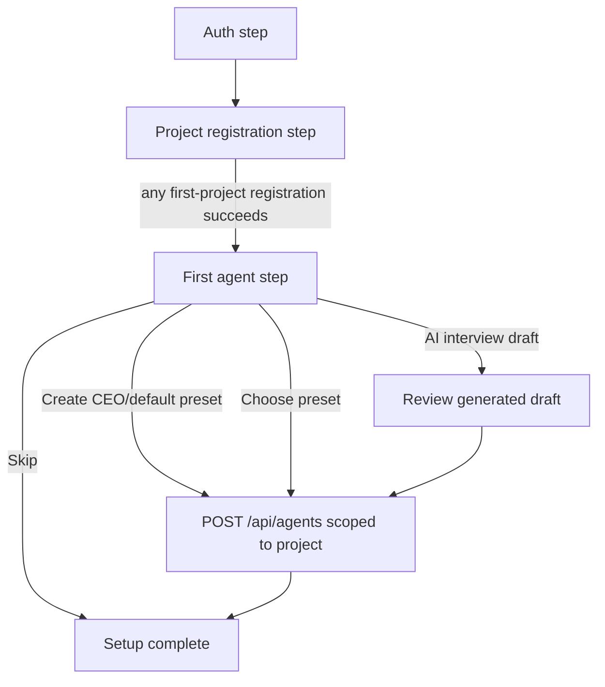

# First-Run Agent Onboarding

## Summary

Extend first-run onboarding so, after registering the first project through any setup mode, Fusion invites the user to create their first persistent agent. The default path should create a CEO-style coordinating agent from the existing preset library, while still letting users choose another template, use AI interview generation when the existing agent-onboarding feature flag is enabled, or skip agent creation and finish setup.

---

## Problem Frame

First-run setup currently ends after project registration, leaving the agent system as something users discover later. The requested change makes the first persistent agent part of onboarding and explains the distinction between Fusion's temporary task agents and a user-created coordinating agent that can help create, coordinate, and manage work.

---

## Requirements

- R1. The setup wizard must ask the user to create their first agent after any successful first-project registration path, including existing-directory and clone setup modes.
- R2. The default creation choice must be the existing CEO preset (`id: "ceo"`) so a new user gets a coordination-oriented agent without extra decisions.
- R3. The wizard must let users choose from the existing agent preset/template library before creating the agent.
- R4. When `experimentalFeatures.agentOnboarding` is enabled, the wizard must offer the existing AI interview/generation path as an alternate way to draft the first agent; when disabled, preset creation and skip remain available without an unavailable AI affordance.
- R5. The wizard copy must explain that Fusion creates temporary agents to work on tasks, while the user's persistent agent can coordinate, create tasks, and help manage the work.
- R6. The agent step must be skippable, and skipping must complete onboarding without creating an agent.
- R7. Users who skip must still have a clear path to create agents later from the Agents view.
- R8. Agent creation during setup must use the same validation and persistence behavior as the existing New Agent flow.
- R9. The onboarding update must remain usable on desktop and mobile modal layouts, including keyboard preset selection, selected-preset screen-reader labeling, reachable Create/Skip/AI actions, inline error focus, and supported mobile breakpoint behavior.

---

## Key Technical Decisions

- **Reuse shared creation logic, not copied mappings:** Build the new onboarding step from `AGENT_PRESETS`, `createAgent(...)`, and the current AI interview draft flow, but extract shared preset/draft/payload helpers or a shared creation component from `NewAgentDialog` so setup does not mirror `handlePresetSelect` / `handleCreate` by hand. This keeps first-run creation aligned with the canonical New Agent dialog as presets, runtime fields, and validation evolve.
- **Keep setup wizard as the orchestrator:** Add an `"agent"` wizard step to `SetupWizardModal` after project registration succeeds and before `"complete"`. Registration must store the returned `ProjectInfo` in wizard state and must not invoke the current parent setup-complete callback until agent creation succeeds or the user skips.
- **Default CEO by selected preset, not hidden auto-create:** Preselect the CEO preset by stable `id: "ceo"` and make the action explicit. CEO is the default because the first persistent agent is framed as a coordinator for task creation and cross-task direction, while role-specific templates remain available for users who want a narrower first agent.
- **Skip is terminal for setup:** A skip action should advance to the completion step and should not mark an error, create a placeholder agent, or require the user to visit the Agents view immediately.
- **AI interview remains draft-first and feature-flagged:** Reuse `ExperimentalAgentOnboardingModal` semantics where AI produces a draft for review before persistence, and expose the AI entry only when `experimentalFeatures.agentOnboarding === true` is passed into setup. The setup wizard can apply the draft to the agent step, but the final Create action remains explicit.
- **Project scope follows the registered project:** The first agent should be created in the project context returned by `registerProject(...)`, matching the workspace the user just registered. Implementation must verify the exact `createAgent(...)` scoping contract, including where the project ID is passed and how tests prove the created agent belongs to the registered project.

---

## High-Level Technical Design

The agent step should be an onboarding-specific entry surface backed by shared New Agent creation logic rather than a copied second implementation. It needs preset selection, a concise preview of the selected agent, an AI interview entry point when enabled, a pending state for Create, and a skip action.

---

## Implementation Units

### U1. Add First-Agent State to Setup Wizard

- **Goal:** Extend `SetupWizardModal` with an agent step that appears after any successful first-project registration path and owns the newly registered project ID for scoped agent creation.
- **Files:** `packages/dashboard/app/components/SetupWizardModal.tsx`, `packages/dashboard/app/components/SetupWizardModal.css`, `packages/dashboard/app/components/AppModals.tsx`, `packages/dashboard/app/hooks/useProjectActions.ts`
- **Patterns:** Follow the existing `WizardState` step model, footer action branching, and modal layout rules in `SetupWizardModal`.
- **Test Scenarios:** In `packages/dashboard/app/components/__tests__/SetupWizardModal.test.tsx`, assert that existing-directory and clone registration each advance to the first-agent step before completion, store the returned project ID, and preserve their existing registration payloads.
- **Verification:** The project registration payload tests stay unchanged, the parent setup-complete callback is not invoked at registration time, and completion is reached only after agent creation or skip.

### U2. Reuse Preset-Based Agent Creation

- **Goal:** Render the existing preset list with CEO preselected and create an agent from the selected preset using shared New Agent creation mapping and `createAgent(...)`.
- **Files:** `packages/dashboard/app/components/SetupWizardModal.tsx`, `packages/dashboard/app/components/NewAgentDialog.tsx`, `packages/dashboard/app/components/agent-presets/index.ts`, `packages/dashboard/app/api/legacy.ts`
- **Patterns:** Extract or reuse a shared preset-to-form/payload helper so onboarding and `NewAgentDialog` produce the same create payload for the same preset.
- **Test Scenarios:** In `SetupWizardModal.test.tsx`, assert that CEO is selected by default, selecting a different preset changes the preview, and clicking Create sends a scoped `createAgent` payload with name, role, title, icon, soul, and instructions text. Add a parity test that compares the onboarding-created payload with the canonical preset-created payload for the same preset.
- **Verification:** Agent creation enters a pending state, disables duplicate create/skip/template changes as appropriate, exposes accessible busy feedback, displays errors inline with focus returned to the error/agent step, and transitions to completion only after persistence succeeds.

### U3. Add Skip Path and Later-Creation Copy

- **Goal:** Make skipping the first-agent step explicit and safe, with copy that says users can create agents later from the Agents view.
- **Files:** `packages/dashboard/app/components/SetupWizardModal.tsx`, `packages/dashboard/app/components/SetupWizardModal.css`, `packages/i18n/locales/en/app.json`, `packages/i18n/locales/es/app.json`, `packages/i18n/locales/fr/app.json`, `packages/i18n/locales/ko/app.json`, `packages/i18n/locales/zh-CN/app.json`, `packages/i18n/locales/zh-TW/app.json`
- **Patterns:** Follow existing setup wizard skip-button behavior from the auth step, but route to `"complete"` rather than a prior setup step.
- **Test Scenarios:** In `SetupWizardModal.test.tsx`, assert that clicking Skip on the first-agent step does not call `createAgent`, advances to completion, and renders completion copy that still makes sense when no agent was created.
- **Verification:** The skip button remains keyboard reachable, has an accessible name on desktop and mobile, and routes to setup completion without calling `createAgent(...)`.

### U4. Integrate AI Interview as an Optional Draft Path

- **Goal:** Offer AI-generated first-agent drafting from the agent step using the existing `ExperimentalAgentOnboardingModal` and draft application behavior when the existing experimental feature flag is enabled.
- **Files:** `packages/dashboard/app/App.tsx`, `packages/dashboard/app/components/AppModals.tsx`, `packages/dashboard/app/components/SetupWizardModal.tsx`, `packages/dashboard/app/components/ExperimentalAgentOnboardingModal.tsx`, `packages/dashboard/app/api/legacy.ts`
- **Patterns:** Pass `agentOnboardingEnabled={experimentalFeatures.agentOnboarding === true}` through `AppModals` into `SetupWizardModal`. Reuse the create-mode data contract from `NewAgentDialog`; first-run setup should pass an explicit empty existing-agent context unless implementation fetches the registered project's agents before opening the interview.
- **Test Scenarios:** In `SetupWizardModal.test.tsx`, assert that the AI entry point is hidden when disabled, opens the interview when enabled, applying a draft updates the preview/create payload, and the user still must confirm creation.
- **Verification:** Cancel, close, escape/backdrop behavior, draft application, error handling, and focus restoration return the user to the triggering AI button or updated draft preview. If the AI interview errors, preset creation and skip remain available.

### U5. Update User-Facing Copy and Documentation

- **Goal:** Add concise onboarding text explaining temporary task agents versus the user's persistent coordinating agent.
- **Files:** `packages/i18n/locales/en/app.json`, `packages/i18n/locales/es/app.json`, `packages/i18n/locales/fr/app.json`, `packages/i18n/locales/ko/app.json`, `packages/i18n/locales/zh-CN/app.json`, `packages/i18n/locales/zh-TW/app.json`, `docs/dashboard-guide.md`, `docs/agents.md`
- **Patterns:** Keep `docs/agents.md` as the deeper conceptual reference for agent behavior and `docs/dashboard-guide.md` as the first-run UI guide.
- **Test Scenarios:** In `packages/i18n/src/__tests__/i18n-gate-coverage.test.ts`, update any key coverage expectations if new setup keys require inclusion. In docs-adjacent tests, update lazy/setup references only if they assert specific onboarding inventories.
- **Verification:** Run the existing i18n extraction/sync/types flow (`pnpm i18n:extract`, `pnpm i18n:sync`, `pnpm i18n:types`) so `packages/i18n/src/resources.d.ts` is regenerated instead of manually edited, and confirm UI copy avoids implying the persistent agent replaces Fusion's temporary executor/reviewer agents.

---

## Acceptance Examples

- AE1. Given a new user registers their first project through existing-directory or clone setup, when registration succeeds, then the wizard shows a first-agent step with CEO selected by default.
- AE2. Given the user wants a different coordinating role, when they select another preset and create it, then Fusion creates that preset-scoped agent for the registered project and completes setup.
- AE3. Given the experimental agent-onboarding flag is enabled and the user wants help designing the agent, when they use AI interview and apply the generated draft, then the wizard previews the draft and waits for explicit Create before saving.
- AE4. Given the user does not want to create an agent during onboarding, when they click Skip, then setup completes and no agent creation request is sent.
- AE5. Given agent creation fails, when the API returns an error, then the wizard keeps the user on the first-agent step with an inline error and preserves their selected preset or draft.
- AE6. Given the user is on a mobile viewport, when the first-agent step renders, then preset selection, preview, AI entry point when enabled, Create, Skip, inline errors, and completion copy remain visible or reachable without incoherent overflow.

---

## Scope Boundaries

- The plan does not replace `NewAgentDialog` or the Agents view creation workflow; setup must share its creation mapping or component rather than fork behavior.
- The plan does not auto-create an agent without an explicit user action.
- The plan does not change temporary task-agent provisioning or execution behavior.
- The plan does not require AI interview to be enabled for first-run setup to work.
- The plan does not introduce new agent templates beyond reusing the existing preset library.

---

## System-Wide Impact

The change affects first-run onboarding, project registration completion, and agent creation from a new entry point. It should not alter task execution, ephemeral agent provisioning, model onboarding, or the existing Agents view. Because `SetupWizardModal` is lazy-loaded, the lazy-loaded views inventory should not change.

---

## Risks & Dependencies

- **Nested modal risk:** Opening the AI interview from setup can stack modals. Keep the interview optional, gated by `agentOnboardingEnabled`, and verify launch, cancel, close, escape/backdrop behavior, draft application, errors, and focus restoration.
- **Project ID timing:** Agent creation needs the project ID returned by registration. Preserve that value in wizard state before advancing, and call the parent setup-complete callback only after agent creation or skip.
- **Agent API scoping:** Verify whether `createAgent(...)` uses an explicit `projectId` argument, implicit active project context, or global storage. If explicit project scoping is missing, add the API contract work before UI wiring.
- **Mobile density:** Preset selection inside setup can become tall on small screens. Use a compact list or responsive grid that fits the modal's existing mobile height constraints, then verify desktop and mobile viewports for preset selection, preview, AI entry point, Create, Skip, inline error, and completion states.

---

## Sources / Research

- `packages/dashboard/app/components/SetupWizardModal.tsx` currently owns auth, project registration, clone/existing project modes, advanced settings, and completion.
- `packages/dashboard/app/components/NewAgentDialog.tsx` is the canonical manual agent creation flow and already maps presets, AI drafts, runtime fields, and `createAgent(...)`.
- `packages/dashboard/app/App.tsx` computes `agentOnboardingEnabled` from `experimentalFeatures.agentOnboarding`; `packages/dashboard/app/components/AppModals.tsx` is the modal boundary that must pass the flag into setup.
- `packages/dashboard/app/components/ExperimentalAgentOnboardingModal.tsx` provides the draft-first AI interview behavior for agent creation.
- `packages/dashboard/app/components/agent-presets/index.ts` defines the CEO preset and the rest of the reusable preset library.
- `packages/i18n/locales/*/app.json` are the source catalogs for setup UI copy; `packages/i18n/src/resources.d.ts` is generated by the i18n scripts.
- `docs/agents.md` documents the canonical New Agent dialog, experimental planning-style onboarding, and preset library.
