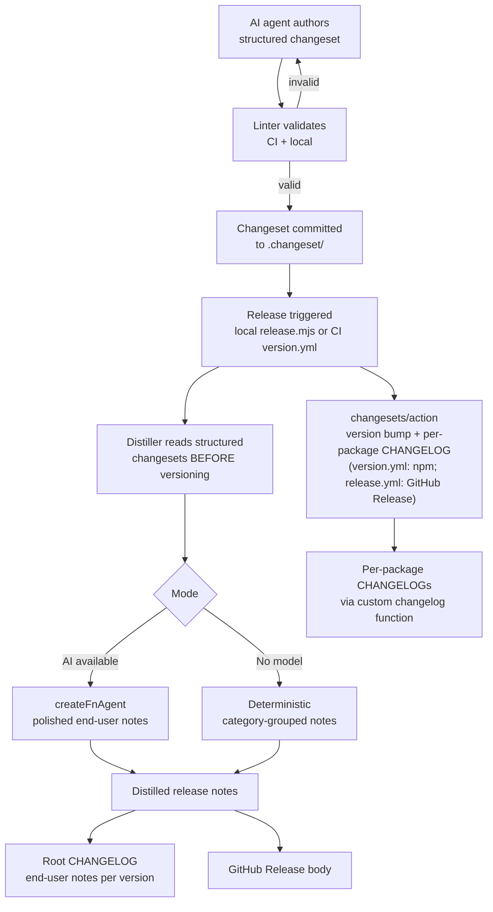

# Better Changelog — Structured Changesets + AI-Distilled Release Notes

## Summary

Replace the current dense, freeform changeset paragraphs with a **structured changeset body format** (category + end-user summary + optional dev detail) enforced by a linter, and add an **AI-powered release-notes distiller** that turns a release's collected changesets into clean, grouped, end-user-facing release notes. The distiller reuses the existing `createFnAgent` model-call seam, falls back to deterministic category-grouped rendering when no model is available, and feeds both the root `CHANGELOG.md` and GitHub Release notes through a single unified pipeline.

---

## Problem Frame

Fusion's changelog pipeline has two problems:

1. **Changeset content is unwieldy.** AI agents author dense, multi-paragraph technical changesets (some 800+ words of internal implementation detail) that aggregate into a 10,000+ line root `CHANGELOG.md`. The content is written for developers, not the Fusion operators who consume release notes.

2. **Release notes are inconsistent across paths.** The local release (`scripts/release.mjs`) extracts notes from the changeset-derived CHANGELOG via `extractVersionNotes`. The CI binary release (`.github/workflows/release.yml`) uses GitHub's `generate_release_notes: true`, which auto-generates from PR titles/commits — a completely different output. The dashboard's Update banner links to GitHub release notes, so users see whichever path produced the release.

The changeset *versioning engine* (cross-package fixed-group semver via `@changesets/cli`) is sound — the problem is content quality and output rendering, not versioning mechanics.

### Actors

- **AI agents** — primary changeset authors during task execution
- **Fusion operators** — primary changelog/release-notes audience
- **Release operator** — runs `pnpm release` locally or merges the CI version PR

---

## Requirements

- **R1.** Every changeset body follows a structured format: a category from a fixed set (`added`, `changed`, `fixed`, `deprecated`, `removed`, `security`) and a concise end-user-facing summary.
- **R2.** A linter validates changeset bodies and runs in CI, rejecting non-conforming changesets before merge.
- **R3.** A release-notes distiller consumes structured changesets and produces grouped, end-user-facing release notes organized by category (Keep a Changelog style).
- **R4.** The distiller operates in two modes: deterministic (always available, category-grouped markdown) and AI-polished (when model access is available, reusing the existing `createFnAgent` seam).
- **R5.** Both release paths (local `release.mjs` and CI `release.yml`) produce the same distilled release notes — one source of truth.
- **R6.** The root `CHANGELOG.md` per-version entry is the distilled end-user release notes, not the raw per-package technical aggregate.
- **R7.** Per-package `CHANGELOG.md` files render structured changesets as clean bullet points via a custom changelog function.

---

## Key Technical Decisions

### KTD1: Keep the changeset versioning engine, impose structured body schema

The `@changesets/cli` versioning engine correctly handles the fixed-group cross-package semver bumping defined in `.changeset/config.json`. Re-implementing that is real risk with no user-facing benefit. The problem is changeset *content quality*. We keep the engine and impose a structured body format enforced by a linter.

**Directional format** (implementation may refine the exact parsing rules):

```markdown
---
"@runfusion/fusion": minor
---

added: Command Center productivity control for previewing and applying historical LOC backfills from the dashboard.
```

- First non-empty line after frontmatter: `<category>: <end-user-facing summary>`
- Category must be one of: `added`, `changed`, `fixed`, `deprecated`, `removed`, `security`
- Optional subsequent paragraph: developer-facing detail (consumed by the distiller for AI context, omitted from end-user output by default)

### KTD2: Custom changeset changelog function

The changeset body renders into per-package `CHANGELOG.md` entries via the changelog function configured in `.changeset/config.json` (currently `"@changesets/cli/changelog"`). Without custom rendering, structured fields would appear raw (e.g., `added: some summary`). A custom changelog function parses the structured body and renders it as a clean bullet point. Developer detail is omitted from per-package entries (it lives in the changeset source file until consumed).

### KTD3: Two-mode distiller (deterministic + AI)

Release notes must work in both local and CI environments. The distiller's **deterministic mode** groups changesets by category and renders markdown — always available, no model call, no credentials. The **AI mode** passes structured entries to `createFnAgent` (with `tools: "readonly"`, mirroring `packages/dashboard/src/pr-metadata-generator.ts`) for a polished, grouped, end-user summary. AI mode activates when model access is available; deterministic mode is the fallback. Both modes consume the same structured changeset input, so the output shape is consistent regardless of mode.

### KTD4: Root CHANGELOG becomes distilled end-user notes

The root `CHANGELOG.md` is the user-facing artifact (linked from the dashboard Update banner via `packages/dashboard/app/components/UpdateAvailableBanner.tsx`). Each version's entry becomes the distilled, category-grouped end-user release notes. Per-package `CHANGELOG.md` files retain developer-facing technical detail (rendered cleanly via KTD2's custom function). Historical entries are not backfilled — only future releases get the new treatment.

### KTD5: CI model access is optional (deterministic fallback)

The distiller's AI mode needs model credentials. CI may not have these configured. Rather than making AI distillation a hard CI requirement, the distiller falls back to deterministic mode in CI (still a major improvement — clean category-grouped notes from structured summaries). When a CI model secret is configured, AI mode activates automatically. The local release path always uses AI mode (the operator's machine has model access).

---

## High-Level Technical Design



**Key sequencing constraint:** the distiller must read `.changeset/*.md` files *before* `changeset version` runs, because versioning consumes and deletes the changeset files. In `release.mjs`, the distillation call happens after authorization but before `pnpm release:version`. The distilled output is held in memory (or a temp file) and used after the CHANGELOG sync to (a) replace that version's root CHANGELOG entry and (b) feed the GitHub release `--notes-file`.

---

## Scope Boundaries

### In scope

- Structured changeset body format + parser + linter
- Migration of existing pending `.changeset/*.md` files to the new format
- Custom changeset changelog function for clean per-package rendering
- Release-notes distiller (deterministic + AI modes)
- Integration into both release paths (local `release.mjs` + CI `release.yml`)
- Root `CHANGELOG.md` per-version entries become distilled end-user notes
- Documentation updates (`AGENTS.md`, `RELEASING.md`, `docs/contributing.md`)

### Out of scope (non-goals)

- Re-implementing cross-package semver versioning (the changeset versioning engine stays)
- Backfilling historical `CHANGELOG.md` entries to the new format
- Changing the npm publishing mechanism (OIDC via `version.yml`)
- Changing the binary build/signing pipeline (`release.yml` build legs)
- Dashboard UI changes (the Update banner continues to link to GitHub releases)

### Deferred to follow-up work

- Changeset authoring automation (agent prompt updates to emit the structured format automatically — partially covered by AGENTS.md convention update)
- Version-PR-preview release notes (showing distilled notes in the version PR body before merge)
- Release-notes deduplication across packages in the fixed group
- Migration of `extractVersionNotes` consumers if any remain after distiller integration

---

## Implementation Units

### U1. Structured Changeset Schema, Parser, and Linter

**Goal:** Define the structured changeset body format, implement a parser that extracts `{ category, userSummary, devDetail? }` from `.changeset/*.md` bodies, and a linter that validates all pending changesets against the schema.

**Requirements:** R1, R2

**Dependencies:** none

**Files:**
- `scripts/lib/changeset-schema.mjs` (new) — parser + types
- `scripts/check-changeset-format.mjs` (new) — linter entrypoint
- `scripts/__tests__/changeset-schema.test.mjs` (new) — parser tests
- `scripts/__tests__/check-changeset-format.test.mjs` (new) — linter tests

**Approach:**

The parser reads a changeset file in two phases: (1) parse the YAML frontmatter for package/bump-type (using the same lightweight parsing the existing release scripts already do), and (2) parse the body for the structured fields. The body format is: first non-empty line after frontmatter is `<category>: <user-facing summary>`, optional subsequent lines are developer detail. Categories are the Keep a Changelog set: `added`, `changed`, `fixed`, `deprecated`, `removed`, `security`.

The linter scans all `.changeset/*.md` files (excluding `config.json`), parses each, and reports violations: missing category prefix, invalid category, missing or empty summary, summary exceeding a character budget (directional: ~150 chars), or unparseable body. Exit code 1 on any violation. The linter is a standalone node script with no build dependency, so it can run in the lint CI job without needing compiled artifacts.

**Patterns to follow:** `scripts/check-no-nohup.mjs`, `scripts/check-no-kill-4040.mjs` — standalone validation scripts that read repo files and exit non-zero on violation. These already run as part of `test:gate`.

**Test scenarios:**
- *Happy path:* parse a well-formed body (`added: some feature`) — returns `{ category: "added", userSummary: "some feature", devDetail: undefined }`
- *Edge case:* body with category + summary + optional dev detail paragraph — devDetail populated
- *Edge case:* body with extra blank lines between frontmatter and content — trimmed correctly
- *Edge case:* summary at exactly the character budget boundary — accepted
- *Error path:* body missing category prefix (e.g., `This adds a feature`) — linter rejects with clear message
- *Error path:* invalid category (e.g., `enhanced: ...`) — linter lists valid categories
- *Error path:* summary exceeding character budget — linter rejects
- *Error path:* empty body after frontmatter — linter rejects
- *Integration:* linter scans a directory of mixed valid/invalid `.changeset/*.md` files — reports all violations, exits 1

**Verification:** `node scripts/check-changeset-format.mjs` exits 0 when all changesets conform, exits 1 with per-file violation messages when any do not.

---

### U2. Migrate Existing Pending Changesets

**Goal:** Convert all current `.changeset/*.md` files to the new structured format so the linter passes on day one.

**Requirements:** R1

**Dependencies:** U1

**Files:**
- All `.changeset/*.md` files (13 pending files as of this plan)

**Approach:**

Each existing changeset body is rewritten into the `category: summary` format. The category is inferred from the content (e.g., "Fix ..." → `fixed`, "Add ..." → `added`, "Breaking:" → `changed` or `removed`). The dense technical paragraph is compressed into a one-sentence end-user summary, with key technical context moved to the optional dev-detail paragraph. The frontmatter (package + bump type) is unchanged.

**Test expectation:** none — data migration. Verify all migrated files pass the linter from U1.

**Verification:** `node scripts/check-changeset-format.mjs` exits 0 against the migrated files.

---

### U3. Custom Changeset Changelog Function

**Goal:** Replace the default `@changesets/cli/changelog` with a custom function that parses structured changeset bodies and renders them as clean bullet points in per-package `CHANGELOG.md` files.

**Requirements:** R7

**Dependencies:** U1 (uses the parser)

**Files:**
- `scripts/lib/changeset-changelog-function.mjs` (new) — custom changelog function
- `.changeset/config.json` (modify) — point `changelog` field to the custom function
- `scripts/__tests__/changeset-changelog-function.test.mjs` (new) — rendering tests

**Approach:**

The changesets library calls `getReleaseLine(changeset, type)` for each changeset when generating per-package CHANGELOG entries. The custom function parses the structured body (reusing U1's parser) and renders: `- **Added:** summary` (category title-cased and bolded). If the changeset body is not in structured format (e.g., a legacy entry that slipped through), it falls back to the raw body text so rendering never breaks. The `getDependencyReleaseLine` function passes through dependency bumps unchanged (these are mechanical and contain no user-facing content).

The `.changeset/config.json` `changelog` field changes from `"@changesets/cli/changelog"` to a path pointing at the custom function module.

**Patterns to follow:** The changesets changelog function interface (`getReleaseLine`, `getDependencyReleaseLine`). The fallback-to-raw pattern from `pr-metadata-generator.ts`'s `buildFallback`.

**Test scenarios:**
- *Happy path:* structured body `added: feature text` → renders `- **Added:** feature text`
- *Happy path:* each category title-cases correctly (`fixed` → `Fixed`, `deprecated` → `Deprecated`, etc.)
- *Edge case:* body with dev detail → detail omitted from rendered line (per-package CHANGELOG is concise)
- *Edge case:* legacy unstructured body → falls back to raw text rendering (no crash)
- *Integration:* changesets/action calls `getReleaseLine` during `changeset version` → per-package CHANGELOG shows clean entries

**Verification:** Run `pnpm release:version --dry-run` (or equivalent) and inspect generated per-package CHANGELOG entries for clean rendering.

---

### U4. Release-Notes Distiller

**Goal:** Implement the distiller module with deterministic and AI modes that consume structured changesets and produce grouped, end-user-facing release notes.

**Requirements:** R3, R4

**Dependencies:** U1 (uses the parser)

**Files:**
- `scripts/lib/release-notes-distiller.mjs` (new) — deterministic mode (pure JS, no engine imports)
- `scripts/lib/release-notes-distiller-ai.ts` (new) — AI mode using `createFnAgent` from `@fusion/engine`
- `scripts/__tests__/release-notes-distiller.test.mjs` (new) — deterministic mode tests

**Approach:**

**Deterministic mode** (`release-notes-distiller.mjs`): pure JS, no `@fusion/*` imports. Takes an array of parsed `StructuredChangeset` objects, groups by category in Keep a Changelog order (`Added`, `Changed`, `Deprecated`, `Removed`, `Fixed`, `Security`), and renders markdown:

```markdown
## Added

- Command Center productivity control for LOC backfills
- Editable global model pricing overrides

## Fixed

- Stop Planning Mode from auto-focusing on mobile
- Fix stale durable agent task assignments
```

Categories with no entries are omitted. Dev detail is excluded from the output.

**AI mode** (`release-notes-distiller-ai.ts`): a tsx-runnable module that imports `createFnAgent` from `@fusion/engine` (the same seam `packages/dashboard/src/pr-metadata-generator.ts` uses). It passes the structured changeset entries (category + summary, optionally enriched with dev detail) to the model with a system prompt that instructs it to produce a polished, grouped, end-user-facing summary. The model returns markdown in the same category-grouped shape, but with summaries rewritten for clarity and flow. The AI mode will default to the title-summarizer model setting (`resolveTitleSummarizerSettingsModel`) for consistency with other lightweight AI text tasks, pending the open question on whether a dedicated model setting is warranted.

**Fallback contract:** if the AI call fails, times out, or no model is configured, the distiller returns the deterministic output. The caller never sees an error from distillation — only degraded polish.

**Patterns to follow:** `packages/dashboard/src/pr-metadata-generator.ts` — the `createFnAgent({ tools: "readonly", onText, systemPrompt })` + accumulate + parse + fallback pattern.

**Test scenarios:**
- *Happy path (deterministic):* 5 changesets across 3 categories → markdown with 3 category headings, entries grouped correctly, empty categories omitted
- *Edge case (deterministic):* all changesets in one category → single heading section
- *Edge case (deterministic):* empty changeset array → minimal/empty output
- *Happy path (AI):* structured changesets → model produces grouped markdown (mocked `createFnAgent` in test)
- *Error path (AI):* model timeout/error → falls back to deterministic output (no thrown error)
- *Error path (AI):* no model configured → deterministic output returned directly
- *Integration:* distiller output is valid markdown with category headings usable as GitHub release notes

**Verification:** Deterministic mode produces correct grouped markdown for representative changeset sets. AI mode falls back cleanly when the model is unavailable.

---

### U5. Integrate Distiller into Both Release Paths

**Goal:** Wire the distiller into local `release.mjs` and CI `release.yml` so both produce the same distilled release notes, and the root `CHANGELOG.md` entry per version is the distilled output.

**Requirements:** R5, R6

**Dependencies:** U3, U4

**Files:**
- `scripts/release.mjs` (modify) — distill changesets before versioning, use distilled notes for root CHANGELOG + GitHub release
- `scripts/lib/extract-version-notes.mjs` (modify or deprecate) — retained as fallback but superseded by distiller
- `.github/workflows/release.yml` (modify) — use distilled notes instead of `generate_release_notes: true`
- `.github/workflows/version.yml` (modify) — ensure root CHANGELOG sync uses distilled notes when versioning

**Approach:**

**Local path (`release.mjs`):** After authorization but before `pnpm release:version` (which consumes and deletes changeset files), read all `.changeset/*.md` files, parse them via U1's parser, and pass to U4's distiller (AI mode — the operator's machine has model access). Store the distilled notes. After `syncRootChangelog()` runs, replace that version's root CHANGELOG entry with the distilled notes. Use the distilled notes for the GitHub release `--notes-file` instead of `extractVersionNotes`.

**CI path (`release.yml`):** Replace `generate_release_notes: true` with `notes-file` pointing to a pre-distilled notes file. The notes file is produced during the version step (when changesets are consumed). Since CI may lack model credentials, the CI distiller runs in deterministic mode by default. When a CI model secret (e.g., `FUSION_CHANGELOG_MODEL_KEY`) is configured, AI mode activates. The `softprops/action-gh-release` action's `body` field receives the distilled notes.

**CI path (`version.yml`):** The `changesets/action` version step calls `pnpm release:version` which runs `changeset version`. The root CHANGELOG sync (currently only in local `release.mjs`'s `syncRootChangelog()`) needs to also run in CI so the version PR includes the distilled root CHANGELOG. Add a post-version step that runs the distiller in deterministic mode and patches the root CHANGELOG before the version PR is committed.

**Migration note:** `extractVersionNotes` is retained as a fallback for historical versions but is no longer the primary notes source. Existing tests in `scripts/__tests__/extract-version-notes.test.mjs` continue to pass.

**Test scenarios:**
- *Happy path (local):* `release.mjs` distills changesets before versioning → GitHub release body matches distilled notes
- *Happy path (local):* root CHANGELOG entry for the new version is the distilled end-user notes (not the raw per-package aggregate)
- *Happy path (CI):* `release.yml` uses distilled notes file → GitHub release body matches distilled output
- *Edge case (CI):* no model secret configured → deterministic distilled notes used (still grouped, clean)
- *Edge case:* no changesets pending → release flow handles gracefully (no crash, minimal notes)
- *Integration:* both paths produce the same notes shape for the same changeset set

**Verification:** A dry-run local release (`pnpm release --dry-run`) shows distilled notes. CI release workflow references a notes file rather than auto-generation.

---

### U6. Update Documentation and Conventions

**Goal:** Update all documentation that describes changeset authoring or the release flow to reflect the new structured format, linter, and distillation pipeline.

**Requirements:** R1, R2

**Dependencies:** U1, U5 (documents the final behavior)

**Files:**
- `AGENTS.md` (modify) — update the "Finalizing Changes" changeset rules with the structured format, category list, and summary budget
- `RELEASING.md` (modify) — update release flow to mention distillation
- `docs/contributing.md` (modify) — update changeset convention section

**Approach:**

Update the AGENTS.md "Finalizing Changes" section to specify the new changeset body format: `category: user-facing summary` with the allowed category list, the character budget for summaries, and the optional dev-detail paragraph. Note that the linter enforces this in CI. Update the bump-type guidance (unchanged: patch/minor/major) but clarify the body format.

Update RELEASING.md to describe the distillation step in both release paths. Update contributing.md's changeset section to match.

Add FNXC comments to the new scripts documenting the date and requirement rationale.

**Test expectation:** none — documentation update.

**Verification:** Documentation accurately describes the new format and flow. No stale references to the old freeform changeset body convention.

---

## System-Wide Impact

**Affected parties:**
- **AI agents** — every changeset authored during task execution must use the new structured format. The AGENTS.md update (U6) is the primary vector; agent prompt compliance is convention-driven.
- **Release operator** — no change to the release command (`pnpm release`); distillation is automatic.
- **Fusion operators** — release notes and root CHANGELOG become significantly more readable.
- **CI** — `release.yml` and `version.yml` gain a distillation step; `pr-checks.yml` gains a changeset-format check.

**Affected surfaces:**
- All future `.changeset/*.md` files (format change)
- `.changeset/config.json` (changelog function change)
- `scripts/release.mjs` (distiller integration)
- Root `CHANGELOG.md` (per-version entries become distilled notes)
- Per-package `CHANGELOG.md` files (rendered via custom function)
- `.github/workflows/release.yml`, `.github/workflows/version.yml` (distillation integration)
- `.github/workflows/pr-checks.yml` (linter in lint job)

---

## Risks & Dependencies

- **Risk: changeset format adoption by agents.** AI agents author changesets based on AGENTS.md conventions. If agents don't adopt the format, the linter blocks PRs. Mitigation: the AGENTS.md update (U6) is explicit, and the linter error messages list valid categories and the expected format.
- **Risk: custom changelog function breaks changesets/action in CI.** The custom function replaces a well-tested default. Mitigation: fallback-to-raw rendering for non-conforming bodies (U3) ensures the function never crashes; test with `changeset version` locally before merging.
- **Risk: distiller reads changesets at the wrong time.** The distiller must read `.changeset/*.md` before `changeset version` consumes them. Mitigation: U5 explicitly sequences the distillation call before `pnpm release:version` in `release.mjs`.
- **Dependency: `createFnAgent` from `@fusion/engine`.** The AI distiller mode imports this. It requires model credentials and settings resolution. Mitigation: deterministic mode is the fallback; AI mode is opt-in via available credentials.
- **Dependency: `softprops/action-gh-release` body vs notes-file.** The CI release needs to pass distilled notes. The action supports `body` (inline) or `body_path` (file). Verify which is cleaner for the CI integration.

---

## Open Questions

- **Linter enforcement level:** Should the changeset-format linter be part of the merge gate (`test:gate` / lint job in `pr-checks.yml`) from day one, or start as non-blocking in `full-suite.yml` and promote after a grace period? *Recommendation: start in the lint job (blocking) since U2 migrates all existing changesets in the same PR.*
- **Summary character budget:** What is the right max length for the end-user summary? *Directional: 150 chars. Confirm during implementation.*
- **Model setting for distiller AI mode:** Should the distiller use the existing `resolveTitleSummarizerSettingsModel` setting (shared with PR title summarization), or get a dedicated model setting? *Recommendation: reuse title-summarizer setting for now; add a dedicated setting only if quality or cost demands it.*
