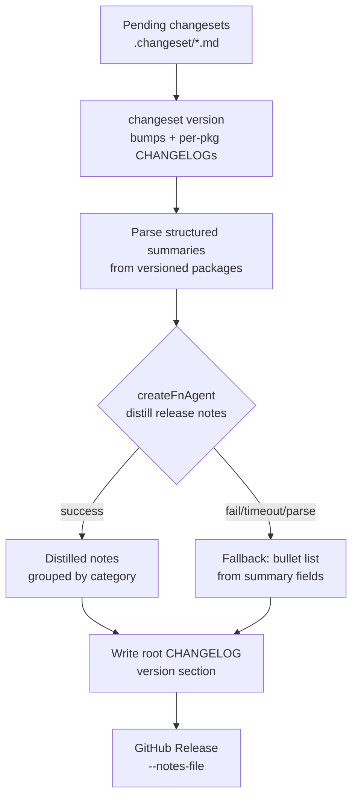
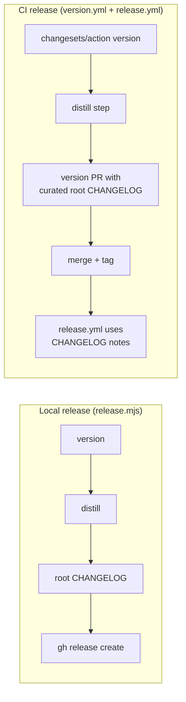

# feat: Better changelog — structured changesets + AI-distilled release notes

## Summary

Replace today's dense, agent-authored technical changeset paragraphs with a **structured, concise changeset schema** (end-user summary + category + optional dev detail), enforced by a linter. Add an **AI distillation step** at version time that transforms a release's collected changesets into clean, grouped, end-user-facing release notes, reusing the existing `createFnAgent` model-call seam. Unify both release paths (local `release.mjs` and CI `version.yml` / `release.yml`) behind a single distilled artifact so the root `CHANGELOG.md` and GitHub Release both carry the same user-facing notes.

## Problem Frame

AI agents currently author changesets as dense technical paragraphs — multi-sentence implementation detail, internal class names, and edge-case mechanics that serve developers, not the Fusion operators who read release notes. These aggregate into a 10,000+ line root `CHANGELOG.md` and flow unchanged into GitHub release notes via `extractVersionNotes`. The result is unwieldy: an end user reading "what changed in v0.46.0" wades through internal jargon about `reconcileOrphanedTaskDirs` recency windows and `dotGitPointerIsDangling` sentinels.

Two structural issues compound this:

1. No format constraint exists — changeset bodies are freeform markdown with no required fields, length cap, or audience guidance.
2. The two release paths produce **different** notes: the local release (`release.mjs`) extracts from the changeset-derived `CHANGELOG.md`, while CI (`release.yml`) uses GitHub's `generate_release_notes: true` (auto-generated from PR titles/commits). Neither produces a curated, user-facing summary.

---

## Requirements

### Changeset format

- R1. Each changeset body uses a structured schema with a required `summary` field (one line, user-facing, max 120 chars), a required `category` field (one of: `feature`, `fix`, `breaking`, `security`, `performance`, `internal`), and an optional `dev` field for developer/migration detail.
- R2. The `summary` is the only content that flows into end-user release notes by default. The `dev` field is preserved in per-package CHANGELOGs but excluded from distilled release notes unless the distillation model judges it user-relevant.
- R3. Existing freeform changesets are grandfathered during a transition period: the linter warns (not fails) when the structured fields are absent, giving the agent fleet time to adopt the new format.

### Linter

- R4. A changeset linter validates the structured schema and runs as part of the PR-check gate (`pr-checks.yml`) and `test:gate`, so malformed changesets block merge.
- R5. The linter enforces `summary` length (max 120 chars), valid `category` enum, and that only `@runfusion/fusion` appears in the frontmatter bump declarations (matching the single-package-publish reality).

### Distillation

- R6. At version time, a distillation step reads the version's changesets, calls `createFnAgent` with a release-notes system prompt, and produces grouped, user-facing release notes organized by category (New, Fixed, Breaking, etc.).
- R7. Distillation degrades gracefully: if the model call fails, times out, or returns unparseable output, the release proceeds using the structured `summary` lines as a fallback (bullet list by category), so a model outage never blocks a release.
- R8. The distillation step respects the same settings-driven model resolution as other AI features (title-summarizer model settings), so operators can point it at any configured provider/model.

### Release integration

- R9. The local release (`release.mjs`) uses distilled notes for both the root `CHANGELOG.md` version section and the GitHub Release notes, replacing the current `extractVersionNotes` raw-aggregation path.
- R10. The CI version workflow (`version.yml`) runs distillation after the changeset versioning step and writes the distilled notes into the root `CHANGELOG.md` before the version PR is created, so the merged version PR carries curated notes.
- R11. The CI binary release workflow (`release.yml`) uses the root `CHANGELOG.md` version section (already distilled) for the GitHub Release body instead of `generate_release_notes: true`, so both paths produce identical curated notes.

### Root CHANGELOG

- R12. The root `CHANGELOG.md` shows distilled end-user notes per version. Per-package `CHANGELOG.md` files retain the structured changeset entries (summary + category + dev detail) as the developer-facing record.

---

## Key Technical Decisions

- **Keep the changeset versioning engine, impose structure on bodies.** The `@changesets/cli` correctly handles the fixed-group cross-package semver (`config.json` `fixed` array). Re-implementing that is real risk for zero versioning benefit. The plan imposes a structured *content* schema on changeset bodies and adds a linter; the versioning engine stays untouched.

- **Structured body format, not new frontmatter.** Changeset frontmatter (`---"@runfusion/fusion": minor---`) is consumed by the changesets tool and must stay machine-parseable. The structured content (`summary`, `category`, `dev`) lives in the body as labeled fields, parsed by a lightweight reader. This avoids fighting the changesets tool's frontmatter contract.

- **Distillation via `createFnAgent` with `tools: "readonly"`.** The PR-metadata generator (`packages/dashboard/src/pr-metadata-generator.ts`) already proves this exact pattern: single-shot model call, `onText` accumulation, settings-driven model resolution, graceful fallback on parse failure. The distillation module mirrors that shape. No new model infrastructure is needed.

- **Distillation runs in `release.mjs` (local) and as a post-version step in `version.yml` (CI).** Both paths share the same `scripts/lib/distill-release-notes.ts` module. In CI, the step runs after `changeset version` produces per-package CHANGELOGs but before the version PR commit, so curated notes ship with the version bump. Model credentials in CI come from a GitHub secret mapped to the existing settings model resolution.

- **Root CHANGELOG becomes the distilled view; per-package CHANGELOGs stay developer-facing.** The root `CHANGELOG.md` is the user-facing artifact (linked from the dashboard Update banner, GitHub Release). Per-package CHANGELOGs remain the developer/integrator record with structured changeset entries. `syncRootChangelog` is replaced by a distillation-aware sync that writes the distilled notes as the version's root section.

---

## High-Level Technical Design

### Changeset body schema

```
---
"@runfusion/fusion": minor
---

summary: Add a Command Center productivity control for LOC backfills.
category: feature
dev: Uses the new `fn_backfill_loc` tool; settings key `commandCenter.locBackfill`.
```

The body is parsed as labeled fields. `summary` and `category` are required; `dev` is optional. Any freeform text not matching a labeled field is treated as legacy content and triggers a linter warning.

### Release-time distillation flow



### Two release paths unified



---

## Implementation Units

### U1. Structured changeset parser + schema

- **Goal:** Define the structured changeset body schema and ship a parser that extracts `summary`, `category`, and `dev` fields from a changeset markdown file, with legacy freeform fallback.
- **Requirements:** R1, R2
- **Dependencies:** none
- **Files:**
  - `scripts/lib/changeset-schema.mjs` (new) — schema constants (categories, max summary length), parse and validate functions
  - `scripts/__tests__/changeset-schema.test.mjs` (new)
- **Approach:** The parser reads a changeset `.md` file, splits frontmatter from body (reusing the `---` delimited convention), then extracts labeled fields (`summary:`, `category:`, `dev:`) from the body. Fields are parsed as `key: value` on the first line matching each label, with `dev` allowing multi-line content until the next labeled field or EOF. If no labeled fields are found, the entire body is treated as legacy `summary` (first line) with `category: internal` default and a `legacy: true` flag.
- **Patterns to follow:** `readChangesetSummaries` in `scripts/release.mjs` (frontmatter parsing pattern); `parseAiResult` in `packages/dashboard/src/pr-metadata-generator.ts` (lenient parse with null fallback).
- **Test scenarios:**
  - Happy path: parse a well-formed structured changeset with all three fields; assert each field is extracted correctly.
  - Multi-line `dev`: parse a changeset where `dev` spans multiple lines; assert full content captured.
  - Legacy freeform: parse an old-style changeset with a dense paragraph body and no labeled fields; assert `legacy: true`, `summary` is the first line, `category` defaults to `internal`.
  - Missing `category`: parse a changeset with `summary` but no `category`; assert validation flags it as missing.
  - Empty body: parse a changeset with frontmatter but empty body; assert graceful null return.
  - Summary over 120 chars: parse a changeset with an over-length `summary`; assert validation flags the violation.
- **Verification:** Parser unit tests pass; parser correctly handles all three existing changeset shapes (structured, legacy paragraph, minimal one-liner) found in `.changeset/`.

### U2. Changeset linter

- **Goal:** Ship a linter script that validates every changeset in `.changeset/` against the structured schema, enforcing required fields, summary length, category enum, and frontmatter package scope. Wire it into the PR-check gate.
- **Requirements:** R3, R4, R5
- **Dependencies:** U1
- **Files:**
  - `scripts/check-changeset-format.mjs` (new) — linter entrypoint
  - `scripts/__tests__/check-changeset-format.test.mjs` (new)
  - `.github/workflows/pr-checks.yml` (modify) — add changeset-format check step
  - `package.json` (modify) — add `check:changesets` script
  - `package.json` (modify) — add `check:changesets` to `test:gate` chain
- **Approach:** The linter scans `.changeset/*.md` (excluding `README.md` and `config.json`), parses each via U1's parser, and validates: `summary` present and <= 120 chars, `category` is a valid enum value, frontmatter declares only `@runfusion/fusion`. Legacy changesets (no structured fields) produce a **warning** (exit 0) during the transition period; structurally invalid changesets (partial fields, bad category, over-length summary) produce **errors** (exit 1). The warning-vs-error threshold is a `--strict` flag so the transition can be tightened later.
- **Patterns to follow:** `scripts/check-no-nohup.mjs`, `scripts/check-no-kill-4040.mjs` (existing lint-gate scripts that exit 1 on violation, integrated into `test:gate`).
- **Test scenarios:**
  - Valid structured changeset passes with exit 0 and no warnings.
  - Legacy freeform changeset passes with exit 0 and a warning (transition mode).
  - Missing `category` on a structured changeset fails with exit 1 and names the file.
  - Over-length `summary` (121+ chars) fails with exit 1.
  - Invalid `category` value (e.g., `enhancement`) fails with exit 1 and lists valid values.
  - `--strict` flag causes legacy changesets to fail (exit 1) instead of warn.
  - Empty `.changeset/` directory (excluding config/README) passes with exit 0.
  - Frontmatter declaring a non-`@runfusion/fusion` package fails with exit 1.
- **Verification:** `pnpm check:changesets` exits 0 against the current `.changeset/` directory (all existing entries are legacy and pass in transition mode). `pnpm test:gate` includes the check and passes.

### U3. AI distillation module

- **Goal:** Ship the distillation module that takes a version's parsed changesets and produces grouped, user-facing release notes via `createFnAgent`, with graceful fallback to a structured bullet list on any model failure.
- **Requirements:** R6, R7, R8
- **Dependencies:** U1
- **Files:**
  - `scripts/lib/distill-release-notes.ts` (new) — distillation orchestrator
  - `scripts/__tests__/distill-release-notes.test.ts` (new)
- **Approach:** The module accepts an array of parsed changeset entries (from U1), the target version, and an optional settings/model override. It builds a system prompt that instructs the model to produce grouped markdown release notes (sections: New, Fixed, Breaking, Performance, Security; omit empty sections), using only the `summary` fields as input and writing for a Fusion operator audience. It calls `createFnAgent` with `tools: "readonly"` and accumulates text via `onText`, mirroring `generatePrMetadata`. On success, the accumulated text is the release notes body. On any failure (model error, timeout, unparseable/empty output), the fallback builds a category-grouped bullet list directly from the structured `summary` fields — no model call. The module accepts an `AbortSignal` and timeout for release-script integration.
- **Execution note:** Start with a failing test for the fallback path (no model available) to lock the graceful-degradation contract before implementing the model-call path.
- **Patterns to follow:** `packages/dashboard/src/pr-metadata-generator.ts` (the canonical single-shot `createFnAgent` pattern: settings model resolution, `onText` accumulation, `AbortController` + timeout, try/finally `session.dispose()`, fallback on failure). `packages/engine/src/merger-ai.ts` (prompt-builder / verdict-parser separation for testability).
- **Technical design (directional):**

  ```
  distillReleaseNotes({
    entries: ParsedChangeset[],
    version: string,
    settings?: Settings,
    signal?: AbortSignal,
    timeoutMs?: number,
  }): Promise<{ notes: string; source: "ai" | "fallback" }>
  ```

  The system prompt instructs: produce markdown grouped under `### New`, `### Fixed`, `### Breaking`, `### Performance`, `### Security`; use the `summary` text verbatim or lightly edited for grouping; omit empty sections; no internal class names or implementation detail; audience is a Fusion operator.

- **Test scenarios:**
  - Fallback path: call with `createFnAgent` stubbed to throw; assert returns bullet list grouped by category, `source: "fallback"`, exit 0.
  - Fallback path: call with model returning empty string; assert fallback bullet list.
  - Fallback path: call with model returning non-markdown garbage; assert fallback bullet list.
  - AI path: call with model stubbed to return grouped markdown; assert notes match, `source: "ai"`.
  - Timeout: call with `timeoutMs: 1` and a slow stub; assert fallback fires.
  - Abort: call with a pre-aborted signal; assert fallback fires immediately.
  - Category grouping in fallback: pass entries with categories `feature`, `fix`, `breaking`; assert fallback groups them under correct headings and omits empty sections.
  - Legacy entries: pass entries with `category: internal` (legacy default); assert they appear in an "Internal" section or are omitted per audience rule.
  - Single entry: pass one entry; assert notes are well-formed with one bullet.
- **Verification:** Module unit tests pass with both stubbed model (AI path) and forced-failure (fallback path). Module produces valid markdown for the current pending changesets when run manually with a real model.

### U4. Release script integration (local path)

- **Goal:** Wire the distillation module into `release.mjs` so the local release produces distilled notes for both the root `CHANGELOG.md` and the GitHub Release.
- **Requirements:** R9, R12
- **Dependencies:** U1, U3
- **Files:**
  - `scripts/release.mjs` (modify) — replace `syncRootChangelog` + `extractVersionNotes` with distillation-aware versions
  - `scripts/lib/sync-root-changelog.mjs` (new, extracted from `release.mjs`) — refactored root CHANGELOG sync that accepts a distilled-notes override for the version section
  - `scripts/__tests__/sync-root-changelog.test.mjs` (new)
- **Approach:** After `pnpm release:version` runs (which bumps versions and writes per-package CHANGELOGs), the script reads the versioned changesets (now deleted from `.changeset/` by `changeset version`), so the changeset content must be captured **before** `changeset version` runs. Add a pre-version capture step that reads and parses all pending changesets via U1, then after versioning, passes the parsed entries to U3's `distillReleaseNotes`. The distilled notes replace the version's section in the root `CHANGELOG.md` (per-package CHANGELOGs are untouched — they carry the structured entries). The GitHub Release uses the distilled notes directly via `--notes-file`. Extract `syncRootChangelog` into its own module so it can accept the distilled-notes override.
- **Patterns to follow:** The existing `release.mjs` flow ordering (version → sync → build → commit → publish → tag → release). The `readChangesetSummaries` function already captures pre-version changeset content; extend it to use U1's parser.
- **Test scenarios:**
  - `syncRootChangelog` with distilled override: pass a version, existing root CHANGELOG content, and distilled notes; assert the version section is replaced with the distilled notes while other versions are preserved.
  - `syncRootChangelog` without override (fallback): pass no distilled notes; assert behavior matches current aggregation (backward compat for dry-runs without model).
  - Pre-version capture: mock `.changeset/` with structured entries; assert entries are captured before `changeset version` deletes them.
  - Pre-version capture with legacy entries: assert legacy entries are captured with `legacy: true` and still feed distillation.
- **Verification:** `pnpm release --dry-run` shows the captured changesets and proposed distilled notes without making changes. A real release produces a root `CHANGELOG.md` with the distilled version section and a GitHub Release with matching notes.

### U5. CI workflow integration

- **Goal:** Wire distillation into the CI version workflow (`version.yml`) and update the binary release workflow (`release.yml`) to use the curated notes.
- **Requirements:** R10, R11
- **Dependencies:** U3, U4
- **Files:**
  - `.github/workflows/version.yml` (modify) — add a post-version distillation step between `changeset version` and the version PR commit
  - `.github/workflows/release.yml` (modify) — replace `generate_release_notes: true` with `--notes-file` reading the root CHANGELOG version section
  - `scripts/ci-distill-release-notes.mjs` (new) — CI entrypoint that resolves model credentials from GitHub secrets, runs distillation, and writes the root CHANGELOG
- **Approach:** In `version.yml`, after `changesets/action` runs the version step (which calls `pnpm release:version`), add a new step that runs `node scripts/ci-distill-release-notes.mjs --version <version>`. This script reads the just-versioned per-package CHANGELOGs, extracts the structured entries for the new version, calls U3's distillation module with model settings resolved from a GitHub secret (`FUSION_RELEASE_MODEL_API_KEY` or similar, mapped through the existing settings model resolution), and writes the distilled notes into the root `CHANGELOG.md`. The version PR then carries curated notes. In `release.yml`, replace `generate_release_notes: true` with a step that extracts the version section from the root `CHANGELOG.md` (via `extractVersionNotes`) and passes it as `--notes-file`, so the GitHub Release matches the curated notes.
- **Patterns to follow:** The existing `version.yml` `changesets/action` integration; the `release.yml` `softprops/action-gh-release` usage.
- **Test scenarios:**
  - CI distillation entrypoint: mock per-package CHANGELOGs with structured entries; assert the script produces distilled root CHANGELOG section.
  - CI distillation with no model secret: assert the script falls back gracefully (bullet list) and does not fail the workflow.
  - `release.yml` notes extraction: given a root CHANGELOG with a distilled version section, assert `extractVersionNotes` returns the correct content for `--notes-file`.
  - `release.yml` notes extraction: version not found in CHANGELOG; assert fallback string is used.
- **Verification:** `version.yml` workflow run (manual dispatch) produces a version PR with a distilled root CHANGELOG section. `release.yml` GitHub Release body matches the root CHANGELOG version section.

### U6. Agent guidance + documentation update

- **Goal:** Update all documentation and agent-facing guidance so the agent fleet and human contributors author changesets in the new structured format.
- **Requirements:** R1, R3
- **Dependencies:** U1, U2
- **Files:**
  - `AGENTS.md` (modify) — update the "Finalizing Changesets" section with the structured format, field definitions, category enum, and examples
  - `RELEASING.md` (modify) — update the changeset authoring section with the new format
  - `docs/contributing.md` (modify) — update the changeset reference
  - `.changeset/README.md` (new) — template + format reference that `pnpm changeset` consumers see
- **Approach:** The AGENTS.md "Finalizing Changesets" section currently says "add a changeset" with a bump-type table. Expand it with the structured body schema: required `summary` (one line, user-facing, max 120 chars), required `category` (enum), optional `dev` (developer detail). Provide before/after examples showing the transformation from dense paragraph to structured fields. Note the linter enforcement and the transition period (legacy changesets warn, don't fail). Add a `.changeset/README.md` that `pnpm changeset` surfaces as the format guide.
- **Patterns to follow:** The existing AGENTS.md "Finalizing Changesets" section structure (bump types, rules table).
- **Test expectation:** none — documentation-only unit.
- **Verification:** AGENTS.md guidance matches the U1 schema and U2 linter rules exactly. A new contributor reading the docs can author a valid structured changeset without further guidance.

---

## Scope Boundaries

### Deferred for later

- Backfilling the existing 10,000-line root `CHANGELOG.md` history into the distilled format. Only future releases get the new treatment; historical versions retain their current content.
- A dashboard surface for browsing release notes in-app (beyond the existing Update banner link to GitHub). The plan covers the notes pipeline, not a new UI surface.
- Per-package CHANGELOG distillation (the per-package files keep structured entries; only the root CHANGELOG is distilled).
- Migration of the `@changesets/cli` tool itself to a custom versioning system.

### Outside this product's identity

- Replacing the changeset versioning engine with a commit-conventional or PR-derived changelog generator. The confirmed direction is structured changesets + distillation, not deriving from PRs.

---

## Risks & Dependencies

- **CI model credentials.** Distillation in `version.yml` requires a model API key available as a GitHub secret. If this is not configured, CI distillation must fall back gracefully (bullet list from summaries). The local release path is unaffected (uses the operator's local settings). This is the main operational dependency.
- **`createFnAgent` from a root script.** No existing root-level script imports `@fusion/*` packages (they are TS source resolved via workspace aliases). The distillation module is written in TypeScript and run via `tsx` (already a devDependency). The CI entrypoint is `.mjs` and shells to the TS module via `tsx`. If workspace resolution is problematic in the release context, the fallback is to shell out to a Fusion CLI one-shot (if one exists) or inline the model call. This is an execution-time unknown to resolve during U3.
- **Changeset capture timing.** `changeset version` deletes changeset files after consuming them. The pre-version capture step (U4) must read and parse changesets before `changeset version` runs. If the capture step is missed, the per-package CHANGELOGs (which contain the aggregated entries) can serve as a secondary source. The implementation should handle both paths.
- **Transition period ambiguity.** During the transition, a release may contain a mix of structured and legacy changesets. The distillation module and fallback must handle mixed input gracefully (legacy entries use the first-line-as-summary default).

---

## System-Wide Impact

- **Agent fleet behavior.** Every AI agent that completes a task with a changeset must author the new structured format. This is a behavioral change enforced by the linter and documented in AGENTS.md. The transition period prevents immediate breakage.
- **Release pipeline.** Both release paths (local and CI) gain a model-call step. The local path adds ~10-30 seconds for distillation. The CI path adds a step to the version workflow. Both degrade gracefully on model failure.
- **External consumers.** The root `CHANGELOG.md` and GitHub Release notes change shape (from raw changeset aggregation to curated, grouped notes). Users who parse the CHANGELOG programmatically may need to adjust. The per-package CHANGELOGs retain the changesets structure for npm consumers.

---

## Documentation / Operational Notes

- Operators running local releases (`pnpm release`) get distillation automatically using their configured model settings — no additional setup.
- CI distillation requires a GitHub secret for the model API key. Document the required secret name and settings shape in `RELEASING.md`.
- The `--strict` flag on the changeset linter allows tightening the transition: once all agents produce structured changesets, flip the gate from warning to error on legacy format.
- The distillation system prompt and category mappings are defined in `scripts/lib/distill-release-notes.ts` and can be tuned without code changes beyond the prompt string.
