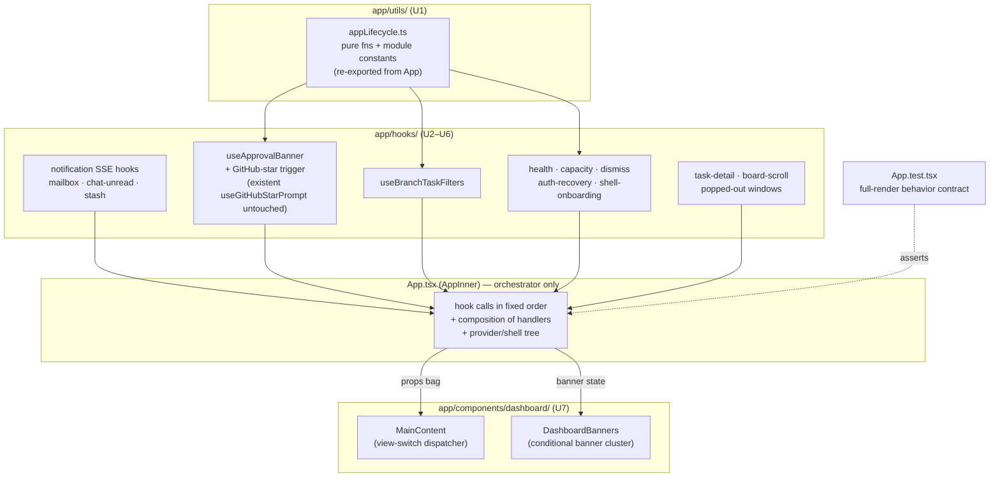

# refactor: Break the dashboard `App.tsx` into smaller modules

## Summary

A behavior-preserving decomposition of `packages/dashboard/app/App.tsx` (2,724 lines today; grandfathered at a 2,729-line ratchet baseline against `scripts/check-file-line-count.mjs`; a single ~2,350-line `AppInner` component): extract its inline state/effect/handler clusters into custom hooks under `app/hooks/`, its pure helpers and constants into `app/utils/`, and its two large render blocks into presentational components under `app/components/` — mirroring the codebase's existing conventions — with the explicit goal of graduating `App.tsx` below the 2,000-line file-count cap so it leaves the ratchet.

## Problem Frame

`App.tsx` is the Fusion dashboard's root component and its largest file by far. It is grandfathered at 2,729 lines (the ratchet baseline; the file is currently 2,724) against `scripts/check-file-line-count.mjs` (cap 2,000). Almost all of that bulk lives in one `AppInner()` function (lines ~352–2706), which interleaves ~25 `useState` calls, dozens of `useEffect`/`useMemo`/`useCallback` blocks, several SSE subscriptions and polling loops, the approval-banner dedupe state machine, and two large JSX render blocks — a ~650-line `renderMainContent()` view-switch and a ~430-line provider/header/sidebar/modals shell tree.

This is a maintenance and review hazard: every dashboard change edits the same monolith, behavior is hard to test in isolation, and the file's size is held in place only by a ratchet baseline rather than by design. The codebase already demonstrates the extraction target — `app/hooks/` holds ~95 custom hooks (including the 24 KB `useTasks`), and `AppInner` itself already consumes ~25 of them — so the inline logic is the remaining un-factored surface, and the conventions to factor it are established.

The work is strictly behavior-preserving: no feature, UX, or contract change. The success metric is concrete and machine-checked — drive `App.tsx` below 2,000 lines so it leaves the ratchet baseline — gated on the existing behavior contract (`App.test.tsx`, the exported pure-function unit tests) staying green.

---

## Requirements

### Behavior preservation

- R1. All existing dashboard behavior is preserved: no functional, UX, rendering, or timing change. Verified by `packages/dashboard/app/components/__tests__/App.test.tsx` (the 4,273-line full-render behavior contract), the exported pure-function unit tests, and a browser smoke check against a freshly built bundle.
- R2. The seven pure functions currently exported from `App.tsx` (`shouldShowFirstEverBootLoader`, `requiresNativeShellOnboarding`, `executeCliSessionBannerAction`, `getCliActionDisabledReasonForBanner`, `isSessionNeedingInputForBanner`, `didEnterAwaitingApproval`, `didEnterDone`) remain importable from `App` so their existing unit tests (`app/__tests__/App.boot-gate.test.tsx`, `App.shell-onboarding.test.tsx`, `app-cli-action-wiring.test.tsx`, and `App.test.tsx`) stay green without test edits.

### Structure and the line-count ratchet

- R3. `App.tsx` line count drops below 2,000, and the file is removed from the ratchet baseline (`scripts/line-count-baseline.json`) via the reviewed `--update` path so it can never regress.
- R4. Every new file is ≤ 2,000 lines and follows the established conventions: custom hooks return an object with `UseXxxOptions`/`UseXxxResult` interfaces and private helpers above the hook; imports are relative (no `@/` alias); no `any` in non-test code; no `eslint-disable react-hooks/exhaustive-deps`.

### Load-bearing invariants honored

- R5. The non-underscore `lazy()` view consts in `App.tsx` are unchanged; `packages/dashboard/app/__tests__/lazy-loaded-views-docs.test.ts` and the AGENTS.md "Lazy-Loaded Heavy Views" 20-view inventory stay green and unchanged.
- R6. The eager `import "./components/ChatView.css"` (lines 111–115) is preserved verbatim at the `App.tsx` top level — it is an intentional anti-lazy-load that prevents a flash of unstyled chat UI, documented only in that code comment.
- R7. React's rules-of-hooks and `AppInner`'s load-bearing hook-call ordering (the explicit "MUST be called before any conditional logic" sequence) are preserved; no hook becomes conditional as a result of extraction.
- R8. `FNXC:<Area>` requirement comments are carried into the extracted modules that own the behavior they describe and kept current (dated, greppable).

### Verification

- R9. The merge-blocking gate (`pnpm lint`, `packages/dashboard` typecheck, `pnpm build`) is green, `App.test.tsx` is green, and focused `renderHook` unit tests are added under `app/hooks/__tests__/` for the non-trivial extracted hooks (matching the `useUpdateCheck.test.ts` / `useAgents.test.ts` template).

---

## Key Technical Decisions

- KTD1. **Extraction strategy is hooks-first plus render-block splitting.** The inline state/effect/handler clusters become custom hooks (`app/hooks/`); the two large render blocks (`renderMainContent()` and the conditional-banner cluster) become presentational components (`app/components/`). This mirrors the codebase's dominant convention (95 existing hooks) and yields the biggest maintainability and line-count win. The full provider/shell wrapper (`AppShell`) is deferred — see Scope Boundaries — because hook + MainContent + Banners extraction alone clears the 2,000-line target, and wrapping the entire provider tree carries the most prop-drifting risk for the least marginal benefit. **Line budget (back-of-envelope, vs. the 2,724-line baseline):** U1 ~150, U2 ~170, U3 ~100, U4 ~50, U5 ~200, U6 ~80, U7 ~770 (MainContent ~640 + DashboardBanners ~130) — roughly 1,520 lines removed, landing `App.tsx` near ~1,200, comfortably under 2,000 even with a pessimistic extraction. `AppShell` is therefore a pure safety net, not load-bearing for R3.
- KTD2. **Pure helpers move to `app/utils/` with re-export shims in `App.tsx`** (acknowledged transient debt — see Deferred to Follow-Up Work). Rather than rewrite the import paths of the existing pure-function unit tests, the function bodies move to `app/utils/appLifecycle.ts` and `App.tsx` re-exports the seven tested symbols. The shim is intentionally partial: the complete cutover (re-pointing the test imports and dropping the re-export lines) is deferred to keep this change free of test churn; the shim is not an intentional long-term re-export surface.
- KTD3. **Extracted hooks mirror the `useAgents`/`useTasks` shape.** Object return value, `UseXxxOptions`/`UseXxxResult` interfaces, private helpers above the hook, and `readCache`/`writeCache` (`app/utils/swrCache.ts`) + `subscribeSse` (`app/sse-bus.ts`) exactly as the data hooks already use them.
- KTD4. **Preserve the single `task:updated` subscriber and its cross-concern wiring.** Today one `/api/events` subscription drives the approval-banner state machine, the first-done GitHub-star trigger, *and* a mailbox-count refresh inside the `task:updated`→`awaiting-approval` branch (App.tsx ~826). Extraction keeps `task:updated` + `approval:requested` banner logic in one hook (`useApprovalBanner`), which exposes an `onTaskEnteredAwaitingApproval: () => void` input that `AppInner` wires to `useMailboxUnread.refresh` so that count refresh still fires on exactly that transition. `useMailboxUnread` separately subscribes to `message:*` and `approval:*` count events (idempotent, and `subscribeSse` multiplexes them onto one shared `EventSource`). The banner trigger is never split across two `task:updated` handlers, preserving single-handler ordering.
- KTD5. **Verification posture = merge gate + behavior contract + targeted hook tests + browser smoke.** The merge gate (lint/typecheck/build) is the hard CI bar; `App.test.tsx` is the non-blocking behavior contract that must stay green; new `renderHook` tests cover hooks with real logic (dedupe, filtering, thresholding); a browser smoke against a freshly built bundle catches the jsdom-misses-stale-dist class of regression documented in `docs/solutions/`. No `any`, no exhaustive-deps disables, no changeset (private package + behavior-preserving).

---

## High-Level Technical Design

The decomposition splits `AppInner` along three seams — pure helpers, cohesive state clusters, and render blocks — each landing in the directory that already owns that concern.

The dependencies flow downward and rightward: utils feed constants/helpers to the hooks; hooks expose state + actions to `AppInner`, which stays the orchestrator (hook ordering, handler composition, the provider/shell tree); `AppInner` passes a props bag into the two extracted presentational components. `App.test.tsx` keeps rendering the real `<App/>`, so every extracted hook still runs for real unless the test mocks it by path.

---

## Scope Boundaries

**In scope:** `packages/dashboard/app/App.tsx` and the new modules it spawns under `app/utils/`, `app/hooks/`, and `app/components/dashboard/`.

**Out of scope (non-goals):**

- The separate terminal-dashboard TUI at `packages/cli/src/commands/dashboard-tui/app.tsx` (different file, different surface).
- Any reorganization of the `lazy()` view declarations or the `lazy-loaded-views-docs.test.ts` inventory.
- Any functional, UX, rendering, or timing change; new features; dependency additions or upgrades; changeset creation (private package + behavior-preserving).

### Deferred to Follow-Up Work

- **`AppShell` full-layout wrapper** — extracting the provider tree + `Header` + `LeftSidebarNav` + `ExecutorStatusBar` + `MobileNavBar` + floating windows + `AppModals` into one shell component. Highest prop-surface, lowest marginal benefit once U1–U7 land; pull in only if `App.tsx` is still over target after the other units (per the KTD1 line budget it should not be needed).
- **Re-pointing the seven pure-function test imports** from `'../../App'` to the new `app/utils/` module and dropping the KTD2 re-export shims. Deferred to avoid test churn inside a behavior-preservation change; the shim is explicitly transient debt, not a long-term surface.
- **Capturing the breakup's institutional knowledge** (module boundaries, hook seams, the FOUC-import and static-literal-lazy constraints) via `/ce-compound` — there is currently no `docs/solutions/` entry for an `App.tsx` decomposition.
- A dedicated `useMobileKeyboardFlags` hook for the ~30-line keyboard-flag + scroll-lock block; marginal and tightly coupled to `AppInner`'s `isMobile`/modal state.

---

## Implementation Units

The units are phased: U1 foundation → U2–U6 state extraction → U7 render extraction → U8 verification. Each unit is independently landable as one commit (U7 lands as two: `MainContent` then `DashboardBanners`) and should be verified against the gate (`pnpm --filter @fusion/dashboard typecheck`, `pnpm lint`) plus the relevant dashboard test project before the next begins.

### U1. Extract pure helpers and constants to `app/utils/appLifecycle.ts`

- **Goal:** Move the module-level pure functions and constants out of `App.tsx`, keeping `App`'s public exports stable via re-export so no existing test import breaks (KTD2).
- **Requirements:** R2, R3, R4.
- **Dependencies:** none.
- **Files:**
  - `packages/dashboard/app/utils/appLifecycle.ts` (new) — receives the moved definitions.
  - `packages/dashboard/app/App.tsx` (modify) — removes the definitions, imports them, and re-exports the seven tested symbols plus any types imported elsewhere (`ApprovalBannerCandidate`, `CliActionDeps`).
- **Approach:** Move `didEnterAwaitingApproval`, `didEnterDone`, `parseDateMs`, `loadApprovalBannerDismissals`, `persistApprovalBannerDismissals`, `buildRemoteDashboardUrl`, `shouldShowFirstEverBootLoader`, `requiresNativeShellOnboarding`, `isSessionNeedingInputForBanner`, `getCliActionDisabledReasonForBanner`, `executeCliSessionBannerAction`, and the `ApprovalBannerCandidate` and `CliActionDeps` interfaces into the new util, along with the module-level constants: the storage-key strings (`SETUP_WARNING_DISMISSED_KEY`, `WORKING_BRANCH_FILTER_STORAGE_KEY`, `BASE_BRANCH_FILTER_STORAGE_KEY`, `APPROVAL_BANNER_DISMISSED_STORAGE_KEY`, `CAPACITY_RISK_DISMISSED_KEY`), the `NO_BRANCH_FILTER_VALUE` sentinel, and the `RETRY_WARNING_RATIO` numeric threshold. `App.tsx` keeps `export { … } from "./utils/appLifecycle";` for the seven tested symbols so existing `from "../../App"` test imports resolve unchanged.
- **Patterns to follow:** existing `app/utils/` helpers (e.g. `boardScrollSnapshot.ts`, `mobileBarKeyboardFlags.ts`) — plain typed functions, no `any`, relative imports.
- **Test scenarios:**
  - The three pure-function test files import from `App` and pass unchanged; `App.test.tsx`'s use of `didEnterAwaitingApproval`/`didEnterDone` still resolves and passes (happy-path correctness regression check).
- **Verification:** `pnpm --filter @fusion/dashboard typecheck`, `pnpm lint`, and the three pure-function test files (`App.boot-gate.test.tsx`, `App.shell-onboarding.test.tsx`, `app-cli-action-wiring.test.tsx`) plus the pure-function assertions in `App.test.tsx` all green.

### U2. Extract notification SSE hooks (`useMailboxUnread`, `useChatUnreadBadge`, `useStashOrphanCount`)

- **Goal:** Extract the mailbox, chat, and stash badge state plus their SSE/poll wiring into self-contained hooks.
- **Requirements:** R1, R3, R4, R7.
- **Dependencies:** none (these clusters do not depend on U1's helpers).
- **Files:**
  - `packages/dashboard/app/hooks/useMailboxUnread.ts` (new)
  - `packages/dashboard/app/hooks/useChatUnreadBadge.ts` (new)
  - `packages/dashboard/app/hooks/useStashOrphanCount.ts` (new)
  - `packages/dashboard/app/hooks/__tests__/useMailboxUnread.test.ts`, `useChatUnreadBadge.test.ts`, `useStashOrphanCount.test.ts` (new)
  - `packages/dashboard/app/App.tsx` (modify — consume the three hooks)
- **Approach:** `useMailboxUnread(projectId)` owns `mailboxUnreadCount`/`mailboxPendingApprovalCount`, the `fetchUnreadCount` refresh, and the `message:*` and `approval:*` count-refresh SSE handlers (it subscribes to `approval:requested`/`approval:updated`/`approval:decided` for count refresh only). `useChatUnreadBadge(projectId, { taskView, quickChatOpen })` owns `chatHasUnreadResponse`, the `chat:message:added`/`chat:room:message:added` handlers, and the clear-on-chat-view effect. `useStashOrphanCount(projectId)` owns the 30-second `/stash-recovery/orphans` poll with its `cancelled` teardown. Per KTD4, the approval-banner *trigger* and the `task:updated` subscriber stay in `useApprovalBanner` (U3); the `task:updated`→awaiting-approval mailbox refresh is preserved via the `onTaskEnteredAwaitingApproval` callback wired in `AppInner`, not by a second `task:updated` handler. `subscribeSse` multiplexes, so multiple subscriptions to `/api/events` share one `EventSource`.
- **Patterns to follow:** `useAgents.ts` (KTD3) — SWR/cache hydration where relevant, `subscribeSse` with teardown, generation-counter stale suppression, object return + `UseXxxOptions`/`UseXxxResult` interfaces.
- **Test scenarios:**
  - `message:sent`/`message:received`/`message:read`/`message:deleted` each refresh the unread count; `approval:requested`/`approval:decided`/`approval:updated` refresh the count.
  - An assistant `chat:message:added` sets `chatHasUnreadResponse` when `taskView !== "chat"` and quick-chat is closed; a user-role message does not; opening chat/quick-chat clears it.
  - Project mismatch (`payload.projectId !== currentProject.id`) is ignored for chat.
  - Stash poll sets the count on success and falls back to `0` on error; the interval is cleared on unmount/project change.
  - Project switch re-subscribes (dependency on `currentProject?.id`).
- **Verification:** typecheck, lint, `pnpm --filter @fusion/dashboard test:quality:app:foundation-hooks-utils`, and `App.test.tsx` green.

### U3. Extract `useApprovalBanner` and the GitHub-star trigger

- **Goal:** Extract the approval-banner dedupe/dismiss state machine and the first-completed-task GitHub-star prompt, preserving the single `task:updated` subscriber and its mailbox-refresh side effect (KTD4).
- **Requirements:** R1, R3, R4, R7, R8.
- **Dependencies:** U1 (storage constants, `parseDateMs`, `loadApprovalBannerDismissals`/`persistApprovalBannerDismissals`, `didEnterAwaitingApproval`, `didEnterDone`).
- **Files:**
  - `packages/dashboard/app/hooks/useApprovalBanner.ts` (new) — owns `approvalBannerCandidate`, the `taskStatusByIdRef`/`seenApprovalKeysRef`/`approvalDismissalsRef` refs, the single `task:updated` and `approval:requested` handlers, the dismiss action, the per-`tasks` ref-sync effect, and the `onTaskEnteredAwaitingApproval` callback input.
  - `packages/dashboard/app/hooks/useGitHubStarPromptTrigger.ts` (new) — exposes `{ showGitHubStarPrompt, trigger, markShown }`; `trigger` is the function `useApprovalBanner`'s `task:updated` handler calls to flip the prompt on (`!gitHubStarPromptShown && didEnterDone(...)`), mirroring KTD4's `onTaskEnteredAwaitingApproval` callback for the star path. **Do not create or overwrite `useGitHubStarPrompt.ts`** — that file already exists and exports the persisted cross-tab flag `useGitHubStarPromptShown`/`markGitHubStarPromptShown` (a `useSyncExternalStore` flag imported at App.tsx:54 and consumed at App.tsx:724/2455); it stays untouched.
  - `packages/dashboard/app/hooks/__tests__/useApprovalBanner.test.ts` (new)
  - `packages/dashboard/app/App.tsx` (modify)
- **Approach:** This is the trickiest unit — it carries the stale-closure and effect-identity hazards documented in `docs/solutions/ui-bugs/skill-autocomplete-highlight-reset-on-swr-revalidation.md` and `docs/solutions/logic-errors/queued-chat-message-flush-trusts-stale-isgenerating.md`. Preserve exactly: the ref-sync effect that rebuilds `taskStatusByIdRef`/`seenApprovalKeysRef` from `tasks` on every change; the dedupe-by-key behavior; the dismissal timestamp comparison (`updatedAtMs <= dismissedAt` suppresses); clearing a key when a task leaves `awaiting-approval`; the `didEnterDone` → star-prompt trigger firing at most once; and the `refreshMailboxUnreadCount()` call inside the `awaiting-approval` branch, now expressed as the `onTaskEnteredAwaitingApproval` callback that `AppInner` wires to `useMailboxUnread.refresh`. The ephemeral star trigger lives in `useGitHubStarPromptTrigger`; the *suppression guard* remains the existing `useGitHubStarPromptShown` flag, so the trigger fires only when `!gitHubStarPromptShown && didEnterDone(...)`.
- **Patterns to follow:** `useAgents.ts` ref + generation-counter patterns (KTD3); keep dependency arrays faithful (plain comment, not an eslint-disable, for any intentionally-trimmed array).
- **Test scenarios:**
  - `approval:requested` for a new key triggers the banner; a repeat for the same key is a no-op.
  - A dismissal persists and suppresses re-trigger until a newer `updatedAtMs` arrives.
  - A `task:updated` to a non-`awaiting-approval` status clears the key and its dismissal.
  - `didEnterDone` (first transition to `done`) fires the star prompt exactly once; `gitHubStarPromptShown` suppresses it.
  - A `task:updated` entering `awaiting-approval` invokes `onTaskEnteredAwaitingApproval` (the mailbox refresh) exactly once.
  - Refs rebuild from a fresh `tasks` array without resetting live banner state spuriously.
- **Verification:** typecheck, lint, foundation-hooks-utils test run, and `App.test.tsx`'s approval-banner assertions green.

### U4. Extract `useBranchTaskFilters`

- **Goal:** Extract the working/base branch-filter state, its scoped persistence, and the derived options/filtered-tasks memos.
- **Requirements:** R1, R3, R4, R7.
- **Dependencies:** U1 (`WORKING_BRANCH_FILTER_STORAGE_KEY`, `BASE_BRANCH_FILTER_STORAGE_KEY`, `NO_BRANCH_FILTER_VALUE`).
- **Files:**
  - `packages/dashboard/app/hooks/useBranchTaskFilters.ts` (new)
  - `packages/dashboard/app/hooks/__tests__/useBranchTaskFilters.test.ts` (new)
  - `packages/dashboard/app/App.tsx` (modify)
- **Approach:** `useBranchTaskFilters({ boardSourceTasks, currentProjectId })` returns `{ branchFilter, baseBranchFilter, branchOptions, baseBranchOptions, filteredBoardTasks, onBranchFilterChange, onBaseBranchFilterChange }`. It must consume the already-resolved remote-aware `boardSourceTasks` (`isRemote && remoteData.tasks.length > 0 ? remoteData.tasks : tasks`), **not** raw `tasks`, so remote-node board filtering is preserved; `AppInner` passes `boardSourceTasks` in. It reads scoped values on project change via `getScopedItem`/`setScopedItem` (`app/utils/projectStorage.ts`) and recomputes `filteredBoardTasks` with the existing filter logic, including the `NO_BRANCH_FILTER_VALUE` ("no branch") sentinel that excludes tasks which *have* a branch. `branchOptions`/`baseBranchOptions` remain unique-sorted derivations of the task set.
- **Patterns to follow:** `useFavorites.ts` / `useProjectBookmarks.ts` for scoped-localStorage hydration hooks (KTD3).
- **Test scenarios:**
  - Initial mount reads the scoped value for the current project; project switch reloads both filters.
  - Changing a filter writes the scoped value and recomputes `filteredBoardTasks`.
  - `NO_BRANCH_FILTER_VALUE` excludes tasks with a non-empty branch; a concrete filter excludes non-matching branches; base-branch filter composes independently.
  - Options are unique and sorted; empty/whitespace branches are dropped.
  - Remote-node tasks flow through identically to local tasks (consumes `boardSourceTasks`).
- **Verification:** typecheck, lint, foundation-hooks-utils test run, and `App.test.tsx` board-filter behavior green.

### U5. Extract health, capacity, dismiss, auth-recovery, and shell-onboarding hooks

- **Goal:** Extract the parallel banner-dismiss flags, dashboard health, capacity-risk signal, auth-token recovery, and native-shell onboarding.
- **Requirements:** R1, R3, R4, R7.
- **Dependencies:** U1 (`SETUP_WARNING_DISMISSED_KEY`, `CAPACITY_RISK_DISMISSED_KEY`, `requiresNativeShellOnboarding`). `useCapacityRiskBanner` must be called after `useAgents()` and `useAppSettings()` so its inputs are defined (avoid TDZ).
- **Files:**
  - `packages/dashboard/app/hooks/useDashboardHealth.ts` (new) — `{ health, refreshing, refreshError, refresh, setHealth }`; mount fetch + `refreshDbCorruptionHealth`; preserves the `taskIdIntegrity` updater shape consumed by the banner.
  - `packages/dashboard/app/hooks/useCapacityRiskBanner.ts` (new) — options `{ agentStats, inProgressCount, inReviewCount, capacityRiskBannerEnabled, capacityRiskTodoThreshold, settingsLoaded, currentProjectId }`; returns `{ signal, dismissed, dismiss, hydrated }`; `computeCapacityRisk` over the counts + threshold; mirrors the settings-hydrate guard effect and the re-enable-clears-dismissal effect (App.tsx ~1111) inside the hook.
  - `packages/dashboard/app/hooks/useScopedDismissFlag.ts` (new) — options `{ storageKey, currentProjectId }`, returns `{ dismissed, dismiss }`; backed by `getScopedItem`/`setScopedItem` and **owns the project-change re-read effect** (re-run `getScopedItem` on `currentProjectId` change, App.tsx ~964–972) so a dismissal in one project does not leak into another. Powers the setup-warning dismiss (and is reused internally by `useCapacityRiskBanner` for its dismiss).
  - `packages/dashboard/app/hooks/useAuthTokenRecovery.ts` (new) — `{ open }`; the `AUTH_TOKEN_RECOVERY_REQUIRED_EVENT` window listener.
  - `packages/dashboard/app/hooks/useShellOnboarding.ts` (new) — `{ onboardingComplete, connectionManagerOpen, requiresOnboarding, setConnectionManagerOpen }`; the connection-manager open effect keyed on `openConnectionManagerSignal`/shell state.
  - Co-located `__tests__/` for the hooks with non-trivial logic.
  - `packages/dashboard/app/App.tsx` (modify)
- **Approach:** These are small, mostly-parallel clusters; group them as one unit to avoid a flurry of micro-commits while keeping each hook single-purpose. `useScopedDismissFlag` must own the project-change scoped re-read so dismissal state resets per project. The capacity-risk settings-hydrate guard (skip on first load or project change) must be preserved to avoid a spurious banner flash, and the re-enable-clears-dismissal behavior must be carried into `useCapacityRiskBanner`. The dashboard-health `setHealth` updater used by the `TaskIdIntegrityBanner` must keep its conditional status-derivation shape.
- **Patterns to follow:** `useUpdateCheck.ts` (KTD3; smallest mount-effect + dismiss template), `useScopedDismissFlag` mirrors the existing scoped-storage dismiss pattern.
- **Test scenarios:**
  - Health: mount fetch sets/errs to `null`; `refresh` sets `refreshing`, updates health, clears on success, sets `refreshError` on failure.
  - Capacity: signal computes from todo/in-progress/in-review/idle counts + threshold; dismiss persists scoped and hides; hydrate guard skips the first settings load and on project change; re-enabling the banner clears a prior dismissal.
  - Scoped-dismiss: dismiss writes scoped `"true"` and flips the flag; switching `currentProjectId` re-reads the scoped value so a dismissal in project A does not persist into project B.
  - Auth-recovery: the recovery event sets `open`.
  - Shell-onboarding: the connection-manager effect opens on the signal; `requiresOnboarding` follows the existing `requiresNativeShellOnboarding` logic.
- **Verification:** typecheck, lint, foundation-hooks-utils test run, and `App.test.tsx` banner/onboarding assertions green.

### U6. Extract task-detail, board-scroll, and popped-out-windows hooks

- **Goal:** Extract the main-panel task-detail state, board scroll snapshot/restore, and popped-out task windows.
- **Requirements:** R1, R3, R4, R7.
- **Dependencies:** none (consume the existing `app/utils/boardScrollSnapshot.ts` helpers).
- **Files:**
  - `packages/dashboard/app/hooks/useMainPanelTaskDetail.ts` (new) — `{ task, initialTab, open, close, setTask, setInitialTab }`.
  - `packages/dashboard/app/hooks/useBoardScrollRestore.ts` (new) — `{ capture, restore }` + the `requestAnimationFrame` double-frame restore effect keyed on `taskView`.
  - `packages/dashboard/app/hooks/usePoppedOutTasks.ts` (new) — `{ tasks, popOut, close }`.
  - Co-located `__tests__/` where logic warrants.
  - `packages/dashboard/app/App.tsx` (modify)
- **Approach:** These hooks expose primitives; `AppInner` stays the place that composes them with navigation-history pushes (`pushNav`), because the `popstate`↔React-state coordination documented in `docs/solutions/ui-bugs/navigation-history-stale-modal-stack.md` is fragile across the `App.tsx` + `AppModals.tsx` + `useModalManager` seam. Do not move the `pushNav`/`replaceCurrent`/`removeNav` composition out of `AppInner`. Preserve the double-`requestAnimationFrame` restore timing (with the `requestAnimationFrame`/`setTimeout` fallback) exactly.
- **Patterns to follow:** existing `boardScrollSnapshot.ts` util (KTD3); keep the `useRef` snapshot holders inside the hooks.
- **Test scenarios:**
  - Detail: `open(task, tab)` sets task + tab; `close` clears; `setTask` merges updates for the matching id only.
  - Scroll: capture stores the snapshot; restore fires on board remount via the rAF chain; both frame handles are cancelled on cleanup.
  - Popped-out: `popOut` dedupes by task id (re-pop is a no-op); `close` removes by id.
- **Verification:** typecheck, lint, foundation-hooks-utils test run, and `App.test.tsx` task-detail navigation assertions green.

### U7. Extract `MainContent` and `DashboardBanners` components

- **Goal:** Extract the two largest render blocks into presentational components under a new `app/components/dashboard/` directory.
- **Requirements:** R1, R3, R4, R5, R6, R8.
- **Dependencies:** U2–U6 (consumes the extracted hooks' outputs as props).
- **Files:**
  - `packages/dashboard/app/components/dashboard/MainContent.tsx` (new) — the `renderMainContent()` view-switch (~650 lines), as a pure presentational switch.
  - `packages/dashboard/app/components/dashboard/DashboardBanners.tsx` (new) — the conditional banner cluster (~15 banners).
  - `packages/dashboard/app/components/dashboard/types.ts` (new) — shared prop-bag interfaces to avoid drift between `App` and the two components.
  - `packages/dashboard/app/App.tsx` (modify — render the two components, keep the provider/shell tree inline).
- **Approach:** Land as separate commits within the unit (`MainContent` first, then `DashboardBanners`) since each is independently verifiable. `MainContent`'s prop bag is large (~80–100 fields across ~24 view branches), so keep branch-local consts and render-prop arrows (e.g. `closeSettingsView`, the `renderTaskCard` arrow, `pluginTasks`) co-located *inside* `MainContent` rather than threading them as props — this shrinks the surface to the data/handlers each branch actually needs. Define the remaining prop interfaces in `types.ts` and have `App` pass a composed props bag; `MainContent` is a pure `switch` on `taskView`/`viewMode` returning the existing `<PageErrorBoundary>`/`<Suspense>` subtrees unchanged. Carry every `FNXC:Navigation`/`FNXC:Settings`/`FNXC:TaskDetail` comment into the component that now owns its JSX. Keep the eager `./components/ChatView.css` import at the `App.tsx` top level (do **not** move it into `MainContent`) — R6. The "Settings renders ahead of the overview branch" ordering and the "board-opened task detail replaces the board" behavior must be preserved verbatim.
- **Patterns to follow:** existing presentational components (`Header.tsx`, `LeftSidebarNav.tsx`) (KTD3) — typed prop interfaces, co-located `.css` only if the component owns styles (these two own none — they compose existing styled children).
- **Test scenarios:**
  - `MainContent` renders the correct view for each `taskView` (board, list, settings, chat, mailbox, missions, agents, documents, pull-requests, insights, research, evals, memory, secrets, goalsView, todos, command-center, planning, workflows, import-tasks, automations, devserver, task-detail) and the `viewMode === "overview"` ProjectOverview branch.
  - Settings renders ahead of the overview branch when `taskView === "settings"` even with no project selected.
  - Backend-connection-error page renders when `showBackendConnectionErrorPage`.
  - `DashboardBanners` shows each banner only under its exact condition (test-mode, engine-unavailable, OAuth-relogin, session-needing-input, CLI-binary-install, onboarding resume/post-onboarding, update-available, merge-advance-notice, task-id-integrity anomaly, db-corruption, setup-warning, approval, GitHub-star, capacity-risk).
  - `App.test.tsx` DOM assertions (`getByTitle('Settings')`, `data-testid="dashboard-project-shell"`, banner presence) pass.
- **Verification:** typecheck, lint, `pnpm build`, `App.test.tsx` green, and a browser smoke against a freshly built bundle.

### U8. Verification, line-count graduation, and docs/test sync

- **Goal:** Confirm end-to-end behavior preservation, graduate `App.tsx` off the ratchet, and confirm the docs invariants are intact.
- **Requirements:** R1, R3, R5, R6, R8, R9.
- **Dependencies:** U1–U7.
- **Files:**
  - `scripts/line-count-baseline.json` (modify, via the reviewed `node scripts/check-file-line-count.mjs --update`).
  - `packages/dashboard/app/App.tsx` (final).
- **Approach:** Run the full dashboard suite (`pnpm --filter @fusion/dashboard test`), `pnpm lint`, `packages/dashboard` typecheck, and `pnpm build`. Run a browser smoke against a freshly built bundle using the worktree-safe recipe (`FUSION_CLIENT_DIR=$PWD/packages/dashboard/dist/client node packages/cli/bin.mjs dashboard --dev --port 4101 --token cetest123`; never port 4040, never `fn daemon`) to catch the stale-dist regression class. Confirm `App.tsx` is < 2,000 lines and remove it from the ratchet baseline via `--update` after review. Confirm `lazy-loaded-views-docs.test.ts` is green and the AGENTS.md 20-view inventory is unchanged. Audit that `FNXC` comments were carried into the new modules and that the seven pure functions are still re-exported from `App`.
- **Test expectation:** none — this is a verification harness; the assertions are the gate outputs and the line-count/file-inventory invariants.
- **Verification:** line-count audit passes with `App.tsx` removed from the baseline; the full merge gate green; `App.test.tsx` green; browser smoke shows no visual/behavioral regression.

---

## Risks & Dependencies

- **Stale-closure / effect-identity regressions during hook extraction.** Moving effects out of `AppInner` can subtly change when they fire (fresh array identities in dependency arrays re-triggered the SWR highlight bug; stale client state drove the queued-chat flush bug). Mitigation: preserve every effect's exact dependencies and ref semantics; prefer plain comments over trimmed arrays; `App.test.tsx` plus new `renderHook` tests as the regression net (KTD5). (`docs/solutions/ui-bugs/skill-autocomplete-highlight-reset-on-swr-revalidation.md`, `docs/solutions/logic-errors/queued-chat-message-flush-trusts-stale-isgenerating.md`)
- **`task:updated` cross-concern wiring.** The single `task:updated` handler drives approval, star, and mailbox refresh together (KTD4). Mitigation: keep one subscriber in `useApprovalBanner` and surface the mailbox refresh via the `onTaskEnteredAwaitingApproval` callback rather than duplicating the handler.
- **Navigation-history ↔ modal coordination desync.** The `pushState`/`popstate`/React-state alignment across `App.tsx` + `AppModals.tsx` + `useModalManager` is documented-fragile. Mitigation: keep nav composition in `AppInner` (U6); do not push it into the extracted hooks. (`docs/solutions/ui-bugs/navigation-history-stale-modal-stack.md`)
- **`eslint-disable react-hooks/exhaustive-deps` is a hard CI error** because the rule is unregistered in the flat config, and `pnpm test`/vitest never run ESLint so it only fails the PR Lint job. Mitigation: never use the directive; run `pnpm lint` locally on every unit. (`docs/solutions/build-errors/eslint-exhaustive-deps-rule-not-registered-fails-ci-lint.md`)
- **jsdom tests pass against source while the browser serves a stale dist.** A refactor can pass `App.test.tsx` yet ship a broken bundle. Mitigation: browser smoke against a freshly built bundle in U7/U8 (KTD5). (`docs/solutions/developer-experience/browser-testing-dashboard-from-worktree-safely.md`)
- **`lazy()` static-literal constraint.** Any temptation to abstract the lazy imports behind a helper/variable breaks Vite code-splitting and the inventory test. Mitigation: do not touch the lazy-const block (R5). (`docs/solutions/integration-issues/bundled-plugin-vite-alias-missing.md`)
- **Large prop surface on `MainContent`.** The view-switch closes over ~80–100 fields; threading them as props risks a dropped prop silently changing a view. Mitigation: shared `types.ts` interfaces, co-locating branch-local consts inside `MainContent` (U7), and the `App.test.tsx` per-view render assertions.

---

## Sources / Research

- `packages/dashboard/app/App.tsx` — the refactor target; structural read of the `AppInner` body (hook ordering, state clusters, the `renderMainContent()` switch at ~1611–2258, the shell tree at ~2272–2706).
- `packages/dashboard/app/hooks/useAgents.ts`, `useTasks.ts`, `useUpdateCheck.ts` — the hook-extraction templates (object return, `UseXxxOptions`/`UseXxxResult`, `readCache`/`writeCache` + `subscribeSse`, generation counters).
- `packages/dashboard/app/hooks/useGitHubStarPrompt.ts` — the existing persisted cross-tab flag hook (`useGitHubStarPromptShown`/`markGitHubStarPromptShown`); must not be clobbered by the new ephemeral trigger (U3).
- `packages/dashboard/app/sse-bus.ts` — confirms `subscribeSse` multiplexes same-URL subscribers onto one shared `EventSource` (KTD4).
- `packages/dashboard/app/components/__tests__/App.test.tsx` — the 4,273-line full-render behavior contract; mocks hooks/components by relative path and renders the real `<App/>`.
- `packages/dashboard/vitest.config.ts` — the ~11 project partition (new hook/util tests auto-route to `dashboard-app-quality-foundation-hooks-utils`; new component tests to `dashboard-app-quality-components-a/b`; the backfill project catches any unlisted new test).
- `scripts/check-file-line-count.mjs` + `scripts/line-count-baseline.json` — the 2,000-line cap with `App.tsx` grandfathered at 2,729 (file currently 2,724); `--update` is the reviewed graduation path.
- `packages/dashboard/app/__tests__/lazy-loaded-views-docs.test.ts` — the 20-view (14 App-level + `_`-prefixed embedded) inventory guard over `App.tsx` and `AppModals.tsx`.
- `AGENTS.md` — merge-gate definition, changeset rule (no changeset for behavior-preserving refactors), `FNXC` comment convention, Lazy-Loaded Heavy Views inventory.
- `docs/solutions/` — the six learnings cited in Risks & Dependencies (eslint-disable, browser-testing, navigation-history modal stack, SWR highlight reset, queued-chat stale flush, bundled-plugin Vite alias).
- `STRATEGY.md` / `CONCEPTS.md` — domain vocabulary (Surface, Workflow Runtime, Task) used to keep the plan in project terms.
