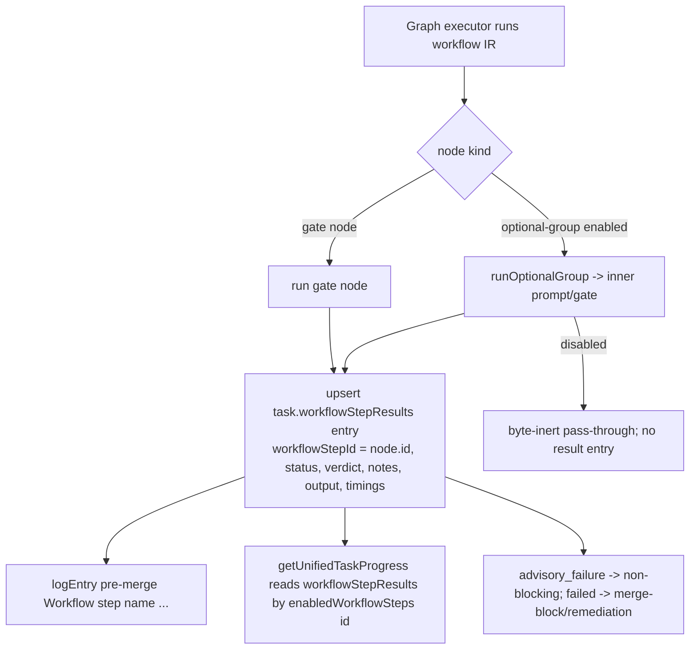

# refactor: Make workflow steps fully graph-native and remove the legacy workflow-step system

> **Revision note (2026-06-26, post ce-doc-review):** Six reviewers (coherence, feasibility, adversarial, scope-guardian, product-lens, design-lens) reshaped this plan. Two foundational decisions changed:
> - **Results model (KTD-1):** the graph writes the **existing `task.workflowStepResults` field keyed by node id** — NOT a new `workflow_run_node_results` table. This avoids an upgrade data-loss regression for `in-review`/`autoMerge:false` tasks and collapses most of U2+U3. The earlier sibling-table spike was reverted.
> - **Migration (KTD-7 / U7):** reconcile with the **existing migration 109 fragment scheme** (legacy `workflow_steps` → graph `fragment` WorkflowDefinitions, idempotency via `workflow_steps.migrated_fragment_id`) instead of inventing node-injection into read-only built-in workflows (which is infeasible).
>
> **Shipped so far:** U1 is committed (`dd1b9603b`) and resolves the original FN-7039 report.

## Summary

Workflow quality-gate steps (e.g. `browser-verification`, `code-review`) run as `optional-group` prompt/gate nodes inside the workflow graph (`builtin:coding` already replaced its legacy `workflow-step` seam node with optional-group nodes). But only the **legacy** path — `runWorkflowSteps()` in `packages/engine/src/executor.ts` — ever *records* per-step status (into `task.workflowStepResults`) and emits `[pre-merge] Workflow step …` logs. Graph-run steps record nothing, so the unified progress bar stays empty; and a separate store bug downgraded enabled built-in group ids to legacy `WS-xxx` rows the graph never matched (FN-7039).

This plan makes workflow steps run **entirely** through the graph: the graph records outcomes into the existing `task.workflowStepResults` field keyed by node id (which the progress bar already reads), emits logs, and the legacy `workflow_steps` table / `runWorkflowSteps` path / `WORKFLOW_STEP_TEMPLATES` catalog / `/api/workflow-steps` REST surface / Settings management UI are removed. Existing projects migrate via the established fragment scheme.

**Key framing the review clarified:** "remove all legacy code" means removing the legacy `workflow_steps` **table**, the `runWorkflowSteps` **execution path**, the **templates catalog**, and the **management UI/API** — NOT the `task.workflowStepResults` **field**, which becomes the graph's output sink (an existing, already-persisted Task field — no new persistence wiring, no migration data loss).

---

## Problem Frame

1. **Enabled steps silently didn't run (FIXED in U1).** `Store.optionalGroupIdSet()` returned an empty set when no workflow resolved, so a built-in group id collided with a template id and was materialized into a `WS-xxx` row the graph never matched. Fixed by falling back to `builtin:coding`. (`docs/solutions/logic-errors/optional-group-toggle-id-remapped-by-step-materializer.md`.)
2. **Graph steps record nothing (visibility).** Optional-group nodes run via the graph but never write `task.workflowStepResults` (only `runWorkflowSteps()` does), and emit no `[pre-merge]` logs. `getUnifiedTaskProgress()` (`packages/dashboard/app/utils/taskProgress.ts:56-88`) keys off `workflowStepResults` + `enabledWorkflowSteps`, so graph-run steps never show status.
3. **Two parallel systems (architecture debt).** The legacy `workflow_steps` table, `WORKFLOW_STEP_TEMPLATES`, `/api/workflow-steps`, the Settings UI, and `runWorkflowSteps()` duplicate what graph nodes now express.

**Goal:** one system. Graph nodes execute, record into `task.workflowStepResults` (existing field) keyed by node id, emit logs, and drive the progress bar. The legacy table/path/catalog/UI are deleted; existing data migrates via fragments.

---

## Scope Boundaries

**In scope**
- (Done) Fix `optionalGroupIdSet` + create-time UI fallback (U1).
- Graph records `task.workflowStepResults` keyed by node id + emits `[pre-merge]` logs.
- Progress bar / Workflow tab read graph-written `workflowStepResults` (already wired); drop the `workflowStepNameLookup` dependency on deleted DB rows; specify all render states.
- Remove `runWorkflowSteps()` + the `workflow-step` seam primitive; rework the watchdog; make the graph unconditional; fail-closed on the store-fallback branch.
- Remove the `workflow_steps` table + store CRUD, `/api/workflow-steps*` routes + client fns, Settings → Workflow Steps UI.
- Delete `WORKFLOW_STEP_TEMPLATES` (inline into IR builders); keep plugin templates as an optional-group palette.
- Migration reconciled with the existing fragment scheme; drop `workflow_steps` after migration.

**Out of scope (non-goals)**
- Redesigning workflow IR, `foreach`/step-inversion, merge/branch-group lifecycle, the brand rename.
- Removing the `task.workflowStepResults` field (it is the graph's output sink — kept).
- Changing how implementation `Task.steps[]` are parsed/executed.

### Deferred to Follow-Up Work
- A dedicated graph run-history model (multi-run, multi-attempt verdict history). `workflowStepResults` is latest-status-only by design (see KTD-3); rework history (REVISE→APPROVE) is not preserved.
- A migration-time operator notice listing converted custom steps beyond an audit log entry.

---

## Key Technical Decisions

### KTD-1. Graph writes the existing `task.workflowStepResults` field, keyed by node id
The graph records each enabled optional-group / gate node's outcome as a `WorkflowStepResult` with `workflowStepId = node.id` (the same id the per-task `enabledWorkflowSteps` toggle uses, kept identity-stable by KTD-6). `getUnifiedTaskProgress` already reads `workflowStepResults` keyed by `workflowStepId === enabledWorkflowSteps[i]`, so the progress bar works with near-zero dashboard change. **Rejected:** a new `workflow_run_node_results` table (sibling to the foreach-only `workflow_run_step_instances`) — it required a results backfill to avoid upgrade data loss, a new read route, and dashboard prop re-threading, for a multi-run dimension the latest-status UI doesn't use. **Rejected:** reusing `workflow_run_step_instances` (foreach-shaped PK; gates don't fit). The `workflowStepResults` field is a Task field that already persists today (no six-edit-site `rowToTask` work) and survives upgrades untouched (no migration data loss).

### KTD-2. The graph is the only execution path; `runWorkflowSteps` is deleted, but `workflowStepResults` (the field + its store update path) stays
`builtin:coding` already routes steps through optional-group nodes (`builtin-coding-workflow-ir.ts:31` — "REPLACING the legacy `workflow-step` seam node"). Delete `runWorkflowSteps()`, the `workflow-step` seam primitive/handler (`runtime-primitives.ts:182`, `workflow-node-handlers.ts:264-267,355-363`), and the legacy `execute()` step calls — **but keep `store.updateTask({workflowStepResults})`** (`store.ts:8041`) since the graph now writes through it. Make the graph unconditional and resolve the store-fallback branch (see KTD-5).

### KTD-3. Progress + Workflow tab read graph-written `workflowStepResults`; latest-status-only
`workflowStepResults` is already on the task payload, so no new route. Drop the `workflowStepNameLookup` plumbing (`App.tsx:796`, built from deleted DB rows); names come from `result.workflowStepName` (the graph writes it). Recording is **upsert by node id within a run** — latest status only; a REVISE→fix→APPROVE rework cycle overwrites the prior verdict (acceptable; rework history is a deferred non-goal, stated so in the Workflow tab copy).

### KTD-4. Delete `WORKFLOW_STEP_TEMPLATES`; inline into IR builders; keep plugin step-templates as an optional-group palette
Inline `name/description/prompt/toolMode/gateMode` literals into `builtin-browser-verification-group.ts:29` / `builtin-code-review-group.ts:27` and delete the array + materialization helpers. **Plugin-contributed** templates (`plugin-loader.ts:1196`, `setPluginWorkflowStepTemplates`) remain as a palette the editor/migration project into optional-group nodes.

### KTD-5. Fail-closed on the store-fallback branch (the legacy `execute()` calls are NOT all dead)
`maybeExecuteWorkflowGraph` returns `false` when the store lacks `getTaskWorkflowSelection` (minimal/older stores), so the legacy `runWorkflowSteps` calls at `executor.ts:8220/9050/9326` ARE reachable for those stores. When deleting the legacy path, convert that fallback to a **closed-fail** (or minimal graph re-entry) rather than a silent skip — a silent skip is the exact FN-7039 failure class. Add a guard test asserting a store without the selection API fails closed, not silently.

### KTD-6. Identity-stable enable ids end-to-end (shipped in U1; preserved here)
`resolveEnabledWorkflowSteps` passes enable ids through unchanged; the graph records `workflowStepId = node.id`; the migration generates node ids that survive create AND update/toggle store paths. Regression test uses a colliding id and round-trips through the store.

### KTD-7. Migration reconciles with the existing fragment scheme (migration 109)
Migration 109 already converts legacy `workflow_steps` rows into graph `fragment` WorkflowDefinitions, stamping idempotency via `workflow_steps.migrated_fragment_id` (`db.ts:400-419`, `db.ts:4900-4912`). U7 must **extend/reconcile** this — not invent node-injection into read-only built-in workflows (`updateWorkflowDefinition` throws on `isBuiltinWorkflowId`). Plugin-originated rows migrate from their **persisted** `name/prompt/toolMode/gateMode/phase` (self-contained; the plugin may be absent at upgrade). Deterministic ids only (no `Date.now()` / editor `newNodeId`). **Requires a research spike first** (how fragments execute today and how `enabledWorkflowSteps` maps onto them) before the migration is authored.

---

## High-Level Technical Design

### Target execution + recording flow

### Before → after

| Concern | Before | After |
|---|---|---|
| Execution | `runWorkflowSteps()` over `enabledWorkflowSteps` | graph optional-group / gate nodes only |
| Result store | `task.workflowStepResults` written by legacy path | `task.workflowStepResults` written by the graph (same field) |
| Step definitions | `workflow_steps` table + `WORKFLOW_STEP_TEMPLATES` | inlined in IR builders + plugin palette → optional-group nodes |
| Progress source | `workflowStepResults` + `workflowStepNameLookup` (DB rows) | `workflowStepResults` (name from result) — lookup deleted |
| Management UI/API | Settings → Workflow Steps, `/api/workflow-steps*` | removed (create-time optional toggles remain) |
| Legacy data | `workflow_steps` rows | migrated via fragment scheme; table dropped |

---

## Implementation Units

### U1. Fix the root-cause id downgrade and the create-time UI fallback — SHIPPED (`dd1b9603b`)
`optionalGroupIdSet` falls back to `builtin:coding`; QuickEntryBox/TaskForm resolve `builtin:coding` when no default workflow. Store regression tests (colliding id, create + update round-trip) pass. No further work.

### U2. Graph records `task.workflowStepResults`; emit `[pre-merge]` logs
**Goal:** Each enabled optional-group / gate node upserts a `WorkflowStepResult` (keyed by node id) into `task.workflowStepResults` and emits parity logs. Disabled groups record nothing (byte-inert).
**Requirements:** Problem Frame #2; KTD-1, KTD-2, KTD-3.
**Dependencies:** none (U1 shipped).
**Files:**
- `packages/engine/src/workflow-graph-executor.ts` — at the optional-group enabled branch (~476-520): record a `pending` entry at start and upsert the terminal entry after `runOptionalGroup`. Extract the inner node's verdict/notes/output/model.
- `packages/engine/src/workflow-graph-loop.ts` (`runOptionalGroup`) — return the exit template node's verdict/output so the executor can record it.
- `packages/engine/src/executor.ts` — a fail-soft persistence adapter that upserts `task.workflowStepResults` by `workflowStepId === node.id` via the existing `store.updateTask({workflowStepResults})` path (read current, replace/append the entry, write); extract the `[pre-merge]` log shapes (`executor.ts:13067/13088/13120` + "using model" `13598`) into a shared helper reused by the graph path.
- Test: `packages/engine/src/__tests__/builtin-coding-workflow-step-results.test.ts` (new).
**Approach:** Map APPROVE/APPROVE_WITH_NOTES → `passed`; REVISE → `advisory_failure` (advisory) or `failed` (gate; surfaces as the group failure outcome); group failure → `failed`. Upsert by node id within the run (latest status). No new table/type/store methods — reuse `WorkflowStepResult` + the existing update path.
**Patterns to follow:** the existing `workflowStepResults` writes in `runWorkflowSteps` (`executor.ts:12898-13170`) for shape + log parity; `mapWorkflowStatus` in `taskProgress.ts`.
**Test scenarios:**
- APPROVE → one `workflowStepResults` entry `passed`, `[pre-merge] Workflow step '<name>' completed` log, "using model" log.
- REVISE advisory → `advisory_failure`, non-blocking; REVISE gate → `failed`, blocks.
- Disabled group → no entry (byte-inert).
- Rerun of same node within a run → entry upserted (not duplicated); latest status wins.
- Covers FN-7039: a run with `code-review` enabled records a `code-review` entry with the reviewer verdict; `browser-verification` enabled records its entry.

### U3. Wire progress bar + Workflow tab to graph-written results; specify all render states
**Goal:** Enabled steps appear in the step counter / progress bar and flip to terminal state from graph execution; the Workflow tab renders graph results with full state coverage.
**Requirements:** Problem Frame #2; KTD-3; design-lens findings.
**Dependencies:** U2.
**Files:**
- `packages/dashboard/app/utils/taskProgress.ts` — `getUnifiedTaskProgress` already reads `workflowStepResults`; remove the `workflowStepNameLookup` parameter dependency (name from `result.workflowStepName`); add a `running` (in-progress) state mapping.
- `packages/dashboard/app/App.tsx` (~774-799) — delete the `fetchWorkflowSteps`→`workflowStepNameLookup` plumbing and its prop threading (MainContent/RightDock/Board/Lane/WorktreeGroup/TaskCard).
- `packages/dashboard/app/components/WorkflowResultsTab.tsx` — read graph results; specify empty/loading/error/never-run states; remove the embedded legacy step picker.
- `packages/dashboard/app/components/TaskCard.tsx` (~1074), `ListView.tsx` — adjust call sites.
- Tests: `taskProgress.test.ts`, `WorkflowResultsTab.test.tsx`, TaskCard progress tests.
**Approach (render-state spec — from design-lens):**
- States: `pending` (enabled, not run), `running` (graph node active), `passed`, `advisory_failure`, `failed`, `skipped`. **Disabled** optional steps are excluded from the counter/bar (only enabled steps count).
- Visual distinction: `advisory_failure` = amber/warning (non-blocking, "returned feedback — not blocking merge"); `failed` = red/error (blocks). Overall task progress reads complete when only advisory steps returned REVISE.
- Mobile (`max-width:768px, max-height:480px`): compact `X/Y` step count, no full bar (specify once so each surface matches).
- Workflow tab states: (1) none enabled → empty message; (2) enabled, never run → pending copy; (3) loading → skeleton; (4) fetch error → error/retry. Tests assert each renders, not just "no crash".
**Test scenarios:** 6 impl steps + 2 enabled steps (one passed, one advisory_failure) → 8 items, counts/labels correct, desktop + mobile; running state visible mid-execution; disabled step excluded from count; advisory vs failed visually distinct; Workflow tab all four states; covers FN-7039 (both steps appear with real status).

### U4. Delete `runWorkflowSteps` + the `workflow-step` seam; keep the `workflowStepResults` write path; rework callers
**Goal:** Remove the legacy execution path; the graph is the sole executor; preserve reliability invariants.
**Requirements:** Problem Frame #3; KTD-2, KTD-5.
**Dependencies:** U2, U3 (graph recording + UI live first).
**Files:**
- `packages/engine/src/executor.ts` — delete `runWorkflowSteps()` (`12873-13171`); delete the legacy `execute()` step calls (`8220/9050/9326`); **resolve the store-fallback branch to fail-closed** (KTD-5); rework the watchdog caller `recoverCompletedTask` (`3684-3760`) to re-enter the graph (see contract below); delete the primitive `runWorkflowStep` handler (`5388-5450`) and seam `workflowStep` handler (`5560-5611`). **Keep** `store.updateTask({workflowStepResults})`.
- `packages/engine/src/runtime-primitives.ts` — remove `runWorkflowStep` (`17`, `182-186`).
- `packages/engine/src/workflow-node-handlers.ts` — remove `workflow-step` seam dispatch + the `workflowStep` legacy-seam field.
- `packages/core/src/types.ts` — KEEP `WorkflowStepResult` (still the graph's output type + used by `task-merge.ts:177`, `eval-signal-collector.ts:12`). Only remove `WorkflowStepInput`/legacy-step-specific types that become unused.
- Tests: update/remove engine tests asserting `runWorkflowSteps`; the reliability backstop `workflow-interpreter-cutover.test.ts`.
**Watchdog re-entry contract (from adversarial/feasibility):** specify resume-vs-fresh-run for a stranded completed task (stable runId `${task.id}:${definition.id}`), how the recovery "any-failure-including-REVISE is hard" policy maps onto graph advisory-vs-gate semantics, completion-interceptor registration so the graph owns the in-review/back-for-fix transition, and coexistence with the existing in-flight/duplicate guards (`3688-3694`). Not a one-liner.
**Test scenarios:** watchdog recovery re-runs pending steps via the graph and records results (no `runWorkflowSteps`), including the REVISE/advisory divergence; store without `getTaskWorkflowSelection` fails closed (not silent no-op); grep-guard: no remaining `runWorkflowSteps`; reliability invariants hold (file-scope, `autoMerge:false`, hard-cancel).

### U5. Remove the legacy `workflow_steps` store surface, REST routes, and management UI
**Goal:** Delete the CRUD/management surface (keep the `workflowStepResults` write path from U4).
**Requirements:** Problem Frame #3.
**Dependencies:** U6 (materializer removal is coupled to template deletion), U7 (migration consumes the table before DDL/store removal).
**Files:**
- `packages/core/src/store.ts` — remove `createWorkflowStep`/`listWorkflowSteps`/`getWorkflowStep`/`updateWorkflowStep`/`deleteWorkflowStep`; simplify `resolveEnabledWorkflowSteps` to pass-through. (The materializer helpers `getBuiltInWorkflowTemplate`/`ensureWorkflowStepForTemplate`/`toBuiltInWorkflowStep` move to U6 since they are template-coupled.)
- `packages/dashboard/src/routes.ts` — remove `/api/workflow-steps` GET/POST/PATCH/DELETE/refine (`2896-3217`) and `/api/workflow-step-templates/:id/create`.
- `packages/dashboard/app/api/legacy.ts` — remove client fns (`5219-5250`, `5612-5614`).
- Dashboard: remove Settings → Workflow Steps manager + template chooser.
- Tests: remove `routes-agents.test.ts` workflow-step suites; update SettingsModal tests.
**Affordance enumeration (from design-lens, FN-6115 pattern) — remove and verify absent at desktop + mobile:** (1) the Settings sidebar/tab entry for "Workflow Steps"; (2) any route/nav link to it; (3) Add/Edit/Delete buttons + their aria-labels; (4) empty wrappers/shells left after removal. Add a grep-guard test that removed aria-label strings are absent.
**Test scenarios:** `/api/workflow-steps*` absent; no client references; Settings has no manager + no orphaned shells (desktop + mobile); create-time optional toggles still work.

### U6. Delete `WORKFLOW_STEP_TEMPLATES`; inline into IR; remove materializer; keep plugin palette
**Goal:** Remove the catalog + the template-materialization helpers; IR builders self-contained; plugin steps remain via palette.
**Requirements:** KTD-4.
**Dependencies:** none (independent of U5/U7; must precede U5's store cleanup and U7's mapping).
**Files:**
- `packages/core/src/types.ts` — delete `WORKFLOW_STEP_TEMPLATES`; retire/keep-internal `WorkflowStepTemplate` for the plugin palette only.
- `packages/core/src/builtin-browser-verification-group.ts`, `builtin-code-review-group.ts` — inline literals (remove `WORKFLOW_STEP_TEMPLATES.find`).
- `packages/core/src/store.ts` — remove `getBuiltInWorkflowTemplate`/`ensureWorkflowStepForTemplate`/`toBuiltInWorkflowStep` (template-coupled materializer).
- `packages/core/src/index.ts` — remove `WORKFLOW_STEP_TEMPLATES` export.
- `packages/core/src/plugin-loader.ts` + `setPluginWorkflowStepTemplates`/`resolvePluginWorkflowStep` — repoint to feed the optional-group palette / editor `stepTemplateToNode` (`WorkflowNodeEditor.tsx:284`).
- Docs: `docs/PLUGIN_AUTHORING.md`.
- Tests: builtin IR parity tests; plugin-palette tests.
**Test scenarios:** builtin IR validates + produces identical optional-group nodes after inlining; a plugin step appears in the editor palette as an optional-group node; no remaining `WORKFLOW_STEP_TEMPLATES` import (grep guard).

### U7. Migration — reconcile legacy `workflow_steps` with the fragment scheme; drop the table
**Goal:** Existing projects' legacy steps continue to run under the graph after `runWorkflowSteps` deletion; the table is dropped. **Research spike first** (KTD-7).
**Requirements:** KTD-7, KTD-6; "old projects should migrate."
**Dependencies:** U6 (IR builders self-contained), and runs before U5's table/store removal.
**Files:**
- (Spike output) a short note in this plan / task doc on how migration 109 fragments execute and how `enabledWorkflowSteps` (WS-xxx) maps onto fragment/optional-group nodes today.
- `packages/core/src/db.ts` — `applyMigration(130, …)` (next free number is now 130 again — the sibling-table migration was reverted; confirm `SCHEMA_VERSION` is 129 before bumping to 130); reconcile with the 109 fragment path (extend or supersede, honoring `migrated_fragment_id` idempotency); `DROP TABLE workflow_steps` after backfill.
- `packages/core/src/workflow-ir.ts` / `workflow-ir-types.ts` — reuse `validateOptionalGroup` for any authored nodes; deterministic ids (`migrated-<slug>-<rowId>`).
- Tests: seed-at-129 migration test (seed legacy rows incl. a custom + a plugin-originated row, run `init()`, assert they still run via the graph and the table is dropped; colliding id round-trips).
**Approach:** Map built-in WS-xxx enable ids → optional-group node ids; custom + plugin-originated rows migrate from their persisted fields via the fragment mechanism (not re-resolved from a possibly-absent plugin/template). Built-in workflows are read-only — do NOT edit their IR; use the fragment path. Idempotent (re-run safe); deterministic ids.
**Test scenarios:** seed-at-129 with built-in row → enable id maps to group node id; custom row → fragment/node carries its prompt + runs + records a result; plugin-originated row with plugin absent → still migrates from persisted fields; `SCHEMA_VERSION === 130`; repo-root `toBe(129)` sweep clean; idempotent (double `init()` no double-inject).

### U8. Docs, changeset, learning capture
**Goal:** Update docs + ship metadata.
**Dependencies:** U1-U7.
**Files:** `docs/workflow-steps.md` (rewrite legacy API/templates/runWorkflowSteps sections to the graph-native model + migration behavior + the new custom-step authoring story via the editor); `docs/settings-reference.md`; `.changeset/fn-7039-workflow-steps-graph-native.md` (extend the existing one — `@runfusion/fusion` minor); verify AGENTS lazy-view inventory.
**Test scenarios:** `Test expectation: none — docs/changeset.` `pnpm check:changesets` passes.

---

## System-Wide Impact

- **Engine:** graph becomes the sole executor; watchdog reworked; store-fallback fails closed; reliability invariants re-verified.
- **Core/DB:** migration reconciled with fragments + table drop; `SCHEMA_VERSION` bump touches plugin workspaces (version sweep). `workflowStepResults` field unchanged (no data loss).
- **Dashboard:** progress bar / Workflow tab read graph-written results (near-zero change); Settings management UI + `/api/workflow-steps*` removed.
- **Plugins:** templates keep working as optional-group palette entries; legacy plugin-originated rows migrate from persisted fields.
- **Operators:** per-task step selections AND existing recorded results preserved across upgrade; create-time toggles show under `builtin:coding`. New custom quality gates are authored via the workflow editor (optional-group nodes) rather than a Settings form — document this (a cognitive-load change; product-lens).

---

## Risks & Mitigations

- **Upgrade data loss (RESOLVED by KTD-1).** Keeping `workflowStepResults` as the graph's sink means in-review/done tasks retain recorded status across upgrade — no backfill needed.
- **Silent legacy fall-through (high).** Store-fallback branch must fail closed (KTD-5); grep guards for `runWorkflowSteps`/legacy writers; assert real wiring on prototypes, not mocks.
- **Watchdog recovery regression (high).** Specify the re-entry contract (KTD-2/U4); test the REVISE/advisory divergence.
- **Migration infeasibility (RESOLVED by KTD-7).** Reconcile with the proven fragment scheme; no edits to read-only built-ins; research spike before authoring.
- **Surface-enumeration regressions (medium).** Desktop + mobile, all render states, fresh vs upgraded DB, removed-affordance cleanup.
- **Plugin breakage (medium).** Preserve palette; migrate plugin rows from persisted fields; test a plugin step end-to-end.
- **Rework-history loss (low, accepted).** `workflowStepResults` is latest-status-only; stated in KTD-3 + Workflow tab copy.

---

## Surface Enumeration

- **Execution producers:** graph optional-group nodes, graph gate nodes, watchdog recovery, store-fallback branch, (removed) `runWorkflowSteps`, (removed) `workflow-step` seam.
- **Result sink:** `task.workflowStepResults` (now graph-written); foreach `workflow_run_step_instances` (unchanged, separate).
- **Display surfaces:** TaskCard progress (desktop + mobile), ListView/Board/Lane/WorktreeGroup, Workflow tab, dependency-graph plugin node progress.
- **Render states:** pending, running, passed, advisory_failure, failed, skipped, disabled (excluded from count).
- **DB states:** fresh DB vs upgraded (seed-at-129); built-in vs custom vs plugin-originated legacy rows.
- **Workflow modes:** `builtin:coding`, `builtin:stepwise-coding`, custom workflows with/without optional groups; stores lacking `getTaskWorkflowSelection` (fail-closed).

---

## Symptom Verification (FN-5893)

- **Original symptom:** A task with `browser-verification` enabled (no project default workflow) is marked done without the step running, and enabled steps don't appear in the progress bar (FN-7039).
- **Exact reproduction:** Create a task, no `workflowId`, no project `defaultWorkflowId`, `enabledWorkflowSteps: ["browser-verification"]`; run through the executor; inspect stored enable ids, logs, `workflowStepResults`, and the unified progress model.
- **Assertion it is gone:** Enable id stays `browser-verification` (U1, done); the graph runs the step; a `workflowStepResults` entry keyed by node id is recorded with a terminal status (U2); a `[pre-merge]` log is emitted; `getUnifiedTaskProgress` shows the step with the recorded status across desktop + mobile (U3).

---

## Open Questions

- **OQ-1 (RESOLVED):** Results model — graph writes `task.workflowStepResults` keyed by node id (KTD-1). No new table.
- **OQ-2 (research spike, U7):** Exactly how migration 109 fragments execute and how `enabledWorkflowSteps` maps onto them — resolve before authoring migration 130.

---

## Sources & Research

- Codebase: `store.ts` (`optionalGroupIdSet`/`resolveEnabledWorkflowSteps` 4358-4402, `updateTask` workflowStepResults 8041, built-in read-only guard 15234, workflow-step CRUD 14522-14867), `executor.ts` (`runWorkflowSteps` 12873-13171, seam/primitive 5388-5611, reachability 7381-7384, store-fallback `return false`, watchdog 3684-3760, call sites 3720/5402/5569/8220/9050/9326), `workflow-graph-executor.ts:476-520`, `db.ts` (fragment migration 109 at 400-419/4900-4912, `SCHEMA_VERSION` 165), `types.ts` (`WorkflowStepResult` 797-822), `taskProgress.ts:56-88`, `App.tsx:774-799`, `WorkflowResultsTab.tsx`, builtin IR builders, `WorkflowNodeEditor.tsx:284`.
- Learnings: `optional-group-toggle-id-remapped-by-step-materializer.md`, `workflow-native-runtime-primitives.md`, `schema-version-constant-must-equal-highest-migration.md`, `schema-version-sweep-must-include-plugin-workspaces.md`, `task-field-silently-dropped-without-sqlite-column-mapping.md`, `branch-group-single-pr-synthetic-id-dead-wiring.md`.
- Review (2026-06-26 ce-doc-review): coherence (circular deps, migration numbering), feasibility (fragment scheme 109, built-in read-only), adversarial (blob option, data loss, store-fallback not dead, latest-only), product-lens (data loss, authoring path, rollback), design-lens (render states), scope-guardian (stale-vs-shipped, OQ-1 settled).
