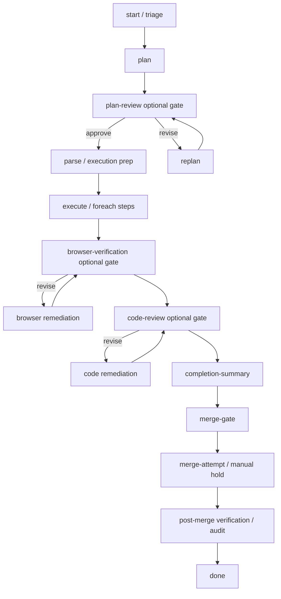

# Workflow Node Lifecycle Authority Plan

## Goal Capsule

| Field | Value |
|---|---|
| Objective | Move workflow behavior that needs ordering, retries, status visibility, optional toggles, and restart recovery into explicit workflow nodes or node regions, while keeping hard safety invariants in the engine, store, and merger. |
| Authority | User requirements in this session: workflow and graph nodes should own transitions where possible; code review must block; plan review must happen before execution and route failures back through planning; workflow tasks must never bypass merge; completion summaries must be agent-generated as part of workflow execution; browser verification, plan review, and code review must be optional across built-ins; ntfy notifications must cover workflow task flows; custom workflows should keep executing sensible node sequences without bespoke engine patching. |
| Execution profile | Deep architecture refactor across workflow IR definitions, workflow graph execution, optional review loops, merge lifecycle handling, recovery routing, notifications, dashboard workflow authoring, and focused regression tests. |
| Stop conditions | Do not remove engine safety checks, merge proof checks, lease/idempotency protections, self-healing backstops, or `autoMerge:false` manual holds. Do not hide workflow failures by silently moving tasks to `done`, `in-review`, or `failed` outside graph policy. |
| Tail ownership | Implement in units. Each unit should ship with focused tests and a changeset when it changes published `@runfusion/fusion` behavior. |

---

## Product Contract

### Summary

Fusion workflow behavior is currently split across built-in graph definitions, executor handoff seams, optional-step helpers, task-store status mutations, merger finalization, self-healing, and dashboard affordances. That split caused repeated regressions: tasks skipped merge, code review failures advanced to review, plan review failed without starting a session, stale pause-abort markers surfaced as operator-required graph failures, retries did not clear the right state, and task cards showed workflow state inconsistently.

The target model is not "everything lives in the workflow." The workflow should own visible lifecycle policy: what node runs next, what review gates block, what remediation loop follows a failed review, what optional steps are enabled, when summary generation runs, when merge is requested, and which status/notification transition is intended. The engine, store, merger, and self-healing layers should enforce invariants that cannot be trusted to workflow authors: task locking, idempotency, branch cleanliness, merge proof, file-scope safety, contamination recovery, and safe recovery after crashes.

### Requirements

- R1. Workflow-owned lifecycle behavior with ordering, retry, optional-step, visibility, and notification semantics must be represented as graph nodes or graph transition policy whenever possible.
- R2. Engine, store, merger, and self-healing retain hard invariant enforcement: locks, leases, merge proof, branch safety, idempotency, file-scope checks, and restart-safe recovery.
- R3. Built-in workflows must all include optional Plan Review, optional Code Review, optional Browser Verification, and an agent-generated completion summary node where the workflow is a full task flow rather than a fragment.
- R4. Quick Fix keeps Plan Review, Code Review, and Browser Verification default-off, while full coding-style workflows keep the requested default-on/default-off defaults.
- R5. Plan Review must be ordered before execution on the task card and workflow definition, must keep the task in the planning/triage phase while reviewing, and must route a failed review through a replan node before execution continues.
- R6. Code Review must block merge/review advancement on REVISE or failure, and remediation should be modeled as a graph loop rather than executor-only fix scheduling.
- R7. Browser Verification should use the same optional gate/remediation model as code review, with workflow-specific gate/advisory policy.
- R8. Completion summaries for workflow tasks must be produced by an agent workflow node and projected onto the task before merge/done, with engine fallback only for backward compatibility or recovery.
- R9. Merge lifecycle must never be bypassed. A workflow task may reach `done` only after merge/integration proof or a bounded no-merge terminal policy. No-merge terminal policy is allowed only for explicit non-code, fragment-only, or no-worktree flows; full built-in task flows cannot opt in.
- R10. Workflow-based task flows must send ntfy/webhook notifications for meaningful lifecycle transitions, including review, failure, merge hold, merge success, and recovery-driven requeue.
- R11. Custom workflow authors should get sane execution from reusable primitives. A graph that has a valid next node should keep executing without requiring bespoke per-workflow executor code.
- R12. Self-healing should prefer proving state and re-enqueueing the correct workflow node over directly moving columns. Direct status mutation remains reserved for invariant repair and bounded recovery.
- R13. Existing in-flight tasks and stored workflow specs must remain compatible. Fallback shims are acceptable during migration but should be narrow, logged, and covered by tests.
- R14. The finalization guard that prevents workflow tasks from reaching `done` without merge proof must land before broader review-loop or recovery refactors, so the current merge-bypass failure class is closed while the architecture work proceeds.

### Scope Boundaries

- In scope: built-in workflow IRs, graph node contracts, optional gate groups, review/remediation loops, merge node handling, workflow task runtime, executor node projection, task-store transition intent, notifications, recovery routing, dashboard workflow authoring warnings, docs, and tests.
- Out of scope: deleting self-healing, removing merger safety checks, broad DB rewrites, replacing the task store, changing all custom workflows in user projects automatically, or weakening `autoMerge:false`.
- Out of scope: making arbitrary unsafe custom graphs succeed. The goal is graceful validation, clear blocking errors, and sensible primitives, not ignoring invalid workflow definitions.

### Acceptance Examples

- AE1. Given Plan Review returns REVISE, the task does not advance to parse/execution. The graph schedules a replan/planning node, updates the task card to show plan review failed or needs revision, and resumes Plan Review after the plan is updated.
- AE2. Given Plan Review later approves, the graph advances to parse and execution exactly once instead of repeatedly reviewing the already-approved plan.
- AE3. Given Code Review returns REVISE, the graph blocks completion/merge and schedules remediation. The task does not move to `in-review`, `done`, or merge while the review is unresolved.
- AE4. Given a workflow reaches completion summary, the node runs as an agent-authored prompt step, projects `task.summary`, and the summary remains visible on the task before merge/done.
- AE5. Given merge is requested, a merge work item starts or resumes. The task cannot be marked `done` unless merge proof, already-on-main proof, or an explicit no-merge policy is present.
- AE6. Given the engine restarts during plan review, code review, browser verification, summary generation, or merge, recovery re-enqueues the correct node/work item rather than parking the task in `in-review` or `failed` with stale pause-abort state.
- AE7. Given a custom workflow omits a summary node, validation warns or built-in defaults can add one where appropriate; execution still respects merge proof and does not silently skip merge.
- AE8. Given ntfy is configured, workflow tasks emit notifications for blocked review, failure, manual merge hold, done, and recovery requeue transitions.
- AE9. Given any full task workflow, built-in or custom, reaches a terminal done path without merge proof, the runtime blocks finalization and parks it in a merge-required or unsafe-workflow state with a run-audit event.

---

## Planning Contract

### Key Technical Decisions

- KTD-1. Split policy ownership from invariant enforcement.
  Workflow nodes own lifecycle policy: order, gates, loops, optional-step state, visible status, notifications, and task projections. Engine/store/merger own non-negotiable invariants: locks, idempotency, branch safety, merge proof, file-scope enforcement, and bounded crash recovery.

- KTD-2. Promote lifecycle seams into reusable node primitives.
  Completion summaries, review remediation, replan, merge request, merge wait/manual hold, post-merge verification, and notify transitions should become reusable nodes or node regions. Built-ins should compose these primitives instead of depending on special executor branches.

- KTD-3. Keep fallback shims narrow and observable.
  Some executor/runtime fallback remains necessary for old stored specs or interrupted tasks. Fallbacks must log run-audit events, avoid changing graph policy, and be covered by compatibility tests.

- KTD-4. Make optional gate groups the single source of review toggles.
  Plan Review, Code Review, and Browser Verification should be represented consistently as optional groups with explicit default state, graph position, pass/fail outcomes, and remediation routes.

- KTD-5. Treat merge as a workflow region backed by an early finalization guard.
  The graph can request and sequence merge work, but only merger/finalizer proof can transition to `done`. The proof guard ships before the broader merge-region refactor so custom or broken workflows cannot bypass integration while this plan is still in progress.

- KTD-6. Move recovery toward node requeue.
  Self-healing should classify stale state and requeue the right graph node or work item. It should directly mutate task status only when repairing impossible or unsafe state.

- KTD-7. Validate custom workflows for missing lifecycle primitives.
  Custom workflow authors should see warnings for missing summary, missing merge proof region, unreachable optional gates, or review gates without failure routes. Warnings should guide without preventing intentionally advanced workflows unless the graph is unsafe.

### High-Level Target Flow



### Code Areas To Ground The Work

- Built-in workflow definitions: `packages/core/src/builtin-workflows.ts`, `packages/core/src/builtin-coding-workflow-ir.ts`, `packages/core/src/builtin-stepwise-coding-workflow-ir.ts`, `packages/core/src/builtin-stepwise-final-review-coding-workflow-ir.ts`, `packages/core/src/builtin-marketing-workflow-ir.ts`, `packages/core/src/builtin-lead-generation-workflow-ir.ts`.
- Optional gate groups and shared primitives: `packages/core/src/builtin-code-review-group.ts`, `packages/core/src/builtin-plan-review-group.ts`, `packages/core/src/builtin-browser-verification-group.ts`, `packages/core/src/builtin-completion-summary-node.ts`.
- Runtime execution: `packages/engine/src/workflow-graph-executor.ts`, `packages/engine/src/workflow-task-runtime.ts`, `packages/engine/src/executor.ts`, `packages/engine/src/workflow-node-handlers.ts`, `packages/engine/src/workflow-work-processor.ts`, `packages/engine/src/workflow-work-scheduler.ts`.
- Merge/finalization: `packages/engine/src/workflow-merge-nodes.ts`, `packages/engine/src/auto-merge-finalization.ts`, `packages/engine/src/merger.ts`, `packages/engine/src/project-engine.ts`.
- Recovery and transitions: `packages/engine/src/self-healing.ts`, `packages/core/src/store.ts`, notification services, and run-audit emitters.
- Dashboard authoring and task cards: workflow editor, task detail workflow step rendering, task card step-status rendering, quick-add optional step controls.

### Assumptions

- The current completion-summary node work is the first extraction candidate and should be finished before broader refactors.
- No database migration is required for the first implementation units; node config and task projection can use existing workflow spec/task metadata surfaces.
- Existing built-in workflow IDs should stay stable. Behavior changes should come from IR updates and node contracts, not ID churn.
- Custom workflows can be validated and warned without forcibly rewriting stored definitions.
- Self-healing remains a required backstop because workflows can be invalid, engines can crash, and branches can drift.

### Stored-Spec Compatibility Matrix

| Stored spec shape | Compatibility behavior | Verification target |
|---|---|---|
| Spec has no `completion-summary` node | Runtime fallback may generate one summary once, then newer built-ins include the node explicitly. | Summary is recorded once and the graph does not double-write on retry. |
| Spec has Plan Review but no `replan` loop | Existing plan-review failure behavior is converted into the new replan work item or parked with a clear compatibility event. | Failed Plan Review does not start execution and does not repeat approval review forever. |
| Spec has Code Review or Browser Verification without remediation loop | Blocking failure schedules the compatible remediation path; advisory mode records and continues only when explicitly configured. | REVISE cannot advance to summary, merge, review, or done. |
| Spec has merge nodes but no explicit merge-request/merge-finalize region | The early finalization guard blocks `done` without proof and recovery requeues merge work where proof is missing. | Retry/restart starts or resumes merge rather than marking done. |
| Spec is fragment-only, non-code, or no-worktree by design | A bounded no-merge terminal policy may allow terminal completion with audit metadata. | Full task flows cannot use this policy accidentally. |
| Spec has stale pause-abort or interrupted work markers | Self-healing clears stale markers and requeues the owning node/work item when proof says no engine is paused. | User retry and engine restart resume the right node without operator-only failure. |

### Sequencing and Dependency Plan

1. Ship U0 first because the current unsafe class is tasks reaching `done` without merge proof. This guard is an invariant, not an optional workflow refinement.
2. Finish U1 next because it is the smallest proof that a former executor-side lifecycle behavior can be expressed as a graph node with task projection and compatibility fallback.
3. Ship U2 before U3 because Plan Review owns the boundary between planning and execution. Code/browser remediation loops should not be layered on top of a still-ambiguous plan-to-execution transition.
4. Ship U3 before U4 because merge safety depends on knowing that blocking review gates cannot leak into summary or merge.
5. Ship U4 before U5 because post-merge verification has no stable trigger until merge proof and merge resumption semantics are settled.
6. Ship U6 after U2-U4 define the transition events worth notifying. Add notifier coverage incrementally if a unit introduces a new transition before U6 lands.
7. Ship U7 after the node/work-item contracts in U2-U4 exist. Recovery cannot reliably requeue a graph region until those regions are explicit.
8. Ship U8 last as the authoring and validation layer over the proven runtime primitives.

The first safe slice is U0 plus focused merge-proof finalization tests. The next safe slice is U1 plus compatibility tests around summary projection. The next safe slice after that is U2 with one built-in coding workflow and one restart scenario. Avoid starting broad self-healing rewrites until at least one review/remediation loop and the merge region have focused green tests.

---

## Implementation Units

### U0. Install the early merge-proof finalization guard

- **Goal:** Close the immediate merge-bypass failure class before broader workflow-node extraction proceeds.
- **Requirements:** R2, R9, R13, R14
- **Files:**
  - `packages/engine/src/auto-merge-finalization.ts`
  - `packages/engine/src/workflow-task-runtime.ts`
  - `packages/engine/src/workflow-merge-nodes.ts`
  - `packages/engine/src/project-engine.ts`
  - `packages/core/src/store.ts`
- **Approach:** Add or tighten the finalization guard so full task workflows cannot move to `done` unless merge proof, already-on-main proof, or a bounded no-merge terminal policy is present. Record a run-audit event when the guard blocks a terminal path. Treat no-merge policy as explicit and narrow: fragment-only, non-code, or no-worktree flows only.
- **Test Scenarios:**
  - Built-in coding workflow cannot finalize `done` before merge proof.
  - Custom full task workflow with a terminal done edge before merge is blocked.
  - Fragment-only or explicit non-code/no-worktree workflow can complete only when the no-merge policy is explicitly set and audited.
  - Retry after a blocked finalization starts or resumes merge work rather than marking done.
- **Verification:** Add focused finalization and workflow-runtime tests before implementing later units.

### U1. Finish the completion-summary node contract

- **Goal:** Complete the current extraction of task completion summaries into a workflow node so built-in workflows generate an agent-authored summary before merge/done.
- **Requirements:** R1, R3, R8, R13
- **Files:**
  - `packages/core/src/builtin-completion-summary-node.ts`
  - `packages/core/src/builtin-workflows.ts`
  - `packages/core/src/builtin-coding-workflow-ir.ts`
  - `packages/core/src/builtin-stepwise-coding-workflow-ir.ts`
  - `packages/core/src/builtin-stepwise-final-review-coding-workflow-ir.ts`
  - `packages/core/src/builtin-marketing-workflow-ir.ts`
  - `packages/core/src/builtin-lead-generation-workflow-ir.ts`
  - `packages/engine/src/executor.ts`
  - `packages/engine/src/workflow-completion-summary.ts`
  - `packages/engine/src/workflow-task-runtime.ts`
- **Approach:** Keep the shared node config small: readonly prompt, `summaryTarget: "task"`, stable node ID, and built-in insertion before merge/review terminal regions. The executor should project the node output to `task.summary`. Runtime fallback should remain only for stored specs that lack the node or interrupted tasks that reached completion without a summary.
- **Test Scenarios:**
  - Every full built-in workflow contains exactly one `completion-summary` node before merge/done.
  - Fragments such as PR workflow fragments are excluded.
  - A custom node with `summaryTarget: "task"` projects the agent output to `task.summary`.
  - Runtime fallback does not double-write when the graph node already produced a summary.
- **Verification:** Run focused core built-in tests and engine workflow task runtime/graph task runner tests.

### U2. Convert Plan Review failure into an explicit replan loop

- **Goal:** Make Plan Review a true pre-execution gate with an explicit failure route back to planning, then continue execution after the revised plan is approved.
- **Requirements:** R1, R3, R5, R12, R13
- **Files:**
  - `packages/core/src/builtin-plan-review-group.ts`
  - Built-in workflow IR files that place `plan-review`
  - `packages/engine/src/workflow-graph-executor.ts`
  - `packages/engine/src/workflow-task-runtime.ts`
  - `packages/engine/src/executor.ts`
  - Task card/workflow detail rendering tests
- **Approach:** Add or formalize a `replan` node/region as the failure target for Plan Review. A failed Plan Review should not be expressed as an executor pause or terminal failure. It should write review feedback, run the planner/replan node, return to Plan Review, and advance to parse only after approval. The task should remain visually in planning/triage until execution starts.
- **Test Scenarios:**
  - Plan Review appears before parse/execution in workflow definitions and task card step lists.
  - Plan Review REVISE schedules replan and does not start execution.
  - Replan success returns to Plan Review.
  - Plan Review APPROVE after replan advances to parse exactly once.
  - Engine restart during Plan Review or replan resumes the same graph region.
- **Verification:** Add focused workflow graph tests plus dashboard step-order rendering tests.

### U3. Model Code Review and Browser Verification remediation as graph loops

- **Goal:** Replace executor-only optional-step fix scheduling with graph-owned remediation loops for Code Review and Browser Verification.
- **Requirements:** R1, R3, R6, R7, R12, R13
- **Files:**
  - `packages/core/src/builtin-code-review-group.ts`
  - `packages/core/src/builtin-browser-verification-group.ts`
  - Built-in workflow IRs
  - `packages/engine/src/workflow-graph-executor.ts`
  - `packages/engine/src/executor.ts`
  - `packages/engine/src/workflow-node-handlers.ts`
- **Approach:** Define standard review outcomes: approve/pass, revise/fail, advisory failure, and exhausted remediation. Gate mode should decide whether failure blocks. Blocking failures route to remediation nodes that run implementation work with review feedback, then return to the gate. Advisory failures record findings and continue only when the workflow explicitly says advisory.
- **Test Scenarios:**
  - Code Review REVISE blocks summary/merge and schedules remediation.
  - Code Review APPROVE allows summary/merge.
  - Browser Verification default-off can be enabled and blocks only when configured as a gate.
  - Optional-step disabled paths bypass the group without creating phantom failed steps.
  - Restart during remediation resumes the remediation or review node, not `in-review`.
- **Verification:** Add workflow graph tests for gate outcomes and remediation loops.

### U4. Move merge lifecycle policy into a merge node region with proof-backed finalization

- **Goal:** Ensure merge request, merge attempt, manual hold, auto-merge, and restart resume are represented as workflow work, while final transition to `done` remains proof-backed.
- **Requirements:** R1, R2, R9, R12, R13
- **Files:**
  - `packages/engine/src/workflow-merge-nodes.ts`
  - `packages/engine/src/workflow-task-runtime.ts`
  - `packages/engine/src/auto-merge-finalization.ts`
  - `packages/engine/src/merger.ts`
  - `packages/engine/src/project-engine.ts`
  - `packages/core/src/store.ts`
- **Approach:** Treat merge as a workflow region: `merge-gate`, `merge-request`, `merge-attempt`, `manual-merge-hold`, `merge-finalize`, and optional post-merge nodes. The graph can request merge and wait, but only finalization proof can mark done. If a custom workflow reaches a terminal state without merge proof, the engine parks it in a merge-required state or fails with a clear unsafe-workflow error, never `done`.
- **Test Scenarios:**
  - Requesting merge starts or resumes a merge work item.
  - Engine restart during merge resumes merge work and does not park in `done`.
  - `autoMerge:false` stops at manual hold but shared-branch local integration still follows documented exception rules.
  - Already-on-main proof can finalize without duplicate merge.
  - Missing merge proof blocks `done` for built-in and custom workflows.
- **Verification:** Add focused merge-node and auto-merge finalization tests.

### U5. Extract post-merge verification and audit into nodes

- **Goal:** Make post-merge verification/audit explicit workflow nodes that run after merge proof and before final done when configured.
- **Requirements:** R1, R2, R9, R13
- **Files:**
  - New or existing post-merge workflow group files in `packages/core/src`
  - `packages/engine/src/workflow-task-runtime.ts`
  - `packages/engine/src/project-engine.ts`
  - `packages/engine/src/auto-merge-finalization.ts`
- **Approach:** Add reusable post-merge nodes for audit/verification. Merge finalization should publish merge proof, then the workflow region runs post-merge checks. Failure should block final done or surface a clear post-merge failure according to project policy.
- **Test Scenarios:**
  - Post-merge nodes never run before merge proof.
  - A post-merge failure records the failure and blocks final done when configured as a gate.
  - Restart after merge proof resumes post-merge nodes, not the merge attempt.
- **Verification:** Add runtime tests for successful and failed post-merge regions.

### U6. Centralize workflow notifications through transition/notify nodes

- **Goal:** Ensure ntfy/webhook notifications are emitted consistently for workflow task flows, including recovery-driven transitions.
- **Requirements:** R1, R10, R12
- **Files:**
  - Notification service files
  - `packages/engine/src/workflow-node-handlers.ts`
  - `packages/engine/src/workflow-work-processor.ts`
  - `packages/engine/src/workflow-task-runtime.ts`
  - `packages/core/src/store.ts`
- **Approach:** Introduce a consistent workflow transition event contract and optional `notify` nodes for explicit workflow-authored notifications. Store-level status changes should emit transition events; graph-owned transitions should attach node/workflow context so ntfy messages are not missed for graph tasks.
- **Test Scenarios:**
  - Notifications fire for review blocked, plan review revise, code review revise, manual merge hold, merge success, failure, and recovery requeue.
  - Duplicate notifications are suppressed on idempotent retry.
  - Non-workflow task notification behavior remains unchanged.
- **Verification:** Add mocked notifier tests around workflow transitions and recovery paths.

### U7. Rework self-healing into a recovery router

- **Goal:** Make self-healing prove stale or unsafe state, then requeue the correct workflow node/work item where possible.
- **Requirements:** R2, R12, R13
- **Files:**
  - `packages/engine/src/self-healing.ts`
  - `packages/engine/src/workflow-work-scheduler.ts`
  - `packages/engine/src/workflow-work-processor.ts`
  - `packages/engine/src/workflow-task-runtime.ts`
  - `packages/core/src/store.ts`
- **Approach:** Classify recovery cases into node requeue, work item resume, invariant repair, and human/manual hold. Prefer node requeue for stale pause-abort markers, interrupted review nodes, interrupted plan/replan, interrupted summary generation, and interrupted merge work. Keep direct status mutation for impossible state, missing branches, failed proof, and user-paused hard cancel.
- **Test Scenarios:**
  - Stale pause-abort during parse, execute, review, summary, and merge is cleared and requeued without operator-required failure.
  - In-review with unresolved review failure rebounds to the correct remediation/review node.
  - Done without merge proof is corrected to merge-required or failed unsafe state.
  - User retry clears stale workflow pause/recovery markers and resumes at the right node.
- **Verification:** Add self-healing tests with run-audit expectations.

### U8. Harden custom workflow validation and authoring defaults

- **Goal:** Help custom workflow authors compose valid lifecycle flows without needing hidden engine behavior.
- **Requirements:** R1, R9, R11, R13
- **Files:**
  - Workflow compiler/validation files
  - Dashboard workflow editor files
  - `docs/workflow-steps.md`
  - `docs/workflow-editor.md`
- **Approach:** Add validation warnings for missing summary node, missing merge-proof region, review gates without failure routes, optional groups placed after execution incorrectly, unreachable nodes, and terminal nodes that bypass merge. Add templates/snippets for Plan Review, Code Review, Browser Verification, Completion Summary, Merge Region, and Notify nodes.
- **Test Scenarios:**
  - A valid custom prompt-to-summary-to-merge workflow executes to merge.
  - A custom workflow with a terminal done path before merge shows a validation warning or safe runtime block.
  - Workflow editor exposes lifecycle primitives without requiring manual JSON edits.
- **Verification:** Add compiler validation tests and focused dashboard workflow editor tests.

---

## Verification Contract

### Targeted Commands

Run focused tests first:

```bash
pnpm --filter @fusion/core exec vitest run src/__tests__/builtin-workflows.test.ts src/__tests__/builtin-coding-workflow-ir.test.ts src/__tests__/builtin-code-review-group.test.ts --silent=passed-only --reporter=dot
pnpm --filter @fusion/engine exec vitest run src/__tests__/workflow-task-runtime.test.ts src/__tests__/workflow-graph-optional-group.test.ts src/__tests__/workflow-graph-task-runner.test.ts src/__tests__/workflow-merge-nodes.test.ts --silent=passed-only --reporter=dot
```

Run package checks after each unit that changes exported behavior:

```bash
pnpm --filter @fusion/core exec tsc --noEmit --pretty false
pnpm --filter @fusion/engine exec tsc --noEmit --pretty false
pnpm check:changesets
```

Use browser verification for dashboard-visible changes:

```bash
pnpm --filter @fusion/dashboard exec vitest run app/__tests__/workflow*.test.ts app/__tests__/task*.test.ts --silent=passed-only --reporter=dot
```

### End-to-End Scenarios

- Create a default Coding task with Plan Review enabled, approve the plan, execute, run Code Review, generate summary, merge, and confirm `done` only after merge proof.
- Create a default Coding task where Plan Review fails once, replans, approves, then executes.
- Create a Coding task where Code Review fails once, remediation runs, review passes, summary is recorded, and merge runs.
- Create a Quick Fix task with Plan Review, Code Review, and Browser Verification disabled; confirm it still generates a summary and cannot bypass merge.
- Restart the engine during Plan Review, execution, Code Review remediation, completion summary, and merge; confirm each resumes at the right graph node/work item.
- Create or load a custom workflow missing merge proof; confirm validation/runtime blocks unsafe done.

### Definition of Done

- All full built-in workflows include a completion summary node and optional Plan Review, Code Review, and Browser Verification groups with documented defaults.
- Plan Review appears before execution in definitions and task card step lists.
- Plan Review failure routes through replan and later continues execution after approval.
- Code Review failure blocks merge/review advancement and routes through remediation.
- Browser Verification uses the same optional gate/remediation pattern.
- Workflow tasks cannot reach `done` without merge proof or an explicit no-merge terminal policy.
- Workflow restart/retry clears stale pause-abort markers and resumes the correct node/work item.
- ntfy/webhook notifications cover workflow task transitions.
- Custom workflow validation warns about missing lifecycle primitives and unsafe terminal paths.
- Focused tests and relevant type/check commands pass.
- Changesets are added for published `@runfusion/fusion` behavior changes.
